# SERVENA Application Flow

| Field | Value |
|---|---|
| Document | SERVENA Application Flow — Phase 1 |
| Version | 1.4 |
| Status | DRAFT |
| Date | 2026-10-07 (v1.0 created; v1.1 navigation contract + ambiguity/contradiction review; v1.2 navigation-gap and CON-02 closure; v1.3 product-owner decisions PO-AF-01…04; v1.4 aligned to SPEC v1.2 / PRD v1.1) |
| Upstream (authoritative) | [SPEC v1.2](../SPEC.md) (approved + amendments A1, A2) · [PRD v1.1](product/PRD.md) (v1.0 approved 2026-10-07; v1.1 records PO-AF-01…04) · [PRD_TRACEABILITY.md](product/PRD_TRACEABILITY.md) · [CAPABILITY-MAP.md](../CAPABILITY-MAP.md) |
| Downstream (not started) | TRD → Database Schema → UI/UX → Implementation Plan → Implementation |

---

## 1. Purpose

### 1.1 Purpose
This document converts the approved SERVENA Phase 1 SPEC and PRD into a deterministic description of **application behaviour**: who acts, what they do, what the system does, which states change, what happens next, and what happens on failure, denial, outlet closure, offline operation and audit.

### 1.1a Two layers
- **Layer A — Business / application flow** (§2–§28): actor → action → system behaviour → state change → next step → alternative/failure paths → authorization → audit → final state.
- **Layer B — Frontend navigation flow** (§29): actor → entry → identification → landing → destinations → screen → action → destination → back/cancel → protected navigation → unauthorized / loading / empty / error → session behaviour. Layer B contains no visual design and no technical implementation.

### 1.2 Scope
Phase 1 only. Every flow here is derived from a CONFIRMED SPEC/PRD requirement. Phase 1 non-goals (PRD §6, `PRD-NG-001.1`…`PRD-NG-016.1`) appear only as negative constraints.

### 1.3 Relationship to SPEC and PRD
```
Explicit user decisions → SPEC v1.1 → PRD v1.0 → APP_FLOW (this) → TRD → Schema / API / UI → Implementation
```
- SPEC and PRD define product truth. This document **represents** that truth; it does not extend it.
- Where this document and the PRD disagree, the PRD wins and this document is corrected (PRD-SOT-001.1).
- Every flow lists its PRD requirement IDs. Every flow ID (`AF-nnn`) is stable and may be traced by the TRD.

### 1.4 What this document does
- Defines flows (`AF-nnn`), state machines, failure patterns (`EF-nn`), audit points and end-to-end journeys (`J-x`).
- Defines the frontend navigation contract: screens (`SCR-nnn`), screen-to-screen transitions (`NAV-nnn`) and navigation gaps (`NAV-GAP-nnn`) (§29).
- Makes authorization, outlet-Closed, Day-Close, offline and audit behaviour explicit per flow.
- Records genuine product ambiguities (`AMB-nn`) and contradictions (`CON-nn`) with an explicit RESOLVED/OPEN status (§31).

### 1.5 What this document intentionally does not define
Visual design (colours, typography, spacing, components, layout, animation), storage, collections, API endpoints, route implementation, components, queues, caches, realtime transport, idempotency-key format, token format, thresholds (Draft inactivity, stale request, Attention baselines), offline-eligible action list, tax/discount/charge/rounding calculation, invoice numbering, screen layout, notification transport. These belong to the TRD / UI-UX (SPEC DF-02, DF-03, DF-09, DF-11, DF-12, DF-13, DF-14).

### 1.6 Conventions
- **Flow format.** Important flows use the full template (Flow ID · Name · Actor · Preconditions · Trigger · Main Flow · State Changes · Authorization · Audit · Alternative Paths · Failure Paths · Offline Behaviour · Exit State · Related PRD Requirements). Small sub-flows use a compact table with the same facts.
- **IDs.** PRD IDs are cited without the `PRD-` prefix inside flows when unambiguous (e.g. `ORD-006.1` = `PRD-ORD-006.1`). Catalogue actions are cited as `ACT-…`.
- **"Closed"** always means *outlet operational availability Closed* (ORG-020). **"Day closed"** means Day Close (DAY-003). They are different things (ORG-022.1).
- **Standard denial (SD).** Unless a flow says otherwise, a denied action follows `EF-01`: no state change, no partial mutation (RBAC-008.1), the user is told which factor failed without other-outlet data (RBAC-016.1).
- **Standard idempotency (SI).** Unless a flow says otherwise, a repeated logical submission returns the existing result and creates no duplicate business record (`EF-05`).

---

## 2. Actors

| Actor | Type | Scope | Phase 1 role definition (PRD §7–8) |
|---|---|---|---|
| **SuperAdmin** | **Platform actor** | All restaurants (platform) | Provisions, configures, suspends/deactivates restaurants; resets Owner credentials; views restaurant operational data; sole viewer of the audit trail. Never a restaurant operational user (RBAC-020.1). |
| **Owner** | Restaurant actor | All authorized outlets of the organization; cross-outlet views | Configures restaurant and outlets; adds outlets; manages staff/permissions; oversees all outlets; AI Menu Import; Owner AI Agent; Brief/What Changed?/Attention. |
| **Manager** | Restaurant actor | Assigned outlet(s) only; never an HQ view | Daily operations, menu/price/availability, tables, staff (not Manager accounts unless granted), corrections, Day Close. |
| **Cashier** | Restaurant actor | One current outlet | Bills, payment information, refunds, reprint, pickup, Day Close / Reopen Day, cash reconciliation. |
| **Waiter** | Restaurant actor | One current outlet | Opens tables, orders, acceptance, service (Served), pickup, bill create/finalize/reopen. |
| **Kitchen Staff** | Restaurant actor | One current outlet's single kitchen incl. stations | KDS, Preparing/Ready, re-fire, priority, kitchen cancellation, cancellation-request acknowledgement. |
| **Customer** | **Customer (end user)** | Only their own order(s), via the outlet of the QR / channel / link | Browse, order, track, feedback, one-tap reorder. **No account, no login, no OTP** (AUTH-009.1). |

- No other role exists (RBAC-021.1, NG-013.1). Delivery, Admin, Supervisor, Support Agent are not actors.
- **Systems that act** (not actors, never authorities): the *System* (KOT generation, completion, derived states); *AI capabilities* (§22) which act only through controlled tools on behalf of an authorized actor; *external integrations* (WhatsApp, email) whose failure is handled in `EF-10`.

---

## 3. Authorization Context

### 3.1 Flow-level authorization model (RBAC-001.1, RBAC-002.1)
```
ROLE (default profile, customizable by Owner within catalogue)
+ OUTLET ACCESS (Owner: authorized outlets · Manager: assigned · Cashier/Waiter/Kitchen: current outlet · Customer: outlet of QR/channel/link)
+ PERMISSION (catalogue action, PRD §13.4)
+ CURRENT STATE (object is in a state where the action is valid)
+ APPROVAL REQUIREMENT (only: Owner approval of AI-imported menu, ACT-AI-02)
= ACTUAL AUTHORIZATION   — all five must pass, evaluated by the server (RBAC-007.1)
```
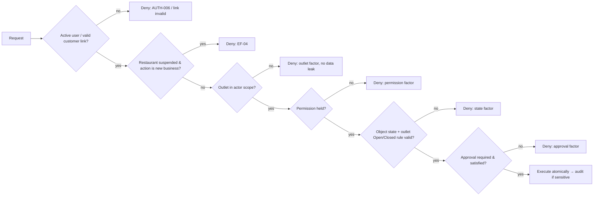
Rules that apply to every flow:
- A permission not explicitly granted is denied (RBAC-019.1, RBAC-017.1). Holding any action permission on an object implies view (RBAC-027.1).
- No second-person approval exists anywhere except ACT-AI-02 (RBAC-014.1). "Approval = None" in this document means *controlled by role, permission, state, reason and audit*.
- Owner customization stays inside the catalogue; it never crosses organization, outlet access, state rules or approvals (RBAC-005.1). Managers customize only if granted (RBAC-029.1).
- Inactive users cannot act (AUTH-006.1, SEC-004.1).

### 3.2 Authorization summary of important flows
Abbreviations: Own, Mgr, Csh, Wtr, Kit, Cust, SA (SuperAdmin), Sys (system).

| Flow | Initiate | Approve | Execute | Reject / decline | View | Outlet scope |
|---|---|---|---|---|---|---|
| Provision restaurant (AF-001) | SA | — | SA | — | SA | Platform |
| Suspend / deactivate (AF-003) | SA | — | SA | — | SA | Platform |
| Owner setup & activation (AF-004) | Own | — | Own (Mgr: menu, tables/QR, staff only) | — | Own | Authorized outlets |
| Add outlet (AF-005) | Own | — | Own | Mgr denied | Own | Organization |
| Outlet Open/Closed (AF-006/007) | Own, Mgr | — | Own, Mgr | — | all outlet staff (state) | Own: authorized; Mgr: assigned |
| Staff create/edit/deactivate (AF-008) | Own, Mgr | — | Own, Mgr (Manager accounts: Own, or Mgr if granted) | — | Own, Mgr; others own record | Actor's outlet access |
| Permission customization (AF-010) | Own (Mgr if granted) | — | Own | — | Own | Organization, catalogue-bounded |
| Availability (AF-013) | self; Own; Mgr (own outlets) | — | same | — | Own, Mgr | Outlet |
| Menu edit / price (AF-014/015) | Own, Mgr | — | Own, Mgr | — | ordering roles (published only) | Org menu + outlet overrides |
| AI Menu Import (AF-057) | Own | **Own (approval)** | Sys draft → Own publish | Own (by not approving) | Own | Organization |
| Table operations (AF-018…021) | Own, Mgr; Wtr opens | — | Own, Mgr; Wtr opens | — | outlet staff | Outlet |
| Customer order submit (AF-023…026) | Cust | Own, Mgr, Csh, Wtr (accept) | Sys | Own, Mgr, Csh, Wtr (reject + reason) | Cust (own), outlet staff | Outlet of QR/channel |
| Staff order (AF-028/029) | Own, Mgr, Csh, Wtr | — (no acceptance) | Sys | — | outlet staff | Current outlet |
| Cancel item/order (AF-032) | Own, Mgr, Csh, Wtr, Kit | — | Sys / Kit acknowledges request | Kit declines request | outlet staff | Outlet |
| Hold item / Void item (AF-033/034) | Own, Mgr | — | Sys | — | outlet staff | Outlet |
| Hold order (AF-033) | Own, Mgr, Csh, Wtr | — | Sys | — | outlet staff | Outlet |
| Void order (AF-034) | Own, Mgr, Csh | — | Sys | — | outlet staff | Outlet |
| Re-fire (AF-035) | Own, Mgr, Kit | — | Sys → Kit | — | Kit, Own, Mgr | Outlet |
| Preparing (AF-037) | Kit | — | Kit | — | Kit, Own, Mgr | Outlet kitchen |
| Ready (AF-037) | Kit; Own, Mgr (oversight) | — | same | — | KDS viewers, handoff staff, Cust | Outlet kitchen |
| Served / Picked Up (AF-041/042) | Wtr / Wtr, Csh | — | same | — | outlet staff, Cust | Outlet |
| Finalize / Reopen bill (AF-045/046) | Own, Mgr, Csh, Wtr | — | same | — | Own, Mgr, Csh, Wtr; Cust own bill | Outlet |
| Discount / charges (AF-044) | Own, Mgr, Csh | — | same | — | — | Outlet |
| Cancel bill / Refund (AF-047/051) | Own, Mgr, Csh | — | same | — | — | Outlet |
| Record / correct payment (AF-049/050) | Own, Mgr, Csh | — | same | — | Own, Mgr, Csh | Outlet |
| Reprint (AF-048) | Csh | — | Csh | — | — | Outlet |
| Day Close / Reopen Day (AF-052/053) | Own, Mgr, Csh | — | same | — | Own, Mgr, Csh | Outlet |
| Dashboard (AF-066) | Own (all + comparison), Mgr (own outlets) | — | — | — | same | as stated |
| Attention (AF-062) | Sys creates | — | Own, Mgr (own outlets) act/dismiss/resolve | — | Own, Mgr | as stated |
| Owner Agent action (AF-059) | Own | **Own confirmation for sensitive actions** | Sys via controlled tool | Own (declines) | Own | Owner's authorized outlets |
| Audit trail view (§26) | SA only | — | — | — | SA | Platform |

---

## 4. Global Application Flow

### 4.1 Domain relationships
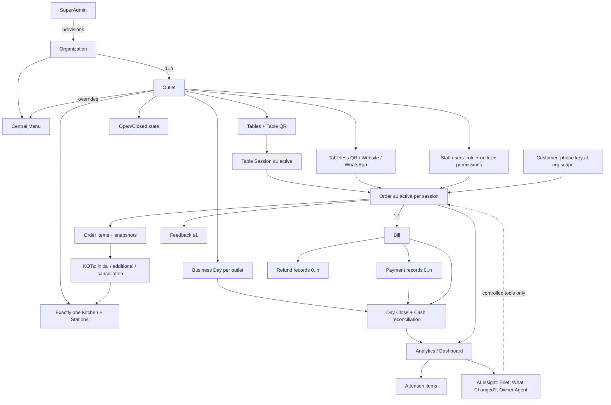

### 4.2 Primary business loop
```mermaid
flowchart LR
  P[AF-001 Provision] --> OA[AF-002 Owner access] --> OS[AF-004 Outlet setup] --> MS[AF-014 Menu] --> SS[AF-008 Staff] --> TS[AF-017 Tables]
  TS --> OC{Order origin}
  OC -->|customer| CO[AF-023..026 submit] --> ACC[AF-027 accept] --> CF[Confirmed]
  OC -->|staff| SO[AF-028/029] --> CF
  CF --> K[AF-036 KOT] --> KD[AF-037 Kitchen] --> RD[Ready] --> H[AF-041 Served / AF-042 Picked Up]
  H --> B[AF-043..046 Bill] --> PY[AF-049 Payment] --> DC[AF-052 Day Close] --> AN[AF-066 Dashboard / AI]
```
Bill and payment may happen before, during or after handoff (BILL-001.1, PAY-010.1); completion depends only on item outcomes and handoff (ORD-063.1). The loop above is the typical order, not a strict sequence.

### 4.3 Flow index
| Area | Flows |
|---|---|
| Provisioning & access | AF-001 Provision · AF-002 Owner/staff access · AF-003 Suspend/deactivate |
| Outlets | AF-004 Setup & activation · AF-005 Add outlet · AF-006 Open→Closed · AF-007 Closed→Open |
| Staff | AF-008 Staff lifecycle · AF-009 Reassignment · AF-010 Permission customization · AF-011 Schedule · AF-012 Attendance · AF-013 Availability |
| Menu | AF-014 Create/publish · AF-015 Edit/price · AF-016 Outlet override |
| Tables | AF-017 Configure tables/QR · AF-018 Table session lifecycle · AF-019 Transfer · AF-020 Merge/split · AF-021 Move items · AF-022 Abandoned Draft release |
| Customer ordering | AF-023 Table QR · AF-024 Tableless QR · AF-025 Website · AF-026 WhatsApp · AF-027 Acceptance/rejection |
| Staff ordering & changes | AF-028 Staff table order · AF-029 Staff takeaway · AF-030 Add items · AF-031 Edit items · AF-032 Cancellation |
| Hold/Void/Re-fire | AF-033 Hold · AF-034 Void · AF-035 Re-fire |
| Kitchen | AF-036 KOT · AF-037 KDS preparation & readiness · AF-038 Priority · AF-039 Kitchen cancellation · AF-040 Cancellation request |
| Handoff | AF-041 Served · AF-042 Picked Up |
| Billing & payment | AF-043 Create bill · AF-044 Adjustments · AF-045 Finalize · AF-046 Reopen & correct · AF-047 Cancel bill · AF-048 Print/reprint · AF-049 Record payment · AF-050 Correct payment · AF-051 Refund |
| Day | AF-052 Day Close · AF-053 Reopen Day & re-close |
| Customer | AF-054 Private order access & tracking · AF-055 Feedback · AF-056 One-tap reorder |
| AI | AF-057 AI Menu Import · AF-058 Owner Agent (read) · AF-059 Owner Agent (action) · AF-060 Daily AI Brief · AF-061 What Changed? · AF-062 Attention · AF-063 WhatsApp Ordering Agent |
| Resilience | AF-064 Offline submission & sync · AF-065 KDS reconnect |
| Analytics | AF-066 Dashboards · AF-067 Unresolved bills |

---

## 5. SuperAdmin / Restaurant Provisioning Flow

### Flow ID
AF-001
### Name
Restaurant provisioning
### Actor
SuperAdmin (platform). Owner receives the invitation.
### Preconditions
SuperAdmin is authenticated as platform operator. No restaurant self-signup exists (ONB-012.1, NG-016.1).
### Trigger
SERVENA decides to onboard a restaurant.
### Main Flow
1. SuperAdmin creates the restaurant (organization) (ONB-001.1).
2. SuperAdmin selects single-outlet or multi-outlet structure (ONB-002.1).
3. SuperAdmin creates a new Owner or assigns an existing Owner (ONB-003.1).
4. SuperAdmin enters basic restaurant and outlet data (ONB-004.1).
5. SuperAdmin provisions the restaurant (ONB-005.1). The organization exists with ≥1 outlet (ORG-001.1); every object is bound to it (ORG-003.1, SEC-001.1).
6. System sends the onboarding email/invitation to the Owner (ONB-006.1).
7. Owner signs in (AF-002) and begins operational setup (AF-004). Provisioning never replaces Owner setup (ONB-011.1).
### State Changes
Restaurant: *(none)* → **Provisioned**. Outlet(s): created, **Not activated**, availability state not yet usable for orders (ONB-032.1). Owner user: created or linked, invited.
### Authorization
SuperAdmin only; outside the restaurant catalogue. No restaurant role can provision.
### Audit
Platform action. Owner credential issuance/reset is a credential/security action and is audited (AUTH-007.1). Provisioning itself is not listed in AUDIT-002.1 → see AMB-21.
### Alternative Paths
- **A1 Invitation email fails** → restaurant stays provisioned and intact; SuperAdmin re-sends; onboarding retry path exists (ONB-013.1, INTEG-003.1, ONB-013.AC1).
- **A2 Wrong structure / data** → SuperAdmin edits configuration after provisioning (ONB-008.1).
- **A3 Owner forgets credentials** → SuperAdmin resets Owner credentials (ONB-010.1, AUTH-004.1); audited.
- **A4 SuperAdmin views operational data** (ONB-007.1) — read only; never performs restaurant operations.
### Failure Paths
- **F1 Invalid input** (missing mandatory basic data) → provisioning does not complete; no restaurant is handed to an Owner. *Which fields are mandatory at provisioning is not defined by PRD (only the activation checklist is, ONB-033.1) → AMB-20.*
- **F2 Duplicate / conflicting data** (e.g. restaurant already exists, Owner identity already in use) → PRD defines no duplicate-detection rule. ONB-003.1 allows *assigning an existing Owner*, so an existing Owner identity is not by itself a conflict. Behaviour beyond that is **unresolved (AMB-20)**.
- **F3 Restaurant later suspended/deactivated** → AF-003.
- **F4 Self-signup attempt** → no such path exists (ONB-012.AC1).
### Offline Behaviour
Not offline-eligible by product rule; platform actions require server confirmation (OFFLINE-008.1). Interrupted submission follows SI — one restaurant per logical provisioning (general rule SEC-003.1/OFFLINE-003.1).
### Exit State
Organization Provisioned; outlet(s) Not activated; Owner invited.
### Related PRD Requirements
ONB-001.1…ONB-013.1, ORG-001.1, ORG-003.1, AUTH-004.1, AUTH-007.1, INTEG-003.1, SEC-001.1, NG-016.1.

---

### Flow ID
AF-002
### Name
Owner and staff access (sign-in, working outlet, credential recovery)
### Actor
Owner, Manager, Cashier, Waiter, Kitchen Staff; SuperAdmin (Owner reset); Owner/Manager (staff reset).
### Preconditions
User exists and is Active (AUTH-006.1). Restaurant provisioned.
### Trigger
User opens SERVENA to work.
### Main Flow
1. User signs in with email + password **or** phone + password (AUTH-001.1). No 2FA (AUTH-002.1, NG-012.1).
2. If the user has access to more than one outlet, they choose a working outlet; all actions run in that outlet's context (AUTH-008.1). Cashier/Waiter/Kitchen have exactly one current outlet (ORG-008.1).
3. User sees only data within role + outlet scope (RBAC-006.1, ORG-009.1); Owner may view across authorized outlets (ORG-006.1).
### State Changes
Session context: user + working outlet. No business state.
### Authorization
Active user only. Customers never sign in (AUTH-009.1).
### Audit
Credential and security actions (resets, deactivation) audited (AUTH-007.1). Ordinary sign-in is not listed as audited.
### Alternative Paths
- **Staff forgot password** → Owner or Manager resets (AUTH-003.1, ACT-STF-03; Manager cannot reset Manager accounts unless granted, RBAC-029.1). Old password stops working; audited (AUTH-003.AC1).
- **Owner forgot password** → SuperAdmin resets (AUTH-004.1).
- No self-service recovery (AUTH-005.1).
### Failure Paths
- Wrong credentials → refused.
- Inactive user → refused without revealing whether the account exists (AUTH-006.AC1).
- User with no outlet assignment → no outlet context can be chosen; no outlet action is possible (follows RBAC-006.1; exact message UI).
- Restaurant suspended → see AF-003 and AMB-06 (whether sign-in remains possible is not defined).
### Offline Behaviour
Sign-in requires the server.
### Exit State
Authenticated user in one outlet context.
### Related PRD Requirements
AUTH-001.1…AUTH-008.1, ORG-006.1, ORG-008.1, ORG-009.1, RBAC-006.1, ACT-STF-03.1, NG-012.1.

---

### Flow ID
AF-003
### Name
Restaurant suspension / deactivation
### Actor
SuperAdmin.
### Preconditions
Restaurant provisioned.
### Trigger
SERVENA decides to suspend or deactivate a restaurant.
### Main Flow
1. SuperAdmin suspends or deactivates the restaurant (ONB-009.1).
2. System sets the platform-level state. **New business is blocked**: no new order can be created on any channel by anyone (ONB-014.1).
3. Existing confirmed orders are not cancelled; they may continue through kitchen, handoff and billing (ONB-014.1).
4. Existing bills may be finalized, paid and corrected under normal authorization rules (ONB-014.1).
5. All historical and audit data remain intact; nothing is deleted (ONB-014.1).
### State Changes
Restaurant: Provisioned → **Suspended** / **Deactivated**. No business-day change; suspension is never Day Close (ONB-009.1, ONB-009.AC1). No order, bill or payment state changes.
### Authorization
SuperAdmin only.
### Audit
SuperAdmin suspension/deactivation is audited (AUDIT-002.1, ONB-009.AC1).
### Alternative Paths
- Customer scans a QR of a suspended or deactivated restaurant → SCR-058 notice: account suspended/blocked, contact the SERVENA technical team; no ordering (PO-AF-03). Other channels refuse new orders (EF-04).
- Staff continue existing work (kitchen Ready, Served/Picked Up, finalize, record payment, reopen/refund) → allowed under normal rules.
### Failure Paths
- Any new-order attempt → EF-04 (ONB-014.AC1).
- Adding items to existing orders while suspended → *not defined*. Suspension blocks "new business"; whether adding items counts as new business is **unresolved (AMB-06)**.
### Offline Behaviour
Queued new-order operations reaching the server after suspension are refused by server validation (OFFLINE-008.1).
### Exit State
Restaurant Suspended/Deactivated; existing work may finish; all data retained.
### Related PRD Requirements
ONB-009.1, ONB-014.1, AUDIT-002.1, OFFLINE-008.1.

*Unreactivation/reinstatement of a suspended restaurant, and the difference between "suspended" and "deactivated", are not defined (AMB-06).*

---

## 6. Owner / Outlet Management Flow

### Flow ID
AF-004
### Name
Owner operational setup and outlet activation
### Actor
Owner (Manager may perform menu, tables/QR and staff parts within scope — PRD §8 boundary table).
### Preconditions
Restaurant provisioned; Owner signed in (AF-002).
### Trigger
First login, or a newly added outlet (AF-005).
### Main Flow
1. Restaurant identity: name, brand, logo, contact (ONB-020.1).
2. Address/location, GST/tax information (ONB-021.1).
3. Restaurant type / cuisine template, operating configuration (ONB-022.1); templates optional (ONB-031.1).
4. Outlet(s) configuration (ONB-023.1).
5. Menu: AI import (AF-057) or manual (AF-014); AI-imported menu must be Owner-approved before going live (ONB-024.1).
6. Staff, roles, outlet assignment, permissions (ONB-025.1) → AF-008, AF-010.
7. Floor, tables, QR codes (ONB-026.1) → AF-017; QR generation is guided (ONB-031.1).
8. Kitchen stations and item→station routing (ONB-027.1).
9. Payment information — payment modes the outlet records (ONB-028.1).
10. Ordering channels (ONB-029.1).
11. Owner verifies the activation checklist (ONB-033.1) and activates operations (ONB-030.1).
### State Changes
Outlet: **Not activated → Activated**. Only an Activated outlet can accept orders (ONB-032.1).
### Authorization
ACT-CFG-01 (Owner only) for restaurant/outlet configuration; ACT-MNU-01…03, ACT-TBL-05, ACT-STF-01…05, ACT-AI-01/02/07 per catalogue.
### Audit
Menu price/availability changes, permission changes and staff actions are audited within their own flows. Activation itself is not in AUDIT-002.1 (AMB-21).
### Alternative Paths
- Template used to speed setup (ONB-031.1).
- AI unavailable → manual menu entry (AI-041.1).
- Owner leaves setup half done → outlet stays Not activated; work is kept.
### Failure Paths
- **Activation with incomplete checklist** → refused; missing items listed (ONB-030.AC1). Mandatory items: identity; address+GST; outlet configured; published menu with ≥1 orderable item; every published item mapped to a station; ≥1 payment mode; ≥1 ordering channel; tables + table QR if table QR is enabled. Staff accounts are not mandatory (ONB-033.1).
- **Order attempt before activation** (customer QR or staff) → no order can be placed (ONB-032.AC1).
- Unapproved AI menu items at activation → not orderable (ONB-024.AC1).
### Offline Behaviour
Configuration is not offline-eligible by product rule; server is authoritative.
### Exit State
Outlet Activated; Open/Closed state now governs ordering (AF-006/007). *The initial Open/Closed value of a newly activated outlet is not defined (AMB-07).*
### Related PRD Requirements
ONB-020.1…ONB-033.1, AI-041.1, ACT-CFG-01.1, ACT-TBL-05.1, ACT-MNU-01.1…03.1, ACT-STF-01.1…05.1.

---

### Flow ID
AF-005
### Name
Add outlet (single-outlet → multi-outlet transition)
### Actor
Owner.
### Preconditions
Organization provisioned; Owner active.
### Trigger
Owner opens a new location.
### Main Flow
1. Owner adds an outlet (ONB-015.1).
2. If the organization had one outlet, it becomes multi-outlet automatically; the existing outlet is unchanged (ONB-015.1).
3. Owner's organization-level visibility now includes the new outlet under existing Owner rules (ORG-006.1).
4. The new outlet gets its own business day (ORG-011.1), its own kitchen (ORG-005.1), its own Open/Closed state (ORG-020.1).
5. New outlet goes through AF-004 setup and activation before accepting orders (ONB-030.1, ONB-032.1).
6. Central menu applies; outlet overrides may be set (ORG-002.1, AF-016).
### State Changes
Organization: single-outlet → multi-outlet (when the 2nd outlet is added). New outlet: Not activated.
### Authorization
Owner only. **Manager attempt → refused** (ONB-015.AC1). SuperAdmin may also edit structure via configuration (ONB-008.1).
### Audit
Not listed in AUDIT-002.1 (AMB-21).
### Alternative Paths
Owner assigns staff/Managers to the new outlet (AF-008, AF-009).
### Failure Paths
Manager adds outlet → SD. Orders at new outlet before activation → refused (ONB-032.1).
### Offline Behaviour
Not offline-eligible.
### Exit State
Organization multi-outlet; new outlet Not activated.
### Related PRD Requirements
ONB-015.1, ONB-008.1, ORG-002.1, ORG-005.1, ORG-006.1, ORG-011.1, ORG-020.1.

### 6.1 Outlet access and cross-outlet visibility (compact)
| Actor | Sees | Acts in | Cross-outlet comparison | Source |
|---|---|---|---|---|
| Owner | All authorized outlets, cross-outlet customer history, benchmarking | Chosen working outlet (AUTH-008.1); Owner-only views across outlets | Yes (ACT-ANL-02) | ORG-006.1, RBAC-022.1, ANALYTICS-003.1 |
| Manager | Assigned outlets only; never HQ aggregate | Chosen assigned outlet | No | ORG-007.1, RBAC-023.1, ANALYTICS-004.1 |
| Cashier / Waiter / Kitchen | Current outlet, own outlet history | Current outlet | No | ORG-008.1, ORG-009.1, RBAC-024.1 |
| Customer | Own order(s) only | Outlet of QR/channel/link | No | RBAC-025.1, CUSTOMER-003.1 |

Cross-outlet request by a non-authorized actor → SD (outlet factor), no data shown (ORG-007.AC1, ORG-008.AC1, SEC-002.1).

Outlet Open/Closed flows are in §19 (AF-006, AF-007). Suspension interaction: suspension (platform) overrides Open: a suspended restaurant accepts no new orders even if an outlet is Open (ONB-014.1).

---

## 7. Staff Management Flow

**Three separate dimensions — never merged** (STAFF-001.1):

| Dimension | Values | Meaning | Who changes | Flow |
|---|---|---|---|---|
| **Schedule** | Planned working period (e.g. 10:00–19:00) | Plan | Own, Mgr (ACT-ATT-02) | AF-011 |
| **Attendance** | Present / Absent | What actually happened | Own, Mgr (ACT-ATT-01) | AF-012 |
| **Availability** | Available / On Break / Unavailable | Can take operational work *now* | self, Own, Mgr own outlets (ACT-AVL-01/02) | AF-013 |

Staff status is operational, never payroll/overtime (STAFF-009.1, NG-005.1).

### Flow ID
AF-008
### Name
Staff lifecycle — create, role, outlet, edit, deactivate, credential reset
### Actor
Owner; Manager (within authorized outlets; Manager accounts only if granted).
### Preconditions
Outlet exists; actor active.
### Trigger
Hiring, role change, departure, forgotten password.
### Main Flow
1. Actor creates a staff member with role (one of Manager, Cashier, Waiter, Kitchen Staff), outlet assignment and default permission profile (ONB-025.1, RBAC-003.1, ACT-STF-01).
2. Staff member receives credentials managed by Owner/Manager (AUTH-003.1); signs in via AF-002.
3. Actor edits details or deactivates the staff member (ACT-STF-01). Deactivated users cannot sign in or act (AUTH-006.1).
4. Actor resets credentials when needed (ACT-STF-03).
### State Changes
Staff: *(none)* → Active ↔ Inactive. Role / outlet assignment set.
### Authorization
ACT-STF-01 Own, Mgr (Mgr limited to authorized outlets, STAFF-012.1). Manager accounts: ACT-STF-02 Owner; Manager only if Owner granted (RBAC-029.1). Credential reset ACT-STF-03 (Mgr not for Manager accounts unless granted). View list: ACT-STF-06 Own, Mgr; Csh/Wtr/Kit own record only.
### Audit
Credential/security actions (create credential, reset, deactivate) audited (AUTH-007.1).
### Alternative Paths
Owner creates a Manager and assigns outlets → Manager's scope = those outlets (RBAC-023.1).
### Failure Paths
- Manager edits staff of another outlet → SD (STAFF-012.AC1).
- Manager creates a Manager / changes permissions without grant → SD (RBAC-029.AC1).
- Deactivated user signs in → refused (AUTH-006.AC1).
- Deactivating a staff member with active work: no rule beyond STAFF-013.1 (work stays attributed; never silently cancelled; explicit reassignment via existing operations). See AMB-08.
### Offline Behaviour
Not offline-eligible.
### Exit State
Staff Active with role + outlet, or Inactive.
### Related PRD Requirements
ONB-025.1, AUTH-003.1, AUTH-006.1, AUTH-007.1, RBAC-003.1, RBAC-029.1, STAFF-012.1, ACT-STF-01.1, ACT-STF-02.1, ACT-STF-03.1, ACT-STF-06.1.

### Flow ID
AF-009
### Name
Staff outlet reassignment
### Actor
Owner; Manager (source and target outlets both within scope).
### Preconditions
Staff member exists; Cashier/Waiter/Kitchen has one current outlet.
### Trigger
Operational need to move staff.
### Main Flow
1. Actor reassigns the staff member to another outlet (STAFF-010.1, ACT-STF-04).
2. System records the reassignment with previous and new outlet (STAFF-011.1).
3. Staff member's next sign-in shows only the new outlet (STAFF-010.AC1); access to the old outlet ends (ORG-010.AC1).
4. Past actions stay attributed to the outlet where they occurred (ORG-010.1).
### State Changes
Staff outlet assignment: A → B. Historical records unchanged.
### Authorization
ACT-STF-04: Own; Mgr only when both outlets are in scope.
### Audit
**Audited**: actor, time, previous outlet, new outlet (STAFF-011.AC1, AUDIT-002.1).
### Alternative Paths
Staff member had open work at A → work stays attributed (STAFF-013.1); any reassignment of that work is explicit through table/order operations (no implicit transfer).
### Failure Paths
Manager reassigns to an outlet outside scope → SD.
### Offline Behaviour
Not offline-eligible.
### Exit State
Staff in outlet B; history in A preserved.
### Related PRD Requirements
STAFF-010.1, STAFF-011.1, STAFF-013.1, ORG-008.1, ORG-010.1, ACT-STF-04.1, AUDIT-002.1.

### Flow ID
AF-010
### Name
Permission customization
### Actor
Owner; Manager only if Owner granted ACT-STF-05.
### Preconditions
Role default profiles exist (RBAC-003.1).
### Trigger
Owner wants a role/user to have more or fewer catalogue permissions.
### Main Flow
1. Actor selects a role/user and adds or removes catalogue permissions (RBAC-004.1, ACT-STF-05).
2. System validates bounds: only catalogue permissions; no new permission types; no SuperAdmin capability; no cross-organization grant; cannot bypass outlet access, current-state rules or approvals (RBAC-005.1, RBAC-009.1).
3. Change takes effect for subsequent actions (RBAC-010.AC1).
### State Changes
Permission set of the role/user changes.
### Authorization
ACT-STF-05: Owner; Manager only if granted (RBAC-029.1).
### Audit
**Every permission change audited** (RBAC-010.1, AUDIT-002.1).
### Alternative Paths
Revocation: e.g. Owner revokes Cashier Refund → Cashier refund then denied (RBAC-010.AC1).
### Failure Paths
Out-of-catalogue / other-outlet / SuperAdmin grant → refused (RBAC-005.AC1).
### Offline Behaviour
Not offline-eligible.
### Exit State
Updated permission set within catalogue bounds.
### Related PRD Requirements
RBAC-003.1, RBAC-004.1, RBAC-005.1, RBAC-009.1, RBAC-010.1, RBAC-011.1, RBAC-029.1, ACT-STF-05.1.

### Compact flows AF-011 / AF-012
| | AF-011 Schedule | AF-012 Attendance |
|---|---|---|
| Actor | Own, Mgr (ACT-ATT-02) | Own, Mgr record (ACT-ATT-01); staff view own (ACT-ATT-03); Own, Mgr view staff (ACT-ATT-04) |
| Main flow | Set/modify planned working period | Mark Present / Absent |
| State change | Schedule only; availability and attendance untouched (STAFF-002.AC1) | Attendance; **Absent forces availability = Unavailable** (STAFF-008.1) |
| Invalid | — | Absent + Available is never stored (STAFF-007.1) |
| Denial | Csh/Wtr/Kit → SD | Csh/Wtr/Kit recording → SD; viewing others → SD |
| Audit | Not in AUDIT-002.1 | Not in AUDIT-002.1 |
| PRD | STAFF-002.1, ACT-ATT-02.1 | STAFF-003.1, STAFF-007.1, STAFF-008.1, ACT-ATT-01.1, ACT-ATT-03.1, ACT-ATT-04.1 |

### Flow ID
AF-013
### Name
Availability — Available / On Break / Unavailable, with active work
### Actor
Staff member (self); Owner; Manager (own outlets).
### Preconditions
Staff Active.
### Trigger
Break, unavailability, return.
### Main Flow
1. Actor changes availability (STAFF-004.1, STAFF-005.1; ACT-AVL-01 self, ACT-AVL-02 others).
2. On Break / Unavailable → staff member is unavailable for operational work (STAFF-006.1); new assignments to them are prevented (STAFF-013.1).
3. Existing work is **not** cancelled and stays attributed to them (STAFF-013.1, STAFF-013.AC1).
4. If work must move, an authorized user performs an explicit existing operation (e.g. table transfer AF-019, order handled by another permitted user). There is no implicit reassignment and no work-assignment subsystem (STAFF-013.1).
5. Returning: set Available (not allowed while Absent — STAFF-007.1).
### State Changes
Availability value. Orders/tables unchanged.
### Authorization
Self for own; Own/Mgr for others; Waiter changing another's availability → SD (STAFF-005.AC1).
### Audit
Availability changes are not in AUDIT-002.1.
### Alternative Paths
Marked Absent (AF-012) → forced Unavailable.
### Failure Paths
Set Available while Absent → refused / prevented by state rule (STAFF-007.1).
### Offline Behaviour
Not specified as offline-eligible (DF-13).
### Exit State
New availability; work untouched.
### Related PRD Requirements
STAFF-001.1, STAFF-004.1…STAFF-008.1, STAFF-013.1, ACT-AVL-01.1, ACT-AVL-02.1.

*What "assignment" means operationally (which actions are blocked for an On Break waiter, e.g. accepting orders or opening tables) is not enumerated → AMB-08.*

---

## 8. Menu Management Flow

### 8.1 Menu hierarchy
```
Organization (central menu)
  └─ Category → Subcategory
       └─ Item: description, image, price, tax, veg/non-veg, preparation time, order-type availability, kitchen station
            ├─ Variants / portion sizes
            └─ Modifier groups: spice, preparation, dietary, add-on, packaging, free-form notes
Outlet override layer: outlet price · outlet availability (temporary = current business day | permanent)
```
(MENU-001.1…MENU-007.1, MENU-009.1)

### Flow ID
AF-014
### Name
Menu creation and publishing (manual)
### Actor
Owner, Manager.
### Preconditions
Organization provisioned; stations configured for mapping (ONB-027.1).
### Trigger
Setup or new items.
### Main Flow
1. Create categories/subcategories (MENU-001.1).
2. Create items with description, image, price, tax, veg/non-veg (MENU-002.1); variants (MENU-003.1); modifier groups (MENU-004.1).
3. Map each item to a kitchen station (MENU-005.1), set preparation time (MENU-006.1) and order-type availability (MENU-007.1).
4. Publish. Only published data is visible to any ordering channel (MENU-008.1, MENU-008.AC1).
### State Changes
Menu data: Draft → Published.
### Authorization
ACT-MNU-01 Own, Mgr (MENU-012.1). AI-imported content additionally needs Owner approval (AF-057).
### Audit
Price and availability changes audited (MENU-013.1). Other edits not listed in AUDIT-002.1.
### Alternative Paths
AI Menu Import (AF-057).
### Failure Paths
Cashier/Waiter/Kitchen edit → SD. Unpublished item ordered on any channel → not offered.
### Offline Behaviour
Not offline-eligible.
### Exit State
Published menu feeding all channels.
### Related PRD Requirements
MENU-001.1…MENU-008.1, MENU-012.1, MENU-013.1, ACT-MNU-01.1.

### Flow ID
AF-015
### Name
Menu edit and price change; order snapshot behaviour
### Actor
Owner, Manager.
### Preconditions
Item exists.
### Trigger
Price or definition change.
### Main Flow
1. Actor edits item or changes price (ACT-MNU-01, ACT-MNU-02).
2. Change applies to **new** order lines only.
3. Existing order lines keep the price and tax captured when the item was added (MENU-017.1, MENU-017.AC1).
4. A modifier becoming unavailable after an order was created does not alter that order (MENU-016.1).
### State Changes
Menu item values; existing order lines unchanged.
### Authorization
Own, Mgr; Cashier price change → SD (MENU-012.AC1).
### Audit
**Price change audited**: who, when, old, new (MENU-013.AC1).
### Alternative Paths
Owner Agent requests a price change → AF-059 with mandatory Owner confirmation (AI-029.1).
### Failure Paths
SD for unauthorized roles.
### Offline Behaviour
Not offline-eligible.
### Exit State
New price live for new lines; history immutable.
### Related PRD Requirements
MENU-012.1, MENU-013.1, MENU-016.1, MENU-017.1, ACT-MNU-01.1, ACT-MNU-02.1, AI-029.1.

### Flow ID
AF-016
### Name
Outlet override — price and availability (temporary / permanent)
### Actor
Owner, authorized Manager (own outlets).
### Preconditions
Item published centrally; outlet in actor scope.
### Trigger
Outlet-specific price, sold-out, or delisting.
### Main Flow
1. Actor selects outlet + item (MENU-009.1, MENU-010.1).
2. Sets outlet price and/or availability.
3. Availability override is either **temporary** — applies for the outlet's current business day and stops applying at Day Close, never at midnight — or **permanent** until explicitly changed (MENU-011.1, MENU-011.2).
4. Channels at that outlet immediately use the override; other outlets unaffected (MENU-014.1, MENU-009.AC1).
5. At Day Close (AF-052), temporary overrides for that outlet stop applying (MENU-011.AC1).
### State Changes
Outlet override set/cleared.
### Authorization
ACT-MNU-03 Own, Mgr.
### Audit
Price/availability changes audited (MENU-013.1).
### Alternative Paths
- Item becomes unavailable while in a customer cart → on submit, item not ordered silently; customer told (MENU-015.1). See AF-023 F-paths.
- Kitchen can still cancel an already-ordered item for unavailability (AF-039).
### Failure Paths
Override outside actor outlet scope → SD.
### Offline Behaviour
Not offline-eligible.
### Exit State
Override active.
### Related PRD Requirements
MENU-009.1, MENU-010.1, MENU-011.1, MENU-011.2, MENU-013.1, MENU-014.1, MENU-015.1, ACT-MNU-03.1, DAY-017.1.

*Behaviour of a temporary override when the day is reopened (AF-053) is not defined (AMB-12).* Tax/charge calculation detail is deferred (DF-14); this document only fixes that the order line captures price and applicable tax information (MENU-017.1).

---

## 9. Table Management Flow

### 9.1 Table state machine
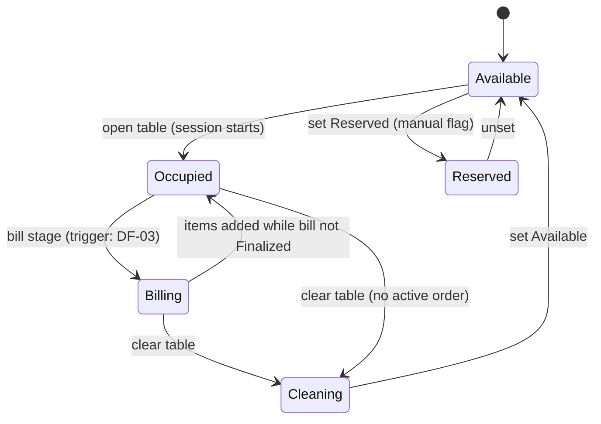
Typical cycle Available → Occupied → Billing → Cleared → Available (TABLE-001.1, TABLE-002.1). Reserved is manual; no booking (TABLE-003.1, NG-016.1). The full transition/actor table is deferred to TRD (TABLE-013 / DF-03); the transitions above are the ones PRD names. The Billing trigger and whether adding items returns the table to Occupied belong to the deferred table transition matrix (SPEC TABLE-013 → DF-03, TRD) — AMB-10 RESOLVED as deferred.

### 9.2 Ownership chain
```
Table ──(session, current association)──▶ Order ──(1:1)──▶ Bill ──▶ Payments / Refunds
Takeaway Order ──(1:1)──▶ Bill
```
- One active session per table (TABLE-014.1); one active order per session (TABLE-015.1, ORD-091.1).
- The **order** is the billing-ownership boundary; table operations change the *current* table association only (TABLE-018.1).
- Historical associations are never rewritten (TABLE-017.1). A table's last bill stays reachable after payment (TABLE-011.1).

### Flow ID
AF-017
### Name
Configure floor, tables and QR
### Actor
Owner, Manager.
### Preconditions
Outlet exists.
### Trigger
Setup / floor change.
### Main Flow
1. Create floor and tables (ONB-026.1, ACT-TBL-05).
2. Generate table QR codes — each identifies outlet + table (TABLE-005.1, ONB-031.1).
3. Generate tableless QR — identifies outlet only (TABLE-006.1).
### State Changes
Tables created in Available.
### Authorization
ACT-TBL-05 Own, Mgr.
### Audit
Not in AUDIT-002.1.
### Alternative Paths
—
### Failure Paths
Other roles → SD.
### Offline Behaviour
Not offline-eligible.
### Exit State
Tables + QR ready; required for activation if table QR enabled (ONB-033.1).
### Related PRD Requirements
ONB-026.1, ONB-031.1, TABLE-005.1, TABLE-006.1, ACT-TBL-05.1.

### Flow ID
AF-018
### Name
Table session lifecycle (open → orders → billing → clear)
### Actor
Waiter, Owner, Manager (open); Owner, Manager (clear/Cleaning/Available, Reserved).
### Preconditions
Table Available; outlet Activated.
### Trigger
Guests seated.
### Main Flow
1. Actor opens the table → table session starts; table Occupied (ACT-TBL-01, TABLE-014.1).
2. Orders for the table go into its single active order (TABLE-015.1); staff order AF-028 or customer table QR AF-023.
3. Additional items join the same active order (ORD-091.1).
4. Bill prepared → table in Billing.
5. Guests leave → Owner/Manager clears the table (Cleaning) → Available (ACT-TBL-03); session ends.
6. The table's last bill stays reachable (TABLE-011.1) and historical associations remain (TABLE-017.1).
### State Changes
Table: Available → Occupied → Billing → Cleaning → Available. Session: started → ended.
### Authorization
ACT-TBL-01 Own, Mgr, Wtr; ACT-TBL-03/04 Own, Mgr only. Waiter cannot clear or reserve (PRD §69 risk; Owner may extend via RBAC-005.1).
### Audit
Open/clear not in AUDIT-002.1. Opening an empty table alone is not a "transaction" for Reopen Day (DAY-025.1).
### Alternative Paths
- Second open attempt on an Occupied table → refused; existing session used (TABLE-014.AC1).
- Occupied with no active order → cleared by Owner/Manager (SPEC §30 edge case).
- Item added while table in Billing and bill not Finalized → allowed (TABLE-010.1); bill Finalized → refused until reopened (TABLE-010.AC1).
- Concurrent changes to the same table/order → no lost update; second writer informed (TABLE-008.1, EF-09).
### Failure Paths
Outlet Closed: opening a table is not itself an order; **new orders** on it are blocked (ORG-024.1). Whether opening a table is allowed while Closed is not stated (AMB-07).
### Offline Behaviour
Not specified as offline-eligible (DF-13); server authoritative.
### Exit State
Table Available; history and last bill reachable.
### Related PRD Requirements
TABLE-001.1, TABLE-002.1, TABLE-003.1, TABLE-004.1, TABLE-008.1, TABLE-010.1, TABLE-011.1, TABLE-014.1, TABLE-015.1, TABLE-017.1, ORD-091.1, ACT-TBL-01.1, ACT-TBL-03.1, ACT-TBL-04.1, RBAC-028.1, DAY-025.1.

### Flow ID
AF-019
### Name
Table transfer
### Actor
Owner, Manager.
### Preconditions
Source table has an active session; target table usable.
### Trigger
Guests move.
### Main Flow
1. Actor transfers the session/order from Table A to Table B (ACT-TBL-06).
2. Order and bill identity unchanged (TABLE-018.1); current association becomes B.
3. KOT history preserved; kitchen sees Table B (TABLE-009.1, TABLE-009.AC1).
4. Historical association with A remains visible (TABLE-017.1).
### State Changes
Current table association A → B; table states update accordingly.
### Authorization
ACT-TBL-06 Own, Mgr; Waiter/Cashier → SD.
### Audit
Auditable operational event: actor, time, before/after association (TABLE-016.1 applies to move/merge/split; ACT-TBL-06 states "auditable event").
### Alternative Paths
Transfer during active KOT → as step 3.
### Failure Paths
Finalized bill: never silently reassigned; billing change needs Reopen (TABLE-018.1).
### Offline Behaviour
Not offline-eligible by default (DF-13).
### Exit State
Order on Table B; history intact.
### Related PRD Requirements
TABLE-009.1, TABLE-016.1, TABLE-017.1, TABLE-018.1, ACT-TBL-06.1, RBAC-028.1.

### Flow ID
AF-020
### Name
Merge / split tables
### Actor
Owner, Manager.
### Preconditions
Tables involved have sessions as applicable.
### Trigger
Party combines or separates.
### Main Flow
1. Actor merges tables (or splits a table) (ACT-TBL-07).
2. Current table associations change; **each order and each bill keeps its identity**; no bill is created, duplicated or silently reassigned (TABLE-018.1, TABLE-018.AC1).
3. Event recorded with before/after associations (TABLE-016.1, TABLE-016.AC1).
4. A restructuring that needs a billing change goes through Reopen/correction (AF-046).
### State Changes
Table associations only.
### Authorization
ACT-TBL-07 Own, Mgr.
### Audit
**Audited**: actor, time, before/after associations (TABLE-016.AC1).
### Alternative Paths
Merged tables where each had an active order → orders stay separate (TABLE-018.1).
### Failure Paths
Attempt to merge bills / create combined bill → not a supported outcome; billing change only via Reopen.
### Offline Behaviour
Not offline-eligible by default.
### Exit State
New associations; ownership unchanged.
### Related PRD Requirements
TABLE-004.1, TABLE-012 (via TABLE-004.1), TABLE-016.1, TABLE-017.1, TABLE-018.1, ACT-TBL-07.1.

*After a merge each order keeps its identity and bill; a merged table may carry several order contexts (TABLE-018.1, PRD §20 edge case) — CON-03 RESOLVED. Still undefined: what "split" does to a single order's items, and which order newly added items join after a merge (AMB-09).*

### Flow ID
AF-021
### Name
Move items between tables
### Actor
Owner, Manager.
### Preconditions
Items exist on an order at the source table; bill handling per TABLE-018.1.
### Trigger
Item served to / belonging to another table.
### Main Flow
1. Actor moves items from Table A to Table B (ACT-MOD-05).
2. History records where the items were originally ordered (TABLE-017.AC1, TABLE-018.1).
3. Event recorded (TABLE-016.1).
### State Changes
Current table association of the moved items.
### Authorization
ACT-MOD-05 Own, Mgr.
### Audit
Audited event (TABLE-016.1).
### Alternative Paths / Failure Paths
Finalized bill involved → billing change via Reopen only (TABLE-018.1).
### Offline Behaviour
Not offline-eligible by default.
### Exit State
Items associated with B; origin preserved.
### Related PRD Requirements
TABLE-004.1, TABLE-016.1, TABLE-017.1, TABLE-018.1, ACT-MOD-05.1.

*Whether moved items change order (and therefore bill) or keep their original order while associated with another table is not defined (AMB-09).*

### Flow ID
AF-022
### Name
Abandoned Draft releases table occupancy
### Actor
System (under the inactivity policy).
### Preconditions
An uncommitted Draft (not submitted; not awaiting acceptance) holds a table occupancy/session claim.
### Trigger
Draft becomes abandoned under the product inactivity policy (threshold DF-13).
### Main Flow
1. System releases the Draft's table occupancy/session claim (TABLE-007.1, ORD-064.2).
2. Draft is **not deleted**; remains identifiable as Draft in history (ORD-064.2, ORD-064.AC2).
3. No KOT and no sale exist (ORD-064.1, ORD-064.AC1).
### State Changes
Table claim released; Draft retained.
### Authorization
System.
### Audit
Not in AUDIT-002.1.
### Alternative Paths
Order awaiting acceptance is **not** an abandoned Draft and is never released by this flow (ORD-064.2).
### Failure Paths
—
### Offline Behaviour
—
### Exit State
Table no longer held by the Draft.
### Related PRD Requirements
TABLE-007.1, ORD-064.1, ORD-064.2.

---

## 10. Customer Ordering Flows

### 10.0 Rules common to all customer channels
- All channels enter one order model (ORD-001.1, ORD-002.1); each order retains organization, outlet, source, table if any, customer if known, staff if any, items, KOT history, bill, payment info, audit history (ORD-003.1).
- Any order without a table is **Takeaway** (ORD-004.1). Only table QR produces dine-in.
- Customer-originated orders require **staff acceptance** before Confirmed; no KOT exists before acceptance (ORD-008.1, ORD-020.AC1).
- Submission is idempotent (ORD-006.1).
- Ordering is impossible when the outlet is Closed (ORG-021.1), not activated (ONB-032.1), or the restaurant is suspended (ONB-014.1).
- Only published, currently available items are offered (MENU-008.1); sold-out-during-checkout items are never ordered silently (MENU-015.1).
- No customer account, no OTP; customer reaches the order through a private, non-guessable link (AUTH-009.1, CUSTOMER-005.1, AF-054).
- Customers cannot cancel their own order before acceptance (ACT-CAN-03 = N).

### Flow ID
AF-023
### Name
Table QR ordering
### Actor
Customer; accepting staff (Own, Mgr, Csh, Wtr); Kitchen; Waiter (service).
### Preconditions
Outlet Activated and Open; restaurant not suspended; valid table QR (outlet + table).
### Trigger
Customer scans the table QR.
### Main Flow
1. System resolves outlet + table from the QR (TABLE-005.1, ORD-007.1).
2. Customer sees the published menu with outlet overrides (MENU-008.1, MENU-009.1).
3. Customer builds a **Draft**. No customer-details step: name and phone are requested only on the QR with no table (AF-024) — PRD-ORD-021.1 as amended by PO-AF-02.
4. Customer submits → order becomes **Draft — awaiting acceptance** (ORD-062.1); customer receives private order access (AF-054). Each line captures price + tax (MENU-017.1).
5. Staff who can accept receive visibility of the pending order (ORD-008.2).
6. Staff accepts (AF-027) → **Confirmed** → initial KOT (AF-036) → Kitchen (AF-037) → Ready → Waiter serves (AF-041) → bill/payment (AF-043…049) → Completed when all items terminal and handoff complete (ORD-063.1) → feedback offered (AF-055).
7. If the table session already has an active order, the accepted items join that order (TABLE-015.1, TABLE-015.AC1, ACT-ORD-01 precondition).
### State Changes
Order: Draft → Draft(awaiting acceptance) → Confirmed → KOT Sent → … (§12). Items: Pending → Sent → …
### Authorization
Customer acts only on own order via QR/link context; acceptance ACT-ACC-01/02.
### Audit
Order submission/acceptance not listed in AUDIT-002.1; the order retains its own history (ORD-003.1).
### Alternative Paths
- **Rejected** by staff with reason → customer sees rejection (ORD-008.AC2, AF-027).
- **Customer adds items later** from the same QR → new submission needs acceptance; after acceptance joins the active order and generates an additional KOT (ACT-MOD-01 Cust, AF-030).
- **Order still awaiting acceptance when outlet closes** → stays pending (ORG-033.1, AF-006).
### Failure Paths
- Outlet Closed / not activated / suspended → no order created; "ordering unavailable" (ORG-021.AC1, ONB-032.AC1, ONB-014.AC1).
- Item sold out during checkout → item not ordered; customer told which item (MENU-015.AC1).
- Double submit / retry → one order, at most one initial KOT (ORD-006.AC1).
- Network lost → pending/failed shown; safe retry (OFFLINE-001.1, AF-064).
- Invalid/unknown QR → no outlet/table context; no order possible. *(Exact behaviour UI/TRD.)*
### Offline Behaviour
Client may preserve the cart and retry; server validates outlet state, menu availability and idempotency on arrival (OFFLINE-008.1).
### Exit State
Order awaiting acceptance (then per AF-027).
### Related PRD Requirements
ORD-001.1, ORD-002.1, ORD-003.1, ORD-006.1, ORD-007.1, ORD-008.1, ORD-008.2, ORD-020.1, ORD-021.1, ORD-022.1, ORD-062.1, TABLE-005.1, TABLE-015.1, MENU-008.1, MENU-015.1, MENU-017.1, ORG-021.1, ONB-032.1, ACT-ORD-01.1, ACT-MOD-01.1.

*When a customer's table-QR Draft/submission starts a table session (if no session is open), and how two concurrent pending submissions from the same table combine, are not defined (AMB-04).*

### Flow ID
AF-024
### Name
Tableless QR ordering (always Takeaway)
### Actor
Customer; accepting staff; Kitchen; Waiter/Cashier (pickup).
### Preconditions
Outlet Activated and Open; tableless QR (outlet only, TABLE-006.1).
### Trigger
Customer scans tableless QR.
### Main Flow
1. System resolves outlet only.
2. Customer builds the order from the published menu.
3. Customer enters **name and phone** — mandatory (ORD-030.1); **no OTP** (ORD-031.1).
4. Submit → awaiting acceptance; private order access issued (AF-054).
5. Staff accept (AF-027) → Confirmed as **Takeaway** (ORD-032.1) → KOT marked TAKEAWAY (KOT-005.1) → Kitchen → Ready → **Picked Up** by Waiter/Cashier (AF-042) → bill/payment → Completed.
6. Name + phone stored with order and customer history (ORD-033.1, CUSTOMER-021.1).
### State Changes
As AF-023; order type Takeaway.
### Authorization
Customer (own); acceptance ACT-ACC-01/02.
### Audit
As AF-023.
### Alternative Paths
Rejected with reason (AF-027).
### Failure Paths
- Missing name or phone → submission refused with field message (ORD-030.AC1).
- Closed / not activated / sold out / duplicate / network → as AF-023.
### Offline Behaviour
As AF-023.
### Exit State
Takeaway order awaiting acceptance.
### Related PRD Requirements
ORD-004.1, ORD-030.1, ORD-031.1, ORD-032.1, ORD-033.1, TABLE-006.1, KOT-005.1, HANDOFF-002.1, HANDOFF-003.1, ACT-ORD-02.1, ACT-ORD-03.1, NG-012.1.

### Flow ID
AF-025
### Name
Direct website ordering (Takeaway)
### Actor
Customer; accepting staff.
### Preconditions
Outlet Activated and Open; website channel enabled (ONB-029.1).
### Trigger
Customer visits website.
### Main Flow
1. Customer browses the outlet's published menu (ORD-040.1).
2. Builds order; enters name + phone (mandatory, no OTP) (ORD-042.1).
3. Submits → awaiting acceptance; private order access issued.
4. Acceptance → Takeaway (ORD-041.1) → as AF-024 steps 5–6.
### State Changes
As AF-024.
### Authorization
As AF-024.
### Audit
As AF-023.
### Alternative Paths
Rejection (AF-027).
### Failure Paths
- Outlet Closed → website shows the outlet is closed and accepts no orders (ORG-029.1).
- Missing phone → refused (ORD-042.AC1).
- Others as AF-023.
### Offline Behaviour
As AF-023.
### Exit State
Takeaway order awaiting acceptance.
### Related PRD Requirements
ORD-040.1, ORD-041.1, ORD-042.1, ORG-029.1, ONB-029.1.

### Flow ID
AF-026
### Name
WhatsApp ordering
### Actor
Customer; WhatsApp Ordering Agent (AI, AF-063); accepting staff.
### Preconditions
Outlet Activated and Open; WhatsApp channel enabled and reachable.
### Trigger
Customer messages the outlet on WhatsApp.
### Main Flow
1. Customer converses with the WhatsApp Ordering Agent (AF-063).
2. Agent offers only published, currently available items at current prices (AI-032.1).
3. Customer's phone is the WhatsApp number; name captured when available (CUSTOMER-021.1). No OTP.
4. Order is submitted into the Unified Order Engine under the same rules as every channel (AI-030.1) → awaiting acceptance (AI-033.1). No KOT until accepted (AI-033.AC1).
5. Acceptance → Takeaway (AI-031.1) → KOT → Kitchen → Picked Up → bill/payment → Completed.
### State Changes
As AF-024.
### Authorization
Customer (own); ACT-AI-06; acceptance ACT-ACC-01/02.
### Audit
AI actions auditable (AUDIT-004.1); order history retained.
### Alternative Paths
Rejection (AF-027); customer told via order status.
### Failure Paths
- Outlet Closed → channel says outlet is closed, accepts no new orders (ORG-030.1).
- WhatsApp unavailable mid-conversation → no partial order created; failure surfaced to staff/Owner (INTEG-002.1, INTEG-002.2, INTEG-002.AC1).
- Customer requests off-menu item → not added (AI-032.AC1).
- AI unavailable → see AF-063 and AMB-15.
### Offline Behaviour
Not applicable to customer device; integration failure handled by EF-10.
### Exit State
Takeaway order awaiting acceptance.
### Related PRD Requirements
AI-030.1, AI-031.1, AI-032.1, AI-033.1, ORG-030.1, INTEG-002.1, INTEG-002.2, CUSTOMER-021.1, ACT-AI-06.1.

### Flow ID
AF-027
### Name
Customer order acceptance / rejection
### Actor
Owner, Manager, Cashier, Waiter of the outlet. Kitchen cannot.
### Preconditions
Order is Draft — awaiting acceptance; outlet Open; restaurant not suspended.
### Trigger
Pending order visible to accepting staff (ORD-008.2).
### Main Flow (accept)
1. Staff reviews and accepts (ACT-ACC-01).
2. Order → **Confirmed** (if it joins an existing table order, its items join that order — TABLE-015.1).
3. System generates the KOT (AF-036); customer status updates (ORD-022.1).
### Main Flow (reject)
1. Staff rejects with a mandatory reason (ACT-ACC-02, ORD-008.1; categories KDS-015.1: Item unavailable · Kitchen capacity · Duplicate order · Other).
2. Order ends rejected; customer sees the rejection (ORD-008.AC2). No KOT, no sale.
### State Changes
Accept: Draft(awaiting) → Confirmed. Reject: Draft(awaiting) → rejected outcome.
### Authorization
ACT-ACC-01/02: Own, Mgr, Csh, Wtr. Kitchen → SD (ORD-008.AC1).
### Audit
Reason recorded. Rejection is not listed in AUDIT-002.1 (AMB-21).
### Alternative Paths
Two staff act concurrently → one outcome wins; the other is told the order changed (TABLE-008.1, EF-09).
### Failure Paths
- **Outlet Closed** → accept and reject both refused; order stays awaiting acceptance; never auto-cancelled; actionable again after reopen (ORG-033.1, ORG-033.AC1).
- Reject without reason → refused (ORD-008.AC2).
- Order already accepted/rejected → state factor denial; existing result shown (SI).
### Offline Behaviour
Acceptance requires server validation of outlet state and order state (OFFLINE-008.1).
### Exit State
Confirmed (→ KOT) or rejected.
### Related PRD Requirements
ORD-008.1, ORD-008.2, ORD-022.1, ORD-062.1, ORG-033.1, KDS-015.1, ACT-ACC-01.1, ACT-ACC-02.1.

*The terminal state name of a rejected order is not one of the PRD order states (Draft…Completed, Cancelled). Whether rejection is represented as Cancelled or as a distinct outcome is not defined (AMB-03). This document calls it "rejected outcome" without adding a state.*

---

## 11. Staff-Created Order Flow

### Flow ID
AF-028
### Name
Staff-created table (dine-in) order
### Actor
Waiter (also Owner, Manager, Cashier — ACT-ORD-01).
### Preconditions
Outlet Activated and Open; restaurant not suspended; actor in outlet; Waiter Available (ORD-050.1 flow begins with availability); table opened (AF-018).
### Trigger
Guest orders from staff.
### Main Flow
```
Availability → Table → Customer details if required → Order → KOT → Kitchen → Ready → Serve → Bill → Payment Information → Completed
```
1. Staff opens or selects the table (ACT-TBL-01 for open: Own, Mgr, Wtr).
2. Optionally captures customer name/phone (ACT-ORD-03); customer identity is optional for staff orders.
3. Builds the order (Draft). Items capture price + tax (MENU-017.1).
4. Commits the order → **Confirmed immediately**, no acceptance (ORD-008.1, ORD-050.AC1).
5. Initial KOT generated (AF-036); kitchen flow continues.
6. If the table session already has an active order, items are added to it instead (TABLE-015.1).
### State Changes
Order Draft → Confirmed → KOT Sent …
### Authorization
ACT-ORD-01 Own, Mgr, Csh, Wtr; Kitchen → SD.
### Audit
Order history retained; not listed in AUDIT-002.1.
### Alternative Paths
Additional items (AF-030), edits (AF-031), cancellation (AF-032), hold/void (AF-033/034).
### Failure Paths
- Outlet Closed → refused (ORG-024.AC1).
- Not activated → refused (ONB-032.AC1).
- Duplicate submit → one order (ORD-006.1).
- Concurrent edit → EF-09.
### Offline Behaviour
Client may preserve and queue (if offline-eligible per DF-13); server revalidates permission, outlet state, item availability and idempotency (AF-064).
### Exit State
Confirmed order with KOT.
### Related PRD Requirements
ORD-050.1, ORD-051.1, ORD-052.1, ORD-008.1, ORD-006.1, ORG-024.1, TABLE-015.1, MENU-017.1, ACT-ORD-01.1, ACT-ORD-03.1, ACT-ORD-04.1.

### Flow ID
AF-029
### Name
Staff-created takeaway / walk-in order
### Actor
Owner, Manager, Cashier, Waiter.
### Preconditions
Outlet Activated and Open; not suspended.
### Trigger
Walk-in or phone-in guest.
### Main Flow
1. Staff creates an order with no table → Takeaway (ORD-004.1, ORD-005.1, ORD-054.1).
2. Customer name/phone optional (ACT-ORD-03).
3. Commit → Confirmed without acceptance (ORD-005.AC1) → KOT marked TAKEAWAY → Kitchen → Ready → Picked Up (AF-042) → bill/payment → Completed.
### State Changes
As AF-028; type Takeaway.
### Authorization
ACT-ORD-02 Own, Mgr, Csh, Wtr.
### Audit
As AF-028.
### Alternative Paths
No customer identity captured → no customer record created, no private order link, no self-service feedback (FEEDBACK-002.2, FEEDBACK-002.AC1); no identity invented.
### Failure Paths
As AF-028.
### Offline Behaviour
As AF-028.
### Exit State
Confirmed Takeaway order.
### Related PRD Requirements
ORD-004.1, ORD-005.1, ORD-054.1, ORD-008.1, FEEDBACK-002.2, ACT-ORD-02.1, ACT-ORD-03.1.

### Flow ID
AF-030
### Name
Add items to an existing order
### Actor
Owner, Manager, Cashier, Waiter; Customer via table QR (through acceptance).
### Preconditions
Order not terminal; **bill not Finalized** (BILL-004.1, TABLE-010.1); **outlet Open** (ORG-026.1); restaurant not suspended (AMB-06).
### Trigger
Guest wants more.
### Main Flow
1. Actor adds item(s) to the existing (active) order (ACT-MOD-01, ORD-091.1). Customer additions go through acceptance (AF-027).
2. Original order and KOT history unchanged (ORD-080.1).
3. Additional KOT with only the new items is generated (KOT-002.1, ORD-080.AC1).
4. Bill (Draft) reflects new items; if payments exist, outstanding / payment status recalculated (PAY-012.1).
### State Changes
New items Pending → Sent. Bill total increases.
### Authorization
ACT-MOD-01 Own, Mgr, Csh, Wtr, Cust (table QR via acceptance). Kitchen → SD.
### Audit
Not listed in AUDIT-002.1; KOT history preserved (KOT-008.1).
### Alternative Paths
Waiter adds to unpaid current bill → allowed; additional KOT (ORD-051.AC1).
### Failure Paths
- Bill Finalized (paid or not) → refused; directed to Reopen (TABLE-010.AC1, ORD-051.AC2, BILL-004.AC1).
- Outlet Closed → refused (ORG-026.AC1).
- Order Completed but bill unresolved → **unresolved (AMB-01)**.
### Offline Behaviour
Queued additions revalidated; refused if outlet Closed meanwhile (OFFLINE-008.AC1).
### Exit State
Order with additional items; additional KOT sent.
### Related PRD Requirements
ORD-080.1, ORD-051.1, ORD-052.1, ORD-091.1, KOT-002.1, BILL-004.1, BILL-015.1, TABLE-010.1, ORG-026.1, PAY-012.1, ACT-MOD-01.1, OFFLINE-008.1.

### Flow ID
AF-031
### Name
Edit quantity / modifiers / notes
### Actor
Owner, Manager, Cashier, Waiter (ACT-MOD-02). Customer cannot.
### Preconditions
Bill not Finalized.
### Trigger
Change request.
### Main Flow
1. **Before KOT** (item Pending) → edited directly.
2. **After KOT** (item Sent or later) → recorded as cancellation of the original line (cancellation KOT) + new line (additional KOT) (ORD-086.1, ORD-086.AC1). Cancellation of the original line follows the state rules of AF-032 (incl. request for Preparing/Ready).
### State Changes
Pending: in place. Post-KOT: original line Cancelled (or request), new line Pending → Sent.
### Authorization
ACT-MOD-02 Own, Mgr, Csh, Wtr.
### Audit
Cancellation part audited (AUDIT-002.1 item cancellation).
### Alternative Paths / Failure Paths
Finalized bill → refused (BILL-004.1). Outlet Closed: an edit that adds a new line is an item addition → refused (ORG-026.1); a pure cancellation is allowed under AF-032.
### Offline Behaviour
As AF-030.
### Exit State
Order reflects change; KOT trail complete.
### Related PRD Requirements
ORD-084.1, ORD-086.1, ORD-051.1, ACT-MOD-02.1.

### Flow ID
AF-032
### Name
Item and order cancellation (by state)
### Actor
Owner, Manager, Cashier, Waiter (cancel / request); Kitchen (cancel directly; acknowledge requests). Customer cannot.
### Preconditions
Item not terminal; **reason supplied** (ORD-089.1).
### Trigger
Customer request, entry error, unavailability.
### Main Flow (per item state, ORD-082.1)
| Item state | Non-kitchen actor | Kitchen actor | KOT effect |
|---|---|---|---|
| Pending | Cancelled directly | (not on KDS yet) | none |
| Sent | Cancelled | Cancelled (AF-039) | cancellation KOT/event (KOT-003.1) |
| Preparing / Ready | **Cancellation request** created (AF-040) — item unchanged until Kitchen acts | Cancelled directly (AF-039) | cancellation KOT/event on cancellation |
| Served / Picked Up | **Not allowed** → bill correction / refund (AF-046/051) | Not allowed | — |

Whole-order cancellation (ACT-CAN-02) applies the same per-item rules to every item; reason required (ORD-085.1).
### State Changes
Item → Cancelled (or request opened). Cancelled items excluded from the bill (ORD-087.1). If every item ends Cancelled before fulfillment → order **Cancelled** (ORD-065.1); otherwise order completes per ORD-063.1.
### Authorization
ACT-CAN-01/02 Own, Mgr, Csh, Wtr, Kit; ACT-CAN-06 (request) Own, Mgr, Csh, Wtr; Customer → SD (ACT-CAN-01 Cust N).
### Audit
**Audited**: item cancellation and order cancellation (AUDIT-002.1). Record keeps actor, reason, time, previous and resulting state (ORD-092.1). Never a silent deletion; issued KOTs never erased (ORD-083.1, ORD-090.1).
### Alternative Paths
- Bill has payments and cancellation lowers total below paid → overpayment shown until resolved (PAY-012.1, PAY-012.AC3).
- Kitchen unavailability → AF-039.
### Failure Paths
- No reason → refused (ORD-089.AC1).
- Served item → refused; directed to correction/refund (ORD-082.AC3).
- Finalized bill: a non-kitchen cancellation changes the bill, so Reopen is required first (BILL-004.1 "any change requires the correction path"). Kitchen operational cancellation when the bill is already Finalized remains open (AMB-02).
### Offline Behaviour
A queued cancellation is evaluated by the server against the item's state at arrival, not the state when queued; the user is told the actual result (OFFLINE-002.1, OFFLINE-008.1). How a queued direct cancellation is treated if the item has meanwhile become Preparing is not defined (DF-13 offline mechanics).
### Exit State
Item Cancelled / request open / refused.
### Related PRD Requirements
ORD-081.1, ORD-082.1, ORD-083.1, ORD-084.1, ORD-085.1, ORD-087.1, ORD-089.1, ORD-090.1, ORD-092.1, ORD-053.1, ORD-065.1, KOT-003.1, PAY-012.1, ACT-CAN-01.1, ACT-CAN-02.1, ACT-CAN-03.1, ACT-CAN-06.1, KDS-015.1.

---

## 12. Order Lifecycle

### 12.1 Order-level state machine (ORD-060.1)
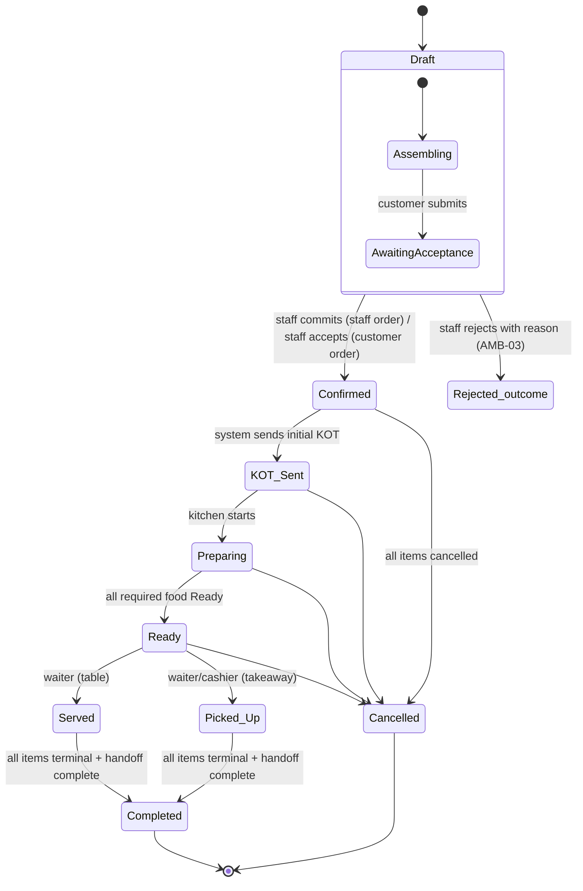

| State | Entered when | Actor | Postcondition |
|---|---|---|---|
| Draft | Order being assembled; no KOT, no sale | Customer / staff | Persisted; identifiable (ORD-064.2) |
| Draft — awaiting acceptance | Customer submits | Customer | Visible to accepting staff (ORD-008.2); counts as a transaction for Reopen Day (DAY-025.1) |
| Confirmed | Staff commit or acceptance | Staff | Initial KOT generated (KOT-001.1) |
| KOT Sent | KOT dispatched | System | Kitchen has the work |
| Preparing | Kitchen starts | Kitchen | — |
| Ready | All required food Ready across stations (KDS-009.1) | Kitchen / Own, Mgr oversight | Handoff staff notified (HANDOFF-001.2) |
| Served / Picked Up | Handoff recorded | Waiter / Waiter, Cashier | — |
| Completed | Every item Served, Picked Up or Cancelled **and** handoff complete (ORD-063.1) | System | Feedback offered (FEEDBACK-001.1); reorder eligible (CUSTOMER-020.1) |
| Cancelled | Every item cancelled before fulfillment (ORD-065.1), or order cancellation | Authorized actor / Kitchen / System | No feedback (ORD-065.AC1); not reorder-eligible |

**Invalid transitions** (ORD-061.1): any skip of a required state is refused with no change, e.g. Draft → Ready (ORD-061.AC1); Draft → KOT Sent without Confirmed; Completed by bill/payment alone (ORD-063.AC2); Cancelled/Completed → any active state. The complete transition table is TRD (DF-03).

**Order-level vs item-level.** Item state is authoritative for readiness, cancellation and completion (ORD-070.1, ORD-072.1). The order is "fully Ready" only when all required items are Ready (KDS-009.1). *How the order-level label is derived when items are in mixed states (e.g. some Served, a later additional item Preparing) is not defined in PRD beyond these rules; the transition table is deferred (DF-03) — AMB-01.*

### 12.2 Item-level state machine (ORD-071.1)
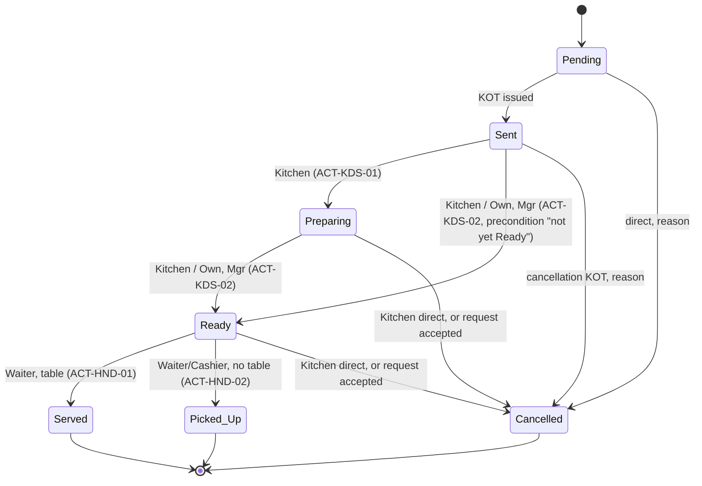
- KDS "New" corresponds to item **Sent** (PRD §34 state changes "New/Sent → Preparing").
- Hold, Void, Re-fire act on items without adding item states (§13).
- Owner/Manager may mark Ready but not Preparing (ACT-KDS-01/02). Ready may be marked from Sent/New or Preparing: the ACT-KDS-02 precondition is "Item not yet Ready" (RBAC-015.1) — AMB-13 RESOLVED.

### 12.3 Lifecycle cases
| Case | Behaviour | PRD |
|---|---|---|
| Additional items | Same order; additional KOT; history preserved | ORD-080.1 |
| All items cancelled | Order outcome Cancelled, not Completed | ORD-065.1 |
| Some fulfilled, rest cancelled | Completed once all terminal + handoff complete (e.g. Burger Served + Fries Served + Coke Cancelled) | ORD-063.1, ORD-063.AC1 |
| Bill paid, item still Ready | Not Completed | ORD-063.AC2 |
| Duplicate submission | One order; retry returns it; no duplicate KOT | ORD-006.1 |
| Abandoned Draft | No KOT/sale; Draft kept; table claim released (AF-022) | ORD-064.1, ORD-064.2 |
| Offline submission | Pending/failed shown; safe retry; server validates (AF-064) | OFFLINE-001.1…003.1 |
| Supported operations | modify qty/modifiers, customer notes, kitchen notes, multiple KOTs, hold, void, cancel, re-fire, cancel order with reason, source tracking | ORD-084.1 |

---

## 13. Hold / Void / Re-fire

### Flow ID
AF-033
### Name
Hold (item or order)
### Actor
Hold item: Owner, Manager (ACT-MOD-03). Hold order: Owner, Manager, Cashier, Waiter (ACT-MOD-06).
### Preconditions
Item not yet terminal; order-level Hold only when the entire order is intentionally paused (ORD-073.1).
### Trigger
Operational need to pause preparation/progress.
### Main Flow
1. Actor places Hold on the item (primary use) or entire order.
2. Held item/order is paused from progressing; history is never erased (ORD-073.1).
### State Changes
Hold flag on item/order; item state value unchanged (Hold is not an item state, ORD-071.1).
### Authorization
As above. Approval: None.
### Audit
**Audited**: order hold (AUDIT-002.1 "order cancellation/void/hold"); Hold is an audited operational action (ORD-073.1).
### Invalid Use
Hold on a terminal item (Served/Picked Up/Cancelled) → refused. Cashier/Waiter holding a single item → SD.
### KOT implications / Release
Not defined: whether Hold produces a KOT/KDS update, how the kitchen sees a held item, and who releases a Hold (no "release" action is catalogued) → **AMB-02**.
### Offline Behaviour
Server revalidates item state.
### Related PRD Requirements
ORD-073.1, ORD-084.1, ACT-MOD-03.1, ACT-MOD-06.1, AUDIT-002.1.

### Flow ID
AF-034
### Name
Void (item or order)
### Actor
Void item: Owner, Manager (ACT-MOD-04). Void order: Owner, Manager, Cashier (ACT-MOD-07).
### Preconditions
Reason supplied.
### Trigger
Authorized operational invalidation.
### Main Flow
1. Actor voids the item/order with a reason.
2. Record preserved — never physically deleted (ORD-073.1).
3. If the item has entered kitchen processing, Void follows cancellation state-safety exactly: Sent → cancellation KOT; Preparing/Ready → cancellation request to Kitchen (AF-040), item unchanged until Kitchen accepts (ORD-073.AC1); Served/Picked Up → not allowed (correction/refund).
### State Changes
Item → Cancelled (directly or after Kitchen acceptance). Excluded from bill (ORD-087.1).
### Authorization
As above; Waiter void order → SD; Cashier/Waiter void item → SD.
### Audit
**Audited** (AUDIT-002.1), reason required.
### Invalid Use
Void without reason → refused; void bypassing kitchen state → impossible by rule.
### Offline Behaviour
Server revalidates state.
### Related PRD Requirements
ORD-073.1, ORD-082.1, ORD-088.1, ACT-MOD-04.1, ACT-MOD-07.1, AUDIT-002.1.

### Flow ID
AF-035
### Name
Re-fire
### Actor
Owner, Manager, Kitchen (ACT-KOT-04).
### Preconditions
Existing preparation operationally unusable or another preparation is required.
### Trigger
Dropped/incorrect dish.
### Main Flow
1. Actor re-fires the item.
2. Additional kitchen work is generated; original preparation history preserved (ORD-073.1, ORD-073.AC2, KDS-006.1).
### State Changes
New kitchen work for the item; original history unchanged. *Whether re-fire creates a new item line, a new KOT, and whether it affects the bill, is not defined (AMB-02).*
### Authorization
Own, Mgr, Kit. Cashier/Waiter → SD.
### Audit
**Audited** (AUDIT-002.1 "re-fire").
### Invalid Use
Re-fire of a Cancelled item → refused (no preparation to replace).
### Offline Behaviour
Server authoritative.
### Related PRD Requirements
ORD-073.1, KDS-006.1, ACT-KOT-04.1, AUDIT-002.1.

---

## 14. KOT and Kitchen Flow

### 14.1 Overview
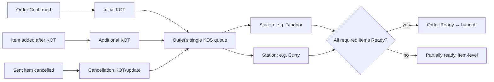

### Flow ID
AF-036
### Name
KOT generation (initial / additional / cancellation)
### Actor
System.
### Preconditions
Initial: order Confirmed. Additional: item added after initial KOT. Cancellation: Sent item cancelled.
### Trigger
State change of order/item.
### Main Flow
1. System generates the KOT (KOT-001.1 / KOT-002.1 / KOT-003.1).
2. KOT shows table or order number, items, modifiers, notes (KOT-004.1); marks **TAKEAWAY** when no table (KOT-005.1, KOT-005.AC1).
3. Items routed to their mapped station (KOT-006.1, KOT-006.AC1).
4. KOT delivered to KDS (KOT-009.1, KOT-009.2); kept in order history (KOT-008.1).
### State Changes
Order Confirmed → KOT Sent; items Pending → Sent.
### Authorization
System (ACT-KOT-01…03).
### Audit
KOT history on the order; cancellation KOT is part of the audited cancellation.
### Alternative Paths
Transfer after KOT → KDS shows new table, history unchanged (TABLE-009.1).
### Failure Paths
Interrupted KOT send → safe retry → exactly one logical KOT (KOT-007.1, KOT-007.AC1, OFFLINE-004.1).
### Offline Behaviour
KDS disconnected → AF-065.
### Exit State
KOT on KDS.
### Related PRD Requirements
KOT-001.1…KOT-009.2, ACT-KOT-01.1, ACT-KOT-02.1, ACT-KOT-03.1, OFFLINE-004.1, TABLE-009.1. Thermal printing deferred (KOT-010 / DF-05).

### Flow ID
AF-037
### Name
KDS preparation and readiness aggregation
### Actor
Kitchen Staff (all share one queue); Owner, Manager (view; Ready oversight).
### Preconditions
KOT on KDS; one kitchen per outlet (KDS-001.1, ORG-005.1); stations inside it (KDS-002.1).
### Trigger
New KOT.
### Main Flow
1. KOT appears as **New** with order timer (KDS-003.1, KDS-004.1).
2. Any Kitchen user marks items **Preparing** (ACT-KDS-01).
3. Any Kitchen user (or Own/Mgr oversight, KDS-010.1) marks items **Ready** (ACT-KDS-02, KDS-008.1).
4. Readiness recorded per item (ORD-072.1). Order is fully Ready only when all required food across stations is Ready, regardless of which user acted (KDS-009.1, KDS-009.AC1, KDS-002.AC1).
5. Ready → handoff staff and customer status updated (HANDOFF-001.2, ORD-022.1).
### State Changes
Item Sent → Preparing → Ready; order → Preparing → Ready.
### Authorization
ACT-KDS-01 Kit only; ACT-KDS-02 Kit, Own, Mgr; ACT-KDS-04 view Own, Mgr, Kit. Cashier/Waiter → SD.
### Audit
Ready by Owner attributed to Owner (KDS-010.AC1). Not in AUDIT-002.1.
### Alternative Paths
Multiple kitchen users act on same order → shared state; concurrent conflict → EF-09.
### Failure Paths
Mark Ready on an already Ready item → state denial. Ready may be marked from New/Sent or Preparing (ACT-KDS-02 precondition "Item not yet Ready", RBAC-015.1). No delayed-order workflow or delay alerts exist (KDS-007.1, NG-014.1).
### Offline Behaviour
AF-065.
### Exit State
Items/order Ready.
### Related PRD Requirements
KDS-001.1…KDS-004.1, KDS-008.1, KDS-009.1, KDS-010.1, KDS-007.1, ORD-072.1, ORG-005.1, ACT-KDS-01.1, ACT-KDS-02.1, ACT-KDS-04.1, NG-004.1, NG-014.1.

### Compact flow AF-038 — Priority escalation
| Aspect | Rule |
|---|---|
| Actor | Kitchen, Manager (ACT-KDS-03). Owner **N**. |
| Precondition | Item not completed |
| Flow | Default NORMAL → manually raised to HIGH or URGENT; KDS shows it (KDS-005.AC1) |
| Never | AI-driven (KDS-005.1, AI-044.1) |
| Audit | Not in AUDIT-002.1 |
| PRD | KDS-005.1, AI-044.1, ACT-KDS-03.1 |

### Flow ID
AF-039
### Name
Kitchen operational cancellation (full / partial)
### Actor
Kitchen Staff (ACT-CAN-04 items, ACT-CAN-05 order).
### Preconditions
Item not Served/Picked Up; valid operational reason.
### Trigger
Unavailability or other operational reason.
### Main Flow
1. Kitchen selects items or whole order (KDS-011.1).
2. Selects mandatory reason category (+ optional text): Item unavailable · Ingredient unavailable · Preparation issue · Duplicate entry · Other (KDS-012.1, KDS-015.1). No request needed.
3. Items → Cancelled; order and bill update; never a silent deletion (KDS-013.1).
4. Waiter/Cashier and customer see the result (KDS-013.2, KDS-011.AC1).
### State Changes
Items → Cancelled; bill excludes them (ORD-087.1); if all cancelled → order Cancelled (ORD-065.1).
### Authorization
Kitchen only.
### Audit
**Audited** (KDS-014.1); cancellation record fields (ORD-092.1).
### Alternative Paths
Partial cancellation → remaining items continue.
### Failure Paths
No reason → refused (KDS-012.AC1). Served item → refused.
### Offline Behaviour
Server authoritative.
### Exit State
Items Cancelled; stakeholders informed.
### Related PRD Requirements
KDS-011.1, KDS-012.1, KDS-013.1, KDS-013.2, KDS-014.1, KDS-015.1, ORD-082.1, ACT-CAN-04.1, ACT-CAN-05.1.

### Flow ID
AF-040
### Name
Cancellation request and acknowledgement (Preparing/Ready items)
### Actor
Requester: Owner, Manager, Cashier, Waiter (ACT-CAN-06). Acknowledger: Kitchen (ACT-CAN-07).
### Preconditions
Item Preparing or Ready; reason supplied.
### Trigger
Non-kitchen cancellation (or Void, AF-034) of an in-preparation item.
### Main Flow
1. Requester submits request with mandatory reason (ORD-088.1).
2. Item stays in its current state (ORD-088.AC1); Kitchen sees the request (ORD-088.2, KDS-017.1).
3. Kitchen **accepts** → item Cancelled; cancellation KOT/event; bill excludes item.
4. Kitchen **declines** → item stays active; declined request kept in history (ORD-093.AC1).
### State Changes
Request: Open → Accepted / Declined / No-op. Item: unchanged or Cancelled.
### Authorization
As above.
### Audit
Request and outcome kept in history/audit (ORD-093.1, ORD-092.1).
### Alternative Paths
- **Item reaches Served/Picked Up first** → terminal state stands; request becomes a no-op kept in history and audit (ORD-093.AC3).
- **Stale request** (threshold DF-13) → stays pending, item not cancelled, Attention item created (ORD-093.AC2, ATTENTION-003.2) → AF-062.
### Failure Paths
No reason → refused. Request on Pending/Sent item → not applicable (direct cancellation instead).
### Offline Behaviour
Server authoritative; acknowledgement on a resolved request returns the existing result.
### Exit State
Request resolved or no-op; never auto-cancels.
### Related PRD Requirements
ORD-088.1, ORD-088.2, ORD-093.1, KDS-017.1, ATTENTION-003.2, ACT-CAN-06.1, ACT-CAN-07.1.

---

## 15. Food Handoff Flow

### 15.0 Canonical handoff rule (CON-02 RESOLVED, v1.2)
| Order type (ORD-004.1) | Handoff end state | Action | Default actor | Precondition |
|---|---|---|---|---|
| Table-associated (dine-in) | **Served** | ACT-HND-01 | Waiter (any other role only if the Owner grants ACT-HND-01 through catalogue customization, RBAC-004.1/005.1) | Ready; table associated |
| No table (Takeaway, any source) | **Picked Up** | ACT-HND-02 | Waiter, Cashier | Ready; no table |

There is no other handoff path, role or state. HANDOFF-002.1's "no waiter" wording is applied within ACT-HND-02's explicit precondition "Ready; no table" (decided 2026-10-07, OD-45.1), which prevails over the hardening-document wording (SOT-003 / PRD-SOT-003.1) and is the authoritative current-state precondition (RBAC-015.1). An outlet that serves table orders without Waiters must have the Owner grant ACT-HND-01 to the serving role; the table/Takeaway definition and the completion rule (ORD-063.1) are unchanged.

### Flow ID
AF-041
### Name
Served (table order with waiter)
### Actor
Waiter (ACT-HND-01). Owner/Manager/Cashier/Kitchen **N**.
### Preconditions
Item/order Ready; table associated.
### Trigger
Waiter sees Ready (HANDOFF-001.2).
### Main Flow
1. Waiter collects the Ready food.
2. Waiter confirms **Served** (HANDOFF-001.1, HANDOFF-001.AC1).
3. If all items are terminal and handoff complete → order Completed (ORD-063.1).
### State Changes
Items Ready → Served; possibly order → Completed.
### Authorization
Waiter only.
### Audit
Not in AUDIT-002.1.
### Failure Paths
Not Ready → state denial. No table → use AF-042. Non-Waiter → SD unless the Owner has granted ACT-HND-01 to that role through catalogue customization (RBAC-005.1). A table-associated order can never be marked Picked Up (ACT-HND-02 precondition "no table") — canonical handoff rule §15.0 (CON-02 RESOLVED).
### Offline Behaviour
Server authoritative.
### Exit State
Served.
### Related PRD Requirements
HANDOFF-001.1, HANDOFF-001.2, ACT-HND-01.1, ORD-063.1.

### Flow ID
AF-042
### Name
Picked Up (Takeaway / no waiter)
### Actor
Waiter or Cashier (ACT-HND-02, HANDOFF-004.1).
### Preconditions
Ready; no table.
### Trigger
Recipient arrives.
### Main Flow
1. Food handed off; KDS and customer views show TAKEAWAY (HANDOFF-003.1).
2. Waiter/Cashier records **Picked Up** (HANDOFF-002.1).
3. Completion check (ORD-063.1).
### State Changes
Ready → Picked Up; possibly Completed.
### Authorization
Waiter, Cashier; Kitchen → SD (HANDOFF-004.AC1); Customer N.
### Audit
Not in AUDIT-002.1.
### Failure Paths
Not Ready → refused; has table → refused (use AF-041).
### Offline Behaviour
Server authoritative.
### Exit State
Picked Up.
### Related PRD Requirements
HANDOFF-002.1, HANDOFF-003.1, HANDOFF-004.1, HANDOFF-001.2, ACT-HND-02.1.

---

## 16. Billing Flow

### 16.1 Two independent axes (BILL-001.1, BILL-002.1)
| Axis | Values | Changed by |
|---|---|---|
| Bill status | Draft → Finalized; correction states Reopened, Cancelled, Refunded (partial/full) | Bill actions |
| Payment status | Not Paid / Paid | Recorded payments vs current total (PAY-010.1) |

```mermaid
stateDiagram-v2
  [*] --> Draft: create bill (1 per order)
  Draft --> Draft: items added/removed, adjustments, payments (no Reopen; outstanding/overpayment recalculated)
  Draft --> Finalized: finalize
  Finalized --> Reopened: reopen + reason
  Reopened --> Reopened: correction
  Reopened --> Finalized: re-finalize
  Finalized --> Cancelled: cancel bill (not a refund)
  Finalized --> Refunded: refund recorded (partial/full)
```
Payment axis: `Not Paid ──recorded payments ≥ current total──▶ Paid`; recalculated whenever the total changes (PAY-012.1). The diagram shows only transitions PRD names; preconditions for Cancel bill are "—" in the catalogue (AMB-11) and the payment-status effect of refunds is not defined (AMB-05).

### 16.2 Action matrix (PRD §13.4.3)
| Action | Own | Mgr | Csh | Wtr | Kit | Cust | Precondition | Outlet Closed |
|---|---|---|---|---|---|---|---|---|
| Create bill (ACT-BIL-09) | Y | Y | Y | Y | N | — | One bill per order | allowed for existing confirmed orders (ORG-025.1 "continue through … billing") |
| View bill (ACT-BIL-01) | Y | Y | Y | Y | N | Own order via link | — | allowed |
| Discount (ACT-BIL-02) | Y | Y | Y | N | N | — | Bill not Finalized | not stated (AMB-07) |
| Service/packaging charge (ACT-BIL-03) | Y | Y | Y | N | N | — | Bill not Finalized | not stated (AMB-07) |
| Finalize (ACT-BIL-04) | Y | Y | Y | Y | N | — | Draft or Reopened | **allowed** (ORG-027.1) |
| Reopen (ACT-BIL-05) | Y | Y | Y | Y | N | — | Finalized (paid or not); reason | **allowed** (ORG-034.1) |
| Cancel bill (ACT-BIL-06) | Y | Y | Y | N | N | — | — | correction → allowed (ORG-034.1) |
| Refund (ACT-BIL-07) | Y | Y | Y | N | N | — | Payment recorded | **allowed** (ORG-034.1) |
| Print/digital/reprint (ACT-BIL-08) | N | N | Y | N | N | N | Never mutates | allowed |
| Record payment (ACT-PAY-01) | Y | Y | Y | N | N | — | Independent of finalization | **allowed** (ORG-027.1) |
| Correct payment (ACT-PAY-02) | Y | Y | Y | N | N | — | — | **allowed** (ORG-034.1) |

### Flow ID
AF-043
### Name
Create bill and Draft bill
### Actor
Owner, Manager, Cashier, Waiter.
### Preconditions
Order exists; no bill yet for this order (BILL-015.1).
### Trigger
Staff prepares the bill.
### Main Flow
1. Staff creates the bill for the order (ACT-BIL-09). Table → Order → Bill; Takeaway Order → Bill (BILL-015.1).
2. Bill is **Draft**: customer not yet billed, may keep ordering (BILL-003.1); items added to the order appear on the bill; cancelled items excluded (ORD-087.1).
3. Tax computed from line snapshots (MENU-017.1); calculation policy DF-14.
4. Customer may view own bill via private link (ACT-BIL-01).
### State Changes
Bill: *(none)* → Draft, Not Paid. Table → Billing (dine-in; trigger DF-03).
### Authorization
ACT-BIL-09.
### Audit
Bill creation counts as a transaction for Reopen Day (DAY-025.1); not in AUDIT-002.1.
### Alternative Paths
Payments may be recorded on a Draft (PAY-010.AC2, AF-049).
### Failure Paths
Second bill for same order → refused/existing returned (BILL-015.AC1, SI). Kitchen → SD.
### Offline Behaviour
SI applies; server authoritative.
### Exit State
Draft bill.
### Related PRD Requirements
BILL-003.1, BILL-008.1, BILL-015.1, ORD-087.1, MENU-017.1, ORG-023.1, ACT-BIL-09.1, ACT-BIL-01.1.

*Bills are created by staff, not by the system: the catalogue reserves `sys` for system actions, and ACT-BIL-09 is granted to Owner, Manager, Cashier, Waiter (AMB-11 sub-question resolved).*

### Compact flow AF-044 — Discounts and service/packaging charges
| Aspect | Rule |
|---|---|
| Actor | Own, Mgr, Csh (ACT-BIL-02/03); Waiter N |
| Precondition | Bill not Finalized (Draft, or Reopened as part of correction) |
| Flow | Apply discount / service charge / packaging charge; round-off applied; total recalculated; payment status/outstanding recalculated (PAY-012.1) |
| Audit | **Discount audited** with who, when, before/after amounts (BILL-013.AC1). Service/packaging charge adjustment not listed in AUDIT-002.1 (AMB-21) |
| Not defined here | Discount rules, charge basis, rounding (DF-14) |
| PRD | BILL-008.1, BILL-013.1, ACT-BIL-02.1, ACT-BIL-03.1 |

### Flow ID
AF-045
### Name
Finalize bill
### Actor
Owner, Manager, Cashier, Waiter (ACT-BIL-04).
### Preconditions
Bill Draft or Reopened.
### Trigger
Customer ready to pay / leave.
### Main Flow
1. Staff verifies items, taxes, discounts, charges (Cashier workflow §41 PRD).
2. Staff finalizes → **Finalized**. Payment status independent (Finalized + Not Paid allowed, BILL-001.AC1).
3. Finalized bill contributes to day-close finalized sales of its business day (DAY-022.1).
### State Changes
Draft/Reopened → Finalized.
### Authorization
ACT-BIL-04.
### Audit
Finalization is a transaction (DAY-025.1). Not in AUDIT-002.1 except as part of correction history (BILL-011.1).
### Alternative Paths
Outlet Closed → allowed (ORG-027.1). Any time of day (ORG-023.1).
### Failure Paths
Already Finalized → state denial; later edits require Reopen (BILL-004.1, BILL-004.AC1).
### Offline Behaviour
SI; server authoritative.
### Exit State
Finalized.
### Related PRD Requirements
BILL-001.1, BILL-004.1, ORG-023.1, ORG-027.1, DAY-022.1, ACT-BIL-04.1.

### Flow ID
AF-046
### Name
Reopen bill and correction
### Actor
Owner, Manager, Cashier, Waiter (ACT-BIL-05; BILL-017.1).
### Preconditions
Bill **Finalized** (paid or not). A Draft bill is corrected without Reopen (BILL-005.1, PAY-012.1).
### Trigger
Error found after finalization; additional items needed after finalization.
### Main Flow
1. Actor reopens with mandatory reason (BILL-014.1; categories: Item correction · Payment correction · Discount/charge correction · Other).
2. Bill → **Reopened**; editing allowed (BILL-016.AC1) — items, adjustments within each action's permission.
3. Existing payment records kept unchanged; outstanding and payment status recalculated against the new total (PAY-012.1). Example: Paid ₹2,840 → item added → ₹3,040 → Not Paid, ₹200 outstanding (PAY-012.AC1).
4. Actor re-finalizes (AF-045) → Finalized.
5. Correction history preserved (BILL-011.1).
### State Changes
Finalized → Reopened → Finalized. Payment status recalculated.
### Authorization
ACT-BIL-05 incl. Waiter. Approval: None.
### Audit
**Bill reopen audited** with before/after (BILL-014.AC1, AUDIT-002.1). Correction keeps original business-day attribution and actual timestamp (DAY-022.1).
### Alternative Paths
- Outlet Closed → reopen, correction, refund, re-finalize all allowed (ORG-034.1, ORG-034.AC1).
- Day already closed → see AF-053 / §18.6 (correction keeps original attribution; Reopen Day only under its constraints).
- Table restructuring needing billing change → this flow (TABLE-018.1).
### Failure Paths
- Reopen without reason → refused (BILL-014.AC1).
- Edit Finalized/Paid bill without Reopen → refused (BILL-016.1, BILL-016.AC1, ORD-051.AC2).
- Reopen on Draft → state denial (not needed).
### Offline Behaviour
Server authoritative; concurrent correction → EF-09.
### Exit State
Re-finalized bill.
### Related PRD Requirements
BILL-004.1, BILL-005.1, BILL-011.1, BILL-014.1, BILL-016.1, BILL-017.1, PAY-012.1, ORG-034.1, DAY-022.1, KDS-015.1, ACT-BIL-05.1, TABLE-011.1.

### Flow ID
AF-047
### Name
Cancel bill
### Actor
Owner, Manager, Cashier (ACT-BIL-06).
### Preconditions
Catalogue precondition "—".
### Trigger
Authorized correction.
### Main Flow
1. Actor cancels the bill → **Cancelled**.
2. No refund is created automatically (BILL-007.1, BILL-007.AC1).
### State Changes
Bill → Cancelled (resolved per ANALYTICS-011.1).
### Authorization
Own, Mgr, Csh; Waiter → SD (BILL-010.AC1).
### Audit
**Audited** (AUDIT-002.1).
### Failure Paths
Waiter attempt → SD.
### Not defined
Reason requirement (not listed in KDS-015.1 reason uses), effect on recorded payments and on the order, whether a new bill may be created for the order afterwards (AMB-11).
### Related PRD Requirements
BILL-007.1, BILL-010.1, BILL-013.1, ACT-BIL-06.1.

### Compact flow AF-048 — Print / digital bill / reprint
| Aspect | Rule |
|---|---|
| Actor | Cashier only (ACT-BIL-08); Owner/Manager/Waiter **N** |
| Flow | Provide printable or digital bill; reprint any time; table's last bill reachable after payment (TABLE-011.1) |
| Invariant | Reprint never mutates financial data (BILL-009.1, BILL-009.AC1) |
| Printer integration | Deferred (DF-05) |
| PRD | BILL-008.1, BILL-009.1, TABLE-011.1, ACT-BIL-08.1 |

---

## 17. Payment Flow

### Flow ID
AF-049
### Name
Record payment information (full / partial / split)
### Actor
Owner, Manager, Cashier (ACT-PAY-01). Waiter **N**.
### Preconditions
Bill exists (Draft, Finalized or Reopened) — independent of finalization (PAY-010.1).
### Trigger
Customer pays.
### Main Flow
1. Actor records one or more payment components: mode (UPI, Cash, Card; Split = several components) and amount (PAY-002.1).
2. For online payments, records the provider/payment reference **when supplied** (PAY-003.1); if none is supplied the payment is recorded without one; SERVENA never fabricates a reference (PAY-011.1, PAY-011.AC1).
3. Each record linked to bill, order, outlet (PAY-004.1) and to the business day in which it is recorded (PAY-009.1, DAY-006.1).
4. System recalculates: outstanding = current total − recorded payments; **Paid** when recorded payments cover the total, else **Not Paid** (PAY-010.1, PAY-010.AC1).
5. Split components kept separately and feed Day Close (PAY-005.1, PAY-005.AC1).
### State Changes
Payment records added; payment status recalculated; bill status unchanged (e.g. Draft stays Draft, PAY-010.AC2).
### Authorization
ACT-PAY-01; allowed while outlet Closed (ORG-027.1). No money moves (PAY-008.1, NG-011.1).
### Audit
Payment recording is a transaction (DAY-025.1). Not in AUDIT-002.1 (corrections are).
### Alternative Paths
- Partial: ₹2,000 on ₹2,840 → Not Paid, ₹840 outstanding (PAY-010.AC1).
- Split: ₹1,840 UPI (+reference) + ₹1,000 Cash on one bill — never multiple bills (BILL-015.1).
- **Bill total changes after payment**: Draft → no Reopen; payments kept; status recalculated (PAY-012.AC2). Finalized → only via Reopen (AF-046).
- **Overpayment** = total recorded payments − current bill total; if > 0, shown explicitly on the bill until resolved by an authorized, audited correction (AF-050) or refund (AF-051) (PAY-012.1, PAY-012.AC3).
### Failure Paths
- Duplicate submission → one record (PAY-006.1, PAY-006.AC1, SEC-003.1).
- Waiter/Kitchen → SD.
### Offline Behaviour
Retries idempotent (OFFLINE-006.1); never creates conflicting financial truth (OFFLINE-008.1).
### Exit State
Payment recorded; status current.
### Related PRD Requirements
PAY-001.1…PAY-012.1, BILL-001.1, BILL-015.1, DAY-006.1, ORG-027.1, OFFLINE-006.1, SEC-003.1, ACT-PAY-01.1, NG-011.1.

### Flow ID
AF-050
### Name
Correct payment information
### Actor
Owner, Manager, Cashier (ACT-PAY-02).
### Preconditions
Payment record exists.
### Trigger
Wrong mode/amount/reference recorded, or overpayment resolution.
### Main Flow
1. Actor corrects the payment information.
2. Existing records are never silently deleted or rewritten (PAY-012.1); the correction is a traceable event.
3. Payment status recalculated.
### State Changes
Payment information corrected; status recalculated.
### Authorization
ACT-PAY-02; allowed while Closed (ORG-034.1). Owner Agent → requires Owner confirmation (AI-029.1).
### Audit
**Audited** (PAY-007.1, BILL-013.1, AUDIT-002.1).
### Failure Paths
Unauthorized → SD. Duplicate → SI.
### Offline Behaviour
Server authoritative.
### Exit State
Corrected payment information.
### Related PRD Requirements
PAY-007.1, PAY-012.1, BILL-013.1, ORG-034.1, ACT-PAY-02.1.

*How a correction preserves the original record while changing the effective value (e.g. reversal + new record) is a TRD concern; reason requirement for payment correction is "relevant correction actions" per KDS-015.1 — not explicitly enumerated (AMB-21).*

### Flow ID
AF-051
### Name
Refund (partial / full)
### Actor
Owner, Manager, Cashier (ACT-BIL-07). Waiter **N**.
### Preconditions
Payment recorded on the bill.
### Trigger
Complaint, billing error, cancellation after payment, overpayment.
### Main Flow
1. Actor records a refund: amount, refund/payment mode, reason (categories: Customer complaint · Billing error · Cancelled after payment · Other), provider reference when available — never fabricated (PAY-013.1, BILL-006.1).
2. System records actor and timestamp; distinguishes partial vs full (BILL-006.1, BILL-006.AC1).
3. Bill shows Refunded (partial/full) (BILL-002.1). Refund is recorded information only; no money moves (BILL-012.1).
4. Cash refunds reduce expected cash of the business day in which they are recorded (CASH-007.1).
### State Changes
Refund record added; bill status Refunded.
### Authorization
ACT-BIL-07; allowed while Closed (ORG-034.1). Owner Agent requires Owner confirmation (AI-029.1).
### Audit
**Audited** (AUDIT-002.1, AUDIT-001.AC1: actor, time, outlet, amount, before/after, reason).
### Alternative Paths
Bill cancellation does not create a refund (BILL-007.1).
### Failure Paths
No payment recorded → state denial. Waiter → SD (BILL-010.AC1). Duplicate → SI (SEC-003.1).
### Offline Behaviour
Idempotent; no conflicting financial truth.
### Exit State
Refund recorded.
### Related PRD Requirements
BILL-002.1, BILL-006.1, BILL-007.1, BILL-012.1, BILL-013.1, PAY-013.1, CASH-007.1, ORG-034.1, ACT-BIL-07.1, AI-029.1.

*Payment status and outstanding after a refund (whether refunds reduce "recorded payments" in the PAY-012.1 formula) are not defined (AMB-05).*

---

## 18. Day Close Flow

### 18.1 Business day model
- Each outlet runs one continuous business day; no midnight, operating-hours or system start/end boundary; no Start Day (DAY-001.1, DAY-002.1, NG-015.1).
- The only boundary is Day Close by Owner, Manager or Cashier; its timestamp is authoritative (DAY-003.1). The next period automatically becomes the running day (DAY-004.1).
- Days are contiguous and never overlap (DAY-023.1). Every transaction keeps its originating day (DAY-019.1); midnight has no meaning (DAY-005.1).
- "Today" everywhere = current business day since last Day Close (DAY-017.1, ANALYTICS-005.1).

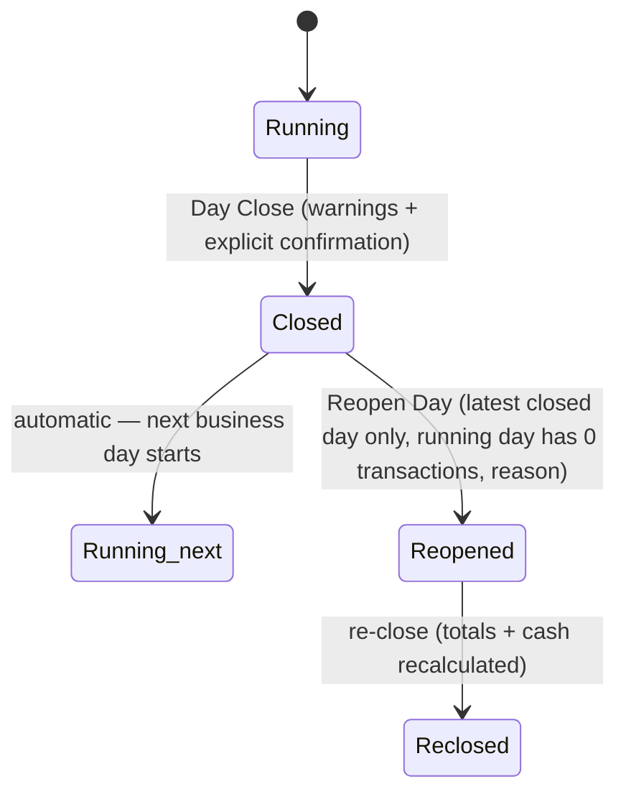

### Flow ID
AF-052
### Name
Day Close with cash reconciliation
### Actor
Owner, Manager, Cashier (ACT-DAY-01/02, ACT-CSH-01/02). Waiter/Kitchen **N** (DAY-003.AC1).
### Preconditions
Outlet business day Running. Outlet may be Open or Closed (ORG-022.AC1).
### Trigger
Authorized user decides to end the outlet's day.
### Main Flow
1. Actor opens Day Close and reviews running-day totals (ACT-DAY-01).
2. System shows **warnings** for: orders not Completed or Cancelled; customer orders awaiting acceptance; items Pending, Sent, Preparing or Ready; unresolved bills (Draft, Reopened, Finalized + Not Paid) (DAY-020.1, ANALYTICS-011.1).
3. System shows sales basis (DAY-022.1): finalized sales = Finalized bills (Paid and Not Paid); paid amount; outstanding; Draft/Reopened not counted as sales. Example: ₹1,000 F+Paid, ₹500 F+Not Paid, ₹300 Draft → sales ₹1,500, paid ₹1,000, outstanding ₹500 (DAY-022.AC1).
4. System shows expected cash = cash payments recorded in the day − cash refunds recorded in the day; no opening float (CASH-005.1, CASH-007.1).
5. Actor enters counted cash and optional notes (ACT-CSH-01); variance = counted − expected is calculated (CASH-003.1).
6. Actor **explicitly confirms** (DAY-012.1).
7. System atomically records Day Close: gross sales, refunds, discounts, net sales, UPI/cash/card sales, expected cash, actual cash, variance, closing user, timestamp, notes (DAY-007.1). Expenses excluded (DAY-008.1).
8. Day → **Closed** at that timestamp; next business day starts automatically (DAY-004.1).
9. Temporary menu availability overrides stop applying (MENU-011.2).
10. Unresolved items remain unchanged and visible; unresolved bills stay in analytics (DAY-011.1, ANALYTICS-010.1, DAY-012.AC1).
### State Changes
Business day Running → Closed; new Running day. No order, item, bill or payment changes.
### Authorization
ACT-DAY-02, ACT-CSH-01. Approval: None.
### Audit
**Day Close audited** (DAY-014.1, AUDIT-002.1).
### Alternative Paths
- Close with unresolved items → allowed after confirmation; nothing cancelled or altered (DAY-012.1).
- Close with variance → allowed; variance stored (CASH-006.1, CASH-006.AC1); may become an Attention item if it meets threshold (ATTENTION-003.AC1, DF-02).
- Outlet Closed → Day Close still available (ORG-022.1).
### Failure Paths
- Duplicate submission → one closed-day record (DAY-009.1, DAY-009.AC1).
- Connection lost → one recoverable outcome, closed or not closed, never duplicated (DAY-010.1, DAY-010.AC1, OFFLINE-007.1).
- Waiter/Kitchen → SD.
- Day not Running (e.g. concurrent close by another user already completed) → existing result returned (SI / EF-09).
### Offline Behaviour
Requires server confirmation; atomic; never completed locally.
### Exit State
Day Closed; next day Running.
### Related PRD Requirements
DAY-001.1…DAY-012.1, DAY-014.1, DAY-016.1, DAY-017.1, DAY-019.1, DAY-020.1, DAY-022.1, DAY-023.1, CASH-001.1…CASH-007.1, ANALYTICS-010.1, ANALYTICS-011.1, MENU-011.2, OFFLINE-007.1, ORG-011.1, ORG-022.1, ACT-DAY-01.1, ACT-DAY-02.1, ACT-CSH-01.1, ACT-CSH-02.1.

### 18.2 Transactions crossing the boundary
| Situation | Belongs to | PRD |
|---|---|---|
| 23:50 and 00:20, no close between | Same business day | DAY-005.AC1 |
| Close 01:30, payment 01:31 | Next business day | DAY-006.AC1 |
| Cash before/after a close | Day in which recorded | CASH-004.1, PAY-009.1 |
| Order created in day N, paid in day N+1 | Payment in N+1; order/bill keep originating attribution | DAY-019.1, PAY-009.1 |
| Correction/refund/re-finalization after close | Keeps original business-day attribution **and** actual timestamp; no further accounting treatment | DAY-022.1, DF-14 |

### Flow ID
AF-053
### Name
Reopen Day and re-close
### Actor
Owner, Manager, Cashier (ACT-DAY-03).
### Preconditions
(a) Target is the outlet's **most recently closed** day (DAY-015.1); (b) the current running day has **zero transactions** (DAY-021.1); (c) reason supplied (DAY-018.1).
**Transaction** = any persisted business operation that materially changes operational/financial state: order creation/modification/cancellation, item changes, KOT-related changes, bill creation/finalization/reopen/cancellation, payment recording/correction, refunds, cash reconciliation, relevant table/order operational changes. An order awaiting acceptance counts. An uncommitted customer Draft does not count merely by existing; opening an empty table alone does not count (DAY-025.1).
### Trigger
Missed transaction or cash count correction.
### Main Flow
1. Actor selects the most recently closed day, enters reason (Missed transaction · Cash count correction · Other).
2. Day → **Reopened**; the empty running period is absorbed into it (DAY-024.1). Never two active business days per outlet (DAY-015.1).
3. Corrections are recorded in the reopened day (transactions during reopen belong to it).
4. Actor re-closes (AF-052 steps 1–8); totals and cash reconciliation recalculated; re-close timestamp becomes the boundary (DAY-015.AC1, DAY-024.1).
### State Changes
Closed → Reopened → Reclosed; next running day begins after re-close.
### Authorization
ACT-DAY-03. Approval: None.
### Audit
**Audited** as Closed → Reopened → Reclosed with actors, times, reason (DAY-014.1, AUDIT-008.1, AUDIT-008.AC1).
### Alternative Paths
Running day contains only an opened empty table → allowed (DAY-025.AC1).
### Failure Paths
- Running day has any transaction (incl. a pending customer order) → refused with state message (DAY-021.AC1, DAY-025.AC1, RBAC-016.AC1).
- Not the most recently closed day → refused (DAY-015.AC2).
- No reason → refused.
### Offline Behaviour
Server only; atomic.
### Exit State
Day reclosed with recalculated totals.
### Related PRD Requirements
DAY-013.1, DAY-015.1, DAY-018.1, DAY-021.1, DAY-023.1, DAY-024.1, DAY-025.1, AUDIT-008.1, ACT-DAY-03.1.

### 18.3 Correction after close (no Reopen Day)
When the running day already has transactions, an earlier day cannot be reopened. Bill-level corrections (AF-046), payment corrections (AF-050) and refunds (AF-051) remain available under their own rules and keep both original business-day attribution and actual timestamp (DAY-022.1). *Whether such a later correction changes the stored Day Close record of the original day is not defined (AMB-14).*

---

## 19. Outlet Open / Closed Flow

### Flow ID
AF-006
### Name
Outlet OPEN → CLOSED
### Actor
Owner, Manager (ACT-AVA-01). Cashier/Waiter/Kitchen **N** (ORG-031.AC1).
### Preconditions
Outlet Activated and Open; actor has outlet in scope.
### Trigger
Explicit decision — **never automatic** from operating hours (ORG-032.1, ORG-032.AC1).
### Main Flow
1. Actor sets outlet Closed.
2. System applies the Closed rules below immediately to every channel and staff surface.
3. Business day continues; Closed is not Day Close and needs no Start Day (ORG-022.1).
### Behaviour while Closed
| Subject | Behaviour | PRD |
|---|---|---|
| New customer orders (table QR, tableless QR, website, WhatsApp, one-tap reorder) | Blocked; customer told ordering unavailable | ORG-021.1, ORG-021.AC1, CUSTOMER-018.1 |
| Website | Shows outlet closed; no new orders | ORG-029.1 |
| WhatsApp | Tells customer outlet closed; no new orders | ORG-030.1 |
| New staff-created orders | Blocked | ORG-024.1, ORG-024.AC1 |
| Pending customer orders (awaiting acceptance) | Stay visible as awaiting acceptance; cannot be accepted, rejected or Confirmed; never auto-cancelled | ORG-033.1 |
| Existing Confirmed orders | Continue through kitchen, handoff, billing; may complete | ORG-025.1, ORG-025.AC1 |
| Kitchen | Keeps processing existing confirmed orders | ORG-028.1 |
| New items on existing orders | Blocked | ORG-026.1, ORG-026.AC1 |
| Existing bills | Finalize and record payment allowed | ORG-027.1 |
| Corrections | Reopen finalized bill, permitted corrections, refunds, re-finalize — allowed under normal rules | ORG-034.1, ORG-034.AC1 |
| Cancellations, re-fire, hold/void on existing items | Not explicitly addressed; ORG-034.1 states Closed blocks new business, not authorized corrections — explicit rule absent (AMB-07) | ORG-034.1 |
| Billing by time of day | Never blocked | ORG-023.1 |
| Day Close / Reopen Day | Available | ORG-022.AC1 |
| Owner/Manager controls | Can reopen outlet (AF-007) | ORG-031.1 |
### State Changes
Outlet availability Open → Closed. No business-day change.
### Authorization
ACT-AVA-01. Owner Agent → requires explicit Owner confirmation (AI-029.1).
### Audit
Not listed in AUDIT-002.1 (AMB-21).
### Failure Paths
Cashier attempt → SD. Already Closed → no change.
### Offline Behaviour
Queued new-order or add-item operations arriving after closure are refused by the server; user told; no server data overwritten (OFFLINE-008.AC1).
### Exit State
Outlet Closed.
### Related PRD Requirements
ORG-020.1…ORG-034.1, CUSTOMER-018.1, ACT-AVA-01.1, AI-029.1, OFFLINE-008.1.

### Flow ID
AF-007
### Name
Outlet CLOSED → OPEN
### Actor
Owner, Manager.
### Preconditions
Outlet Activated and Closed; restaurant not suspended (a suspended restaurant accepts no new business regardless, ONB-014.1).
### Trigger
Explicit decision; never automatic.
### Main Flow
1. Actor sets outlet Open.
2. All channels accept new orders again (subject to activation and suspension).
3. Pending customer orders become actionable: accept or reject (ORG-033.1).
4. Adding items to existing orders allowed again (subject to bill state).
### State Changes
Closed → Open.
### Authorization
ACT-AVA-01.
### Audit
Not listed in AUDIT-002.1 (AMB-21).
### Exit State
Outlet Open.
### Related PRD Requirements
ORG-020.1, ORG-031.1, ORG-032.1, ORG-033.1, ACT-AVA-01.1.

---

## 20. Customer Identity and Feedback

### 20.1 Identity rules (compact)
| Rule | Behaviour | PRD |
|---|---|---|
| No accounts | Customers never sign in; no OTP | AUTH-009.1, CUSTOMER-005.1, NG-012.1 |
| Phone matching | Phone is the primary matching key at **organization** scope | CUSTOMER-021.1 |
| Visibility | Order/history visibility stays **outlet**-scoped per authorization; Owner cross-outlet; matching never widens visibility | CUSTOMER-004.1, CUSTOMER-021.1, ACT-CUS-01 |
| Example | Same phone at two outlets → one customer record at org scope; Cashier of one outlet sees only that outlet's order; each link opens only its own order | CUSTOMER-021.AC1 |
| WhatsApp | Name captured when available | CUSTOMER-021.1 |
| Tableless QR / website | Name + phone mandatory | ORD-030.1, ORD-042.1 |
| Table QR | Name/phone not requested (details are requested only on the no-table QR — PO-AF-02) | ORD-021.1 (amended, PO-AF-02) |
| Staff-created orders | Identity optional; none invented | ACT-ORD-03, FEEDBACK-002.2 |
| Customer record contents | Name, phone, order history, visit count, total spend, AOV, last order, preferred items, outlet history | CUSTOMER-002.1, CUSTOMER-002.AC1 |
| Customer never gets restaurant-wide access | Private link exposes only that order | CUSTOMER-003.1, CUSTOMER-021.1 |

### Flow ID
AF-054
### Name
Private order access and tracking
### Actor
Customer.
### Preconditions
Customer-originated order submitted (link issued). Link mechanism (generation, expiry, revocation) DF-12.
### Trigger
Customer opens their private, non-guessable link.
### Main Flow
1. System resolves the link to exactly one order.
2. Customer sees current order state (ORD-022.1, CUSTOMER-015.1) — awaiting acceptance, accepted/rejected, progress, Ready, handoff, Completed — and own bill (ACT-BIL-01).
3. From the link: feedback when Completed (AF-055); reorder when eligible (AF-056).
### State Changes
None (read).
### Authorization
ACT-CUS-02; the link grants access to its own order only (RBAC-025.1).
### Audit
None.
### Failure Paths
- Altered/guessed link → no other order shown (CUSTOMER-003.AC1, RBAC-025.AC1).
- Invalid/expired link → no order shown (expiry rules DF-12).
- Every customer-originated order — table QR, tableless QR, website, WhatsApp — has a private order link (AUTH-009.1, FEEDBACK-002.2) — AMB-19 RESOLVED.
### Offline Behaviour
Read requires server.
### Exit State
Customer informed.
### Related PRD Requirements
AUTH-009.1, CUSTOMER-003.1, CUSTOMER-005.1, CUSTOMER-015.1, CUSTOMER-016.1, ORD-022.1, RBAC-025.1, ACT-CUS-02.1, ACT-BIL-01.1.

### Flow ID
AF-055
### Name
Customer feedback
### Actor
Customer (submit, ACT-FB-01); Owner, Manager own outlets (view, ACT-FB-02).
### Preconditions
Order **Completed** (FEEDBACK-001.1); customer-originated order with an order-access link (table QR, tableless QR, website, WhatsApp) (FEEDBACK-002.2); no feedback yet for the order (FEEDBACK-006.1).
### Trigger
Order reaches Completed → feedback offered.
### Main Flow
1. Customer gives rating 1–5 and optional comment (FEEDBACK-006.1, FEEDBACK-002.1).
2. Feedback linked to order, outlet, customer (FEEDBACK-003.1).
3. Feedback appears to Owner/Manager as operational insight (FEEDBACK-004.1, ANALYTICS-006.1).
### State Changes
Feedback record created (one per order).
### Authorization
Customer via own link; viewing Own, Mgr own outlets; Cashier/Waiter/Kitchen view → SD.
### Audit
Not in AUDIT-002.1.
### Alternative Paths
—
### Failure Paths
- Order not Completed → not offered (FEEDBACK-001.AC1).
- Order Cancelled (all items cancelled) → not offered (ORD-065.AC1).
- Second submission → refused (FEEDBACK-006.AC1).
- Staff-created / walk-in order without customer link → not offered; no identity invented (FEEDBACK-002.AC1).
- Never published to or requested on public review platforms (FEEDBACK-005.1, CUSTOMER-006.1, NG-008.1).
### Offline Behaviour
SI applies to retries.
### Exit State
Feedback stored.
### Related PRD Requirements
FEEDBACK-001.1…FEEDBACK-006.1, ANALYTICS-006.1, CUSTOMER-006.1, NG-008.1, ACT-FB-01.1, ACT-FB-02.1.

---

## 21. One-Tap Reorder

### Flow ID
AF-056
### Name
One-tap reorder
### Actor
Customer; accepting staff.
### Preconditions
Customer holds the private link to a historical order that reached **Completed** and contains reorderable items (CUSTOMER-020.1); outlet Activated and **Open**; restaurant not suspended. No account/OTP.
### Trigger
Customer taps reorder on the historical order.
### Main Flow
1. System validates outlet state and current menu: availability, price, applicable tax, menu rules (CUSTOMER-012.1, CUSTOMER-017.1).
2. Cancelled / non-fulfillable historical items are not recreated; currently unavailable items are left out and shown — never substituted or invented (CUSTOMER-014.1, CUSTOMER-020.1).
3. System creates a **new** order submission through the Unified Order Engine with current values (CUSTOMER-013.1); the historical order is never modified (CUSTOMER-019.1).
4. Context: with a valid active table context → associated with that table, items join the session's active order if one exists (TABLE-015.1); otherwise **Takeaway** (CUSTOMER-020.1, CUSTOMER-020.AC2).
5. New submission awaits staff acceptance (AF-027).
6. Customer sees the new order and any items left out (CUSTOMER-015.1, CUSTOMER-014.AC1).
### State Changes
New order: Draft (awaiting acceptance). Historical order unchanged.
### Authorization
ACT-CUS-03; acceptance ACT-ACC-01/02.
### Audit
New order history; historical order immutable.
### Alternative Paths
All items unavailable → no orderable items; *whether an empty reorder is refused or no submission is created is not stated; by CUSTOMER-014.1 nothing may be substituted* (AMB-16).
### Failure Paths
- Outlet Closed → rejected; no order (CUSTOMER-018.1, CUSTOMER-018.AC1).
- Historical order Cancelled → reorder not offered (CUSTOMER-020.AC1).
- Invalid/expired link → no access (DF-12).
- Expired/invalid table context → treated as no valid active table context → Takeaway (CUSTOMER-020.1). *How a customer obtains a "valid active table context" when reordering from a private link is not defined (AMB-16).*
- Duplicate tap → one submission (ORD-006.1).
### Offline Behaviour
As AF-023.
### Exit State
New order awaiting acceptance.
### Related PRD Requirements
CUSTOMER-010.1…CUSTOMER-020.1, TABLE-015.1, ORG-021.1, ORD-006.1, ACT-CUS-03.1, NG-007.1, AI-001.1.

---

## 22. AI Flows

### 22.0 Controlled-tool model (applies to every AI flow)
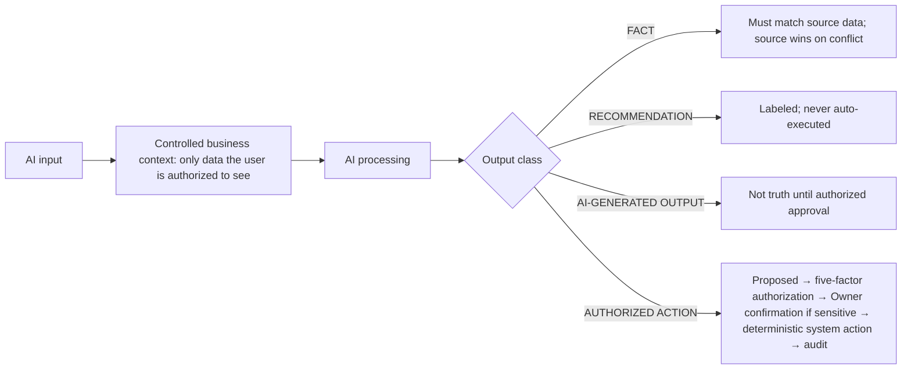
**AI ≠ source of truth.** AI never silently alters orders, bills, payments, menu or day records (AI-004.1); business rules are applied by the product, not by AI reasoning (AI-043.1); source data prevails over AI output (AI-045.1); AI has no unrestricted data access — controlled tools only (AI-024.1); AI never bypasses RBAC (AI-023.1, SEC-005.1); AI actions are permissioned and audited (AI-042.1, AUDIT-004.1); facts and recommendations are separated, nothing is invented (AI-021.1, AI-022.1). Phase 1 AI = exactly AI Menu Import, Owner AI Agent, Daily AI Brief, What Changed?, WhatsApp Ordering Agent, one-tap reorder (AI-001.1); no recovery automation (AI-002.1). **AI unavailable**: ordering, KOT, kitchen, billing and Day Close continue; AI features show unavailable; fallback is deterministic product behaviour (AI-003.1, AI-040.1, AI-041.1, INTEG-001.1). KDS priority is never AI-driven (AI-044.1).

### Flow ID
AF-057
### Name
AI Menu Import
### Actor
Owner only (ACT-AI-01, ACT-AI-07, ACT-AI-02).
### Preconditions
Organization provisioned; AI available.
### Trigger
Owner uploads a menu source.
### Main Flow
1. **AI input**: Owner uploads PDF, image, or Excel/CSV (AI-010.1).
2. **Controlled context**: the uploaded file and the organization's existing menu (for duplicate detection, AI-016.1).
3. **AI processing**: extracts a structured draft — categories, items, prices, attributes (AI-011.1).
4. **Proposed result**: AI-GENERATED OUTPUT draft; low-confidence fields flagged (AI-012.1); duplicates flagged (AI-016.1). Not live.
5. Owner reviews and edits the draft (AI-013.1, ACT-AI-07).
6. **Approval** (the only approval factor in Phase 1): Owner approves (ACT-AI-02, RBAC-014.1).
7. **Authoritative action**: approved content becomes live menu data (AI-014.1, MENU-008.1).
### State Changes
Draft (AI output) → Approved → Published menu.
### Authorization
Owner only; Manager → SD.
### Audit
**Import approval audited** (AI-015.1, AUDIT-002.1).
### Alternative Paths
Owner abandons draft → nothing goes live.
### Failure Paths
- Unapproved items → never orderable, including at activation (AI-014.AC1, ONB-024.AC1).
- Low-confidence price → flagged in review (AI-012.AC1).
- **AI unavailable / output failure** → feature shows unavailable; Owner creates menu manually (AF-014) (AI-041.1).
### Offline Behaviour
Not offline-eligible.
### Exit State
Approved menu published, or draft pending.
### Related PRD Requirements
AI-010.1…AI-016.1, ONB-024.1, RBAC-014.1, ACT-AI-01.1, ACT-AI-02.1, ACT-AI-07.1, AI-041.1.

### Flow ID
AF-058
### Name
Owner AI Agent — answer, analyze, recommend (read-only default)
### Actor
Owner only (ACT-AI-03).
### Preconditions
Owner signed in; AI available.
### Trigger
Owner asks a question.
### Main Flow
1. **Input**: Owner question.
2. **Controlled context**: only data the Owner is authorized to see (AI-020.1), via controlled tools (AI-024.1).
3. **Processing**: analysis.
4. **Result**: answer with FACTS separated from RECOMMENDATIONS (AI-021.1, AI-021.AC1). Missing data stated as unavailable, never estimated as fact (AI-022.AC1). Conflict with source → source shown as fact (AI-045.AC1).
5. No state change (read-only default, AI-029.1).
### Authorization
Owner only.
### Audit
Not required for read (AI actions audited — AF-059).
### Failure Paths
AI unavailable → feature unavailable; dashboards and operations unaffected (AI-040.1).
### Exit State
Answer delivered.
### Related PRD Requirements
AI-020.1…AI-025.1, AI-029.1, AI-045.1, ACT-AI-03.1.

### Flow ID
AF-059
### Name
Owner AI Agent — execute permitted action
### Actor
Owner (requests and confirms); System (executes through controlled tool).
### Preconditions
Action is explicitly permitted for the agent (AI-025.1); Owner holds the underlying permission in the target outlet.
### Trigger
Owner asks the agent to perform a business action.
### Main Flow
1. **Input**: Owner request.
2. **Controlled context**: authorized data; target object state.
3. **Processing**: agent maps request to an explicitly permitted controlled business tool (AI-029.1).
4. **Proposed action** shown to the Owner.
5. **Authorization**: five-factor check as if the Owner acted (RBAC-002.1, ACT-AI-08).
6. **Confirmation**: required for sensitive actions — refunds, payment corrections, permission/RBAC changes, staff credentials/access, outlet Open/Closed, menu price changes, destructive/corrective operational actions (AI-029.1). Nothing happens until confirmed (AI-029.AC1).
7. **Authoritative system action**: executed by the product under the action's own rules (e.g. refund follows AF-051).
8. **Audit**: action, requesting Owner and AI origin recorded (AI-042.AC1).
### State Changes
Exactly those of the underlying flow.
### Authorization
ACT-AI-08 Owner only.
### Audit
Every executed action audited (AI-029.1, AUDIT-004.1).
### Alternative Paths
Owner declines confirmation → nothing executed.
### Failure Paths
- Action not explicitly permitted → refused (AI-025.AC1, SEC-005.1).
- Underlying rule fails (state, outlet, reason) → refused like the human flow.
- AI unavailable → Owner performs the action directly through the normal flow.
### Offline Behaviour
Not offline-eligible.
### Exit State
Action executed and audited, or nothing changed.
### Related PRD Requirements
AI-025.1, AI-029.1, AI-042.1, AI-043.1, SEC-005.1, NG-010.1, ACT-AI-08.1.

*The list of "explicitly permitted" agent actions is not enumerated in PRD (tool implementation DF-13) — AMB-17.*

### Flow ID
AF-060
### Name
Daily AI Brief
### Actor
Owner (authorized outlets), Manager (assigned outlets) (ACT-AI-04).
### Preconditions
Outlet business-day data exists.
### Trigger
Brief generated for an outlet business day (trigger, time and delivery: DF-13).
### Main Flow
1. **Input**: outlet business-day data, bounded by Day Close — never a calendar day (AI-027.1, AI-027.AC1).
2. **Controlled context**: sales, orders, bills and payment status, anomalies, Attention items, meaningful operational changes, business-day comparisons (AI-026.1).
3. **Processing → result**: summary with facts and recommendations separated; no fabricated values (AI-026.1).
4. Viewer sees only outlets in scope (AI-026.AC1).
### State Changes
None to operational truth.
### Authorization
Own, Mgr (own outlets).
### Audit
Not required (read).
### Failure Paths
AI unavailable → Brief unavailable; operations unaffected.
### Related PRD Requirements
AI-026.1, AI-027.1, AI-020.1…AI-024.1, DAY-017.1, ACT-AI-04.1.

### Flow ID
AF-061
### Name
What Changed?
### Actor
Owner, Manager (own outlets) (ACT-AI-05).
### Preconditions
At least one completed comparable business day for a baseline.
### Trigger
User asks "What Changed?".
### Main Flow
1. **Input**: current meaningful business/operational state.
2. **Context**: most recent comparable completed business-day baseline (AI-028.1).
3. **Result**: meaningful changes in sales, order volume/status, bills/payments, anomalies, Attention, menu/staff/outlet configuration (e.g. a price change reported as a change, not a raw audit entry — AI-028.AC2). Not a raw audit viewer.
### Authorization
Own, Mgr within outlet authorization.
### Failure Paths
- No valid baseline → states comparison unavailable; never fabricates (AI-028.AC1).
- AI unavailable → unavailable.
### Related PRD Requirements
AI-028.1, AI-020.1…AI-024.1, ACT-AI-05.1.

### Flow ID
AF-063
### Name
WhatsApp Ordering Agent (AI boundary view of AF-026)
### Actor
Customer; AI agent; accepting staff.
### Preconditions
Outlet Open; WhatsApp reachable; AI available.
### Trigger
Customer message.
### Main Flow
1. **Input**: customer messages.
2. **Controlled context**: outlet's published, currently available menu and current prices only (AI-032.1).
3. **Processing**: builds the order conversationally.
4. **Proposed result**: order submission.
5. **Authoritative action**: Unified Order Engine creates the order under all normal rules (AI-030.1): Takeaway (AI-031.1), awaiting staff acceptance (AI-033.1), idempotent (ORD-006.1).
6. **Authorization**: staff acceptance decides; AI cannot confirm orders.
7. **Audit**: AI actions auditable (AUDIT-004.1).
### Failure Paths
- Off-menu item → not added (AI-032.AC1).
- Outlet Closed → closed message (ORG-030.1).
- WhatsApp down → no partial order; failure surfaced (INTEG-002.1).
- **AI unavailable** → *the PRD requires ordering to continue without AI (AI-040.1) and a deterministic fallback (AI-041.1) but defines no deterministic WhatsApp ordering path* (AMB-15). Other channels are unaffected.
### Related PRD Requirements
AI-030.1…AI-033.1, AI-040.1, AI-041.1, ORG-030.1, INTEG-002.1, ACT-AI-06.1.

*One-tap reorder is listed as a Phase 1 AI capability (AI-001.1); its flow (AF-056) is deterministic — current-menu validation, no substitution (CUSTOMER-014.1). The Attention Engine flow is AF-062 (§23).*

---

## 23. Attention Flow

### Flow ID
AF-062
### Name
Attention lifecycle
### Actor
System (detects, creates); Owner (authorized outlets), Manager (assigned outlets) — review, act, dismiss, resolve (ACT-ANL-04).
### Preconditions
Operational data for the outlet.
### Trigger
A defined signal meets its threshold (thresholds/baselines DF-02).
### Main Flow
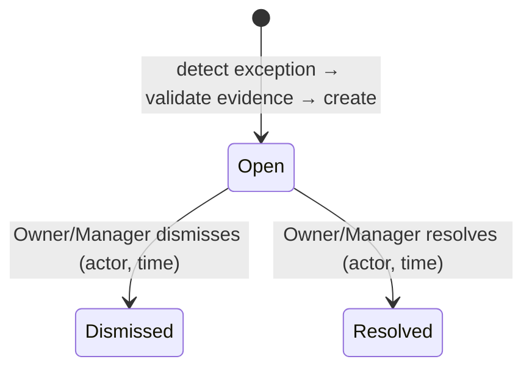
1. Detect exception from operational data (ATTENTION-002.1). Signals: sales materially below baseline, cash variance, unusual discount usage, unusual cancellation/void activity, kitchen preparation slowdown, customer reorder gap, outlet underperformance (ATTENTION-003.1); **stale cancellation request** (ATTENTION-003.2).
2. Validate evidence; create Attention item **Open** with evidence; never accuses an employee or claims an unsupported cause (ATTENTION-004.1, ATTENTION-004.AC1).
3. Owner/Manager of the outlet receive visibility (ATTENTION-002.2, ATTENTION-008.1).
4. Reviewer may **act** using existing permitted actions in their normal flows (no new actions), **dismiss**, or **resolve**; actor and time recorded (ATTENTION-006.1, ATTENTION-006.AC1).
### State Changes
Attention: Open → Dismissed | Resolved. Underlying operational records unchanged by Attention itself.
### Authorization
Own (authorized outlets), Mgr (assigned outlets); Manager sees none from other outlets (ATTENTION-008.AC1). Cashier/Waiter/Kitchen → SD.
### Audit
Actor and time recorded on the item (ATTENTION-006.1). Not in AUDIT-002.1.
### Alternative Paths
Stale cancellation request: Attention created; request stays pending and the item is not cancelled (ORD-093.AC2).
### Failure Paths
Attention is insight only — no KDS delay alerts, no customer outreach (ATTENTION-005.1, NG-014.1, NG-007.1). AI unavailable does not affect deterministic detection *(whether detection is AI-based is not stated)*.
### Exit State
Dismissed or Resolved.
### Related PRD Requirements
ATTENTION-001.1…ATTENTION-008.1, ATTENTION-003.2, ATTENTION-002.2, ORD-093.1, ACT-ANL-04.1.

*Not defined: automatic resolution when the underlying condition clears (e.g. the stale request is acknowledged), and any difference in meaning between Dismissed and Resolved beyond the state name (AMB-18).*

### 23.1 Dashboards and unresolved bills (inputs to Attention and AI)

### Flow ID
AF-066
### Name
Owner / Manager dashboard
### Actor
Owner (all authorized outlets + cross-outlet comparison); Manager (assigned outlets only). Cashier/Waiter/Kitchen have no dashboard (ACT-ANL-01 N).
### Preconditions
Signed in; outlet(s) in scope.
### Trigger
User opens the dashboard.
### Main Flow
1. Dashboard answers business questions first; detailed reports second (ANALYTICS-001.1).
2. Shows for the **current business day** (since last Day Close, never midnight — ANALYTICS-005.1, ANALYTICS-005.AC1): sales, orders, AOV, payment mix, top items, top categories, order-source mix, peak hours, discounts, cancellations, refunds, open orders, staff activity, payment variance, unresolved bills, feedback, multi-outlet comparison where applicable (ANALYTICS-002.1, ANALYTICS-006.1).
3. Owner sees each outlet and a comparison (ANALYTICS-003.1, ANALYTICS-003.AC1); Manager sees only assigned outlets with no comparison or HQ aggregate (ANALYTICS-004.1, ANALYTICS-004.AC1).
4. Follow-ups use only existing permitted actions in their own flows (PRD §50 table).
### State Changes
None.
### Authorization
ACT-ANL-01 (Own; Mgr own outlets), ACT-ANL-02 (Own only), ACT-FB-02, ACT-CUS-01.
### Audit
None (read).
### Failure Paths
Out-of-scope outlet → SD. AI unavailable → dashboard unaffected (it is not an AI feature).
### Related PRD Requirements
ANALYTICS-001.1…ANALYTICS-006.1, ACT-ANL-01.1, ACT-ANL-02.1, ACT-FB-02.1, ACT-CUS-01.1, DAY-017.1.

### Compact flow AF-067 — Unresolved bills
| Aspect | Rule |
|---|---|
| Definition | Unresolved = Draft, Reopened, or Finalized + Not Paid. Resolved = Finalized + Paid, Cancelled, Refunded (ANALYTICS-011.1) |
| Visibility | Stays visible and traceable in Owner and Manager analytics until resolved, across Day Close (ANALYTICS-010.1, ANALYTICS-010.AC1, DAY-011.1) |
| Viewers | Own, Mgr, Csh, Wtr (ACT-ANL-03; Cashier/Waiter via bill actions, RBAC-027.1); Kitchen N |
| Resolution | Only through billing/payment flows (AF-045, AF-047, AF-049, AF-051) — never by Day Close |

---

## 24. Offline Flow

### Flow ID
AF-064
### Name
Offline submission, buffering, retry and server validation
### Actor
Any staff user or customer client.
### Preconditions
Client loses connectivity during an operation.
### Trigger
Network failure.
### Main Flow
```mermaid
sequenceDiagram
  participant U as User
  participant C as Client
  participant S as Server (authoritative)
  U->>C: perform action
  C--xS: network lost
  C->>U: show PENDING or FAILED (never false success)
  C->>C: preserve user-entered work; queue if offline-eligible (list: DF-13)
  C->>S: retry after reconnect (same logical submission)
  S->>S: dedupe (idempotency) · authenticate · five-factor authorization · outlet Open/Closed & suspension · object state · menu availability
  alt valid and first time
    S-->>C: success (authoritative state)
  else duplicate
    S-->>C: existing result (no duplicate record)
  else invalid now (permission, Closed, state changed)
    S-->>C: refused with reason; no server data overwritten
  end
  C->>U: final authoritative state
```
1. Client shows whether submission succeeded, failed or is pending (OFFLINE-002.1, OFFLINE-002.AC1).
2. Client may preserve user-entered work locally, queue eligible operations, retry after reconnection and deduplicate retries (OFFLINE-008.1).
3. Server validates each retry fully; offline never bypasses permissions, outlet state or business-state validation; never creates conflicting financial truth; never silently overwrites newer server data (OFFLINE-008.1).
4. Final state is the server's.
### State Changes
Only on server acceptance.
### Authorization
Re-evaluated at arrival, not at queue time.
### Audit
As the underlying flow, timestamped when the server performs the action.
### Specific cases
| Operation | Rule | PRD |
|---|---|---|
| Order submit | One order on retry | OFFLINE-001.1, OFFLINE-001.AC1, ORD-006.1 |
| KOT | One logical KOT | OFFLINE-004.1, KOT-007.1 |
| Payment | No duplicate payment | OFFLINE-006.1, PAY-006.1 |
| Day Close | One recoverable atomic outcome | OFFLINE-007.1, DAY-010.1 |
| Item add queued, outlet Closed before reconnect | Refused; user told; nothing overwritten | OFFLINE-008.AC1 |
| Any retry | No partial duplication | OFFLINE-003.1 |
### Exit State
Authoritative server state communicated.
### Related PRD Requirements
OFFLINE-001.1…OFFLINE-008.1, ORD-006.1, KOT-007.1, PAY-006.1, DAY-010.1, SEC-003.1.

### Compact flow AF-065 — KDS reconnect
| Aspect | Rule |
|---|---|
| Trigger | KDS loses connection |
| Flow | Reconnect → recover current operational state → queue restored |
| Invariant | No duplicate cards; no lost KOTs (KDS-016.1, KDS-016.AC1, OFFLINE-005.1) |
| Kitchen actions while disconnected | Not defined as offline-eligible (DF-13); server authoritative |

---

## 25. Error and Failure Flows

| ID | Pattern | Trigger | System response | User-visible result | Audit | Recovery |
|---|---|---|---|---|---|---|
| EF-01 | Unauthorized action | Any factor fails (role/permission/outlet/approval); hidden action called directly | Deny server-side; no partial mutation (RBAC-007.1, RBAC-008.1) | Refusal naming failed factor; no other-outlet data (RBAC-016.1) | Not specified as audited (AMB-21) | Ask an authorized user; Owner may customize within catalogue |
| EF-02 | Invalid state transition | Action not valid in current state (e.g. Draft→Ready, edit Finalized bill, cancel Served item) | Refuse; no change (ORD-061.1) | State message; directed to correct path (Reopen, refund) | — | Use correct flow |
| EF-03 | Outlet Closed / not activated | New order, add item, accept/reject pending order | Refuse per §19 | "Ordering unavailable" / closed message on website & WhatsApp | — | Owner/Manager reopens outlet (AF-007) / completes activation |
| EF-04 | Restaurant suspended | Any new business | Refuse (ONB-014.1); existing work continues | Refusal | Suspension itself audited | SuperAdmin action (reinstatement not defined, AMB-06) |
| EF-05 | Duplicate submission | Same logical submission repeated (order, KOT, payment, refund, Day Close, feedback) | Return existing result; no duplicate (ORD-006.1, PAY-006.1, DAY-009.1, SEC-003.1) | Existing result shown | Single event | — |
| EF-06 | Network failure | Connection drops mid-operation | Outcome determined by server | Pending / failed, never false success (OFFLINE-002.1) | — | Safe retry (AF-064) |
| EF-07 | Offline submission | Queued operation replayed | Full revalidation (OFFLINE-008.1) | Success / existing / refused | As underlying flow | Re-do under current state |
| EF-08 | Stale state | User acts on outdated view (e.g. item already Served; order already accepted; day already closed) | Evaluate against current state; refuse or no-op (ORD-093.1) | Told current state | — | Refresh |
| EF-09 | Concurrent update | Two users change same table/order/bill | No lost update; one wins (TABLE-008.1; mechanism DF-11) | Second writer told data changed (TABLE-008.AC1) | — | Re-apply on fresh state |
| EF-10 | External integration failure | WhatsApp or email unavailable | No order data corruption; no partial order; account stays recoverable (INTEG-002.1, INTEG-003.1) | Failure surfaced to staff/Owner (INTEG-002.2) | — | Retry invitation; customer uses other channel |
| EF-11 | AI unavailable | AI provider down / output failure | Core operations continue (AI-040.1); deterministic fallback (AI-041.1) | AI feature shows unavailable (INTEG-001.1) | — | Manual menu entry; direct actions; dashboards |
| EF-12 | Payment inconsistency | Payments ≠ total after item change, cancellation or correction | Keep all payment records; recalculate outstanding/status; show overpayment (PAY-012.1) | Not Paid with outstanding, or explicit overpayment | Corrections/refunds audited | Record additional payment, correct payment (AF-050) or refund (AF-051) |
| EF-13 | Missing mandatory reason | Cancellation, rejection, kitchen cancellation, bill reopen, day reopen, void without reason | Refuse (ORD-089.1, KDS-012.1, BILL-014.1, DAY-018.1) | Field message | — | Supply reason |
| EF-14 | Inactive user / invalid customer link | Deactivated user acts; guessed link | Refuse (AUTH-006.1); show nothing (CUSTOMER-003.1) | Generic refusal, no existence leak | Deactivation audited | Owner/Manager reactivates; customer uses own link |

---

## 26. Audit Flow

### 26.1 Audit record (AUDIT-001.1)
Every sensitive action records: **actor** · **action** · **timestamp** · **organization** · **outlet** · **before state** · **after state** · **reason** (where required). AI-executed actions also record AI origin and the requesting Owner (AI-042.AC1). Records are append-only — never edited or deleted (AUDIT-005.1, AUDIT-005.AC1). Only SuperAdmin views the audit trail (AUDIT-007.1, AUDIT-007.AC1). A sensitive action without its audit event is a defect (AUDIT-003.1). Storage/payload design: DF-03 (AUDIT-006).

### 26.2 Audited actions
| Action | Flow | Reason required | PRD |
|---|---|---|---|
| Credential/security actions (create, reset, deactivate) | AF-002, AF-008 | — | AUTH-007.1, AUDIT-002.1 |
| Permission changes | AF-010 | — | RBAC-010.1 |
| Staff outlet reassignment | AF-009 | — | STAFF-011.1 |
| Menu price / availability changes (incl. outlet overrides) | AF-015, AF-016 | — | MENU-013.1 |
| Discounts | AF-044 | — | BILL-013.1 |
| Order cancellation / void / hold | AF-032, AF-033, AF-034 | cancel, void: yes | AUDIT-002.1, ORD-073.1 |
| Item cancellation (incl. kitchen cancellation, cancellation requests and outcomes) | AF-032, AF-039, AF-040 | yes | AUDIT-002.1, KDS-014.1, ORD-092.1, ORD-093.1 |
| Item hold / void | AF-033, AF-034 | void: yes | ORD-073.1 |
| Re-fire | AF-035 | — | AUDIT-002.1 |
| Table move / merge / split (and transfer — "auditable event") | AF-019…021 | — | TABLE-016.1, ACT-TBL-06 |
| Bill reopen | AF-046 | yes | AUDIT-002.1, BILL-014.1 |
| Refund | AF-051 | yes | AUDIT-002.1, PAY-013.1 |
| Bill cancellation | AF-047 | not stated | AUDIT-002.1 |
| Payment corrections | AF-050 | not stated explicitly | PAY-007.1 |
| Day Close | AF-052 | — | DAY-014.1 |
| Day Reopen / Reclose | AF-053 | yes | DAY-014.1, AUDIT-008.1 |
| AI Menu Import approval | AF-057 | — | AI-015.1 |
| AI-executed actions | AF-059 | per action | AUDIT-004.1, AI-029.1 |
| SuperAdmin suspension / deactivation | AF-003 | — | AUDIT-002.1 |

Actions whose audit status PRD does **not** state (not invented here): provisioning, outlet activation, outlet Open/Closed toggle, order rejection, service/packaging charge, staff availability/attendance/schedule, priority escalation, finalization, payment recording, denied attempts → AMB-21.

---

## 27. Cross-Module End-to-End Journeys

### J-A Customer Table QR → Order → Kitchen → Serve → Bill → Payment → Feedback
| # | Actor | Step | Flow | Key rule |
|---|---|---|---|---|
| 1 | Customer | Scan table QR; outlet+table resolved; menu | AF-023 | Outlet Open + Activated |
| 2 | Customer | Draft → submit → awaiting acceptance; private link | AF-023, AF-054 | Idempotent (ORD-006.1) |
| 3 | Waiter | Accept | AF-027 | Joins active table order if one exists |
| 4 | System | Initial KOT routed by station | AF-036 | TAKEAWAY not shown (table order) |
| 5 | Kitchen | Preparing → Ready (all stations) | AF-037 | KDS-009.1 |
| 6 | Waiter | Served | AF-041 | — |
| 7 | Cashier | Create bill → finalize → record split payment | AF-043, AF-045, AF-049 | Bill/payment independent |
| 8 | System | Completed (all items terminal + handoff) | §12 | ORD-063.1 |
| 9 | Customer | Feedback 1–5 via link | AF-055 | One per order |

### J-B Waiter → Table → Order → KOT → Kitchen → Ready → Served → Bill
Waiter (Available) opens table (AF-018) → creates order, Confirmed without acceptance (AF-028) → KOT (AF-036) → Kitchen Preparing/Ready (AF-037) → Waiter Served (AF-041) → Waiter creates and finalizes bill (AF-043, AF-045) → Cashier/Manager/Owner records payment (AF-049; Waiter cannot) → Completed → Owner/Manager clears table (AF-018; Waiter cannot).

### J-C Takeaway → Customer → Acceptance → KOT → Pickup → Payment
Customer orders via tableless QR / website / WhatsApp with name + phone, no OTP (AF-024/025/026) → staff accepts (AF-027) → KOT marked TAKEAWAY (AF-036) → Ready (AF-037) → Waiter or Cashier records Picked Up (AF-042) → Cashier records payment (AF-049) → Completed. Staff walk-in variant: AF-029 (no acceptance; no feedback without link).

### J-D Order → Additional Items → Additional KOT → Bill → Payment
Confirmed order with KOT → staff (or customer via table QR + acceptance) adds items while bill not Finalized and outlet Open (AF-030) → additional KOT with only new items (AF-036) → Draft bill includes them; if a payment was already recorded, outstanding recalculated (PAY-012.1) → finalize (AF-045) → payment (AF-049). If the bill was already Finalized → Reopen with reason first (AF-046).

### J-E Day Operations → Day Close → Cash Reconciliation
Running day accumulates orders, bills, payments, refunds → (optionally outlet Closed, AF-006; existing work completes) → Cashier opens Day Close, reviews totals and warnings (AF-052) → enters counted cash; variance computed → explicit confirmation → Closed; new day starts; temporary menu overrides end → unresolved bills remain in analytics (AF-067) → variance may raise Attention (AF-062) → if a correction is needed and the new day has zero transactions: Reopen Day with reason → correct → re-close (AF-053).

### J-F Owner → Dashboard → What Changed → Attention → Action
Owner opens dashboard across authorized outlets (AF-066) → asks What Changed? (AF-061) → opens Open Attention item with evidence (AF-062) → acts through an existing permitted flow (e.g. reviews cancellation reasons via analytics — never the audit trail, CON-01 RESOLVED, adjusts availability AF-016, or asks the Owner Agent to perform a permitted action with confirmation AF-059) → resolves or dismisses the item.

### J-G Customer → Previous Order → One-Tap Reorder
Customer opens private link of a Completed order (AF-054) → taps reorder (AF-056) → current menu/price/tax/availability applied; unavailable/cancelled items left out and shown → new submission (Takeaway unless valid active table context) → staff acceptance (AF-027) → normal lifecycle. Outlet Closed → rejected.

---

## 28. Flow-Level Invariants

| ID | Invariant | Enforced in | PRD |
|---|---|---|---|
| INV-01 | AI never becomes operational truth; source data wins; AI acts only via controlled tools under the same rules as a human, with Owner confirmation for sensitive actions | §22 | AI-004.1, AI-024.1, AI-029.1, AI-043.1, AI-045.1 |
| INV-02 | Unauthorized users cannot perform actions; all five factors evaluated server-side; denial leaves no partial mutation | §3, EF-01 | RBAC-002.1, RBAC-007.1, RBAC-008.1 |
| INV-03 | Outlet and organization boundaries cannot be bypassed — by UI, customization, AI, offline replay or customer links | §3, §20, AF-064 | ORG-004.1, SEC-001.1, SEC-002.1, RBAC-005.1, CUSTOMER-021.1 |
| INV-04 | Historical business records are never silently rewritten: KOTs, cancellations, voids, order lines (price/tax snapshot), table associations, payments, bills, Drafts, audit | §9, §12–17 | ORD-064.2, ORD-083.1, ORD-090.1, MENU-017.1, TABLE-017.1, PAY-012.1, AUDIT-005.1, CUSTOMER-019.1 |
| INV-05 | Duplicate submissions never create duplicate business operations (orders, KOTs, payments, refunds, Day Close) | EF-05 | ORD-006.1, KOT-007.1, PAY-006.1, DAY-009.1, SEC-003.1 |
| INV-06 | Outlet Closed blocks new business (new orders, new items, accept/reject of pending orders) | §19 | ORG-021.1, ORG-024.1, ORG-026.1, ORG-033.1 |
| INV-07 | Existing confirmed work continues while Closed: kitchen, handoff, billing, payment, authorized corrections | §19 | ORG-025.1, ORG-027.1, ORG-028.1, ORG-034.1 |
| INV-08 | Day Close is explicit and per outlet; no midnight, no Start Day, no automatic Open/Closed; days contiguous and non-overlapping | §18 | DAY-001.1…003.1, DAY-016.1, DAY-023.1, ORG-032.1 |
| INV-09 | Bill status and payment status are separate; payment never completes an order; finalization never implies payment | §16–17 | BILL-001.1, PAY-010.1, ORD-063.1 |
| INV-10 | Table → Order → Bill ownership remains traceable; one bill per order; order is the billing boundary; no silent duplicate bills | §9, §16 | BILL-015.1, TABLE-018.1 |
| INV-11 | Offline operation cannot bypass server authority | AF-064 | OFFLINE-008.1 |
| INV-12 | Sensitive actions are audited, append-only, SuperAdmin-only view | §26 | AUDIT-001.1…007.1 |
| INV-13 | Customer-originated orders never reach the kitchen without staff acceptance; Kitchen cannot accept | AF-027 | ORD-008.1 |
| INV-14 | Every order without a table is Takeaway on every surface | §10, AF-036 | ORD-004.1, KOT-005.1, HANDOFF-003.1 |
| INV-15 | One kitchen per outlet; readiness is item-level and aggregated across stations | AF-037 | ORG-005.1, KDS-001.1, KDS-009.1 |
| INV-16 | Every cancellation, rejection, void, bill reopen and day reopen carries a reason | EF-13 | ORD-089.1, ORD-008.1, ORD-073.1, BILL-014.1, DAY-018.1, KDS-015.1 |
| INV-17 | A cancellation request never cancels automatically; Served/Picked Up wins over a pending request | AF-040 | ORD-093.1 |
| INV-18 | Customers see only their own orders; no accounts; no OTP | AF-054 | CUSTOMER-003.1, AUTH-009.1 |
| INV-19 | No Phase 1 non-goal behaviour exists (multiple kitchens, payment execution, 2FA/OTP, extra roles, delayed KDS, midnight/Start Day, self-signup, booking, loyalty, public reviews, inventory, etc.) | §1.2 | NG-001.1…NG-016.1, PC-005.1 |

---

## 29. User Navigation & Screen Flow (Layer B)

### 29.0 Rules of this section
- **Layer A** (§1–§28) defines business/application behaviour. **Layer B** (this section) defines the frontend navigation contract: entry, identification, landing, destinations, screen-to-screen transitions, redirects, protected navigation and state-dependent availability.
- Layer B never defines visual design (colours, typography, spacing, components, layout, animation) or technical implementation (routes as code, components, state stores, APIs, transport). Those belong to UI/UX and TRD.
- A destination is listed only when a SPEC/PRD requirement establishes it. Each screen carries a **source status**:
  - **SD — source-defined**: the source names the screen/view/surface (e.g. "sign-in screen", "kitchen queue (KDS)", "unresolved-bills view").
  - **SI — source-implied**: an approved capability requires a user-facing surface for that actor, but the source does not name or group it. The *capability* is binding; whether it is its own screen, a tab, a panel or part of another screen is a UI/UX decision (NAV-GAP-007).
- Where the source is silent, a stable `NAV-GAP-nnn` is recorded (§29.12) and classified RESOLVED, UI/UX, TRD or OPEN; UI/UX and TRD items carry a binding behavioural contract (§29.13). Nothing in this section is a conventional SaaS default.
- **No role has a defined sidebar, tab bar, breadcrumb, profile/own-account page, settings page or notification centre in the source documents** (navigation structure is UI/UX under C-NAV; own-account screen excluded, NAV-GAP-026). Landings are fixed only where the sources establish them (§29.6): Owner SCR-003/SCR-004, Manager SCR-004, Cashier SCR-026, Waiter SCR-018 → SCR-019, Kitchen SCR-024; SuperAdmin landing is UI/UX among its three destinations.
- Screen IDs `SCR-nnn` and transition IDs `NAV-nnn` are stable. Each references the Layer A flow (AF-nnn) and PRD requirements it represents; no new product requirement is created by a navigation path.

### 29.1 Screen and destination catalogue

| SCR | Destination | Purpose | Actors (per catalogue) | Status | Source |
|---|---|---|---|---|---|
| SCR-001 | Sign-in | Email or phone + password sign-in for restaurant users; no self-service reset | Own, Mgr, Csh, Wtr, Kit | **SD** | AUTH-001.1, AUTH-005.AC1 |
| SCR-002 | Working-outlet selection | Users with access to several outlets choose the outlet they work in | Own; Mgr with >1 assigned outlet | SI (behaviour SD) | AUTH-008.1 |
| SCR-003 | Owner operational setup (guided) + activation checklist | Guided setup steps 1–11; checklist lists missing items; activation | Own (Mgr: menu, tables/QR, staff parts) | **SD** (flow step "Owner Login → Owner Operational Setup"; "guided onboarding") | ONB-020.1…ONB-033.1, PRD §10–§11 |
| SCR-004 | Outlet dashboard | Business-day metrics; Owner also sees each outlet + cross-outlet comparison | Own (all authorized outlets + comparison), Mgr (assigned only) | **SD** | ACT-ANL-01.1, ACT-ANL-02.1, ANALYTICS-001.1…006.1 |
| SCR-005 | Unresolved bills view | Unresolved bills across Day Close until resolved | Own, Mgr, Csh, Wtr | **SD** ("unresolved-bills view") | ANALYTICS-010.AC1, ACT-ANL-03.1 |
| SCR-006 | Attention items | Review / act / dismiss / resolve Open items with evidence | Own, Mgr (own outlets) | SI | ACT-ANL-04.1, ATTENTION-002.1 |
| SCR-007 | Daily AI Brief | View outlet business-day brief | Own, Mgr (own outlets) | SI (delivery DF-13) | ACT-AI-04.1, AI-026.1 |
| SCR-008 | What Changed? | Comparison vs latest comparable completed business day | Own, Mgr (own outlets) | SI | ACT-AI-05.1, AI-028.1 |
| SCR-009 | Owner AI Agent | Ask / analyze / recommend; propose action; confirm sensitive action | Own | SI | ACT-AI-03.1, ACT-AI-08.1, AI-029.1 |
| SCR-010 | AI Menu Import (upload → draft review → approve) | Upload source; review flagged draft; edit; approve | Own | SI ("flagged in review") | ACT-AI-01.1, ACT-AI-07.1, ACT-AI-02.1, AI-012.AC1 |
| SCR-011 | Menu management | Categories, items, variants, modifiers, station mapping, price, publish | Own, Mgr | SI | ACT-MNU-01.1, ACT-MNU-02.1 |
| SCR-012 | Outlet menu overrides | Outlet price; availability temporary (business day) / permanent | Own, Mgr | SI | ACT-MNU-03.1 |
| SCR-013 | Restaurant / outlet configuration | Identity, GST/tax, outlets (add outlet), stations, payment modes, channels | Own only | SI | ACT-CFG-01.1, ONB-015.1 |
| SCR-014 | Floor / table & QR configuration | Create tables, generate table and tableless QR | Own, Mgr | SI | ACT-TBL-05.1 |
| SCR-015 | Staff list and staff record | Staff list/status; create/edit/deactivate; reassign outlet; reset credentials; Csh/Wtr/Kit see own record only | Own, Mgr; others own record | **SD** ("View staff list and status") | ACT-STF-01.1…06.1 |
| SCR-016 | Permission customization | Catalogue-bounded role/user permission changes | Own (Mgr if granted) | SI | ACT-STF-05.1, RBAC-005.1 |
| SCR-017 | Schedule and attendance | Manage schedule, record attendance; staff view own attendance | Own, Mgr; Mgr/Csh/Wtr/Kit own attendance | SI | ACT-ATT-01.1…04.1 |
| SCR-018 | Own availability | Set own Available / On Break / Unavailable | Own, Mgr, Csh, Wtr, Kit | SI | ACT-AVL-01.1 |
| SCR-019 | Floor / tables (operational) | Table states; open table; clear, reserve, transfer, merge/split, move items | Own, Mgr (all); Wtr (open, select) | SI (Waiter flow step "Table") | ACT-TBL-01.1…07.1, ACT-MOD-05.1, ORD-050.1 |
| SCR-020 | Active orders | The outlet's active orders incl. Takeaway marker and source | Own, Mgr, Csh, Wtr, Kit | **SD** ("View the outlet's active orders") | ACT-ORD-04.1, ORD-003.AC1, ORD-004.AC1 |
| SCR-021 | Orders awaiting acceptance | Every new customer-originated order awaiting acceptance | Own, Mgr, Csh, Wtr | SI (visibility SD, surface not) | ORD-008.2, ACT-ACC-01.1 |
| SCR-022 | Order detail | Items + states, KOT history, source, table/Takeaway, customer; order actions | Own, Mgr, Csh, Wtr (actions per catalogue); Kit view (RBAC-027.1 via ACT-ORD-04/ACT-CAN-04) | SI | ORD-003.1, ACT-MOD-01.1…07.1, ACT-CAN-01.1…06.1 |
| SCR-023 | Staff order entry | Create table or takeaway order; capture customer details if required | Own, Mgr, Csh, Wtr | SI (Waiter flow "Customer details if required → Order") | ACT-ORD-01.1…03.1, ORD-050.1 |
| SCR-024 | KDS (kitchen queue) | Shared outlet queue: New → Preparing → Ready, timer, priority, re-fire, cancellation, requests | Kit; Own, Mgr (view, Ready; Mgr priority) | **SD** ("kitchen queue (KDS)") | ACT-KDS-01.1…04.1, KDS-001.1…017.1 |
| SCR-025 | Ready / handoff visibility | Ready orders/items for the responsible handoff staff | Wtr (table); Wtr, Csh (takeaway) | SI (visibility SD, surface not) | HANDOFF-001.2, ACT-HND-01.1, ACT-HND-02.1 |
| SCR-026 | Active bills | Cashier's list of active bills | Csh (also Own, Mgr, Wtr via bill actions) | **SD** (PRD §41 "Sign in → active bills") | ACT-BIL-01.1, PRD §41 |
| SCR-027 | Bill | Review items/taxes/discounts/charges; finalize; reopen; cancel; refund; print/reprint; payments, outstanding, overpayment | Own, Mgr, Csh, Wtr (per action) | **SD** ("Open/review active bill") | ACT-BIL-01.1…09.1, ACT-PAY-01.1, ACT-PAY-02.1 |
| SCR-028 | Day Close | Running-day totals, warnings, counted cash, variance, confirm | Own, Mgr, Csh | **SD** ("opens Day Close and reviews the running-day totals") | ACT-DAY-01.1, ACT-DAY-02.1, ACT-CSH-01.1, ACT-CSH-02.1 |
| SCR-029 | Reopen Day | Reopen most recently closed day with reason; re-close | Own, Mgr, Csh | SI | ACT-DAY-03.1 |
| SCR-030 | Outlet Open/Closed control | Change outlet availability | Own, Mgr | SI | ACT-AVA-01.1 |
| SCR-031 | Customer history | Outlet-scoped (Owner cross-outlet) customer records | Own, Mgr, Csh, Wtr, Kit (scope per ACT-CUS-01) | SI | ACT-CUS-01.1, CUSTOMER-002.1 |
| SCR-032 | Feedback (staff view) | View feedback as operational insight | Own, Mgr | SI | ACT-FB-02.1 |
| SCR-040 | Restaurant provisioning | Create restaurant, structure, Owner, basic data, provision | SuperAdmin | SI | ONB-001.1…006.1 |
| SCR-041 | Restaurant record (platform) | View operational data; edit configuration; suspend/deactivate; reset Owner credentials; re-send invitation | SuperAdmin | SI | ONB-007.1…010.1, ONB-013.1 |
| SCR-042 | Audit trail | Append-only audit records | SuperAdmin only | **SD** ("open the audit trail") | AUDIT-007.1, AUDIT-007.AC1 |
| SCR-050 | Customer menu | Published menu of the outlet (with overrides) for QR/website | Customer | **SD** (flow "→ menu"; CAPABILITY-MAP customer-ordering "menu, cart, submit, tracking") | ORD-020.1, MENU-008.1 |
| SCR-051 | Cart | Items chosen before submission | Customer | **SD** ("added it to their cart") | MENU-015.1 |
| SCR-052 | Customer details entry | Name + phone (mandatory for tableless QR and website; not requested for table QR — PO-AF-02) | Customer | SI (rule SD) | ORD-030.1, ORD-042.1, ORD-021.1 |
| SCR-053 | Customer order view (private link) | Current order state incl. "awaiting acceptance", rejection, progress, Takeaway, completion; entry to bill, feedback, reorder | Customer | **SD** ("customer's order view") | ORD-022.AC1, ORD-062.1, AUTH-009.1, ACT-CUS-02.1 |
| SCR-054 | Customer bill view | Own bill via private link | Customer | SI (permission SD) | ACT-BIL-01.1 |
| SCR-055 | Feedback | Rating 1–5 + optional comment, once per Completed order | Customer | SI ("feedback is offered") | FEEDBACK-001.1, FEEDBACK-006.1, ACT-FB-01.1 |
| SCR-056 | Ordering-unavailable / outlet-closed state | Customer told ordering is unavailable (outlet Closed or not activated); website shows outlet closed | Customer | **SD** (behaviour) | ORG-021.1, ORG-029.1, ONB-032.1 |
| SCR-058 | Restaurant suspended / blocked notice | Shown when a customer scans a QR of a suspended or deactivated restaurant: states the account has been suspended/blocked and to contact the SERVENA technical team to resolve it; no menu, no ordering | Customer | **SD** (product-owner decision PO-AF-03) | ONB-009.1, ONB-014.1, ONB-016.1 (PO-AF-03) |
| SCR-057 | WhatsApp conversation | Ordering through the WhatsApp Ordering Agent; closed message | Customer | **SD** (channel) | AI-030.1, ORG-030.1 |

Total: **44 destinations** (17 SD incl. SCR-058 from PO-AF-03, 27 SI). No other destination is established by the source.

### 29.2 Role × navigation matrix

| Actor | Scope | Entry | Identification | Landing | Navigation structure | Key destinations (permitted) |
|---|---|---|---|---|---|---|
| SuperAdmin | **Platform** (all restaurants) | Authenticated platform entry (C-SA-AUTH; mechanism TRD, NAV-GAP-001) | Authenticated (TRD) | One of SCR-040/041/042 — UI/UX (C-SA-IA, NAV-GAP-002) | C-NAV (UI/UX) | SCR-040, SCR-041, SCR-042 |
| Owner | **Organization** (all authorized outlets) + outlet context for operations | Invitation → SCR-001 | Email/phone + password | No activated outlet: **SCR-003**; otherwise **SCR-004** (NAV-GAP-003 RESOLVED) | C-NAV (UI/UX) | SCR-002…SCR-032 per catalogue (not SCR-024 actions beyond view/Ready; no SCR-042) |
| Manager | **Assigned outlet(s)**; never HQ | SCR-001 | Email/phone + password | **SCR-004** for the working outlet (NAV-GAP-004 RESOLVED) | C-NAV (UI/UX) | SCR-004 (own outlets, no comparison), SCR-005…008, SCR-011, SCR-012, SCR-014, SCR-015 (not Manager accounts unless granted), SCR-017…SCR-032 per catalogue |
| Cashier | **One current outlet** | SCR-001 | Email/phone + password | **SCR-026 Active bills** (PRD §41; NAV-GAP-005 RESOLVED) | C-NAV (UI/UX) | SCR-026, SCR-027, SCR-028, SCR-029, SCR-005, SCR-020…SCR-023, SCR-025 (takeaway pickup), SCR-031, SCR-018, SCR-015/017 own record |
| Waiter | **One current outlet** | SCR-001 | Email/phone + password | **SCR-018 → SCR-019** (PRD §27 "Availability → Table"; NAV-GAP-006 RESOLVED) | C-NAV (UI/UX) | SCR-018, SCR-019 (open/select only), SCR-020…SCR-023, SCR-025, SCR-027 (create, view, finalize, reopen), SCR-005, SCR-031, SCR-015/017 own record |
| Kitchen Staff | **One current outlet's kitchen** (station scope per RBAC-024.1) | SCR-001 | Email/phone + password | **SCR-024 KDS** (PRD §34, §51) | C-NAV (UI/UX) | SCR-024, SCR-020, SCR-031, SCR-018, SCR-015/017 own record |
| Customer | **Customer context** (outlet of the QR/channel/link; own order only) | Table QR · tableless QR · website · WhatsApp · private order link | QR/channel/link context; name + phone where required; **no account, no OTP** | Channel-specific (§29.3.G) | Channel-specific sequence only | SCR-050…SCR-058 |

### 29.3 Navigation contracts by actor

#### 29.3.A SuperAdmin navigation
| Item | Contract |
|---|---|
| Actor | SuperAdmin — platform role; not a restaurant user; no "Admin" role exists (RBAC-020.1, NG-013.1) |
| Entry point | Authenticated platform entry — contract C-SA-AUTH; mechanism TRD (NAV-GAP-001) |
| Authentication / identification | Must be authenticated before any platform destination; not a restaurant user (C-SA-AUTH). AUTH-001.1 governs restaurant users only; SuperAdmin mechanism → TRD (NAV-GAP-001) |
| Authentication success | One of SCR-040 / SCR-041 / SCR-042 — choice is UI/UX (C-SA-IA, NAV-GAP-002) |
| Authentication failure | No platform destination is reachable (C-SA-AUTH); mechanism TRD |
| Landing screen | UI/UX among SCR-040…042 (NAV-GAP-002). No platform dashboard is defined; none is assumed |
| Primary navigation (destinations only; structure NAV-GAP-007) | Provision restaurant → SCR-040 · Restaurant record → SCR-041 · Audit trail → SCR-042 |
| Screen flow | SCR-040 → provision → restaurant Provisioned, Owner invited (AF-001); result per C-POST (restaurant Provisioned, invitation status) · SCR-041 → edit configuration (ONB-008.1) / suspend or deactivate (AF-003) / reset Owner credentials (ONB-010.1) / re-send invitation (ONB-013.1) / view operational data (ONB-007.1) → result per C-POST · SCR-042 → view audit records (read-only, append-only) |
| Back navigation | Contract C-BACK; presentation UI/UX (NAV-GAP-027) |
| Authorization | SuperAdmin performs no restaurant operational actions; restaurant users opening SCR-042 → refused (AUDIT-007.AC1) |
| Outlet scope | Platform scope; not bound to a working outlet |
| Open / Closed state | Not applicable to platform screens |
| Loading / empty / error | C-EMPTY (UI/UX). Product: invitation email failure keeps restaurant intact with retry path (ONB-013.1) |
| Session expiration | C-SESSION; mechanism TRD (NAV-GAP-009) |
| Exit | Sign-out ends access; next entry is the platform entry (C-SA-AUTH; mechanism TRD) |

#### 29.3.B Owner navigation
| Item | Contract |
|---|---|
| Actor | Owner — organization scope over authorized outlets (RBAC-022.1) |
| Entry point | Onboarding email/invitation (ONB-006.1) → sign-in; thereafter SCR-001 |
| Authentication | SCR-001: email or phone + password; no 2FA; no self-service reset (AUTH-001.1, AUTH-002.1, AUTH-005.1). How the invitation establishes the first credential: DF-12/TRD |
| Authentication success | **First login → SCR-003 Owner operational setup** (PRD §10 main flow "Owner Login → Owner Operational Setup"; §11 objective "from first login to an outlet that can take orders"). Several outlets → SCR-002 is required before any outlet action (AUTH-008.1). **No activated outlet yet → SCR-003; at least one activated outlet → SCR-004** (ANALYTICS-001.1, PRD §50 objective, PRD §3; NAV-GAP-003 RESOLVED) |
| Authentication failure | Remains at sign-in; refusal without revealing whether the account exists (AUTH-006.AC1); forgotten password → SuperAdmin reset (AUTH-004.1) |
| Landing screen | SCR-003 until an outlet is activated; then SCR-004 |
| Primary navigation (destinations; structure NAV-GAP-007) | **Organization-wide:** Outlet dashboard incl. cross-outlet comparison → SCR-004 · Customer history (cross-outlet) → SCR-031 · Restaurant/outlet configuration incl. add outlet → SCR-013 · Permission customization → SCR-016 · Owner AI Agent → SCR-009 · AI Menu Import → SCR-010. **Per authorized outlet (working-outlet context or outlet-scoped view):** Attention → SCR-006 · Daily AI Brief → SCR-007 · What Changed? → SCR-008 · Menu / overrides → SCR-011, SCR-012 · Tables & QR config → SCR-014 · Floor/tables → SCR-019 · Staff → SCR-015 · Schedule/attendance → SCR-017 · Active orders / pending acceptance → SCR-020, SCR-021 · Order entry → SCR-023 · KDS (view, mark Ready) → SCR-024 · Bills → SCR-026/SCR-027 · Unresolved bills → SCR-005 · Day Close / Reopen Day → SCR-028, SCR-029 · Open/Closed → SCR-030 · Feedback → SCR-032 · Own availability → SCR-018 |
| Org-wide vs outlet-scoped | Owner sees all authorized outlets in organization-wide views (ORG-006.1); every operational action runs in a chosen working outlet (AUTH-008.1). Behaviour per C-OUTLET; presentation UI/UX (NAV-GAP-023) |
| Screen flow | SCR-003 → activate → outlet Activated (AF-004); incomplete → missing items listed (ONB-030.AC1) · SCR-004 → open an outlet's figures / unresolved bills → SCR-005 / Attention → SCR-006 (drill-down per C-DRILL, NAV-GAP-029) · SCR-006 item → act through an existing permitted destination / dismiss / resolve (AF-062) · SCR-009 → propose action → explicit confirmation for sensitive actions → executed (AF-059) · SCR-010 → upload → draft review → edit → approve → live menu (AF-057) · SCR-013 → add outlet → new outlet Not activated → SCR-003 for that outlet (ONB-015.1) · remaining operational screens as §29.4 |
| Back navigation | Contract C-BACK; presentation UI/UX (NAV-GAP-027) |
| Authorization | Owner opening audit trail → refused (AUDIT-007.AC1); Owner marking Preparing, escalating priority, Served, Picked Up, reprint → not permitted by default catalogue (ACT-KDS-01/03, ACT-HND-01/02, ACT-BIL-08 = N); refusal names the failed factor (RBAC-016.1) |
| Outlet scope | One authorized outlet → that outlet is the context; several → SCR-002 (AUTH-008.1); changing the working outlet per C-OUTLET (NAV-GAP-014, UI/UX) |
| Open / Closed | Owner can change it (SCR-030). While Closed: new orders, new items and accept/reject unavailable; existing work, bills, corrections, Day Close available (§19) |
| Suspended | Signs in normally to the normal landing; new business refused per C-REFUSAL; existing work and corrections continue (ONB-014.1; NAV-GAP-015 RESOLVED). Customers scanning a QR of a suspended or deactivated restaurant see SCR-058 (PO-AF-03) |
| Loading / empty / error | Product: dashboard "today" = current business day (ANALYTICS-005.1); What Changed? with no baseline states comparison unavailable (AI-028.AC1); AI unavailable → AI destinations show unavailable, others unaffected (INTEG-001.1). Presentation UI/UX (C-EMPTY, NAV-GAP-021) |
| Session expiration | C-SESSION: re-authenticate at SCR-001; mechanism TRD (NAV-GAP-009) |
| Exit | Sign out → SCR-001 (NAV-GAP-008 RESOLVED) |

#### 29.3.C Manager navigation
| Item | Contract |
|---|---|
| Actor | Manager — assigned outlet(s) + explicit permissions; never an HQ view (RBAC-023.1) |
| Entry / authentication | SCR-001 (as Owner); credential reset by Owner, or by a Manager only if granted (RBAC-029.1) |
| Authentication success | More than one assigned outlet → SCR-002 (AUTH-008.1). **Landing: SCR-004 for the working outlet** (PRD §51, ANALYTICS-004.1; NAV-GAP-004 RESOLVED) |
| Authentication failure | As Owner; forgotten password → Owner (or granted Manager) reset (AUTH-003.1) |
| Primary navigation (destinations; structure NAV-GAP-007) | Outlet dashboard (assigned outlets, **no comparison, no HQ aggregate**) → SCR-004 · Attention → SCR-006 · Daily AI Brief → SCR-007 · What Changed? → SCR-008 · Menu / overrides → SCR-011, SCR-012 · Tables & QR config → SCR-014 · Floor/tables → SCR-019 · Staff (not Manager accounts or permissions unless granted) → SCR-015 · Schedule/attendance → SCR-017 · Active orders / pending → SCR-020, SCR-021 · Order entry → SCR-023 · KDS (view, Ready, priority) → SCR-024 · Bills → SCR-026, SCR-027 · Unresolved bills → SCR-005 · Day Close / Reopen Day → SCR-028, SCR-029 · Open/Closed → SCR-030 · Customer history (own outlets) → SCR-031 · Feedback → SCR-032 · Own availability → SCR-018 |
| Not available | SCR-003 activation and SCR-013 configuration (ACT-CFG-01 = N; menu/tables/staff parts of setup only), SCR-009, SCR-010, SCR-016 (unless granted), SCR-042, cross-outlet comparison (ACT-ANL-02 = N) |
| Screen flow | As Owner for permitted destinations (§29.4) |
| Authorization | Outlet B data requested by Outlet A Manager → refused, no data (ORG-007.AC1); Manager adding an outlet → refused (ONB-015.AC1) |
| Outlet scope | Assigned outlets only; several → SCR-002; changing per C-OUTLET (NAV-GAP-014, UI/UX) |
| Open / Closed, suspended, loading, session, exit | As Owner (§29.3.B): suspended → normal landing with new business refused; session C-SESSION; sign out → SCR-001 |

#### 29.3.D Cashier navigation
| Item | Contract |
|---|---|
| Actor | Cashier — one current outlet; no Owner configuration access (RBAC-024.1, RBAC-026.1) |
| Entry / authentication | SCR-001 |
| Authentication success | **SCR-026 Active bills — source-implied** by the Cashier workflow "Sign in → active bills → verify items, taxes, discounts, charges → finalize → record payment information → printable/digital bill → (when needed) reopen / refund / cancel → Day Close" (PRD §41). NAV-GAP-005 RESOLVED |
| Authentication failure | As §29.3.B; forgotten password → Owner/Manager reset (AUTH-003.1) |
| Landing screen | SCR-026 |
| Primary navigation (destinations; structure NAV-GAP-007) | Active bills → SCR-026 · Bill → SCR-027 · Unresolved bills → SCR-005 · Day Close → SCR-028 · Reopen Day → SCR-029 · Active orders / pending acceptance → SCR-020, SCR-021 · Order entry (table or takeaway) → SCR-023 · Takeaway pickup → SCR-025 · Customer history (own outlet) → SCR-031 · Own availability → SCR-018 · Own record / own attendance → SCR-015, SCR-017 |
| Not available | SCR-004 dashboard (PRD §51 "Cashier … no dashboard access"), SCR-006…SCR-014, SCR-016, SCR-019 table operations (ACT-TBL-* = N), SCR-024 KDS (ACT-KDS-04 = N), SCR-030 |
| Screen flow | SCR-026 → select bill → SCR-027 · SCR-027 → finalize / record payment(s) / apply discount or charge / reopen (reason) / cancel / refund / print or reprint → bill state per AF-043…051; result per C-POST (NAV-GAP-013, UI/UX) · SCR-028 → review totals → warnings → counted cash → confirm → day Closed (AF-052); result per C-POST (closed-day record, next day Running) · SCR-021 → order → accept / reject (reason) (AF-027) |
| Back navigation | Contract C-BACK; presentation UI/UX (NAV-GAP-027) |
| Authorization | Cashier changing a price → refused (MENU-012.AC1); changing Open/Closed → refused (ORG-031.AC1) |
| Outlet scope | One current outlet; Outlet B records → refused (ORG-008.AC1) |
| Open / Closed | Bills: finalize, payments, reopen, corrections, refunds remain available (ORG-027.1, ORG-034.1); order entry and accept/reject unavailable (ORG-024.1, ORG-033.1) |
| Suspended | Signs in normally to SCR-026; new orders refused; existing bills may be finalized, paid, corrected (ONB-014.1; NAV-GAP-015 RESOLVED) |
| Loading / empty / error | Product: duplicate payment or Day Close submission → existing result (PAY-006.1, DAY-009.1); interrupted Day Close → one definite outcome (DAY-010.AC1); presentation UI/UX (C-EMPTY, NAV-GAP-021) |
| Session expiration / exit | C-SESSION, re-authenticate at SCR-001 (TRD, NAV-GAP-009) / sign out → SCR-001 (NAV-GAP-008 RESOLVED) |

#### 29.3.E Waiter navigation
| Item | Contract |
|---|---|
| Actor | Waiter — one current outlet |
| Entry / authentication | SCR-001 |
| Authentication success | **SCR-018 own availability → SCR-019 floor/tables** (NAV-GAP-006 RESOLVED). Source workflow sequence: "Availability → Table → Customer details if required → Order → KOT → Kitchen → Ready → Serve → Bill → Payment Information → Completed" (PRD §27, ORD-050.1) |
| Primary navigation (destinations; structure NAV-GAP-007) | Own availability → SCR-018 · Floor/tables (open, select) → SCR-019 · Order entry → SCR-023 · Active orders / pending acceptance → SCR-020, SCR-021 · Order detail → SCR-022 · Ready / handoff → SCR-025 · Bill (create, view, finalize, reopen) → SCR-027 · Unresolved bills → SCR-005 · Customer history (own outlet) → SCR-031 · Own record / own attendance → SCR-015, SCR-017 |
| Not available | SCR-004, SCR-024 KDS, payment recording, discounts/charges, refund, cancel bill, reprint, table clear/transfer/merge/split/move, Day Close (catalogue N) |
| Screen flow | SCR-018 → set Available · SCR-019 → open table (Available only; second session refused, TABLE-014.AC1) → table session → SCR-023 (or join active order, TABLE-015.1) → commit → Confirmed + KOT (AF-028) · SCR-022 → add items (AF-030) / edit (AF-031) / cancel or request cancellation with reason (AF-032, AF-040) / hold order (AF-033) → updated order · SCR-025 → mark Served (table-associated) or Picked Up (no table) — canonical rule §15.0 (AF-041, AF-042) · SCR-027 → create / finalize / reopen with reason (AF-043, AF-045, AF-046) |
| Post-action destinations | C-POST (NAV-GAP-013, UI/UX) |
| Back navigation | Contract C-BACK; presentation UI/UX (NAV-GAP-027) |
| Authorization | Edit a Paid bill without reopening → refused (ORD-051.AC2); change another staff member's availability → refused (STAFF-005.AC1); refund/cancel bill → refused (BILL-010.AC1) |
| Outlet scope | One current outlet |
| Open / Closed | New orders, new items, accept/reject unavailable; Served, Picked Up, finalize, reopen remain available (§19). Queued offline additions refused after closure (OFFLINE-008.AC1) |
| Suspended | As Cashier |
| Loading / empty / error | Product: concurrent edit → told data changed (TABLE-008.AC1); submission pending/failed, never false success (OFFLINE-002.AC1); presentation UI/UX (C-EMPTY, NAV-GAP-021) |
| Session expiration / exit | C-SESSION, re-authenticate at SCR-001 (TRD, NAV-GAP-009) / sign out → SCR-001 (NAV-GAP-008 RESOLVED) |

#### 29.3.F Kitchen Staff navigation
| Item | Contract |
|---|---|
| Actor | Kitchen Staff — current outlet's single kitchen; stations inside it (KDS-001.1, KDS-002.1) |
| Entry / authentication | SCR-001 |
| Authentication success | **SCR-024 KDS — source-implied**: the kitchen's purpose is "one shared queue showing what to prepare, in what priority, and what is ready" (PRD §34); Kitchen has no dashboard (PRD §51). Reassigned Kitchen Staff "see only Outlet B's kitchen" (STAFF-010.AC1) |
| Primary navigation (destinations; structure NAV-GAP-007) | KDS → SCR-024 · Active orders → SCR-020 · Customer history (own outlet) → SCR-031 · Own availability → SCR-018 · Own record / own attendance → SCR-015, SCR-017 |
| KDS screen flow | New KOT appears as **New** (item Sent) with order timer → **mark Preparing** (Kit only) → **mark Ready** (Kit; Own/Mgr oversight) → order fully Ready only when all required items across stations are Ready (AF-037) · escalate priority NORMAL → HIGH/URGENT (AF-038) · re-fire (AF-035) · cancel item(s)/order with reason (AF-039) · acknowledge cancellation request: accept → Cancelled / decline → stays active (AF-040) · additional and cancellation KOTs appear in the same queue (AF-036) · TAKEAWAY shown when no table (KOT-005.1) |
| Not available | Order acceptance (ORD-008.AC1), order entry, bills, handoff (HANDOFF-004.AC1), dashboard |
| Station view | Every Kitchen user sees and may act on the whole outlet queue (KDS-001.1); station organization of the view per C-STATION (NAV-GAP-024, UI/UX) |
| Back navigation | Contract C-BACK; presentation UI/UX (NAV-GAP-027) |
| Open / Closed | KDS continues processing existing confirmed orders (ORG-028.1); no new KOTs from new orders |
| Disconnect | Reconnect → current queue restored, no duplicate cards (KDS-016.AC1) |
| Loading / empty / error | Presentation UI/UX (C-EMPTY, NAV-GAP-021) |
| Session expiration / exit | C-SESSION, re-authenticate at SCR-001 (TRD, NAV-GAP-009) / sign out → SCR-001 (NAV-GAP-008 RESOLVED) |

#### 29.3.G Customer navigation
Customers never sign in and have no account, dashboard, profile or order-history page (AUTH-009.1, CUSTOMER-005.1). Each entry below is separate.

| Entry | Source-supported sequence | Identification | Closed / unavailable | Gaps |
|---|---|---|---|---|
| **G1 Table QR** | Scan → outlet + table identified → **SCR-050 menu** → build order (**SCR-051 cart**) → submit (no details step — PO-AF-02, NAV-GAP-031 RESOLVED) → **SCR-053** shows "awaiting acceptance" → accepted → status updates through Ready / Served → bill (SCR-054) → Completed → feedback offered (SCR-055) (ORD-020.1, ORD-062.1, ORD-022.AC1) | QR = outlet + table (TABLE-005.1) | Outlet Closed / not activated → SCR-056, no order (ORG-021.AC1, ONB-032.AC1); restaurant suspended or deactivated → SCR-058 (PO-AF-03) | Review step presentation C-SUBMIT (UI/UX); SCR-053 is the private-link view (NAV-GAP-018 RESOLVED); invalid QR C-INVALID |
| **G2 Tableless QR** | Scan → outlet → SCR-050 → SCR-051 → **SCR-052 name + phone (mandatory, no OTP)** → submit → SCR-053 awaiting acceptance → Takeaway → Ready → Picked Up → Completed → SCR-055 (ORD-030.1…033.1) | QR = outlet only (TABLE-006.1) | As G1 | Missing name/phone → refused with field message (ORD-030.AC1); C-SUBMIT, C-INVALID |
| **G3 Website** | Website → SCR-050 → SCR-051 → SCR-052 name + phone → submit → SCR-053 awaiting acceptance → Takeaway (ORD-040.1…042.1) | Website channel of the outlet | Outlet Closed → website shows closed, accepts no orders (ORG-029.1) | Outlet determined before menu per C-WEB (NAV-GAP-030, UI/UX); C-SUBMIT |
| **G4 WhatsApp** | Message the outlet → SCR-057 conversation with the Ordering Agent (published, available items only) → submission → awaiting acceptance → Takeaway → lifecycle (AI-030.1…033.1) | WhatsApp number = phone; name when available (CUSTOMER-021.1) | Closed → told closed, no new orders (ORG-030.1); WhatsApp down → no partial order (INTEG-002.1); AI down → AMB-15 | Conversation presentation UI/UX; how status, rejection and the order link reach a WhatsApp customer — NAV-GAP-028 **DEFERRED** by product owner (PO-AF-01) |
| **G5 Private order access** | Open private link → **SCR-053** own order only → own bill SCR-054 → feedback SCR-055 (when Completed) → reorder (G6) (AUTH-009.1, ACT-CUS-02.1) | Non-guessable link (mechanism DF-12) | Link for another order → nothing shown (CUSTOMER-003.AC1) | Invalid/expired link per C-INVALID (UI/UX; expiry DF-12) |
| **G6 One-tap reorder** | SCR-053 of a Completed order → reorder → current menu/price/tax/availability applied → new submission (Takeaway unless valid active table context) → new order's SCR-053 with left-out items shown (AF-056, CUSTOMER-014.AC1) | Private link | Outlet Closed → no order (CUSTOMER-018.AC1); Cancelled historical order → reorder not offered (CUSTOMER-020.AC1) | Table context from a link — AMB-16 |
| **G7 Feedback** | Order Completed → feedback offered → SCR-055 rating 1–5 + optional comment → submitted (once) (AF-055) | Private link (customer-originated orders) | Not offered: not Completed, Cancelled, staff/walk-in order without link (FEEDBACK-001.AC1, ORD-065.AC1, FEEDBACK-002.AC1) | Offered in the customer's order view SCR-053 (NAV-GAP-019 RESOLVED); placement UI/UX |

Customer back/cancel follows C-BACK and loading/empty follows C-EMPTY (UI/UX); customers have no session/login (AUTH-009.1). After rejection the customer remains on SCR-053 showing the rejection; a new order starts only from a fresh channel entry (NAV-GAP-019 RESOLVED). Resuming an abandoned unsubmitted Draft is not supported in Phase 1 (NAV-GAP-034 CLOSED, PO-AF-04).

### 29.4 Screen-to-screen flow matrix
"C-POST" marks a destination whose presentation is UI/UX under contract C-POST (§29.13): the actor sees the authoritative resulting state; the business outcome (Layer A flow) is binding.

| NAV | Actor | Source screen | Action | Destination | Authorization | State condition | Flow |
|---|---|---|---|---|---|---|---|
| NAV-001 | Restaurant user | SCR-001 | Sign in succeeds, one outlet | Role landing (§29.2) | Active user | — | AF-002 |
| NAV-002 | Owner, Manager (>1 outlet) | SCR-001 | Sign in succeeds | SCR-002 | Active user | Multiple outlets | AF-002 |
| NAV-003 | Owner, Manager | SCR-002 | Choose outlet | Role landing (§29.2): Owner SCR-003 or SCR-004; Manager SCR-004 | Outlet in scope | — | AF-002 |
| NAV-004 | Owner | SCR-001 | First sign-in | SCR-003 | Owner | Restaurant provisioned | AF-004 |
| NAV-005 | Any restaurant user | SCR-001 | Sign-in fails / inactive | SCR-001 (refusal, no account-existence leak) | — | — | AF-002 |
| NAV-006 | Owner | SCR-003 | Activate with complete checklist | C-POST (outlet Activated; Owner landing becomes SCR-004) | ACT-CFG-01 | Checklist complete | AF-004 |
| NAV-007 | Owner | SCR-003 | Activate with missing items | SCR-003 (missing items listed) | ACT-CFG-01 | Checklist incomplete | AF-004 |
| NAV-008 | Owner | SCR-013 | Add outlet | SCR-003 for the new outlet (setup + activation required) | Owner only | — | AF-005 |
| NAV-009 | Owner | SCR-010 | Upload menu source | Draft review (part of SCR-010) | ACT-AI-01 | AI available | AF-057 |
| NAV-010 | Owner | SCR-010 | Approve draft | C-POST (menu becomes live) | ACT-AI-02 | Draft reviewed | AF-057 |
| NAV-011 | Owner | SCR-009 | Request sensitive action | Confirmation step (part of SCR-009) | ACT-AI-08 | Action explicitly permitted | AF-059 |
| NAV-012 | Owner, Manager | SCR-004 | Open unresolved bills | SCR-005 | ACT-ANL-03 | — | AF-067 |
| NAV-013 | Owner, Manager | SCR-004 | Open Attention | SCR-006 | ACT-ANL-04 | — | AF-062 |
| NAV-014 | Owner, Manager | SCR-006 | Act on item | An existing permitted destination relevant to the evidence (C-DRILL); choice is the reviewer's | Underlying action permission | Item Open | AF-062 |
| NAV-015 | Owner, Manager | SCR-006 | Dismiss / resolve | C-POST (item Dismissed/Resolved) | ACT-ANL-04 | Item Open | AF-062 |
| NAV-016 | Owner, Manager, Csh, Wtr | SCR-021 | Open pending order | SCR-022 (order detail) | ACT-ACC-01/02 | Awaiting acceptance | AF-027 |
| NAV-017 | Owner, Manager, Csh, Wtr | SCR-022 | Accept | C-POST (order Confirmed; KOT to SCR-024) | ACT-ACC-01 | Outlet Open | AF-027 |
| NAV-018 | Owner, Manager, Csh, Wtr | SCR-022 | Reject with reason | C-POST (customer sees rejection on SCR-053) | ACT-ACC-02 | Outlet Open | AF-027 |
| NAV-019 | Owner, Manager, Wtr | SCR-019 | Open table | Table session; next step order entry per Waiter sequence (SCR-023) | ACT-TBL-01 | Table Available | AF-018, AF-028 |
| NAV-020 | Staff | SCR-019 | Select table with active order | SCR-022 of that order (TABLE-015.1 one active order) — source-implied | ACT-ORD-04 | Session active | AF-018 |
| NAV-021 | Own, Mgr, Csh, Wtr | SCR-023 | Commit order | C-POST (order Confirmed; KOT sent) | ACT-ORD-01/02 | Outlet Open, Activated, not suspended | AF-028, AF-029 |
| NAV-022 | Own, Mgr, Csh, Wtr, Kit | SCR-020 | Open an order | SCR-022 | ACT-ORD-04 | — | — |
| NAV-023 | Own, Mgr, Csh, Wtr | SCR-022 | Add items | C-POST (additional KOT) | ACT-MOD-01 | Bill not Finalized; Open | AF-030 |
| NAV-024 | Own, Mgr, Csh, Wtr | SCR-022 | Cancel item / request cancellation | C-POST | ACT-CAN-01/06 | By item state | AF-032, AF-040 |
| NAV-025 | Own, Mgr, Csh, Wtr | SCR-022 | Open bill | SCR-027 (create if none — ACT-BIL-09) | ACT-BIL-01/09 | One bill per order | AF-043 |
| NAV-026 | Kit (Own/Mgr Ready) | SCR-024 | Preparing / Ready / priority / re-fire / cancel / acknowledge request | SCR-024 (same queue, updated) — source-implied by the single shared queue | Per ACT-KDS/CAN | Per item state | AF-035…040 |
| NAV-027 | Wtr / Wtr, Csh | SCR-025 | Mark Served (table-associated) / Picked Up (no table) | C-POST | ACT-HND-01/02 (§15.0) | Ready; table / no table | AF-041, AF-042 |
| NAV-028 | Cashier | SCR-026 | Select bill | SCR-027 | ACT-BIL-01 | — | AF-045 |
| NAV-029 | Own, Mgr, Csh, Wtr | SCR-027 | Finalize / reopen (reason) | C-POST | ACT-BIL-04/05 | Draft/Reopened · Finalized | AF-045, AF-046 |
| NAV-030 | Own, Mgr, Csh | SCR-027 | Record / correct payment, discount, charge, cancel, refund | C-POST | ACT-PAY-01/02, ACT-BIL-02/03/06/07 | Per action | AF-044, AF-047, AF-049…051 |
| NAV-031 | Cashier | SCR-027 | Print / reprint | C-POST (no data change) | ACT-BIL-08 | — | AF-048 |
| NAV-032 | Own, Mgr, Csh | SCR-028 | Confirm Day Close | C-POST (closed-day record; next day Running) | ACT-DAY-02 | Day Running | AF-052 |
| NAV-033 | Own, Mgr, Csh | SCR-029 | Reopen day (reason) → re-close | SCR-028 for re-close — source-implied (re-close repeats Day Close) | ACT-DAY-03 | Latest closed day; running day 0 transactions | AF-053 |
| NAV-034 | Own, Mgr | SCR-030 | Close / open outlet | C-POST | ACT-AVA-01 | — | AF-006, AF-007 |
| NAV-035 | Own, Mgr | SCR-015 | Create / edit / deactivate / reassign / reset | C-POST | ACT-STF-01…04 | Within scope | AF-008, AF-009 |
| NAV-036 | SuperAdmin | SCR-040 | Provision | C-POST (Provisioned, invitation status) | SuperAdmin | — | AF-001 |
| NAV-037 | SuperAdmin | SCR-041 | Suspend / deactivate / reset / re-send / edit | C-POST | SuperAdmin | — | AF-001, AF-003 |
| NAV-038 | Customer | QR / website | Enter | SCR-050; SCR-056 if Closed / not activated; SCR-058 if restaurant suspended or deactivated (PO-AF-03) | QR/channel context | Outlet state | AF-023…025 |
| NAV-039 | Customer | SCR-050 | Add item | SCR-051 | — | Item published, available | AF-023 |
| NAV-040 | Customer | SCR-051 | Proceed (tableless QR, website only — PO-AF-02) | SCR-052 | — | — | AF-024, AF-025 |
| NAV-041 | Customer | SCR-051 / SCR-052 | Submit | SCR-053 "awaiting acceptance" — source-supported (ORD-062.1, ORD-022.AC1) | — | Outlet Open; items available | AF-023…025 |
| NAV-042 | Customer | SCR-051 / SCR-052 | Submit with unavailable item | Stays at SCR-051/052; customer told which item; item not ordered (C-SUBMIT) | — | Item sold out | MENU-015.1 |
| NAV-043 | Customer | Private link | Open | SCR-053 (own order only) | Link | Valid link | AF-054 |
| NAV-044 | Customer | SCR-053 | View bill | SCR-054 | ACT-BIL-01 (own) | Bill exists | AF-054 |
| NAV-045 | Customer | SCR-053 | Give feedback | SCR-055 | ACT-FB-01 | Completed; not yet given | AF-055 |
| NAV-046 | Customer | SCR-055 | Submit feedback | SCR-053 (feedback recorded; not offered again — FEEDBACK-006.1) | ACT-FB-01 | — | AF-055 |
| NAV-047 | Customer | SCR-053 | Reorder | New order's SCR-053 with left-out items shown — source-supported (CUSTOMER-015.1, CUSTOMER-014.AC1) | ACT-CUS-03 | Completed historical order; outlet Open | AF-056 |
| NAV-048 | Restaurant user | Any | Sign out | SCR-001 (NAV-GAP-008 RESOLVED) | — | — | AF-002 |
| NAV-049 | Waiter | SCR-001 | Sign in succeeds | SCR-018 (availability) → SCR-019 | Active Waiter | — | AF-002, AF-013, AF-018 |
| NAV-050 | Owner / Manager | SCR-001 / SCR-002 | Sign in succeeds (Owner with an activated outlet; any Manager) | SCR-004 (Manager: working outlet only) | ACT-ANL-01 | — | AF-066 |
| NAV-051 | Unauthenticated | Protected destination | Open | SCR-001 | — | — | AF-002 |
| NAV-052 | Customer | SCR-051 / SCR-052 | Submit while outlet Closed / not activated (restaurant suspended/deactivated → SCR-058) | SCR-056 / SCR-058; no order created | — | Outlet not open for new business | AF-023…025 |
| NAV-053 | Customer | SCR-053 | Order rejected | SCR-053 shows rejection; new order only via fresh channel entry | — | Rejected | AF-027 |
| NAV-054 | Owner | SCR-009 | Decline confirmation | SCR-009; nothing executed | ACT-AI-08 | Sensitive action pending | AF-059 |
| NAV-055 | Kitchen Staff | SCR-001 | Sign in succeeds | SCR-024 | Active Kitchen user | — | AF-037 |
| NAV-056 | Cashier | SCR-001 | Sign in succeeds | SCR-026 | Active Cashier | — | AF-045 |

### 29.5 Protected navigation
| Situation | Product behaviour (binding) | Navigation destination |
|---|---|---|
| Authenticated user → permitted screen/action | Shown/executed within role + outlet scope (RBAC-002.1, RBAC-006.1) | The screen |
| Authenticated user → unauthorized action | Refused; nothing changes; user told which factor failed, without other-outlet data (RBAC-008.1, RBAC-016.1) | Stays in current context (C-REFUSAL) |
| Authenticated user → unauthorized screen (incl. direct URL) | Refused server-side; hiding is not protection (RBAC-007.1, RBAC-007.AC1); no data shown | Refusal at the requested location, no protected content (C-REFUSAL) |
| Unauthenticated user → protected screen | No access to restaurant data (AUTH-001.1, SEC-001.1) | SCR-001 (NAV-GAP-011 RESOLVED; mechanism TRD) |
| Wrong outlet context (Manager/Cashier/Waiter/Kitchen requesting another outlet) | Refused, no data (ORG-007.AC1, ORG-008.AC1, SEC-002.1) | Stays in current context (C-REFUSAL) |
| Inactive / deactivated user | Cannot sign in or act (AUTH-006.1) | SCR-001 refusal |
| Suspended restaurant | New business refused; existing work, bills and corrections continue; data intact (ONB-014.1) | Normal sign-in and landing; refusals per C-REFUSAL; customers scanning a QR → SCR-058 (NAV-GAP-015, NAV-GAP-032 RESOLVED; PO-AF-03) |
| Outlet not activated | No order can be placed by customers or staff (ONB-032.1) | Customer: SCR-056; staff: normal landing, order actions refused (NAV-GAP-016 RESOLVED) |
| Outlet Closed | New orders, new items, accept/reject refused; existing work, bills, corrections, Day Close continue (§19) | Customer: SCR-056 / website closed / WhatsApp closed message; staff: action refused, stays in current context (C-REFUSAL) |
| Customer link for another order / guessed link | Nothing shown (CUSTOMER-003.AC1) | C-INVALID (UI/UX) |
| Restaurant user opening audit trail | Refused (AUDIT-007.AC1) | Refusal, no audit content (C-REFUSAL) |

### 29.6 Redirect contract
| Event | Actor | Destination | Status |
|---|---|---|---|
| Successful sign-in, Owner, first login | Owner | SCR-003 | Source-supported (PRD §10) |
| Successful sign-in, several outlets | Owner, Manager | SCR-002, then role landing | Source-supported (AUTH-008.1) |
| Successful sign-in | Cashier | SCR-026 | Source-implied (PRD §41) |
| Successful sign-in | Kitchen Staff | SCR-024 | Source-implied (PRD §34, §51) |
| Successful sign-in | Owner (an outlet activated) | SCR-004 | RESOLVED (NAV-GAP-003) |
| Successful sign-in | Manager | SCR-004 (working outlet) | RESOLVED (NAV-GAP-004) |
| Successful sign-in | Waiter | SCR-018 → SCR-019 | RESOLVED (NAV-GAP-006) |
| Successful sign-in | SuperAdmin | SCR-040 / SCR-041 / SCR-042 | UI/UX (NAV-GAP-002) |
| Failed sign-in / inactive user | Restaurant user | SCR-001 with refusal | Source-supported (AUTH-006.AC1) |
| Logout | Restaurant users | SCR-001 | RESOLVED (NAV-GAP-008) |
| Unauthorized action | All | Stays in current context with refusal | RESOLVED (NAV-GAP-010) |
| Unauthorized route / direct URL | All | Refusal at requested location, no protected content | RESOLVED (NAV-GAP-010); URL mechanics TRD (NAV-GAP-012) |
| Unauthenticated access | — | SCR-001 | RESOLVED (NAV-GAP-011) |
| Expired session | Signed-in actors | Re-authentication at SCR-001 before the next protected action | TRD for mechanism (NAV-GAP-009, C-SESSION) |
| Outlet Closed — customer entry | Customer | SCR-056 (website: closed; WhatsApp: closed message) | Source-supported (ORG-021.1, ORG-029.1, ORG-030.1) |
| Outlet Closed — staff new order | Staff | Refused | Refusal, stays in current context (ORG-024.AC1; C-REFUSAL) |
| Restaurant suspended | Restaurant actors / customers | Normal landing with new business refused / SCR-058 on QR scan | RESOLVED (NAV-GAP-015; PO-AF-03) |
| Outlet not activated | Customer / staff | Customer SCR-056; staff normal landing, order actions refused | RESOLVED (ONB-032.1; NAV-GAP-016) |
| Customer submits order | Customer | SCR-053 "awaiting acceptance" | Source-supported (ORD-062.1, ORD-020.AC1) |
| Customer reorders | Customer | New order's SCR-053 | Source-supported (CUSTOMER-015.1) |
| Owner adds outlet | Owner | Setup for new outlet (SCR-003) | Source-supported (ONB-015.1) |
| After staff business actions (create order, accept, finalize, payment, Day Close, provisioning…) | Staff, SuperAdmin | Authoritative resulting state shown (C-POST) | UI/UX (NAV-GAP-013) |

### 29.7 Deep link / direct access
| Case | Source-supported behaviour | Decision status |
|---|---|---|
| Signed-in user opens a protected screen URL they are permitted to see | Allowed within role + outlet scope (RBAC-006.1) | Behaviour C-DEEPLINK; URL scheme and outlet resolution → TRD (NAV-GAP-012) |
| Signed-in user opens a screen of another outlet or a non-permitted screen | Refused, no data (RBAC-007.1, SEC-002.1) | C-REFUSAL (NAV-GAP-010 RESOLVED) |
| Unauthenticated user opens a protected URL | No access | SCR-001 first (NAV-GAP-011 RESOLVED); return-to-requested-destination → TRD (NAV-GAP-012) |
| Customer opens private order link | Own order only (AUTH-009.1) | Link mechanism DF-12 |
| Customer opens table QR / tableless QR / website directly | Outlet (and table) context resolved; outlet state applied | Invalid/unknown QR per C-INVALID (NAV-GAP-020, UI/UX) |

### 29.8 Loading / empty / error / unavailable states
Only product behaviour is fixed here; how each state looks is UI/UX (NAV-GAP-021).

| Screen | Product behaviour that must be represented | Source |
|---|---|---|
| Any submission (order, payment, Day Close, acceptance) | Succeeded / failed / pending — never a false success; safe retry; duplicate returns existing result | OFFLINE-002.1, ORD-006.1, PAY-006.1, DAY-009.1 |
| SCR-001 | Refusal without revealing whether the account exists; no self-service reset | AUTH-006.AC1, AUTH-005.AC1 |
| SCR-003 | Activation refused with missing checklist items listed | ONB-030.AC1 |
| SCR-004 | Business-day scope ("today" since last Day Close); Manager sees no comparison | ANALYTICS-005.1, ANALYTICS-004.AC1 |
| SCR-005 | Unresolved bills persist across Day Close until resolved | ANALYTICS-010.AC1 |
| SCR-007 / SCR-008 / SCR-009 / SCR-010 / SCR-057 | AI unavailable → feature shows unavailable; operations unaffected. What Changed? with no baseline → comparison unavailable | INTEG-001.1, AI-028.AC1 |
| SCR-020 / SCR-022 / SCR-019 | Concurrent change → second writer told data changed | TABLE-008.AC1 |
| SCR-021 | Pending orders stay visible while outlet Closed; accept/reject refused | ORG-033.AC1 |
| SCR-024 | Reconnect restores current queue without duplicates | KDS-016.AC1 |
| SCR-027 | Overpayment shown explicitly until resolved; outstanding shown when Not Paid | PAY-012.1 |
| SCR-028 | Warnings for unresolved items; variance shown; one definite outcome after interruption | DAY-020.1, CASH-007.1, DAY-010.AC1 |
| SCR-050 / SCR-051 | Unavailable item → customer told which item; not ordered | MENU-015.AC1 |
| SCR-052 | Missing name/phone → field-level refusal | ORD-030.AC1, ORD-042.AC1 |
| SCR-053 | Status always current; rejection visible; kitchen cancellations visible | ORD-022.AC1, ORD-008.AC2, KDS-013.1 |
| SCR-056 | Ordering unavailable (Closed / not activated) | ORG-021.1, ONB-032.1 |
| SCR-058 | Restaurant suspended/blocked notice with SERVENA technical-team contact instruction; no menu, no ordering | ONB-014.1, PO-AF-03 |
| Empty lists (no orders, no bills, no Attention) | Empty means no data in the actor's scope (C-EMPTY); presentation UI/UX | NAV-GAP-021 |

### 29.9 Business flow ↔ frontend flow mapping
| Business flow (Layer A) | Frontend path (Layer B) |
|---|---|
| Customer table-QR order → acceptance → Confirmed → KOT (AF-023, AF-027, AF-036) | Customer: QR → SCR-050 → SCR-051 → submit → SCR-053 (awaiting acceptance → accepted → progress). Staff: SCR-021 → SCR-022 → accept → C-POST (Confirmed). Kitchen: KOT appears on SCR-024 |
| Tableless QR / website (AF-024, AF-025) | QR / website → SCR-050 → SCR-051 → SCR-052 (name + phone) → SCR-053; Takeaway pickup on SCR-025 |
| WhatsApp (AF-026, AF-063) | SCR-057 conversation → submission → staff SCR-021 |
| Staff table order (AF-018, AF-028) | SCR-018 (availability) → SCR-019 → open table → SCR-023 → commit → KOT on SCR-024 |
| Staff takeaway (AF-029) | SCR-023 (no table) → commit → SCR-024 → SCR-025 Picked Up |
| Add items / edit / cancel (AF-030…032, AF-040) | SCR-020 → SCR-022 → action; kitchen sees additional/cancellation KOT or request on SCR-024 |
| Hold / void / re-fire (AF-033…035) | SCR-022 (hold, void) · SCR-024 (re-fire) |
| Kitchen preparation (AF-037…039) | SCR-024: New → Preparing → Ready; priority; cancellation |
| Handoff (AF-041, AF-042) | SCR-025 → Served / Picked Up |
| Billing & payment (AF-043…051) | Cashier: SCR-026 → SCR-027; others: SCR-022 → SCR-027 (NAV-025); customer: SCR-054 |
| Day Close / Reopen Day (AF-052, AF-053) | SCR-028 → confirm; SCR-029 → reopen → SCR-028 re-close |
| Outlet Open/Closed (AF-006, AF-007) | SCR-030; customers see SCR-056 |
| Provisioning / suspension (AF-001, AF-003) | SuperAdmin SCR-040, SCR-041; Owner invitation → SCR-001 → SCR-003 |
| Owner setup & activation (AF-004, AF-005) | SCR-003 (+ SCR-010/011/014/015/013 for its steps) |
| Staff management (AF-008…013) | SCR-015, SCR-016, SCR-017, SCR-018 |
| Menu (AF-014…016, AF-057) | SCR-011, SCR-012, SCR-010 |
| Tables (AF-017…021) | SCR-014 (configuration), SCR-019 (operations) |
| Analytics / Attention / AI insight (AF-058…062, AF-066, AF-067) | SCR-004, SCR-005, SCR-006, SCR-007, SCR-008, SCR-009 |
| Private access, feedback, reorder (AF-054…056) | Link → SCR-053 → SCR-054 / SCR-055 / reorder → new SCR-053 |
| Offline / reconnect (AF-064, AF-065) | Any submitting screen shows pending/failed; SCR-024 restores queue |

### 29.10 Outlet scope and context rules (navigation)
1. Every operational screen (SCR-005, SCR-006…SCR-008 per outlet, SCR-011…SCR-012 overrides, SCR-014, SCR-015, SCR-017…SCR-030) operates in exactly one outlet context (AUTH-008.1, ORG-003.1).
2. Organization-wide screens exist only for the Owner: SCR-004 cross-outlet comparison, SCR-031 cross-outlet customer history, SCR-013, SCR-016, SCR-009, SCR-010 (ORG-006.1, ACT-ANL-02.1, ACT-CUS-01.1).
3. Manager screens never show organization-wide aggregates (ORG-007.1, ANALYTICS-004.1).
4. Cashier, Waiter, Kitchen have one current outlet; after reassignment they see only the new outlet (ORG-008.1, STAFF-010.AC1).
5. Customer screens are bound to the outlet (and table) of the QR/channel/link (ORD-007.1).
6. Platform screens (SCR-040…SCR-042) are outside any restaurant outlet context.

### 29.11 Session behaviour
The sources define sign-in (AUTH-001.1) and inactive-user refusal (AUTH-006.1) only. Signing out returns to SCR-001 (NAV-GAP-008 RESOLVED). An expired session cannot act and the next protected action requires re-authentication at SCR-001 (C-SESSION); mid-session revocation follows C-REVOKE. Session duration, expiry mechanism and multi-device sessions are **TRD** (NAV-GAP-009, NAV-GAP-033). Offline preservation of user-entered work is permitted (OFFLINE-008.1). Customers have no session concept beyond QR/channel/link context.

### 29.12 Navigation gap register (closure pass v1.2)
Classification: **RESOLVED** (by existing requirements, a necessary implication of them, or an explicit product-owner decision PO-AF-nn — source cited) · **CLOSED / DEFERRED** (product-owner decision) · **UI/UX** (behavioural contract fixed in §29.13; presentation left to UI/UX) · **TRD** (product-level behaviour fixed in §29.13; mechanics left to TRD) · **OPEN** (genuine product decision not determinable from the sources).

| ID | Status | Actor(s) | Screen / flow | Resolution, contract or missing decision | Authoritative source |
|---|---|---|---|---|---|
| NAV-GAP-001 | TRD | SuperAdmin | Entry, authentication | Contract C-SA-AUTH (§29.13). Mechanism (and any SuperAdmin-specific credential policy) → TRD | RBAC-020.1, ONB-012.1, AUTH-007.1, SEC-001.1 |
| NAV-GAP-002 | UI/UX | SuperAdmin | Landing | Contract C-SA-IA: offered destinations are exactly SCR-040, SCR-041, SCR-042; which one opens first is presentation | ONB-001.1…010.1, AUDIT-007.1 |
| NAV-GAP-003 | **RESOLVED** | Owner | Landing | No activated outlet → **SCR-003**; at least one activated outlet → **SCR-004** (organization-wide, all authorized outlets + comparison). Setup of a not-yet-activated outlet stays reachable via SCR-003 | PRD §10 flow "Owner Login → Owner Operational Setup"; PRD §11 objective; ANALYTICS-001.1 "dashboard answers business questions before exposing detailed reports"; PRD §50 objective "at a glance — across every outlet — before they need detailed reports"; PRD §3 "Owners must read every report → Dashboard + Attention"; SPEC §3 loop "… → Owner Dashboard" |
| NAV-GAP-004 | **RESOLVED** | Manager | Landing | **SCR-004** for the working outlet (after SCR-002 if several assigned outlets); no comparison, no HQ aggregate | PRD §51 objective "same operational picture for their own outlets only"; ANALYTICS-001.1, ANALYTICS-004.1 |
| NAV-GAP-005 | **RESOLVED** | Cashier | Landing | **SCR-026 Active bills** | PRD §41 Cashier workflow "Sign in → active bills → …" |
| NAV-GAP-006 | **RESOLVED** | Waiter | Landing | Entry follows the Waiter workflow: **SCR-018 own availability** (Waiter must be Available) → **SCR-019 floor/tables**. Whether the availability step is shown when already Available is presentation (C-NAV) | PRD §27 flow "Availability → Table → …" and Preconditions "Waiter Available"; ORD-050.1 |
| NAV-GAP-007 | UI/UX | All staff, SuperAdmin | Navigation structure | Contract C-NAV | RBAC-007.1, RBAC-019.1, §29.2 |
| NAV-GAP-008 | **RESOLVED** | All signed-in actors | Sign-out | Signing out ends the user's ability to act; next destination **SCR-001**. Necessary implication: actions are attributed to the individual actor (AUDIT-001.1, ORD-092.1, KDS-010.AC1) on queues shared by several users of one outlet (KDS-001.1), so one user's authenticated presence must be endable before another signs in; SCR-001 is the only identification point for restaurant users | AUTH-001.1, AUDIT-001.1, ORD-092.1, KDS-001.1, KDS-010.AC1 |
| NAV-GAP-009 | TRD | All signed-in actors | Session expiry | Contract C-SESSION; duration/mechanism → TRD | AUTH-001.1, OFFLINE-002.1, OFFLINE-008.1 |
| NAV-GAP-010 | **RESOLVED** | All signed-in actors | Refusals (unauthorized action/route, wrong outlet, Closed, not activated, suspended) | A refusal **never navigates and never changes data**: the user stays in the current context and is told which factor failed (permission / outlet / state / approval) without other-outlet data. A refused screen request shows no protected content | RBAC-008.1, RBAC-016.1, RBAC-007.AC1, SEC-002.1 |
| NAV-GAP-011 | **RESOLVED** | Unauthenticated | Protected screen | **SCR-001**; no restaurant data shown. Mechanism → TRD | AUTH-001.1 (sole identification), AUTH-005.1, SEC-001.1 |
| NAV-GAP-012 | TRD | All | Deep links, return-to | Contract C-DEEPLINK | AUTH-008.1, RBAC-002.1, RBAC-007.1 |
| NAV-GAP-013 | UI/UX | Staff, SuperAdmin | Post-action destinations | Contract C-POST | OFFLINE-002.1, Layer A flows |
| NAV-GAP-014 | UI/UX | Owner, Manager | Working-outlet change | Contract C-OUTLET | AUTH-008.1, ORG-008.1 |
| NAV-GAP-015 | **RESOLVED** | All restaurant actors; customers | Suspended restaurant | Restaurant users **sign in normally and reach their normal landing**: ONB-014.1 requires confirmed orders to continue through kitchen, handoff and billing and bills to be finalized, paid and corrected, which needs signed-in staff. New-business actions are refused (C-REFUSAL rule, NAV-GAP-010). Customers scanning a QR → **SCR-058** (PO-AF-03) | ONB-014.1, ONB-014.AC1 |
| NAV-GAP-016 | **RESOLVED** | Staff | Outlet not activated | Normal role landing (Owner per NAV-GAP-003); order creation and acceptance refused with the state factor; KDS has no KOTs because no order can exist | ONB-032.1, ONB-032.AC1, RBAC-016.1 |
| NAV-GAP-017 | UI/UX | Customer | Review step before submit | Contract C-SUBMIT. The table-QR customer-details question is NAV-GAP-031 (RESOLVED, PO-AF-02) | ORD-020.1, MENU-015.1, ORD-030.AC1 |
| NAV-GAP-018 | **RESOLVED** (QR, website) | Customer | Private link delivery | After submission the customer is on **SCR-053**, which is the order's private-link view (ORD-062.1, ORD-022.1, AUTH-009.1) — the link is in the customer's possession from that moment. No outbound sending of the link (SMS/email/message) exists: it is not among Phase 1 integrations (INTEG-001…003) and would be a new capability. Generation/expiry/revocation → DF-12. WhatsApp customers → NAV-GAP-028 | AUTH-009.1, ORD-062.1, ORD-022.AC1, INTEG-001.1…003.1, DF-12 |
| NAV-GAP-019 | **RESOLVED** | Customer | After rejection; after completion | Rejection: the customer remains on **SCR-053**, which shows the rejection; a new order starts only from a fresh channel entry (customers cannot reopen or cancel, ACT-CAN-03). Completion: SCR-053 shows Completed and offers feedback (SCR-055) and reorder (G6) where eligible; placement is presentation | ORD-008.AC2, ORD-022.AC1, FEEDBACK-001.1, CUSTOMER-020.1 |
| NAV-GAP-020 | UI/UX | Customer | Invalid QR, invalid/expired/foreign link | Contract C-INVALID; link expiry rules DF-12 | CUSTOMER-003.AC1, TABLE-005.1, DF-12 |
| NAV-GAP-021 | UI/UX | All | Loading / empty states | Contract C-EMPTY + §29.8 | OFFLINE-002.1 |
| NAV-GAP-022 | UI/UX (+TRD transport) | Staff | Operational visibility surfaces | Contract C-VIS; deferred by approved decision PQ-01 | PRD §54, PQ-01 |
| NAV-GAP-023 | UI/UX | Owner | Org-wide ↔ outlet context | Contract C-OUTLET | ORG-006.1, AUTH-008.1 |
| NAV-GAP-024 | UI/UX | Kitchen Staff | KDS station organization | Authorization part RESOLVED by KDS-001.1 (every Kitchen user shares and may update the whole outlet queue — LD-1 outranks the H§4 "station scope" wording, SOT-003). Contract C-STATION for presentation | KDS-001.1, KDS-002.1, KOT-006.1 |
| NAV-GAP-025 | TRD | Owner, Manager | Daily AI Brief surface | Deferred by approved decision DF-13; product content fixed by AI-026.1 | AI-026.1, DF-13 |
| NAV-GAP-026 | **RESOLVED** | All staff | Own account | **No own-credential screen in Phase 1**: staff credentials are created and reset by Owner/Manager, Owner credentials by SuperAdmin, and there is no self-service credential flow. A staff member's own surfaces are: own record (SCR-015), own attendance (SCR-017), own availability (SCR-018) | AUTH-003.1, AUTH-004.1, AUTH-005.1, ACT-STF-06.1, ACT-ATT-03.1, ACT-AVL-01.1 |
| NAV-GAP-027 | UI/UX | All | Back / cancel | Contract C-BACK | ORD-064.2, DAY-012.1, ACT-CAN-03.1, AI-029.AC1 |
| NAV-GAP-028 | **DEFERRED** (product owner, 2026-10-07) | Customer (WhatsApp) | WhatsApp order tracking | Product owner: "ignore for now" (PO-AF-01). How a WhatsApp customer receives status, acceptance/rejection and the order link is left for a later decision; no behaviour is assumed | DF-15 (PO-AF-01); ORD-022.1, AUTH-009.1, AI-030.1 |
| NAV-GAP-029 | UI/UX | Owner, Manager | Dashboard drill-down | Contract C-DRILL | ANALYTICS-001.1, ANALYTICS-004.1 |
| NAV-GAP-030 | UI/UX | Customer | Website outlet identification | Contract C-WEB | ORD-007.1, ORD-040.1, MENU-009.1, ONB-032.1 |
| NAV-GAP-031 | **RESOLVED** (product owner, 2026-10-07) | Customer (table QR) | Customer details on table QR | Customer details (name + phone) are requested only on the QR that has **no table** associated with it (tableless QR, ORD-030.1); table-QR orders have no customer-details step (PO-AF-02) | ORD-021.1 amended (PO-AF-02); ORD-030.1 |
| NAV-GAP-032 | **RESOLVED** (product owner, 2026-10-07) | Customer | Suspended / deactivated restaurant — customer entry | A customer scanning a QR of a suspended or deactivated (blocked) restaurant sees **SCR-058**: the account has been suspended/blocked; contact the SERVENA technical team to resolve it. No menu, no ordering (PO-AF-03). Staff-side meaning of deactivation stays in AMB-06 | ONB-016.1 (PO-AF-03); ONB-009.1, ONB-014.1 |
| NAV-GAP-033 | TRD *(new)* | All signed-in actors | Mid-session revocation | Contract C-REVOKE; mechanism → TRD | AUTH-006.1, RBAC-010.AC1, ORG-010.AC1, ONB-014.1 |
| NAV-GAP-034 | **CLOSED — not needed** (product owner, 2026-10-07) | Customer | Abandoned customer Draft | No Draft resumption in Phase 1 (PO-AF-04). An abandoned Draft stays persisted with no KOT and no sale and releases its table claim (ORD-064.2, AF-022); it is never offered back to the customer | ORD-094.1 (PO-AF-04); ORD-064.2 |

**Summary (34 entries):** RESOLVED 14 (003, 004, 005, 006, 008, 010, 011, 015, 016, 018, 019, 026, 031, 032) · CLOSED not needed 1 (034) · DEFERRED by product owner 1 (028) · UI/UX 13 (002, 007, 013, 014, 017, 020, 021, 022, 023, 024, 027, 029, 030) · TRD 5 (001, 009, 012, 025, 033) · **OPEN 0**.

### 29.13 Behavioural contracts for UI/UX- and TRD-classified items
These are binding product behaviour; only presentation (UI/UX) or mechanics (TRD) remain.

| Contract | Gap | Binding behaviour |
|---|---|---|
| C-NAV | 007, 006 | Each actor is offered exactly the destinations of §29.2 for their role and current permissions; Owner customization (RBAC-005.1) changes the offered set; a destination that is not offered is still refused if reached by any other means (RBAC-007.1). Grouping into menus/tabs/screens and route names are presentation |
| C-SA-AUTH | 001 | SuperAdmin must be authenticated before any platform destination; SuperAdmin is never a restaurant user and never uses the restaurant permission catalogue (RBAC-020.1); no self-signup (ONB-012.1); SuperAdmin credential/security actions are audited (AUTH-007.1) |
| C-SA-IA | 002 | SuperAdmin destinations are exactly SCR-040, SCR-041, SCR-042; no restaurant operational destination is offered |
| C-REFUSAL | 010 | Refusal never navigates or mutates; factor named; no other-outlet data (applies to staff refusals everywhere, incl. Closed, suspended, not activated) |
| C-SESSION | 009 | An expired session cannot act. The next protected action or destination requires re-authentication at SCR-001. A submission in flight at expiry is shown as succeeded, failed or pending — never a false success (OFFLINE-002.1); user-entered work may be preserved locally and is fully revalidated when resubmitted (OFFLINE-008.1). Duration and mechanism → TRD |
| C-DEEPLINK | 012 | A link to a protected destination is subject to authentication (SCR-001 first if unauthenticated) and to the five-factor check. Operational actions always run in the working outlet (AUTH-008.1): a link to an object of another authorized outlet must not cause an action in the wrong outlet context. URL scheme, outlet resolution and return-to-requested-destination after sign-in → TRD |
| C-POST | 013 | After any action the actor sees the authoritative resulting state of the affected object (or the refusal); pending is shown as pending, never as success (OFFLINE-002.1); the Layer A next step stays reachable. Examples: commit order → order Confirmed with KOT sent; accept → Confirmed; reject → rejected with reason; add items → additional KOT sent; finalize → Finalized with payment status; payment → updated outstanding / Paid; refund → refund recorded; Day Close → closed-day record (totals, variance) and next day Running; Reopen Day → day Reopened; Open/Closed → new outlet state; provisioning → restaurant Provisioned with invitation status; AI import approval → items live; Attention dismiss/resolve → item no longer Open. Which screen shows this is presentation |
| C-OUTLET | 014, 023 | Exactly one working outlet at a time for operational destinations; Owner/Manager choose it among their authorized/assigned outlets (AUTH-008.1) and every subsequent operational action uses it; Cashier, Waiter, Kitchen have one current outlet and no choice (ORG-008.1). Owner organization-wide destinations (SCR-004 comparison, SCR-031 cross-outlet history, SCR-013, SCR-016, SCR-009, SCR-010) do not depend on the working outlet. Where the chooser is offered is presentation |
| C-STATION | 024 | The KDS shows every Kitchen user the whole outlet queue and lets any of them act on any item; each item shows its station (KOT-006.1); any station organization of the view never hides or blocks items from a Kitchen user |
| C-SUBMIT | 017 | Submission is a separate, explicit customer action taken from the cart; it is refused with a field message when mandatory details are missing (ORD-030.AC1, ORD-042.AC1); an item that became unavailable is not ordered and the customer is told which (MENU-015.AC1); a submission while the outlet is Closed creates nothing and shows SCR-056 (ORG-021.AC1). Whether a distinct review screen exists is presentation |
| C-INVALID | 020 | Invalid/unknown QR → no outlet/table context and no ordering; invalid, expired or foreign link → no order data shown (CUSTOMER-003.AC1). Expiry rules → DF-12 |
| C-EMPTY | 021 | §29.8 product behaviours; an empty list implies no data exists in the actor's scope — it never hides data the actor may see. Presentation is UI/UX |
| C-VIS | 022 | The PRD §54 events reach exactly the stated roles in the outlet (PRD-ORD-008.2, PRD-HANDOFF-001.2, PRD-ORD-088.2, PRD-ATTENTION-002.2, PRD-KOT-009.2, PRD-KDS-013.2, PRD-INTEG-002.2); device, transport and layout → UI/UX + TRD (PQ-01) |
| C-DRILL | 029 | Dashboard drill-downs lead only to destinations the actor may open, within scope; a Manager never reaches another outlet's data (ORG-007.AC1) |
| C-WEB | 030 | The website determines the outlet before showing a menu; the menu is that outlet's published menu with its overrides (MENU-009.1); a not-activated outlet accepts no order (ONB-032.1); a Closed outlet shows closed (ORG-029.1) |
| C-BACK | 027 | Back/cancel never commits, submits, confirms or reverses a business action. Leaving staff order entry before commit leaves an uncommitted Draft (ORD-064.2); leaving Day Close before confirmation closes nothing (DAY-012.1); leaving a reason prompt aborts the action (reason mandatory); leaving a customer cart before submission leaves an uncommitted Draft (no KOT, no sale); leaving after submission never cancels the order (ACT-CAN-03 = N); leaving an unconfirmed Owner Agent proposal executes nothing (AI-029.AC1) |
| C-REVOKE | 033 | Deactivation, permission revocation, outlet reassignment or suspension during a session take effect for the next action: it is evaluated against the current state and refused if no longer permitted (AUTH-006.1, RBAC-010.AC1, ORG-010.AC1, ONB-014.1). A deactivated user can no longer act at all. How the session is ended → TRD |

---

## 30. Traceability

Every PRD v1.1 requirement ID (502) appears below. Statuses:
**Covered** — represented by an actual flow step/rule · **Partially covered** — represented, but a genuine product ambiguity (§31) leaves part of the behaviour undefined · **Deferred** — the product rule is represented but its parameter/mechanism belongs downstream (DF-nn) · **Unresolved** — not representable without inventing behaviour.
Negative constraints (NG) are "Covered" by INV-19 and the absence of any flow for them. Governance requirements (SOT) are "Covered" by §1.3 and the trace discipline of this document.

### 30.1 Governance, scope, non-goals, completion
| PRD requirements | Application flow | Section | Status |
|---|---|---|---|
| SOT-001.1, SOT-002.1, SOT-003.1, SOT-004.1, SOT-005.1, SOT-010.1, SOT-011.1, SOT-012.1, SOT-013.1 | Source hierarchy; every flow traces to PRD IDs; failure categories per flow (happy / invalid / denial / duplicate / failure-offline) | §1.3, §1.6, §30 | Covered |
| NG-001.1, NG-002.1, NG-003.1, NG-004.1, NG-005.1, NG-006.1, NG-007.1, NG-008.1, NG-009.1, NG-010.1, NG-011.1, NG-012.1, NG-013.1, NG-014.1, NG-015.1, NG-016.1 | INV-19; no flow exists; NG-004 → AF-037 one kitchen; NG-011 → AF-049; NG-012 → AF-002, AF-024; NG-014 → AF-037; NG-015 → §18; NG-016 → AF-001, §9.1 | §1.2, §28 | Covered |
| PC-001.1 | J-A + J-B + AF-052 with AI disabled (§22.0, EF-11) | §27 | Covered |
| PC-002.1 | J-C | §27 | Covered |
| PC-003.1 | §3 model + per-flow Authorization | §3 | Covered |
| PC-004.1 | §26 | §26 | Covered |
| PC-005.1 | INV-19 | §28 | Covered |
| PC-006.1 | §22.0 + AF-057…063 | §22 | Covered (WhatsApp fallback partial — AMB-15) |
| PC-007.1 | No PROPOSED/OPEN product decision; residual flow ambiguities listed in §31 | §31 | Covered |

### 30.2 Organization, outlets, onboarding, authentication
| PRD requirements | Application flow | Section | Status |
|---|---|---|---|
| ORG-001.1, ORG-003.1 | AF-001 steps 5 | §5 | Covered |
| ORG-002.1 | AF-005 step 6, AF-016 | §6, §8 | Covered |
| ORG-004.1, ORG-006.1, ORG-007.1, ORG-008.1, ORG-009.1 | §6.1, AF-002 | §6 | Covered |
| ORG-005.1 | AF-005 step 4, AF-037 | §6, §14 | Covered |
| ORG-010.1 | AF-009 step 4 | §7 | Covered |
| ORG-011.1 | AF-005, AF-052 | §6, §18 | Covered |
| ORG-020.1, ORG-021.1, ORG-022.1, ORG-023.1, ORG-024.1, ORG-025.1, ORG-026.1, ORG-027.1, ORG-028.1, ORG-029.1, ORG-030.1, ORG-031.1, ORG-032.1, ORG-033.1 | AF-006, AF-007, AF-027 | §19, §10 | Covered |
| ORG-034.1 | AF-006 table, AF-046 | §19, §16 | Partially covered (cancellation/hold/void/re-fire while Closed — AMB-07) |
| ONB-001.1, ONB-002.1, ONB-003.1, ONB-004.1, ONB-005.1, ONB-006.1, ONB-007.1, ONB-008.1, ONB-010.1, ONB-011.1, ONB-012.1, ONB-013.1 | AF-001 | §5 | Covered (duplicate/conflict & mandatory provisioning data — AMB-20) |
| ONB-009.1, ONB-014.1 | AF-003 | §5 | Partially covered (add-items while suspended, reinstatement, suspended vs deactivated, sign-in — AMB-06) |
| ONB-015.1 | AF-005 | §6 | Covered |
| ONB-016.1 | AF-003, SCR-058, §29.3.G | §5, §29 | Covered |
| ONB-020.1, ONB-021.1, ONB-022.1, ONB-023.1, ONB-024.1, ONB-025.1, ONB-026.1, ONB-027.1, ONB-028.1, ONB-029.1, ONB-030.1, ONB-031.1, ONB-032.1, ONB-033.1 | AF-004 | §6 | Covered (initial Open/Closed value at activation — AMB-07) |
| AUTH-001.1, AUTH-002.1, AUTH-003.1, AUTH-004.1, AUTH-005.1, AUTH-006.1, AUTH-007.1, AUTH-008.1 | AF-002, AF-008 | §5, §7 | Covered |
| AUTH-009.1 | §10.0, AF-054, SCR-053 | §10, §20, §29 | Deferred (link mechanism DF-12; rule covered; AMB-19 resolved) |

### 30.3 Authorization and permission catalogue
| PRD requirements | Application flow | Section | Status |
|---|---|---|---|
| RBAC-001.1, RBAC-002.1, RBAC-003.1, RBAC-006.1, RBAC-007.1, RBAC-008.1, RBAC-009.1, RBAC-011.1, RBAC-012.1, RBAC-013.1, RBAC-014.1, RBAC-015.1, RBAC-016.1, RBAC-017.1, RBAC-019.1, RBAC-027.1 | §3.1 model, §3.2 matrix, EF-01 | §3, §25 | Covered |
| RBAC-004.1, RBAC-005.1, RBAC-010.1, RBAC-029.1 | AF-010, AF-008 | §7 | Covered |
| RBAC-020.1, RBAC-021.1, RBAC-022.1, RBAC-023.1, RBAC-024.1, RBAC-025.1, RBAC-026.1 | §2, §6.1 | §2, §6 | Covered |
| RBAC-028.1 | AF-018…021 | §9 | Covered |
| ACT-ORD-01.1, ACT-ORD-02.1, ACT-ORD-03.1, ACT-ORD-04.1 | AF-023…029 | §10, §11 | Covered |
| ACT-ACC-01.1, ACT-ACC-02.1 | AF-027 | §10 | Partially covered (rejected-order state — AMB-03) |
| ACT-MOD-01.1, ACT-MOD-02.1 | AF-030, AF-031 | §11 | Covered |
| ACT-MOD-03.1, ACT-MOD-06.1 | AF-033 | §13 | Partially covered (Hold release & KDS effect — AMB-02) |
| ACT-MOD-04.1, ACT-MOD-07.1 | AF-034 | §13 | Covered |
| ACT-MOD-05.1 | AF-021 | §9 | Partially covered (AMB-09) |
| ACT-KOT-01.1, ACT-KOT-02.1, ACT-KOT-03.1 | AF-036 | §14 | Covered |
| ACT-KOT-04.1 | AF-035 | §13 | Partially covered (re-fire line/KOT/bill effect — AMB-02) |
| ACT-KDS-01.1, ACT-KDS-04.1 | AF-037 | §14 | Covered |
| ACT-KDS-02.1 | AF-037 | §14 | Covered (AMB-13 resolved) |
| ACT-KDS-03.1 | AF-038 | §14 | Covered |
| ACT-HND-01.1, ACT-HND-02.1 | AF-041, AF-042, §15.0 | §15 | Covered (CON-02 resolved) |
| ACT-CAN-01.1, ACT-CAN-02.1, ACT-CAN-03.1, ACT-CAN-06.1 | AF-032, AF-040 | §11, §14 | Covered |
| ACT-CAN-04.1, ACT-CAN-05.1 | AF-039 | §14 | Covered |
| ACT-CAN-07.1 | AF-040 | §14 | Covered |
| ACT-BIL-09.1, ACT-BIL-01.1 | AF-043, AF-054 | §16, §20 | Covered |
| ACT-BIL-02.1, ACT-BIL-03.1 | AF-044 | §16 | Covered |
| ACT-BIL-04.1 | AF-045 | §16 | Covered |
| ACT-BIL-05.1 | AF-046 | §16 | Covered |
| ACT-BIL-06.1 | AF-047 | §16 | Partially covered (AMB-11) |
| ACT-BIL-07.1 | AF-051 | §17 | Partially covered (payment status after refund — AMB-05) |
| ACT-BIL-08.1 | AF-048 | §16 | Covered |
| ACT-PAY-01.1, ACT-PAY-02.1 | AF-049, AF-050 | §17 | Covered |
| ACT-TBL-01.1, ACT-TBL-03.1, ACT-TBL-04.1 | AF-018 | §9 | Deferred (full table transition table DF-03 / SPEC TABLE-013) |
| ACT-TBL-05.1 | AF-017 | §9 | Covered |
| ACT-TBL-06.1 | AF-019 | §9 | Covered |
| ACT-TBL-07.1 | AF-020 | §9 | Partially covered (AMB-09) |
| ACT-MNU-01.1, ACT-MNU-02.1, ACT-MNU-03.1 | AF-014, AF-015, AF-016 | §8 | Covered |
| ACT-CFG-01.1 | AF-004 | §6 | Covered |
| ACT-STF-01.1, ACT-STF-02.1, ACT-STF-03.1, ACT-STF-06.1 | AF-008 | §7 | Covered |
| ACT-STF-04.1 | AF-009 | §7 | Covered |
| ACT-STF-05.1 | AF-010 | §7 | Covered |
| ACT-ATT-01.1, ACT-ATT-02.1, ACT-ATT-03.1, ACT-ATT-04.1 | AF-011, AF-012 | §7 | Covered |
| ACT-AVL-01.1, ACT-AVL-02.1 | AF-013 | §7 | Covered |
| ACT-DAY-01.1, ACT-DAY-02.1, ACT-CSH-01.1, ACT-CSH-02.1 | AF-052 | §18 | Covered |
| ACT-DAY-03.1 | AF-053 | §18 | Covered |
| ACT-AVA-01.1 | AF-006, AF-007 | §19 | Covered |
| ACT-ANL-01.1, ACT-ANL-02.1 | AF-066 | §23.1 | Covered |
| ACT-ANL-03.1 | AF-067 | §23.1 | Covered |
| ACT-ANL-04.1 | AF-062 | §23 | Covered |
| ACT-ANL-05.1 | §26.1 | §26 | Covered |
| ACT-AI-01.1, ACT-AI-02.1, ACT-AI-07.1 | AF-057 | §22 | Covered |
| ACT-AI-03.1 | AF-058 | §22 | Covered |
| ACT-AI-08.1 | AF-059 | §22 | Partially covered (permitted-action list — AMB-17; tool impl DF-13) |
| ACT-AI-04.1 | AF-060 | §22 | Deferred (trigger/time/delivery DF-13) |
| ACT-AI-05.1 | AF-061 | §22 | Covered |
| ACT-AI-06.1 | AF-026, AF-063 | §10, §22 | Covered |
| ACT-CUS-01.1 | §20.1, AF-066 | §20 | Covered |
| ACT-CUS-02.1 | AF-054 | §20 | Covered |
| ACT-CUS-03.1 | AF-056 | §21 | Partially covered (AMB-16) |
| ACT-FB-01.1, ACT-FB-02.1 | AF-055 | §20 | Covered |

### 30.4 Staff, menu, tables
| PRD requirements | Application flow | Section | Status |
|---|---|---|---|
| STAFF-001.1, STAFF-009.1 | §7 dimensions table | §7 | Covered |
| STAFF-002.1 | AF-011 | §7 | Covered |
| STAFF-003.1, STAFF-007.1, STAFF-008.1 | AF-012, AF-013 | §7 | Covered |
| STAFF-004.1, STAFF-005.1, STAFF-006.1 | AF-013 | §7 | Covered |
| STAFF-010.1, STAFF-011.1 | AF-009 | §7 | Covered |
| STAFF-012.1 | AF-008 | §7 | Covered |
| STAFF-013.1 | AF-013 | §7 | Partially covered (what counts as "assignment" — AMB-08) |
| MENU-001.1, MENU-002.1, MENU-003.1, MENU-004.1, MENU-005.1, MENU-006.1, MENU-007.1, MENU-008.1, MENU-012.1 | AF-014 | §8 | Covered |
| MENU-013.1, MENU-016.1, MENU-017.1 | AF-015 | §8 | Covered |
| MENU-009.1, MENU-010.1, MENU-011.1, MENU-014.1 | AF-016 | §8 | Covered |
| MENU-011.2 | AF-016, AF-052 step 9 | §8, §18 | Partially covered (override on Reopen Day — AMB-12) |
| MENU-015.1 | AF-016, AF-023 | §8, §10 | Covered |
| TABLE-001.1, TABLE-002.1, TABLE-003.1, TABLE-004.1 | §9.1, AF-018 | §9 | Deferred (complete transition table DF-03 / SPEC TABLE-013) |
| TABLE-005.1, TABLE-006.1 | AF-017 | §9 | Covered |
| TABLE-007.1 | AF-022 | §9 | Deferred (inactivity threshold DF-13; rule covered) |
| TABLE-008.1 | AF-018, EF-09 | §9, §25 | Deferred (mechanism DF-11; behaviour covered) |
| TABLE-009.1 | AF-019 | §9 | Covered |
| TABLE-010.1, TABLE-011.1, TABLE-014.1 | AF-018 | §9 | Covered |
| TABLE-015.1 | AF-018, AF-023 | §9, §10 | Partially covered (concurrent customer submissions, post-merge item routing — AMB-04, AMB-09; CON-03 resolved) |
| TABLE-016.1, TABLE-017.1 | AF-019…021 | §9 | Covered |
| TABLE-018.1 | AF-020, AF-021 | §9 | Partially covered (AMB-09) |

### 30.5 Ordering, lifecycle, kitchen, handoff
| PRD requirements | Application flow | Section | Status |
|---|---|---|---|
| ORD-001.1, ORD-002.1, ORD-003.1, ORD-007.1, ORD-022.1, ORD-062.1 | §10.0, AF-023 | §10 | Covered |
| ORD-004.1, ORD-005.1 | AF-024, AF-029 | §10, §11 | Covered |
| ORD-006.1 | §10.0, EF-05, AF-064 | §10, §25, §24 | Covered |
| ORD-008.1, ORD-008.2 | AF-027 | §10 | Partially covered (rejected-order state — AMB-03) |
| ORD-020.1, ORD-021.1 | AF-023 | §10 | Partially covered (session start by customer QR — AMB-04) |
| ORD-030.1, ORD-031.1, ORD-032.1, ORD-033.1 | AF-024 | §10 | Covered |
| ORD-040.1, ORD-041.1, ORD-042.1 | AF-025 | §10 | Covered |
| ORD-050.1, ORD-051.1, ORD-052.1, ORD-053.1, ORD-054.1 | AF-028, AF-029, AF-030, AF-032 | §11 | Covered |
| ORD-060.1, ORD-061.1 | §12.1 | §12 | Deferred (complete transition table DF-03; mixed-state roll-up — AMB-01) |
| ORD-063.1 | §12.1, §12.3 | §12 | Partially covered (adding items after Completed while bill unresolved — AMB-01) |
| ORD-064.1, ORD-064.2 | AF-022, §12.3 | §9, §12 | Deferred (inactivity threshold DF-13; rule covered) |
| ORD-065.1 | AF-032, §12.3 | §11, §12 | Covered |
| ORD-094.1 | AF-022, §29.3.G | §9, §29 | Covered |
| ORD-070.1, ORD-071.1, ORD-072.1 | §12.2, AF-037 | §12, §14 | Covered |
| ORD-073.1 | AF-033, AF-034, AF-035 | §13 | Partially covered (AMB-02) |
| ORD-080.1 | AF-030 | §11 | Covered |
| ORD-081.1, ORD-082.1, ORD-083.1, ORD-084.1, ORD-085.1, ORD-087.1, ORD-089.1, ORD-090.1, ORD-092.1 | AF-032 | §11 | Covered (cancel vs Finalized bill — AMB-02) |
| ORD-086.1 | AF-031 | §11 | Covered |
| ORD-088.1, ORD-088.2, ORD-093.1 | AF-040 | §14 | Deferred (stale threshold DF-13; rule covered) |
| ORD-091.1 | AF-018, AF-030 | §9, §11 | Covered |
| KOT-001.1, KOT-002.1, KOT-003.1, KOT-004.1, KOT-005.1, KOT-006.1, KOT-007.1, KOT-008.1, KOT-009.1, KOT-009.2 | AF-036 | §14 | Covered |
| KDS-001.1, KDS-002.1, KDS-003.1, KDS-004.1, KDS-007.1, KDS-008.1, KDS-009.1 | AF-037 | §14 | Covered |
| KDS-010.1 | AF-037 | §14 | Covered (AMB-13 resolved) |
| KDS-005.1 | AF-038 | §14 | Covered |
| KDS-006.1 | AF-035 | §13 | Partially covered (AMB-02) |
| KDS-011.1, KDS-012.1, KDS-013.1, KDS-013.2, KDS-014.1, KDS-015.1 | AF-039 | §14 | Covered |
| KDS-016.1 | AF-065 | §24 | Covered |
| KDS-017.1 | AF-040 | §14 | Covered |
| HANDOFF-001.1, HANDOFF-001.2 | AF-041, §15.0 | §15 | Covered (CON-02 resolved) |
| HANDOFF-002.1, HANDOFF-003.1, HANDOFF-004.1 | AF-042, §15.0 | §15 | Covered |

### 30.6 Billing, payment, day, cash
| PRD requirements | Application flow | Section | Status |
|---|---|---|---|
| BILL-001.1, BILL-002.1 | §16.1 | §16 | Covered |
| BILL-003.1, BILL-015.1 | AF-043 | §16 | Covered |
| BILL-008.1 | AF-043, AF-044, AF-048 | §16 | Deferred (calculation policies DF-14) |
| BILL-004.1, BILL-005.1, BILL-011.1, BILL-014.1, BILL-016.1, BILL-017.1 | AF-046 | §16 | Covered |
| BILL-006.1, BILL-012.1 | AF-051 | §17 | Covered |
| BILL-007.1 | AF-047 | §16 | Partially covered (AMB-11) |
| BILL-009.1 | AF-048 | §16 | Covered |
| BILL-010.1, BILL-013.1 | AF-044, AF-046, AF-047, AF-051, §26 | §16, §17, §26 | Covered |
| PAY-001.1, PAY-002.1, PAY-003.1, PAY-004.1, PAY-005.1, PAY-006.1, PAY-009.1, PAY-010.1, PAY-011.1 | AF-049 | §17 | Covered |
| PAY-007.1 | AF-050 | §17 | Covered |
| PAY-008.1 | AF-049 (no money movement) | §17 | Covered |
| PAY-012.1 | AF-049, AF-046, EF-12 | §17, §16 | Partially covered (refund effect on overpayment/status — AMB-05) |
| PAY-013.1 | AF-051 | §17 | Covered |
| DAY-001.1, DAY-002.1, DAY-003.1, DAY-004.1, DAY-005.1, DAY-006.1, DAY-016.1, DAY-017.1, DAY-019.1, DAY-023.1 | §18.1, §18.2 | §18 | Covered |
| DAY-007.1, DAY-008.1, DAY-009.1, DAY-010.1, DAY-011.1, DAY-012.1, DAY-014.1, DAY-020.1 | AF-052 | §18 | Covered |
| DAY-022.1 | AF-052 step 3, §18.2 | §18 | Partially covered (effect of later corrections on a stored Day Close record — AMB-14; accounting DF-14) |
| DAY-013.1, DAY-015.1, DAY-018.1, DAY-021.1, DAY-024.1, DAY-025.1 | AF-053 | §18 | Covered |
| CASH-001.1, CASH-002.1, CASH-003.1, CASH-004.1, CASH-005.1, CASH-006.1, CASH-007.1 | AF-052 | §18 | Covered |

### 30.7 Customers, feedback, analytics, attention, audit
| PRD requirements | Application flow | Section | Status |
|---|---|---|---|
| CUSTOMER-001.1, CUSTOMER-015.1 | J-A, AF-054 | §27, §20 | Covered |
| CUSTOMER-002.1, CUSTOMER-003.1, CUSTOMER-004.1, CUSTOMER-005.1, CUSTOMER-021.1 | §20.1, AF-054 | §20 | Covered |
| CUSTOMER-006.1 | AF-055 failure paths, INV-19 | §20 | Covered |
| CUSTOMER-010.1, CUSTOMER-011.1, CUSTOMER-012.1, CUSTOMER-013.1, CUSTOMER-014.1, CUSTOMER-016.1, CUSTOMER-017.1, CUSTOMER-018.1, CUSTOMER-019.1 | AF-056 | §21 | Covered |
| CUSTOMER-020.1 | AF-056 | §21 | Partially covered (table context from a private link; empty reorder — AMB-16) |
| FEEDBACK-001.1, FEEDBACK-002.1, FEEDBACK-002.2, FEEDBACK-003.1, FEEDBACK-004.1, FEEDBACK-005.1, FEEDBACK-006.1 | AF-055 | §20 | Covered |
| ANALYTICS-001.1, ANALYTICS-002.1, ANALYTICS-003.1, ANALYTICS-004.1, ANALYTICS-005.1, ANALYTICS-006.1 | AF-066 | §23.1 | Covered (CON-01 resolved) |
| ANALYTICS-010.1, ANALYTICS-011.1 | AF-067, AF-052 | §23.1, §18 | Covered |
| ATTENTION-001.1, ATTENTION-002.1, ATTENTION-002.2, ATTENTION-003.2, ATTENTION-004.1, ATTENTION-005.1, ATTENTION-006.1, ATTENTION-008.1 | AF-062 | §23 | Covered (auto-resolution — AMB-18) |
| ATTENTION-003.1 | AF-062 | §23 | Deferred (thresholds/baselines DF-02) |
| AUDIT-001.1, AUDIT-002.1, AUDIT-003.1, AUDIT-004.1, AUDIT-005.1, AUDIT-007.1, AUDIT-008.1 | §26 | §26 | Covered (unlisted actions — AMB-21) |

### 30.8 AI, offline, integrations, security
| PRD requirements | Application flow | Section | Status |
|---|---|---|---|
| AI-001.1, AI-002.1, AI-003.1, AI-004.1, AI-043.1, AI-044.1, AI-045.1 | §22.0 | §22 | Covered |
| AI-010.1, AI-011.1, AI-012.1, AI-013.1, AI-014.1, AI-015.1, AI-016.1 | AF-057 | §22 | Covered |
| AI-020.1, AI-021.1, AI-022.1, AI-023.1, AI-024.1, AI-025.1 | AF-058, AF-059 | §22 | Covered |
| AI-029.1 | AF-059 | §22 | Partially covered (AMB-17; tool impl DF-13) |
| AI-026.1, AI-027.1 | AF-060 | §22 | Deferred (trigger/time/delivery DF-13) |
| AI-028.1 | AF-061 | §22 | Covered |
| AI-030.1, AI-031.1, AI-032.1, AI-033.1 | AF-026, AF-063 | §10, §22 | Covered |
| AI-040.1, AI-042.1 | §22.0, EF-11, AF-059 | §22, §25 | Covered |
| AI-041.1 | §22.0, AF-057, AF-063 | §22 | Partially covered (no deterministic WhatsApp fallback defined — AMB-15) |
| OFFLINE-001.1, OFFLINE-002.1, OFFLINE-003.1, OFFLINE-004.1, OFFLINE-005.1, OFFLINE-006.1, OFFLINE-007.1 | AF-064, AF-065 | §24 | Covered |
| OFFLINE-008.1 | AF-064 | §24 | Deferred (offline-eligible action list DF-13; rule covered) |
| INTEG-001.1, INTEG-002.1, INTEG-002.2, INTEG-003.1 | EF-10, EF-11, AF-001, AF-026 | §25 | Covered |
| SEC-001.1, SEC-002.1, SEC-003.1, SEC-004.1, SEC-005.1 | §3, INV-02, INV-03, INV-05, EF-14 | §3, §28 | Covered |

### 30.9 Totals
| Status | PRD requirements |
|---|---|
| Covered | 448 |
| Partially covered | 31 |
| Deferred (rule represented; parameter/mechanism downstream) | 23 |
| Unresolved (no flow representable) | 0 |
| **Total traced** | **502** |

---

## 31. Unresolved Ambiguities, Contradictions and Deferred Items

Items marked OPEN need an explicit, dated product-owner decision before the TRD fixes behaviour (SOT-002). Items marked RESOLVED cite the authoritative source that already decides them; no decision was invented. Navigation gaps are in §29.12.

### 31.1 Product-flow ambiguities (reviewed in v1.1 against SPEC v1.1, PRD v1.0, PRD_TRACEABILITY, CAPABILITY-MAP)
| ID | Status | Ambiguity | Review result / authoritative source | Where it affects the flow | Downstream impact if OPEN |
|---|---|---|---|---|---|
| AMB-01 | OPEN | Adding items to an order already **Completed** while its bill is unresolved; order-level label when item states are mixed | No source reconciles BILL-015.1 ("items may be added until the bill is resolved") with ORD-063.1 (Completed = journey end, feedback offered). Mixed-state label falls under the deferred order transition table (DF-03) | AF-030, §12.1, AF-055 | Order engine state rules; feedback/reorder eligibility; analytics "open orders" |
| AMB-02 | OPEN (one sub-question resolved) | Hold KOT/KDS effect and release; re-fire line/KOT/bill effect; item cancellation on a Finalized bill | **Resolved sub-question:** non-kitchen changes to a Finalized bill require Reopen — PRD-BILL-004.1 "Once Finalized, any change requires the correction path (reopen)". **Still open:** Hold release/KDS effect (no release action in catalogue); re-fire representation; kitchen cancellation (KDS-013.1 "updates affected order/bill") when the bill is already Finalized | AF-032, AF-033, AF-035, AF-039 | KDS behaviour; bill correction triggers |
| AMB-03 | OPEN | Terminal state of a rejected customer order | ORD-060.1 lists no rejected state; no source names one | AF-027, §12.1 | Order state model; analytics "cancellations"; customer SCR-053 |
| AMB-04 | OPEN | Table-session start by a customer table-QR Draft; concurrent pending submissions from one table | ACT-TBL-01 (open table) is staff-only; TABLE-007.1 implies a Draft may claim occupancy; no source defines either case | AF-023, AF-018 | Table occupancy model; acceptance merging |
| AMB-05 | OPEN | Payment status / outstanding / overpayment after a refund; payment status of Refunded or Cancelled bills | PAY-010.1/PAY-012.1 define status vs recorded payments only; BILL-002.1/ANALYTICS-011.1 classify Refunded/Cancelled as resolved bills but say nothing about payment status | AF-051, AF-049, EF-12, AF-067 | Payment calculations; Day Close paid amount; unresolved-bills view |
| AMB-06 | OPEN (one sub-question resolved) | Suspended vs deactivated; reinstatement; sign-in while suspended; adding items while suspended | **Resolved (v1.2):** restaurant users can sign in while suspended — ONB-014.1 requires existing orders to continue through kitchen, handoff and billing and bills to be finalized, paid and corrected, which needs signed-in staff. **Resolved (v1.3, PO-AF-03):** a customer scanning a QR of a suspended or deactivated restaurant sees the suspended/blocked notice SCR-058. **Still open:** staff-side difference between suspended and deactivated, reinstatement, adding items while suspended | AF-003, AF-002, AF-030, NAV-GAP-015 | Auth design; platform UI; order engine |
| AMB-07 | OPEN (partly resolved) | Outlet Closed gaps | **Resolved:** creating and processing the bill of an existing confirmed order while Closed is allowed — PRD-ORG-025.1 "already confirmed orders continue through kitchen, handoff and billing". **Still open:** initial Open/Closed value at activation; opening a table while Closed; discounts/charges while Closed; cancellation, hold, void and re-fire of existing items while Closed (ORG-034.1 principle not enumerated) | AF-004, AF-006, §16.2 | Closed-state guards |
| AMB-08 | OPEN | What "new assignment" means for On Break / Unavailable staff; deactivation with active work | STAFF-013.1 forbids new assignments without enumerating them | AF-013, AF-008 | Which actions to block for unavailable staff |
| AMB-09 | OPEN | Merge/split/move-items mechanics | TABLE-018.1 fixes identity preservation (see CON-03, resolved) but not: which order receives new items after a merge, what "split" does to a single order, whether moved items change order/bill | AF-020, AF-021, AF-030 | Table/order model; billing of moved items |
| AMB-10 | **RESOLVED** (reclassified as DEFERRED) | Table Billing trigger; Billing → Occupied on item add | The full table transition/actor matrix is explicitly deferred to the TRD by approved decision **SPEC TABLE-013 → DF-03** (PRD §70 "DF-03 / TABLE-013 … Transition tables … TRD") | §9.1, AF-018 | TRD defines transitions; not a product gap |
| AMB-11 | OPEN (one sub-question resolved) | Cancel bill: precondition, reason, effect on payments/order, re-billing; automatic bill creation | **Resolved:** bills are not system-created — the catalogue marks system actions as `sys`, while ACT-BIL-09 "Create bill" is granted to Owner, Manager, Cashier, Waiter (SPEC §9 legend; PRD §13.4.3). **Still open:** cancel-bill precondition, reason, payment/order effect, re-billing after cancellation | AF-047, AF-043 | Bill lifecycle rules |
| AMB-12 | OPEN | Temporary availability override during a reopened day | MENU-011.2 and DAY-015.1 do not address it | AF-016, AF-053 | Menu availability evaluation |
| AMB-13 | **RESOLVED** | Ready directly from Sent/New | Current-state preconditions are those listed in the catalogue (**PRD-RBAC-015.1**); ACT-KDS-02 precondition is "Item not yet Ready", which includes Sent/New; KDS-010.1 lets Owner/Manager mark Ready though they cannot mark Preparing. Marking Ready from Sent/New is therefore valid | AF-037, §12.2 | — |
| AMB-14 | OPEN | Whether a post-close correction changes the stored Day Close record | DAY-022.1 keeps original attribution + actual timestamp; DAY-015.1 recalculates only on re-close; stored-record effect not stated | §18.3 | Day Close record/reporting design |
| AMB-15 | OPEN | WhatsApp ordering when AI unavailable | AI-040.1/AI-041.1 require continuation and deterministic fallback; no non-AI WhatsApp path defined | AF-026, AF-063, SCR-057 | WhatsApp channel design |
| AMB-16 | OPEN | Reorder table context from a private link; all items unavailable | CUSTOMER-020.1 references "valid active table context" without defining how a link obtains it | AF-056, G6 | Reorder UX; order engine |
| AMB-17 | OPEN | Explicitly permitted Owner Agent actions | AI-025.1/AI-029.1 list only sensitive-confirmation actions; tool implementation DF-13 | AF-059, SCR-009 | Agent tool catalogue |
| AMB-18 | OPEN | Attention auto-resolution; Dismissed vs Resolved meaning; detection method | ATTENTION-006.1 defines states and actor/time only | AF-062, SCR-006 | Attention lifecycle implementation |
| AMB-19 | **RESOLVED** | Order-access link for table-QR orders | **PRD-FEEDBACK-002.2** offers self-service feedback for Completed orders placed through **table QR**, tableless QR, website and WhatsApp, and requires an order-access link; **PRD-AUTH-009.1**/CUSTOMER-005.1 state customers reach their orders through a private link. Every customer-originated order, including table QR, has a private order link | AF-054, AF-055, SCR-053 | — |
| AMB-20 | OPEN | Provisioning validation; duplicates; one Owner across organizations | ONB-003.1/ONB-004.1 only | AF-001, SCR-040 | Platform validation |
| AMB-21 | OPEN | Audit status of actions not in AUDIT-002.1; reasons for payment correction and bill cancellation | AUDIT-002.1 is the defined event list; KDS-015.1 says reasons apply to "relevant void/correction actions" without enumerating them | §26, AF-006, AF-027, AF-044, AF-047, AF-050 | Audit event catalogue (TRD DF-03) |

**Summary:** 3 RESOLVED (AMB-10, AMB-13, AMB-19) · 18 OPEN (of which AMB-02, AMB-07, AMB-11 have one sub-question resolved).

### 31.2 Contradictions (reviewed in v1.1)
| ID | Status | Contradiction | Review result / authoritative source | Downstream impact |
|---|---|---|---|---|
| CON-01 | **RESOLVED** (editorial wording only) | PRD §50 Owner follow-up "Review audit/cancellation reasons" vs SuperAdmin-only audit trail | PRD §50's column is headed "Possible follow-up (**existing permitted actions only**)", and PRD §69 records "Audit visible only to SuperAdmin — Owners cannot self-investigate from the audit trail — CONFIRMED decision (PRD-AUDIT-007.1)". The follow-up grants no permission; the Owner reviews cancellation reasons through analytics (ANALYTICS-002.1 "cancellations"), never the audit trail | None for flows; the PRD wording may be tidied by the product owner |
| CON-02 | **RESOLVED** (v1.2) | Table order handled without a Waiter: Served vs Picked Up | **Canonical rule (§15.0):** a table-associated order ends **Served** (ACT-HND-01); a no-table (Takeaway) order ends **Picked Up** (ACT-HND-02). ACT-HND-02's precondition "Ready; no table" is an explicit dated decision (OD-45.1, 2026-10-07) and the authoritative current-state precondition (RBAC-015.1); it prevails over the H§19-derived wording "no waiter" in HANDOFF-002.1 (SOT-003 / PRD-SOT-003.1), so "no waiter" applies to no-table orders. Served is Waiter-only by default; an outlet serving tables without Waiters has the Owner grant ACT-HND-01 to the serving role through catalogue customization (RBAC-004.1, RBAC-005.1; PRD §69). No new role, no new state, table/Takeaway definition (ORD-004.1) and completion rule (ORD-063.1) unchanged | AF-041, AF-042, §15.0, SCR-025, NAV-027, §29.3.E updated; HANDOFF and ACT-HND traceability now Covered |
| CON-03 | **RESOLVED** | Merge identity vs one active order per session | TABLE-018.1 (OD-46, A1) is the later, merge-specific decision (PRD-SOT-003.1: later dated decisions take precedence) and PRD §20 lists "merged table with several order contexts (PRD-TABLE-018.1)" as an expected edge case: after a merge, each order keeps its identity and bill. Remaining mechanics stay in AMB-09 | Order model must allow several order contexts on a merged table; details per AMB-09 |

**Summary:** 3 RESOLVED (CON-01, CON-02, CON-03) · 0 OPEN.

### 31.2a Product-owner decisions recorded in this document (2026-10-07)
Explicit user decisions given during APP_FLOW review, now recorded upstream as SPEC v1.2 amendment A2 and PRD v1.1 §71.5 (2026-10-07).

| ID | Decision (as given) | Applied to |
|---|---|---|
| PO-AF-01 | NAV-GAP-028 (WhatsApp order tracking) — "ignore for now" | SPEC/PRD DF-15; NAV-GAP-028 DEFERRED; G4 |
| PO-AF-02 | "There will be a QR which will not have any table number associated with it, and if the user wants to order they need to put their details." Applied with ORD-021.1: customer details are requested only on the no-table QR; table-QR orders have no details step | SPEC ORD-021 (amended) / PRD-ORD-021.1, PRD-ORD-021.AC2; NAV-GAP-031; AF-023 step 3; §20.1; SCR-052; G1; NAV-040; §29.9 |
| PO-AF-03 | "When users scan they see a page which says your account has been suspended/blocked, please contact the SERVENA technical team for resolving this." Applied to QR scans of a suspended or deactivated restaurant | SPEC ONB-016 / PRD-ONB-016.1, PRD-ONB-016.AC1; NAV-GAP-032, NAV-GAP-015; new SCR-058; AF-003; G1/G2; NAV-038, NAV-052; §29.5, §29.6, §29.8; AMB-06 |
| PO-AF-04 | NAV-GAP-034 (resume abandoned customer Draft) — "not needed" | SPEC ORD-094 / PRD-ORD-094.1, PRD-ORD-094.AC1; NAV-GAP-034 CLOSED; §29.3.G |

### 31.3 Intentionally deferred (not defined in this document)
| Item | Owner | Ref |
|---|---|---|
| Complete transition tables (order, item, table, bill), permission atoms, idempotency keys, offline mechanics, audit payloads, API contracts | TRD | DF-03 |
| Attention thresholds and baselines | TRD | DF-02 |
| Security baseline (rate limiting, validation, payment-reference handling) | TRD | DF-09 |
| Concurrency/conflict mechanism | TRD | DF-11 |
| Private order-link mechanism (generation, expiry, revocation) | TRD | DF-12 |
| Draft inactivity threshold; stale cancellation-request threshold; Daily AI Brief trigger/time/delivery; staff-alert device/transport/layout; offline-eligible action list; Owner Agent tool implementation | TRD / UI-UX | DF-13 |
| GST/tax calculation, discount rules, service/packaging basis, rounding, invoice numbering, accounting beyond DAY-022.1 | Downstream spec | DF-14 |
| Thermal KOT/bill printing | Post-Phase 1 | DF-05 |
| Payment gateway execution | Later phase | DF-06 |
| Optional customer phone verification | Not built unless requested | DF-04 |
| Public reviews | Phase 2 | DF-07 |
| Quantitative success targets | Later planning | DF-01 |

---

## 32. Quality-Control Record

| # | Check | Result |
|---|---|---|
| 1–3 | SPEC v1.1, PRD v1.0, PRD_TRACEABILITY, CAPABILITY-MAP read completely | Done |
| 4–5 | PRD requirement inventory built (502 IDs, PRD v1.1) and every ID mapped (§30) | 502 / 502 |
| 6 | Every actor (7) appears in §2 and in flows | Yes |
| 7 | State machines: order, item, table, bill/payment, business day, outlet availability, Attention, cancellation request, restaurant | §5, §9, §12, §14, §16, §18, §19, §23 |
| 8–10 | Success, alternative and failure paths per important flow | Full template on all important flows |
| 11 | Authorization boundaries | §3 + per flow |
| 12 | Outlet Closed behaviour | §19 + per flow |
| 13 | Day Close behaviour | §18 + per flow |
| 14 | Offline behaviour | §24 + per flow |
| 15 | Idempotency | EF-05, INV-05, per flow |
| 16 | AI boundaries | §22.0, INV-01 |
| 17 | Audit requirements | §26 |
| 18–19 | Customer, billing and payment flows | §10, §16, §17, §20, §21 |
| 20 | Cross-module journeys | §27 (J-A…J-G) |
| 21 | Invented behaviour | None intentionally; gaps marked AMB-nn / NAV-GAP-nnn instead |
| 22 | Contradictions | CON-01…03: all RESOLVED (§31.2) |
| 23 | Traceability | §30 — 502/502 PRD IDs, each exactly once |

**v1.1 hardening checks (navigation contract)**

| # | Check | Result |
|---|---|---|
| N1 | Existing 67 flows (AF-001…AF-067) preserved | Yes; source-backed corrections only (AF-020, AF-032, AF-037, AF-041, AF-043, AF-054, §9.1, §12.2, §16.2, J-F) |
| N2 | All seven actors have a navigation contract | §29.3.A–G |
| N3 | Entry / identification / post-entry destination per actor | §29.2, §29.3, §29.6; landings resolved for Owner, Manager, Cashier, Waiter, Kitchen; SuperAdmin landing UI/UX |
| N4 | Screens defined only from source | 44 (17 source-defined incl. product-owner decision, 27 source-implied), §29.1 |
| N5 | Screen-to-screen transitions | 56 (NAV-001…056), §29.4; presentation-only destinations marked C-POST |
| N6 | Protected navigation, redirects, deep links | §29.5, §29.6, §29.7 |
| N7 | Organization / outlet / customer / platform scope | §29.2, §29.10 |
| N8 | Closed / suspended / not-activated navigation | §29.3, §29.5, §29.6 |
| N9 | Loading / empty / error / unavailable (product vs presentation) | §29.8 |
| N10 | Business ↔ frontend mapping | §29.9 |
| N11 | Invented dashboards / tabs / routes / home / profile / settings / notifications | None. Only the source-defined outlet dashboard (SCR-004) exists and it is not designated as a landing |
| N12 | AMB-01…21 reviewed | 3 RESOLVED, 18 OPEN (§31.1) |
| N13 | References | No undefined AF, AMB, CON, EF, SCR, NAV, NAV-GAP or C- contract IDs; every cited PRD ID exists |
| N14 | Gap closure | 34 NAV-GAPs, every one with a status: 14 RESOLVED, 1 CLOSED, 1 DEFERRED, 13 UI/UX, 5 TRD, 0 OPEN (§29.12) |
| N15 | CON-02 | RESOLVED — single canonical handoff rule §15.0 applied to AF-041, AF-042, §29.3.E, NAV-027, traceability |

### 32.1 Change log
| Version | Date | Change |
|---|---|---|
| 1.0 | 2026-10-07 | Initial application flow (Layer A): 67 flows, 500/500 PRD traceability |
| 1.1 | 2026-10-07 | Hardening: added §29 User Navigation & Screen Flow (Layer B); reviewed ambiguities (AMB-10, AMB-13, AMB-19 resolved; sub-questions of AMB-02, AMB-07, AMB-11 resolved) and contradictions (CON-01, CON-03 resolved; CON-02 narrowed); applied source-backed corrections to affected flows; renumbered Traceability → §30, Ambiguities → §31, QC → §32 |
| 1.2 | 2026-10-07 | Navigation-gap and CON-02 closure: CON-02 RESOLVED by canonical handoff rule §15.0 (ACT-HND preconditions per OD-45.1 prevail; Served for table orders, Picked Up for no-table orders; Owner may grant Served via customization); NAV-GAP-001…030 reclassified (12 RESOLVED, 13 UI/UX, 4 TRD, 1 OPEN) and NAV-GAP-031…034 added from a completeness pass (1 TRD, 3 OPEN); behavioural contracts §29.13 added; landings, sign-out, refusal, unauthenticated, suspended and not-activated destinations fixed; transitions NAV-049…056 added; AMB-06 sign-in sub-question resolved; HANDOFF/ACT-HND traceability now Covered |
| 1.3 | 2026-10-07 | Product-owner decisions PO-AF-01…04: NAV-GAP-028 DEFERRED; NAV-GAP-031 RESOLVED (details only on no-table QR); NAV-GAP-032 RESOLVED (suspended/blocked notice SCR-058 on QR scan); NAV-GAP-034 CLOSED (no Draft resumption); AMB-06 customer-entry sub-question resolved; 0 open navigation gaps |
| 1.4 | 2026-10-07 | Upstream aligned: PO-AF-01…04 recorded as SPEC v1.2 amendment A2 (ORD-021 amended; ONB-016, ORD-094 added; DF-15 added) and PRD v1.1 (PRD-ORD-021.1 amended, PRD-ONB-016.1, PRD-ORD-094.1 added); traceability now 502/502 |

*End of SERVENA Application Flow v1.4 — DRAFT. No implementation code, schema, API, visual UI design, TRD or implementation plan is defined here.*
