# SERVENA — Technical Requirements & Design (TRD)

> **SERVENA — The Operating System for Modern Restaurants**
> How Phase 1 is technically implemented. This document defines **how**, never **what**: it adds no product behaviour.

## 1. Document Control

| Field | Value |
|---|---|
| Document | SERVENA Technical Requirements & Design |
| Version | **TRD v1.0** |
| Status | **DRAFT** — for product-owner and engineering review; becomes the technical authority for Database Schema, UI/UX brief, Implementation Plan and Implementation once approved |
| Date | 2026-10-07 · amended 2026-10-08 (§5.2 C9 persisted enum representation; §16.2 soft-delete wording; §25.9 product-owner billing decisions PO-TRD-03 closing PB-5 (re-fire part), PB-6, PB-8, PB-15) |
| Upstream (canonical) | SPEC.md **v1.3** (A3 — adds PO-TRD-01/02 after this TRD's first draft; A2 content unchanged) · docs/product/PRD.md **v1.2** · docs/APP_FLOW.md **v1.4** |
| Reference implementation style | `backend/` boilerplate (commit `08c719a`, Docker removal `d3abf32`) |
| Companions | CAPABILITY-MAP.md (module ids) · docs/product/PRD_TRACEABILITY.md |
| Downstream | Database Schema → UI/UX Design Brief → Implementation Plan → Implementation |
| Changes to application code | **None.** This is documentation only. |

### 1.1 Notation

| Token | Meaning |
|---|---|
| `TD-<AREA>-n` | **TECHNICAL DECISION** — made here because upstream documents are silent on a technical matter; smallest technically safe choice, rationale given; no product behaviour added |
| `TN-n` | **TECHNICAL NECESSITY** — an implementation constraint with no direct product requirement but required for correctness/operability |
| `PB-n` | **PRODUCT DECISION REQUIRED** — genuinely product-defining; the TRD deliberately does **not** decide (§45.2) |
| `OTD-n` | **Open Technical Decision** — remains technical; has a stated default (§45.1) |
| `ADR-n` | Architecture Decision Record (§43) |
| `R-n` | Technical risk (§44) |
| `EF-n`, `INV-n`, `C-xxx`, `NAV-GAP-n`, `AMB-n`, `CON-n`, `AF-nnn`, `SCR-nnn` | APP_FLOW identifiers |
| `SPEC-<ID>` / `PRD-<ID>.n` | Upstream requirement references; compact form such as `SPEC ORD-094`, `PRD-ORD-094.1` |
| *engineering target* | A technical goal that is **not** a product commitment or SLA |
| MUST / SHOULD / MAY | RFC 2119 |

Every `TD-*` states its rationale in its own section or in the **Technical Decision Register (Appendix B)**. Anything labelled `engineering default` is configuration, not a product rule.

---

## 2. Purpose

Translate SPEC v1.2 + PRD v1.1 + APP_FLOW v1.4 + the existing backend conventions into an implementable architecture. The TRD answers **HOW** SERVENA implements the already-defined product. It does not answer **WHAT** features SERVENA has.

The TRD resolves every item that upstream documents explicitly delegated to it:

| Delegated item | Source | Resolved in |
|---|---|---|
| State-transition tables, permission atoms, idempotency keys, offline mechanics, audit payloads, API contracts | SPEC DF-03 | §15, §13, §19, §32, §16 |
| Attention thresholds and baselines | DF-02 | §31.9 |
| Baseline security (rate limiting, validation, payment-reference handling) | DF-09 | §35 |
| Concurrency/conflict mechanism | DF-11 | §38 |
| Private order-link mechanism (generation, expiry, revocation) | DF-12 | §30.2 |
| Technical thresholds and delivery mechanics (Draft inactivity, stale cancellation request, Daily Brief trigger/delivery, staff-alert transport, offline-eligible list, Owner Agent tools) | DF-13 | §22.5, §23.6, §31, §19.5, §17 |
| Billing calculation architecture (GST/discount/charge basis, rounding, invoice numbering) | DF-14 | §25.4 — mechanism only; policy values approved (PO-TRD-01, §25.4) |
| Table transition/actor matrix | TABLE-013, AMB-10 | §21.2 |
| SuperAdmin authentication, session expiry, deep-link mechanics, mid-session revocation, Daily Brief surface | NAV-GAP-001, 009, 012, 033, 025 | §12.4, §12.3, §12.6, §12.7, §31.7 |

## 3. Scope

**In scope.** System context, logical and physical architecture, module boundaries, tenancy/outlet isolation, authentication, RBAC, state machines, API conventions, realtime, Redis/BullMQ, offline/idempotency, domain architecture for every Phase 1 module, AI architecture, audit, integrations, file storage, security, observability, performance, concurrency, testing, deployment, traceability, ADRs, risks.

**Out of scope (by instruction).** Final database schema (field-level), UI visual design, component design, screen mockups, implementation plan, application code, any change to the backend boilerplate. Phase 1 non-goals NG-001…NG-016 stay non-goals; the TRD contains no design for them.

**Conceptual vocabulary.** Where the TRD names a field (`organizationId`, `outletId`, `rev`, `businessDayId`, `idempotencyKey`) it names a *technical contract that every schema must honour*, not a schema definition.

## 4. Source Authority

```
Explicit product-owner decisions (incl. PO-AF-01…04)
   ↓
SPEC v1.2  →  PRD v1.1  →  APP_FLOW v1.4        (product authority: the TRD may not contradict)
   ↓
Existing backend boilerplate                      (implementation-style authority)
   ↓
Package / config files · existing ADRs · general engineering knowledge
```

| Rule | Statement |
|---|---|
| TRD-SOT-1 | The TRD MUST NOT change product behaviour defined by SPEC, PRD or APP_FLOW (SOT-001, SOT-002). |
| TRD-SOT-2 | A technical gap is closed by the smallest safe assumption, labelled `TD-*`, with rationale. |
| TRD-SOT-3 | A product-defining gap is **not** closed; it is labelled `PB-*`, the design stays neutral or pluggable, and the affected implementation scope is stated (§45.2). |
| TRD-SOT-4 | A contradiction between product documents is resolved by the higher-authority rule (SOT-003, PRD-SOT-003.1) and recorded in §45.3 — product documents are not rewritten here. |
| TRD-SOT-5 | The **required technology stack** given for this task is non-negotiable; where it conflicts with boilerplate style, the stack wins and the deviation is recorded in §5 with its reason. |

**Source versions read for this TRD:** SPEC 1285 lines (v1.2, amendment A2), PRD 2397 lines (v1.1), APP_FLOW 3528 lines (v1.4: 67 flows AF-001…AF-067, 44 screens, 56 navigation transitions, 34 NAV-GAPs, 21 AMBs, 3 CONs, 19 INVs). Decisions PO-AF-01…04 are applied: tableless-QR-only customer details (ORD-021), suspended/blocked QR page (ONB-016), no Draft resumption (ORD-094), WhatsApp tracking deferred (DF-15).

---

## 5. Existing Backend Boilerplate Compatibility

The `backend/` boilerplate is the **primary implementation-style reference**. It was inspected in full: `server.js`, `config/`, `app/{startup,routes,controllers,services,models,helpers,utils}`, `package.json`, `.env.example`, `.npmrc`, `README.md`, `swagger.json`.

### 5.1 Inspection findings (what exists)

| Aspect | Observed |
|---|---|
| Runtime / module system | Node, **CommonJS** (`'use strict'`, `require`, `module.exports`) — not ESM. `.npmrc` sets `engine-strict=true` but `package.json` declares no `engines`. |
| Entry | `server.js`: `dotenv` → Express app → `http.Server` → `startNodeserver()` sequence **Redis → MongoDB → Express startup → cron → listen**. `SERVER_TYPE` = `api` \| `socket` (`SERVER_TYPES`); socket type skips Express and listens only when `PORT == SOCKET_PORT`. `unhandledRejection` logged; `SIGTERM`/`SIGINT` graceful shutdown (close server → Mongo → Redis, 10 s force exit). |
| Layout | `app/{controllers,services,models,routes/{v1,v2},helpers/common,startup,utils}`, `config/{index.js,swagger.js,env/{development,staging,production}.js}`, `data/logs/`. Each layer folder has an `index.js` **barrel** (`module.exports = { fooController: require('./fooController') }`). |
| Controllers | `let controller = {}; controller.name = async (payload) => createSuccessResponse(msg, data); module.exports = controller;`. Controllers receive one merged `payload` object, never `req/res`. |
| Services | Plain object of async functions (`userService.getUser(criteria, projection)`), `.lean()` reads, `findOneAndUpdate(..., {new:true})`. **No separate repository layer**: services *are* the data-access layer. |
| Routes | **Declarative route tables** (array of objects), not `express.Router`: `{ method, path:'/v1/…', joiSchemaForSwagger:{headers,params,query,body,formData,group,description,model}, authFree, auth, handler }`. `routeUtils.route()` wires multer → Joi validation → API-key check → `userValidate(auth)` → handler. |
| Validation | **Joi 17** with local extensions (`objectId`, `isValidEmail`, `isValidTimeZone`, `dateOnly`) in `utils/joiUtils.js`. Body validated with `.unknown(true)`. |
| API docs | Swagger **2.0** JSON generated at boot from the Joi route schemas (`joi-to-swagger`) and written to `swagger.json`; served at `/documentation` behind basic auth. |
| Response envelope | `{ statusCode, status, msg, type, data? }` via `createSuccessResponse(msg,data)` / `createErrorResponse(msg, ERROR_TYPE, data)` (`helpers/common/resHelper.js`). Controllers/services **throw** the error envelope; `routeUtils` converts any throw lacking `statusCode` into a generic 500. |
| Auth | `X-API-KEY` header gate (or allowed `Origin`) on non-`authFree` routes; `Authorization` header carries the raw token; `authService.userValidate(authType)` looks up `sessions` then **falls back to JWT decode**; `AVAILABLE_AUTHS` = admin/staff/user/…; `USER_TYPE` 1/2/3. |
| Models | Mongoose 8; files `<noun>Model.js`; collection names lowercase plural (`'users'`, `'sessions'`); numeric enums from `constants.js`; `{ timestamps: true, versionKey: false }`; compound indexes declared after the schema. Soft delete = `status: 3`. |
| Constants | One `app/utils/constants.js`: numeric enums (`USER_TYPE`, `TOKEN_TYPES`, …), `ERROR_TYPES` strings, `MESSAGES` (string or function), `NORMAL_PROJECTION`. |
| Config | `config/index.js` merges env-var defaults with `config/env/<NODE_ENV>.js`; production **exits** if `API_AUTH_KEY`, `JWT_SECRET`, `ADMIN_JWT_SIGN_KEY` or `ALLOWED_ORIGINS` missing. `.env.example` uses `UPPER_SNAKE_CASE` (one exception: `dbUrl`). |
| Security middleware | `helmet`, `cors` (whitelist), `express-mongo-sanitize`, `hpp`, global `express-rate-limit` (in-process memory store), 1 MB body limit, `x-request-id` correlation header. |
| Logging | `winston` (error file `data/logs/error.log`) + coloured `console.log` helpers (`utils.log`, `utils.logger`). |
| Redis | `redis` v4 client created in `startup/db_redis.js`, exposed as `global.redisClient`; **no feature uses it yet**. |
| Cron | `node-cron` inside the API process, gated by `RUN_CRON`; no jobs defined. |
| Uploads | `multer` (memory), 5 MB, jpeg/png/gif/pdf/webp whitelist. S3 config keys exist; no AWS SDK installed. |
| Testing | **None** (no runner, no tests). |
| Docker | Removed in `d3abf32`. |
| Style markers | 4-space indent, double/single quote mix, section banner comments, JSDoc one-liners, `// ponytail:` ceiling comments. |

### 5.2 Compatibility register

| # | Existing pattern | SERVENA adoption | Intentional deviation | Reason |
|---|---|---|---|---|
| C1 | CommonJS | Same code *shape*: object-of-functions modules, barrels, `'use strict'` semantics (implicit in ESM) | **ESM** (`"type": "module"`, `import`/`export`, explicit `.js` extensions, `import.meta.dirname`, `import 'dotenv/config'` first) | Required stack mandates ESM (TRD-SOT-5). Barrels become `export { default as fooController } from './fooController.js'`; each controller/service is `const x = {}; … export default x;` so call sites (`fooService.method()`) read identically. `engines` added (Node ≥ 22 LTS — OTD-1) to satisfy the existing `engine-strict` |
| C2 | `app/{controllers,services,models,routes,helpers,startup,utils}` layer-first folders with barrels | Adopted unchanged | **Sub-folders per module inside each layer** (`services/order/orderService.js`, `models/order/orderModel.js`) | 28 domain modules in flat folders is unmaintainable; the boilerplate already uses sub-folders (`routes/v1/`, `helpers/common/`) so the language is preserved. Module boundaries enforced by lint rules (§10.4) |
| C3 | controller → service → model, no repository | Adopted | None. Domain services own business rules **and** data access via Mongoose | Adding a repository layer is not required by the boilerplate; avoided (YAGNI). Cross-module data access goes only through the owning module's service (§10.3) |
| C4 | Declarative route tables + `routeUtils.route` | Adopted; all endpoints are route objects | Route objects gain **three optional keys**: `permission` (ACT id), `scope` (`platform`\|`org`\|`outlet`\|`customerLink`\|`public`), `idempotent` (bool) | Five-factor authorization (RBAC-002) and idempotency (ORD-006) cannot be expressed by the coarse `auth: AVAILABLE_AUTHS` alone (SPEC §32 gap). Existing keys unchanged |
| C5 | `path: '/v1/…'` | Adopted (`v1/`, `v2/` folders and `Routes` concat) | Registry prefixes **`/api`** → public path `/api/v1/…` | Required API root `/api/v1` |
| C6 | Joi 17 + `joiUtils` extensions | Adopted as the **only** backend validation library | Body validation becomes **strict** (`.unknown(false)`/`stripUnknown`) instead of `.unknown(true)` | Mass-assignment/NoSQL-injection hardening (§35). Zod is used **only** in the frontend (forms); the contract between them is OpenAPI |
| C7 | Swagger 2.0 generated from Joi | Adopted generator approach (route table → `swaggerService`) | Emit **OpenAPI 3.0.3**; add response schemas, `Idempotency-Key`, `X-Outlet-Id` parameters, bearer scheme | Required "OpenAPI"; Swagger 2.0 cannot model bearer/refresh cleanly |
| C8 | Envelope `{statusCode,status,msg,type,data}`; throw `createErrorResponse` | Adopted unchanged for **all** REST responses | Additive: `data` carries machine detail on errors (`{factor, code, current}` — §16.5); new error types `CONFLICT` (409), `UNPROCESSABLE`, `TOO_MANY_REQUESTS` (429), `SERVICE_UNAVAILABLE` (503); `201` allowed for creates; `MONGO_EXCEPTION` statusCode `100` corrected to `500` | RBAC-016 requires naming the failed factor; concurrency needs 409. `createErrorResponse` currently throws `TypeError` on an unknown type — new types are registered, never ad-hoc |
| C9 | Numeric enums in `utils/constants.js` | Adopted in **shape**: every domain enum is a frozen constants object consumed through `Object.values(...)`; string error types unchanged | **Persisted enum values use `UPPER_SNAKE_CASE` strings. Numeric enum identifiers are not persisted.** State and enum names written in this TRD in other casings (e.g. `Sent`, `KOT_Sent`, `NotPaid`) are names: each maps one-to-one to its `UPPER_SNAKE_CASE` persisted value, and API/wire spelling is unchanged. Constants file split into `utils/constants/<area>.js` re-exported from `constants.js` | Conditional writes, partial-index filters and audit before/after (§15.0 M2, §32.2, §37.3) and the role enum (§13.2) are already string-valued; strings stay legible and immune to re-ordering. One 2 000-line file does not scale; import surface unchanged. *(Amended 2026-10-08, resolves schema conflict UC-2; no product, state-machine or API behaviour changes.)* |
| C10 | Models: `<noun>Model.js`, plural lowercase collection names, `timestamps`, `versionKey:false`, compound indexes at bottom | Adopted | **Explicit `rev` integer** on concurrency-sensitive aggregates (§38.2); a **tenancy-guard plugin** on every tenant model (§11.4) | `versionKey:false` removes Mongoose's `__v`; a visible `rev` is also exposed to clients for TABLE-008. Schema detail is the next document |
| C11 | `userModel` carries `enabled2FA`, `isPhoneVerified`, `signupStep`, `deviceToken` | — | These fields are **not carried forward** (the schema stage removes them) | AUTH-002 / NG-012 forbid 2FA; ONB-012 forbids self-signup (already noted in SPEC §32) |
| C12 | `sessions` collection; JWT signed with `JWT_SECRET`; `ADMIN_JWT_SIGN_KEY` exists | Adopted: session record is authoritative; `ADMIN_JWT_SIGN_KEY` signs SuperAdmin tokens | **Remove the JWT-decode fallback** in `validateUser` (valid signature alone no longer authenticates); add refresh-token rotation | The fallback makes revocation impossible, contradicting C-REVOKE/AUTH-006 |
| C13 | `X-API-KEY` or allowed `Origin` gate | Retained as a **client gate** (not authentication) | Documented as non-secret for browsers; `SOCKET_SERVER_AUTH_KEY` kept for process-to-process calls | A browser-held key is not a credential |
| C14 | `winston` + coloured `console.log` | `utils.log` / `utils.logger` **facade names kept** so call sites are unchanged | Backed by **Pino** (JSON to stdout, redaction) — no log files in containers | Required stack; ECS → CloudWatch |
| C15 | `node-cron` in API process, `RUN_CRON` flag | `cronScheduler.cronStartUpFunction()` retained as the **registration hook** | It registers **BullMQ repeatable jobs** on the `worker` role only; no `node-cron` timers in `api`/`socket` | N ECS tasks would run N copies of a cron; BullMQ de-duplicates (§18.4) |
| C16 | `global.redisClient` (node-redis v4) | Retained for cache/lock/rate-limit/idempotency/adapter, plus an exported accessor | **ioredis** connection added **only** for BullMQ | BullMQ requires ioredis; two clients for one Redis, no overlap in duties |
| C17 | `SERVER_TYPE` api/socket | Adopted and extended | New value `worker`; Socket.IO runs as its own ECS service in `socket` mode (the existing `SERVER_TYPES.SOCKET` branch) | Independent scaling of connection-heavy and CPU-heavy roles with one image |
| C18 | `express-rate-limit` memory store | Adopted | Redis store | Memory store is per-process; N tasks multiply the limit |
| C19 | `multer` memory storage, 5 MB, image/pdf whitelist | Adopted for small uploads (logo, item image) | Large/AI-import files use **presigned S3 upload** (§34); whitelist adds `xlsx`, `csv` | AI-010 accepts Excel/CSV; large files must not transit the API |
| C20 | `moment-timezone`, `TZ=UTC` | Adopted: all timestamps stored UTC; IANA zone per outlet for display/reporting only | None | Business days are not midnight-based (DAY-001); zone is presentation |
| C21 | `uuid` v11 for `req.id`; `x-request-id` header | Adopted as the correlation ID, propagated to logs, Sentry, jobs, audit | None | — |
| C22 | Graceful shutdown on `SIGTERM`/`SIGINT` | Adopted; extended to drain Socket.IO, stop BullMQ workers (finish active job), flush Pino/Sentry | Timeout raised to ECS `stopTimeout` (default 30 s) | Fargate sends `SIGTERM` then `SIGKILL` |
| C23 | No tests | — | Jest + Supertest + Playwright introduced (§39); Express app construction exposed via `expressStartup(app)` (already a function of `app`) so Supertest needs no listen | SOT-013 requires tests |
| C24 | `// ponytail:` ceiling comments | Convention retained for deliberate simplifications | None | — |

> Where the table lists "None", SERVENA preserves the boilerplate convention exactly. No deviation exists without a stated reason.

### 5.3 Convention extract (normative for implementers)

- **File names:** `camelCase` + layer suffix (`orderController.js`, `orderService.js`, `orderModel.js`, `orderRoutes.js`).
- **Function names:** verb + noun on the module object (`orderService.createOrder`, `billService.finalizeBill`).
- **Variables:** `camelCase`; constants `UPPER_SNAKE` inside `constants`; env vars `UPPER_SNAKE` (the legacy lowercase `dbUrl` is accepted as an alias only).
- **Model names:** singular noun + `Model` exported name; collection plural lowercase.
- **Controller contract:** `async (payload) => createSuccessResponse(MESSAGES.X, data)`; the controller never touches `req/res`.
- **Error contract:** `throw createErrorResponse(MESSAGES.X, ERROR_TYPES.Y, detail)`.
- **Comments:** JSDoc one-liner above each exported function; banner comments for sections; `// ponytail:` for known ceilings.

---

## 6. Architecture Principles

| # | Principle | Consequence |
|---|---|---|
| P1 | **The server is authoritative.** MongoDB (Atlas) is the single source of operational truth; UI, offline queues, caches and AI are never truth (INV-11, AI-004, AI-045) | Clients display server state; events are hints; every retry is re-validated |
| P2 | **Five-factor authorization on every action**, enforced server-side (RBAC-002, RBAC-007) | One `authorize()` pipeline; default-deny; denial names the failed factor (RBAC-016) and mutates nothing (RBAC-008) |
| P3 | **Tenant and outlet isolation is structural**, not a convention (SEC-001, SEC-002) | Tenancy-guard plugin, scoped service signatures, scoped cache keys/rooms/jobs (§11) |
| P4 | **History is never rewritten** (INV-04) | Append-only ledgers (audit, payments, refunds, KOTs, transitions); corrections are new records |
| P5 | **Idempotent by construction** (INV-05) | `Idempotency-Key` + durable natural uniqueness for orders, KOTs, payments, refunds, Day Close |
| P6 | **Money is integer paise**, always | No floating point in storage, API or calculation; Razorpay is natively paise |
| P7 | **Modular monolith, one image, three roles** (`api`, `socket`, `worker`) | Operational simplicity; extraction seams defined (§10.5) |
| P8 | **Deterministic core, AI at the edge** (AI-043, AI-040) | Every core flow runs with the AI provider offline; AI acts only through controlled tools |
| P9 | **Preserve the boilerplate's language** (§5) | Same folders, barrels, route tables, envelope; deviations are few and justified |
| P10 | **Fail closed** | On authorization/cache/Redis uncertainty, re-check Mongo or refuse; never allow-by-default |
| P11 | **Every sensitive action is audited atomically** (AUDIT-003) | Audit row written in the same Mongo transaction as the mutation |
| P12 | **Do not invent product behaviour** (TRD-SOT-1) | Policy points are isolated behind named functions so a later product decision changes one place |

---

## 7. System Context

### 7.1 Actors and external systems

| Actor / system | Interaction | Authentication |
|---|---|---|
| **Customer** | Table QR, tableless QR, website, WhatsApp; tracks/reorders/feeds back via private order link | None (no accounts, no OTP — AUTH-009); **order-link token** after first order (§30.2) |
| **Owner, Manager, Cashier, Waiter, Kitchen Staff** | Staff web app (React) | Email/phone + password; session (§12) |
| **SuperAdmin** | Platform screens SCR-040…042 | Separate platform credential and signing key (§12.4) |
| MongoDB Atlas | System of record | TLS + DB user; private connectivity |
| AWS ElastiCache Redis | Cache, coordination, rate limits, idempotency fast-path, Socket.IO adapter, BullMQ | TLS + AUTH token |
| AWS S3 / CloudFront | Private uploads, public assets | IAM task role; signed URLs |
| MSG91 | Email (onboarding invitation) and WhatsApp channel adapter | API key / webhook signature |
| WhatsApp (via provider) | Inbound customer messages; conversational replies | Webhook signature |
| AI provider | LLM for menu import, Owner Agent, Brief, What Changed?, WhatsApp agent | API key (server-side only) |
| Razorpay | **Boundary only** — no Phase 1 execution (PAY-008, NG-011) | n/a in Phase 1 |
| Sentry, CloudWatch | Errors, logs, metrics | DSN / IAM |

### 7.2 Diagram 1 — System Context

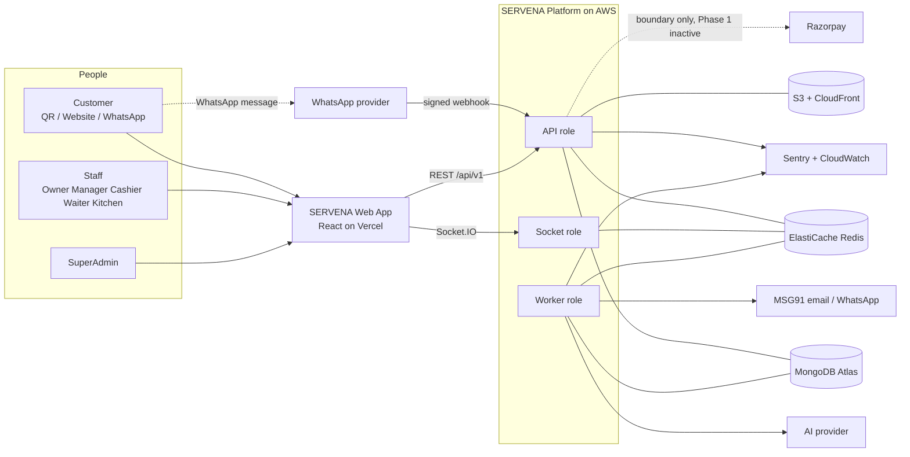

---

## 8. High-Level Architecture

### 8.1 Logical architecture

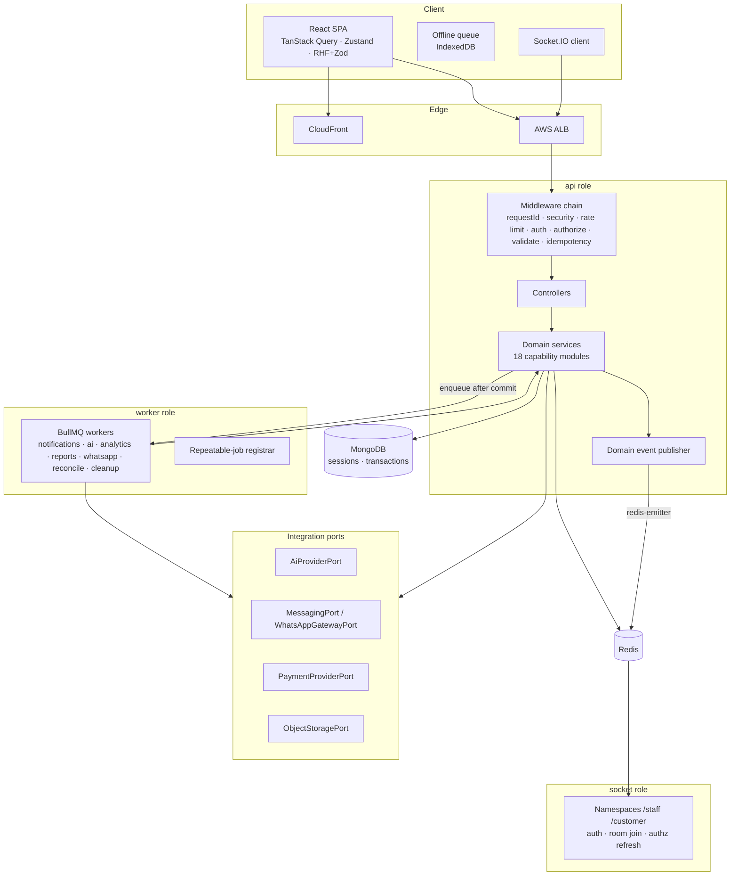

### 8.2 Runtime roles (one codebase, one image)

| Role (`SERVER_TYPE`) | Responsibility | Scales on | Never does |
|---|---|---|---|
| `api` | REST `/api/v1`, webhooks, health | CPU / request rate | Hold WebSocket connections; run BullMQ workers; run cron timers |
| `socket` | Socket.IO connections, room membership, authz refresh | Connection count / memory | Business mutations (it only relays events and answers `resync` pings) |
| `worker` | BullMQ workers + repeatable-job registration | Queue depth / CPU | Serve HTTP business routes (health endpoint only) |

`TD-ARCH-1` — Roles are selected by the existing `SERVER_TYPE` switch, extended with `worker`. *Rationale:* the boilerplate already branches on `SERVER_TYPE` and carries `SOCKET_PORT`/`SOCKET_SERVER_AUTH_KEY`; reusing it keeps one image and one codebase while allowing independent scaling.

### 8.3 Cross-cutting concerns (specified once, used by every module)

Realtime delivery (§17), idempotency (§19), reconnect/recovery (§17.6, §19), tenant isolation (§11), rate limiting (§35.6), observability (§36) — matching the CAPABILITY-MAP's "cross-cutting, specified once in TRD".

---

## 9. Technology Architecture

### 9.1 Stack (non-negotiable)

| Layer | Technology | Role in SERVENA |
|---|---|---|
| Backend | Node.js (ESM), Express 4, Mongoose 8, MongoDB Atlas, Redis (ElastiCache), BullMQ, Socket.IO | §10–§25 |
| Frontend | React, Vite, Tailwind CSS, shadcn/ui, Radix UI, TanStack Query, Zustand, react-hook-form, Zod | §9.3 (technical boundaries only; **no UI design here**) |
| Infrastructure | Docker, ECS Fargate, ALB, ElastiCache, S3, CloudFront, Vercel, GitHub Actions | §40 |
| Payments | Razorpay boundary; **integer paise** | §26, §33 |
| Messaging | MSG91; WhatsApp boundary | §33 |
| Observability | Pino, Sentry, CloudWatch | §36 |
| Testing | Jest, Supertest, Playwright | §39 |
| API | REST `/api/v1`, OpenAPI | §16, §41 |

### 9.2 Library map (backend)

| Concern | Library | Status vs boilerplate |
|---|---|---|
| HTTP | `express` 4 | existing |
| Validation | `joi` + `joi-to-swagger` | existing |
| ODM | `mongoose` 8 | existing |
| Redis (cache/lock/limit/adapter) | `redis` v4 | existing |
| Redis (BullMQ) | `ioredis` (BullMQ dependency) | **new** |
| Queues | `bullmq` | **new** |
| Realtime | `socket.io`, `@socket.io/redis-adapter`, `@socket.io/redis-emitter` | **new** |
| Auth | `jsonwebtoken`, `bcryptjs` | existing |
| Rate limiting | `express-rate-limit` + Redis store | existing + store |
| Security | `helmet`, `cors`, `hpp`, `express-mongo-sanitize` | existing |
| Logging | `pino` (+ `pino-http`) | **new** (replaces `winston`) |
| Errors | `@sentry/node` | **new** |
| AWS | `@aws-sdk/client-s3`, `@aws-sdk/s3-request-presigner`, `@aws-sdk/client-secrets-manager` (if not injected) | **new** |
| Uploads | `multer` | existing |
| File sniffing / parsing | `file-type`; safe CSV/XLSX/PDF text extractors (no formula evaluation) | **new** |
| Time | `moment-timezone` | existing |
| IDs / correlation | `uuid` | existing |
| Tests | `jest`, `supertest`, `mongodb-memory-server` (replica set), Playwright | **new** |

Dependency additions are limited to what a required capability needs; none is added for convenience.

### 9.3 Frontend technical boundaries (no UI design)

| Concern | Rule |
|---|---|
| Server state | **TanStack Query** is the only cache of server data; keys are namespaced `[orgId, outletId, entity, …]` so switching working outlet cannot show another outlet's cache (C-OUTLET) |
| Client/UI state | **Zustand**: session identity, working outlet, offline-queue metadata, realtime connection status. Never stores authoritative business state |
| Forms | **react-hook-form + Zod**; client validation is a convenience — the server (Joi) is authoritative (RBAC-007) |
| Realtime | One Socket.IO client; events **invalidate/refetch** TanStack queries (§17); the REST response is the truth |
| Offline | IndexedDB queue per §19.5; the SPA never reports "success" before the server acknowledges (OFFLINE-002) |
| API types | Generated from the OpenAPI document (§41); no hand-copied DTOs |
| Auth | Access token in memory (not `localStorage`); refresh via httpOnly cookie (§12.2) |
| Hosting | Vercel; the SPA and API share one registrable domain (`TD-AUTH-5`) |

Component structure, visual design, routes-as-code and screen composition belong to the UI/UX brief and implementation (APP_FLOW §29 supplies screens and navigation behaviour).

### 9.4 Repository layout

```
Servena/
├─ SPEC.md · CAPABILITY-MAP.md
├─ docs/ { APP_FLOW.md, TRD.md, product/{PRD.md, PRD_TRACEABILITY.md} }
├─ backend/        (boilerplate-style; ESM)
│   ├─ server.js · package.json · .env.example · Dockerfile (restored for ECS)
│   ├─ config/ { index.js, swagger.js, env/{development,staging,production}.js }
│   ├─ migrations/        (versioned, expand→contract; §40.6)
│   └─ app/ { controllers, services, models, routes/{v1,v2}, helpers, startup, utils, jobs, realtime, integrations, ai }
└─ frontend/       (Vite + React; empty today)
```

`jobs/`, `realtime/`, `integrations/` and `ai/` are **new top-level folders under `app/`** (cross-cutting infrastructure that has no place in the five boilerplate layers) and follow the same barrel/naming conventions (`TD-ARCH-2`). *Rationale:* they are not controllers/services/models; forcing them into `utils/` would hide boundaries the architecture needs.

---

## 10. Module Architecture

**Traces:** CAPABILITY-MAP (18 modules, build order L0–L10) · SPEC SOT-*, ORG-003 · APP_FLOW §4.1, INV-03, INV-04.

### 10.1 Why a modular monolith

| Reason | Evidence |
|---|---|
| The core loop is **transactional across modules** (order → KOT → bill → payment → Day Close) and must be atomic (DAY-010, KOT-007, SEC-003). Cross-process boundaries would force distributed transactions or sagas for no product benefit | APP_FLOW §4.2 |
| A restaurant outlet's write volume is low (engineering estimate: single-digit orders per minute at peak); the scaling problem is **many tenants**, not a hot service | — |
| The boilerplate is a single Express app with layer folders (§5); the team preserves it | §5 |
| The product explicitly requires "core operations work without AI" (AI-003): isolating AI at the edge delivers that without microservices | §31 |
| One image, three roles (§8.2) already provides independent scaling for the only three distinct load shapes (HTTP, connections, background work) | §8.2 |

Microservices are **not** introduced (no canonical requirement establishes a need for service separation). `TD-ARCH-3` below preserves clean extraction seams instead.

### 10.2 Modules

Module ids are the **stable ids of CAPABILITY-MAP.md**. Cross-cutting infrastructure modules are added with `infra-` semantics and own no product behaviour.

| # | Module id | Layer | Responsibility (technical) | Depends on (allowed imports) | Primary source IDs |
|---|---|---|---|---|---|
| 1 | `tenancy` | L0 | Restaurant/organization/outlet structure, platform status (Provisioned/Suspended/Deactivated), Owner assignment, invitation issue/resend | — | ONB-001…016, ORG-001…011 |
| 2 | `identity-access` | L1 | Users, credentials, sessions, effective permissions, `authorize()`, order-link principals | `tenancy` | AUTH-*, RBAC-*, ACT-* |
| 3 | `audit` | L2 | Append-only audit store, sealing job | `identity-access` | AUDIT-* |
| 4 | `outlet-setup` | L3 | Identity/GST/charges/channels config, onboarding checklist + activation, outlet Open/Closed | `identity-access`, `audit` | ONB-020…033, ORG-020…034 |
| 5 | `staff` | L3 | Staff records, reassignment, schedule/attendance/availability | `identity-access`, `audit` | STAFF-* |
| 6 | `menu` | L4 | Catalogue, variants, modifiers, tax config, station map, publish, outlet overrides, snapshots source | `outlet-setup`, `audit` | MENU-* |
| 7 | `ai-menu-import` | L5 | Import pipeline → **draft** → Owner approval → `menu.publish` | `menu` (+ `ai/` ports) | AI-010…016 |
| 8 | `tables` | L4 | Floor, tables, QR keys, table sessions, transfer/merge/split/move | `outlet-setup`, `audit` | TABLE-* |
| 9 | `order-engine` | L5 | Unified order/item lifecycle, idempotent submit, acceptance, modification, cancellation, Takeaway derivation | `menu`, `tables`, `staff`, `audit` | ORD-* |
| 10 | `kitchen` | L6 | KOTs, station routing, KDS read model, readiness roll-up, priority, re-fire, kitchen cancellation, cancellation requests | `order-engine` | KOT-*, KDS-* |
| 11 | `customer-ordering` | L6 | Public channels (table QR, tableless QR, website), customer drafts/cart persistence, tracking via link, handoff display | `order-engine`, `menu`, `tables` | ORD-020…042, HANDOFF-* |
| 12 | `billing` | L6 | Bill lifecycle, calculation, discounts/charges, reprint, payment records, refunds | `order-engine`, `audit` | BILL-*, PAY-* |
| 13 | `customers` | L7 | Customer records/history, feedback, reorder | `order-engine`, `billing` | CUSTOMER-*, FEEDBACK-* |
| 14 | `day-close` | L7 | Per-outlet business day, Day Close/Reopen, cash reconciliation | `billing`, `order-engine`, `audit` | DAY-*, CASH-* |
| 15 | `analytics` | L8 | Dashboards, unresolved-bills view | `day-close`, `billing`, `order-engine`, `customers`, `staff` | ANALYTICS-* |
| 16 | `whatsapp-ordering` | L8 | WhatsApp conversation → unified order engine | `order-engine`, `menu`, `customers` (+ `ai/`, `integrations/`) | AI-030…033 |
| 17 | `attention` | L9 | Attention Engine detect → evidence → item → review | `analytics` | ATTENTION-* |
| 18 | `ai-insights` | L10 | Owner Agent, Daily Brief, What Changed? | `analytics`, `attention`, `identity-access` (+ `ai/`) | AI-020…029 |

| Cross-cutting infrastructure | Folder | Responsibility |
|---|---|---|
| `domainEvents` | `app/services/events/` | In-process typed event bus: **transactional** and **after-commit** channels (§10.3) |
| `idempotency` | `app/services/idempotency/` | Idempotency-key records and middleware (§19) |
| `realtime` | `app/realtime/` | Socket.IO server, namespaces, rooms, emitter (§17) |
| `jobs` | `app/jobs/` | BullMQ queues, workers, registrar (§18) |
| `integrations` | `app/integrations/` | Ports + adapters: MSG91, WhatsApp, S3, AI provider, Razorpay boundary (§33) |
| `ai` | `app/ai/` | Provider-agnostic orchestration, tool registry, proposal store (§31) |
| `notifications` | `app/services/notifications/` | Maps PRD §54 events to realtime audiences and email jobs (§17.8) |

### 10.3 Dependency direction and event inversion

`TD-ARCH-3` — **A module may import only modules at a lower layer** (table above). Higher-layer reactions to lower-layer facts use the domain event bus instead of imports.

| Channel | Semantics | Use |
|---|---|---|
| **Transactional event** | Emitted inside the open Mongo session; subscribers registered by higher-layer modules run **synchronously in the same transaction**, may only read/write Mongo through the passed `session`, and **must be deterministic** (no network I/O). If a subscriber throws, the whole transaction aborts | Invariants that must be atomic across layers: `order.confirmed` → kitchen creates the initial KOT; `order.item.cancelled` → billing recomputes lines; `bill.finalized` → day-close transaction fence |
| **After-commit event** | Emitted only after the transaction commits; fire-and-forget; failures logged + metric, never roll back business state | Realtime fan-out (§17), job enqueue (§18), notifications |

*Rationale:* the order engine (L5) must not import the kitchen (L6), yet KOT-001 requires the initial KOT to exist atomically with Confirmed. Transactional events keep the dependency arrow pointing up while preserving atomicity, and avoid an extra "use-case" layer the boilerplate does not have.

### 10.4 Forbidden relationships (enforced in CI)

| # | Forbidden | Enforcement |
|---|---|---|
| F1 | Controller → model / Mongoose, or controller → provider SDK | `dependency-cruiser` rule |
| F2 | Service ↔ `req`/`res`/Express types | Lint + review |
| F3 | Module A's service importing module B's **model** (any B) | `dependency-cruiser`: models importable only inside their own module folder |
| F4 | Lower layer importing a higher layer (e.g. `order-engine` → `billing`) | `dependency-cruiser` layer config generated from §10.2 |
| F5 | Any `app/**` outside `ai/` and `ai-*` modules importing `ai/` | Rule; guarantees AI-040/AI-043 |
| F6 | Domain code importing provider SDKs (`@aws-sdk/*`, MSG91, Razorpay, LLM SDKs); only `integrations/` adapters may | Rule |
| F7 | Socket handlers or BullMQ processors writing business data directly (they MUST call services) | Review + test |
| F8 | `findById`, `findByIdAndUpdate`, `updateMany`, `deleteMany`, `Model.collection.*` on tenant models outside the tenancy helper | ESLint `no-restricted-syntax` + runtime guard (§11.4) |
| F9 | Physical deletion of business records (orders, KOTs, bills, payments, refunds, audit, drafts) | Models expose no delete; DB role denies delete on append-only collections |
| F10 | Cycles between modules | `dependency-cruiser` `no-circular` |

`TD-ARCH-4` — `dependency-cruiser` is the architecture-fitness tool. *Rationale:* the boundaries in this section are worthless unless a CI failure defends them.

### 10.5 Future extraction seams (not built in Phase 1)

| Order | Candidate | Seam already in place |
|---|---|---|
| 1 | `ai/` + `ai-menu-import` + `ai-insights` + `whatsapp-ordering` | Only reachable through ports/tool registry/queues; no inbound imports (F5) |
| 2 | `socket` role | Already a separate process; communicates via Redis only |
| 3 | `analytics` / `attention` | Read-mostly, secondary-readable, event-fed |
| Never | `order-engine`, `kitchen`, `billing`, `day-close`, `tables` | One transactional core; splitting them requires distributed transactions with no product gain |

---

## 11. Multi-Tenancy & Outlet Architecture

**Traces:** SPEC SEC-001, SEC-002, ORG-003, ORG-004, ORG-006…010, RBAC-006, AUTH-008, CUSTOMER-003/004/021 · PRD-SEC-001.1, PRD-SEC-002.1 · AF-002, AF-009, INV-03, C-OUTLET, C-DEEPLINK.

### 11.1 Hierarchy

```
Platform (SuperAdmin)
 └─ Organization (tenant; = restaurant / brand)            ← isolation boundary 1
     └─ Outlet (1…n; exactly one kitchen)                  ← isolation boundary 2
         ├─ Staff assignments (role + permissions)
         ├─ Tables · Table sessions · QR keys
         ├─ Business days (one Running per outlet)
         └─ Orders · KOTs · Bills · Payments · Refunds · Feedback · Attention · Briefs
```

Every tenant-owned record carries **`organizationId`** and, unless it is organization-level configuration, **`outletId`** (ORG-003). Central menu and organization configuration are organization-level (ORG-002); outlet overrides carry `outletId`.

### 11.2 Principals and scope

| Principal | `ScopeContext` (built per request / job / socket) |
|---|---|
| Owner | `organizationId`; `allowedOutletIds` = all outlets of the organization (authorized outlets); `workingOutletId` = chosen outlet |
| Manager | `organizationId`; `allowedOutletIds` = assigned outlets; `workingOutletId` chosen among them |
| Cashier / Waiter / Kitchen | `organizationId`; `allowedOutletIds` = `[currentOutlet]`; `workingOutletId` = current outlet (no choice — ORG-008) |
| Customer (order link) | `organizationId`, `outletId`, `orderId` (exactly one order — §30.2) |
| Customer (public QR/website before first order) | `organizationId`, `outletId` resolved from the opaque QR/website key; **no read access** to any existing order |
| SuperAdmin | `platform: true`; no restaurant scope; cannot call restaurant operational routes |
| System (jobs) | `organizationId`, optional `outletId` from the job payload; acts as `actor.type='system'` |
| AI (Owner Agent tool call) | The **invoking Owner's** `ScopeContext` + `via:'ai'` (never broader than the Owner) |

`TD-TENANT-1` — The working outlet travels in the **`X-Outlet-Id` request header** and is validated against `allowedOutletIds` on every request; for single-outlet roles it is derived and any supplied value must match. *Rationale:* stateless, no server-side "current outlet" that could drift between tabs/devices, satisfies AUTH-008 and C-OUTLET ("every subsequent operational action uses it").

### 11.3 Scoping rules (queries and mutations)

| Rule | Statement |
|---|---|
| S1 | Every service function that touches a tenant model takes `scope` as its **first parameter**; there is no ambient/global scope (no `AsyncLocalStorage` tenant guess) |
| S2 | Reads by id use `{ _id, organizationId }` then compare `outletId`: not found in org → `404`; found but outlet not in `allowedOutletIds` (or ≠ working outlet for operational routes) → `403` with `factor:'outlet'` and **no object data** (RBAC-016; ORG-007.AC1). A cross-tenant id is indistinguishable from a missing one |
| S3 | Mutations use the same predicate **inside the update filter** (`findOneAndUpdate({_id, organizationId, outletId, rev …})`) so a stale or foreign id changes nothing |
| S4 | Lists always add `organizationId` and `outletId ∈ allowedOutletIds` (or the single working outlet for operational lists). Owner cross-outlet lists use `$in: allowedOutletIds` |
| S5 | `updateMany`/`deleteMany`/aggregations MUST contain `organizationId`; aggregations start with a `$match` carrying it (also the first stage the planner can use an index for) |
| S6 | Operational actions run in the **working outlet** only (C-DEEPLINK): a request whose object belongs to a different authorized outlet is refused (`factor:'outlet'`, code `OUTLET_CONTEXT_MISMATCH`), never silently executed in the wrong context |
| S7 | Owner organization-wide destinations (comparison, cross-outlet history) are the only routes with `scope:'org'`; they do not depend on `workingOutletId` (C-OUTLET) |
| S8 | Customer link principals can address **only** `orderId`; every query includes it |
| S9 | A phone-number match across outlets/organization (CUSTOMER-021) is an **identity-matching** aid; it never widens query scope — history queries still apply S4 |

### 11.4 Structural enforcement (defence in depth)

`TD-TENANT-2` — **Tenancy-guard Mongoose plugin** applied to every tenant model:

- `pre('find' | 'findOne' | 'findOneAndUpdate' | 'updateOne' | 'updateMany' | 'deleteOne' | 'deleteMany' | 'countDocuments' | 'aggregate')` throws `TENANT_SCOPE_MISSING` when the filter (or first `$match`) lacks `organizationId`, unless the query is explicitly tagged `.setOptions({ platform: true })` (only `tenancy`'s platform functions may);
- `pre('save' | 'insertMany')` throws if `organizationId` (and `outletId` for outlet-owned models) is absent;
- the guard logs a Sentry event and increments `tenant_scope_violation_total` before throwing.

*Rationale:* S1–S5 are conventions; a plugin makes a forgotten filter fail loudly in tests and production rather than leak. It is the technical enforcement behind SEC-001/SEC-002.

Additional layers:

| Layer | Mechanism |
|---|---|
| Index design | All compound indexes **lead with `organizationId` then `outletId`** (conceptual; schema stage defines) — scoping is also the fast path |
| Cache | Keys prefixed `o:{orgId}:ou:{outletId}:…`; a helper builds keys from `ScopeContext`; raw key strings are forbidden by lint (F8-style rule) |
| Realtime | Rooms are `org:{orgId}:outlet:{outletId}:<audience>`; join requests validated by §13 on every join (§17.3) |
| Jobs | Payload MUST include `organizationId` (+`outletId`); worker rebuilds scope and runs under the guard (§18.5) |
| Object storage | Keys `org/{orgId}/outlet/{outletId|_}/…` (§34); signed URLs issued only after scope check |
| Audit | Every event stores `organizationId`/`outletId` (§32) |
| Tests | A **generated cross-tenant/cross-outlet matrix**: for every route with `scope≠public`, call with another tenant's / another outlet's ids and assert 404/403 + no data (§39.5) |

### 11.5 Reassignment and history

Reassigning staff (AF-009) changes only the **current** assignment; every historical record retains the `outletId` at time of action (ORG-010, STAFF-013). Session/identity caches are invalidated on reassignment (§13.7) so access to the old outlet ends with the next action (ORG-010.AC1).

### 11.6 Platform scope (SuperAdmin)

`TD-TENANT-3` — SuperAdmin operates through a dedicated `platform` route set (SCR-040/041/042: provisioning, restaurant operational data view, suspend/deactivate, Owner reset, audit view). Platform reads of tenant data use **read-only projection functions** in `tenancy`/`audit` tagged `platform:true`; every platform request is access-logged with `actor`, `organizationId`, route and `requestId` (separate from the audit trail). *Rationale:* ONB-007 grants SuperAdmin visibility, but it must not become a bypass of S1–S5 for restaurant routes (RBAC-020).

---

## 12. Authentication

**Traces:** SPEC AUTH-001…009, ONB-006/010/012/013, SEC-004 · PRD-AUTH-001.1…009.1 · AF-002, AF-001, AF-003 · NAV-GAP-001, 009, 011, 012, 033 · C-SA-AUTH, C-SESSION, C-DEEPLINK, C-REVOKE.

### 12.1 Credentials

| Item | Decision |
|---|---|
| Identifier | Email **or** phone + password (AUTH-001). Email lower-cased and trimmed; phone normalized to E.164 (existing `PHONE_REGEX`) |
| No 2FA, no OTP, no self-signup, no customer accounts (AUTH-002, ONB-012, AUTH-009, NG-012) | None built |
| Hashing | `bcryptjs` (already installed). `TD-AUTH-1`: cost 12 (configurable `BCRYPT_ROUNDS`), passwords limited to **72 bytes** (bcrypt truncation), minimum 8 characters, no composition rules. *Rationale:* upstream defines no policy; length-based minimum with no composition rules is the lowest-friction safe default. Raising cost is a config change |
| Uniqueness | `TD-AUTH-2`: normalized email and phone are **unique across the platform** for restaurant users because SCR-001 identifies the user with email/phone + password and no restaurant selector. A person who works for two organizations therefore needs distinct identifiers; whether one Owner may own several organizations is **AMB-20 / PB-2** and is not decided here |
| Storage | Hash only; never logged, returned, or placed in audit before/after (§32.4) |
| Inactive users | Refused at login and on every request; the response is identical for "wrong password" and "inactive/unknown" (AUTH-006.AC1 — "without revealing whether the account exists") |

### 12.2 Tokens and sessions

`TD-AUTH-3` — Two-token model; **the server-side session record is authoritative**.

| Token | Form | Lifetime (engineering default, env-configurable) | Transport |
|---|---|---|---|
| **Access token** | JWT (HS256) `{ sid, sub, org, typ }` — **no roles or permissions** | `ACCESS_TTL` = 15 min | `Authorization` header (boilerplate: raw token; a leading `Bearer ` is tolerated) |
| **Refresh token** | 256-bit random opaque string, stored **hashed** (SHA-256) in the session record, **rotated on every use**; reuse of a rotated token revokes the whole session family | idle `REFRESH_IDLE_TTL` = 24 h, absolute `REFRESH_ABS_TTL` = 7 d | `httpOnly; Secure; SameSite=Strict; Path=/api/v1/auth` cookie |

| Session record (conceptual) | Content |
|---|---|
| `sessionId`, `userId`, `organizationId`, `userType` | identity |
| `refreshHash`, `family`, `rotatedAt` | rotation and reuse detection |
| `createdAt`, `lastSeenAt`, `idleExpiresAt`, `absoluteExpiresAt` | expiry |
| `deviceType`, `appVersion`, `remoteAddress` | existing boilerplate session fields retained |
| `revokedAt`, `revokedReason` | revocation |

Validation order on every protected request: **JWT signature/exp → Redis `revoked:{sid}` → Redis identity snapshot (user active, assignment, `authzVersion`) → (on any miss) MongoDB session + user**. A valid signature alone never authenticates (removes the boilerplate JWT fallback — C12). *Rationale:* claims-free access tokens mean permission/assignment changes cannot be stale inside a token (C-REVOKE); the 15-minute lifetime bounds the cost of a lost token even if Redis is unavailable.

`TD-AUTH-4` — Redis unavailable → authentication **falls back to MongoDB** (slower, never open). *Rationale:* fail closed (P10).

`TD-AUTH-5` — The web app and API are served from **subdomains of one registrable domain** so the `SameSite=Strict` refresh cookie works without `SameSite=None`. CORS allows exact configured origins only (`ALLOWED_ORIGINS`; credentials enabled). *Rationale:* cross-site cookies would reopen CSRF exposure on the refresh endpoint; API calls themselves use the `Authorization` header and are not CSRF-prone.

### 12.3 Session expiry and "never a false success" (NAV-GAP-009, C-SESSION)

| Situation | Behaviour |
|---|---|
| Access token expires | Client transparently calls `POST /auth/refresh`; failure → `401 UNAUTHORIZED` |
| Refresh idle/absolute expiry, revocation, reuse detection | `401`; client routes to SCR-001 **before** the next protected action (C-SESSION) |
| In-flight mutation during expiry | Client already holds an `Idempotency-Key`; after re-authentication the same key is replayed (§19); the UI shows pending/failed, never success (OFFLINE-002) |
| Locally preserved work | Kept in the offline store and **fully revalidated** (authz, outlet, state) when re-submitted (OFFLINE-008) |
| Kitchen/KDS devices | Same model; the 24 h sliding idle window keeps a continuously used KDS signed in, and the absolute 7 d cap forces periodic re-authentication. Values are `OTD-2` |

### 12.4 SuperAdmin authentication (NAV-GAP-001, C-SA-AUTH)

`TD-AUTH-6` — SuperAdmin is a **platform principal** (`userType=SUPER_ADMIN`, existing constant) authenticated by email + password against a **separate credential set and signing key** (`ADMIN_JWT_SIGN_KEY`, already in the boilerplate), with:

- a shorter session (`SA_ACCESS_TTL` 10 min, `SA_REFRESH_IDLE_TTL` 30 min, `SA_REFRESH_ABS_TTL` 8 h — engineering defaults),
- a stricter login rate limit and lockout (§12.8),
- no restaurant roles, no restaurant permission catalogue (RBAC-020), no operational routes (C-SA-IA),
- every credential/security action audited (AUTH-007),
- seeded from `SU_EMAIL`/`SU_PASS`/`SU_NAME` at first bootstrap only by an explicit one-off script (not at every startup), after which the env password is ignored.

*Rationale:* SPEC/PRD require authentication but not its mechanism; NG-012 forbids 2FA product-wide, so none is added. A separate key and shorter window are the cheapest hardening that does not add behaviour.

### 12.5 Credential lifecycle (no self-service recovery — AUTH-005)

| Event | Mechanism |
|---|---|
| **Onboarding invitation** (ONB-006; "how the invitation establishes the first credential": DF-12) | `TD-AUTH-7`: a **single-use invitation token** (256-bit, stored hashed, expiry `INVITE_TTL` default 7 d) is emailed to the Owner; it is redeemed once to **set the first password**. Resend (ONB-013) revokes the previous token and issues a new one. Email failure leaves the account provisioned and recoverable (INTEG-003) |
| **Staff credential creation/reset** (AUTH-003, ACT-STF-03) | The authorized Owner/Manager **sets a new password for the staff member**; the old password stops working immediately and all of that user's sessions are revoked (AUTH-003.AC1); audited. The staff member has no recovery path of their own |
| **Owner reset** (AUTH-004, ONB-010) | SuperAdmin sets/reissues via the same invitation mechanism or direct set; sessions revoked; audited |
| **Deactivate** (STAFF, AUTH-006) | `status` change + session revocation + `authzVersion` bump (§13.7) |

*Dependency recorded for the UI brief (not a product change):* redeeming an invitation requires a "set first password" destination reachable from the emailed link. APP_FLOW does not enumerate it (AF-001/AF-002 state only that the Owner signs in after onboarding); the UI/UX brief MUST place it inside the existing sign-in entry (SCR-001 flow) without adding a navigable destination to the §29.2 role matrix. `TN-1`.

### 12.6 Deep links and unauthenticated navigation (NAV-GAP-012, C-DEEPLINK, NAV-GAP-011)

| Case | Technical behaviour |
|---|---|
| Unauthenticated user → protected URL | API returns `401`; the SPA stores the **intended path only** (no query data, no tokens) in `sessionStorage` and shows SCR-001 (NAV-GAP-011). After sign-in it navigates to the stored path **only if** the five-factor check for it passes; otherwise to the actor's default destination (UI/UX decides which) |
| Link to an object of another authorized outlet | Server refuses mutations with `OUTLET_CONTEXT_MISMATCH` (S6); the SPA offers switching working outlet then re-evaluates; it never performs the action in the wrong outlet |
| Link to an object the user may not see | `404` (not in organization) or `403 factor:'outlet'|'permission'` (S2); no content (C-REFUSAL) |
| Return-to after sign-in | Same-origin relative paths only; open-redirect protection (reject absolute URLs, `//`, `javascript:`) |
| Customer order link | `GET /api/v1/public/orders/{token}` — separate public scope (§30.2); invalid/expired/foreign → generic not-found, no order data (C-INVALID) |

URL scheme and route names remain UI/UX + implementation decisions; the TRD fixes only the behaviour above.

### 12.7 Mid-session revocation (NAV-GAP-033, C-REVOKE)

Deactivation, permission revocation, outlet reassignment and suspension take effect **at the next action** (AUTH-006.1, RBAC-010.AC1, ORG-010.AC1, ONB-014.1):

| Trigger | Mechanism |
|---|---|
| Deactivate user / reset credential | Revoke all sessions of the user (Mongo + Redis `revoked:{sid}`), `INCR authz:ver:{userId}`, emit `authz.revoked` to the `socket` role → disconnect the user's sockets |
| Permission/role override change | `INCR authz:ver:{userId}` (or `authz:ver:role:{orgId}:{role}` fan-out to affected users); next request recomputes effective permissions |
| Outlet reassignment | `INCR authz:ver:{userId}`; sockets leave old-outlet rooms |
| Restaurant suspension/deactivation | Platform status read **per request** from a short-lived Redis snapshot invalidated on change; blocks new business routes only (ONB-014) — staff may keep signing in and finishing existing work (AMB-06, resolved sub-question) |

A deactivated user "can no longer act at all" because identity snapshot/session checks fail first.

### 12.8 Brute-force and abuse protection

| Control | Default (engineering) |
|---|---|
| Login rate limit | 10 attempts / 15 min / IP; Redis store |
| Per-identifier lockout | After 5 consecutive failures: progressive delay (1 → 2 → 4 … up to 15 min) keyed by `sha256(identifier)`; resets on success; **response is identical** to a wrong password (no account-existence leak) |
| SuperAdmin | 5 attempts / 15 min / IP and identifier; lockout 30 min |
| Failure telemetry | `auth_failure_total{reason}` metric and Sentry breadcrumb; identifier never logged (hash only) |
| Sensitive-action protection | Credential reset, permission change, deactivation, refund, reopen, outlet toggle — require a **valid session** and `authorize()`; there is no re-authentication prompt because the product defines none (adding one would be new product behaviour) |

### 12.9 Logout

`POST /auth/logout` revokes the session (Mongo + Redis), clears the refresh cookie, emits disconnect to its sockets. Signing out returns to SCR-001 (NAV-GAP-008). Logout is idempotent.

---

## 13. Authorization / RBAC

**Traces:** SPEC RBAC-001…030, §9 (ACT-*), ORG-004/008, AUDIT-002/003 · PRD §13 · AF §3, AF-010, INV-02, EF-01 · C-NAV, C-REFUSAL.

### 13.1 Canonical rule

```
ACTUAL AUTHORIZATION = ROLE + OUTLET ACCESS + PERMISSION + CURRENT STATE + APPROVAL REQUIREMENT
```

All five must pass; any failure refuses the action, **names the failed factor**, mutates nothing (RBAC-002, RBAC-008, RBAC-016).

### 13.2 Representation

| Concept | Technical form |
|---|---|
| Roles | Closed enum: `OWNER, MANAGER, CASHIER, WAITER, KITCHEN, CUSTOMER` for restaurant principals. **SuperAdmin is a different principal type** (`userType`), never a value of this enum (RBAC-020). No role may be added (RBAC-021, NG-013) |
| Permission atom | **One atom per action-inventory row**: the stable string key is the SPEC id (`ACT-ORD-01`, `ACT-BIL-07`, …). `TD-RBAC-1`: atoms are 1:1 with §9 rows — no finer split in Phase 1. *Rationale:* RBAC-009 allows finer atoms but forbids broader authority; 1:1 is the smallest design that makes the matrix directly testable (PC-003). Splitting later is additive |
| Role default profile | A **versioned, code-resident constant** (`app/utils/constants/permissionCatalogue.js`) generated from SPEC §9 `Y`/`N`/`sys` cells; cells with `—` mean not applicable (never grant). A test fails if the constant and SPEC §9 diverge (§39.4) |
| Override | Per-organization **role override** and per-user **user override**, each a set of `grant`/`deny` atoms (AF-010: "role/user") |
| Customer / link principal | A fixed, non-customizable allow-set: `ACT-ORD-01/02/03` (own submission), `ACT-MOD-01` (table QR, via acceptance), `ACT-BIL-01` (own order), `ACT-CUS-02`, `ACT-CUS-03`, `ACT-FB-01`, `ACT-AI-06`; `ACT-CAN-03` is **not granted** (OD-45.1) |
| System/AI | `system` principal: only calls registered system functions (`ACT-KOT-01…03`); AI inherits the invoking Owner (§31.3) |

### 13.3 Effective permission calculation

```
effective(user, organization) =
    deny-filter(
        (roleDefault(user.role)
          ∪ orgRoleOverride(user.role).grants
          ∪ userOverride(user).grants)
        − orgRoleOverride(user.role).denies
        − userOverride(user).denies )
    ∩ catalogueBounds
```

| Rule | Statement |
|---|---|
| E1 | **Default deny**: an atom not in the set is denied (RBAC-019, RBAC-030) |
| E2 | **Explicit deny beats grant** at the same or lower level; user override beats role override beats default |
| E3 | `catalogueBounds` (RBAC-005): only §9 atoms; **no SuperAdmin capability**, no cross-organization effect, **cannot waive outlet access, state rules or approvals**. The bounds are enforced when the override is *written* (reject out-of-bounds) **and** when *evaluated* (ignore any atom outside the catalogue) |
| E4 | Manager may write overrides only if effective set contains `ACT-STF-05`; Manager does not manage Manager accounts unless `ACT-STF-02` is granted (RBAC-029) |
| E5 | **Outlet scope is separate from permission**: a permission applies only within `allowedOutletIds`/working outlet (RBAC-006); an Owner-granted atom never extends outlet reach |
| E6 | View is implied by holding any action atom on that object (RBAC-027) — implemented as a derived "view" check in the same function, **not** as extra stored atoms |
| E7 | Effective set is **cached** per user as `perm:{orgId}:{userId}:{authzVersion}` (§13.7) |

### 13.4 Enforcement pipeline

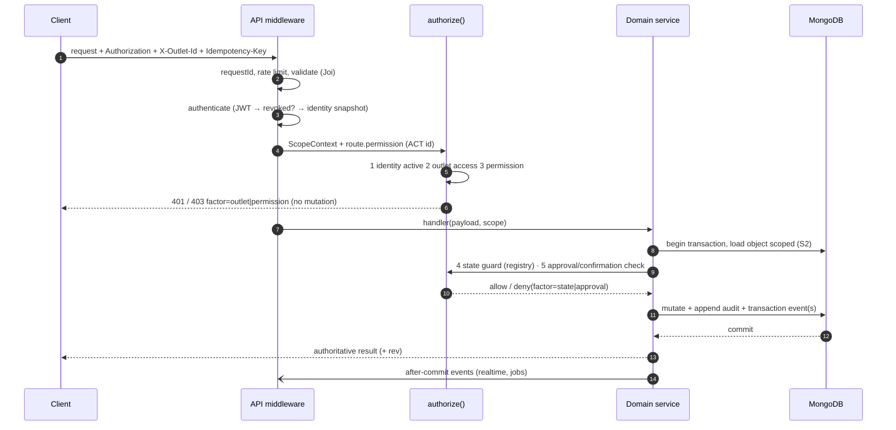

Factors 1–3 run in middleware before any data is loaded; factors 4–5 need the object, so they run inside the service after the scoped load. **Both** layers exist (defence in depth): a route that forgets `permission` fails a startup assertion (§13.9).

### 13.5 State and approval constraints

`TD-RBAC-2` — **State guards** are a registry `stateGuards[actionId](object, context) → {ok} | {ok:false, code}` colocated with each module. Guards encode exactly the "Current-state precondition" column of §9 and the outlet/platform rules:

| Guard family | Source |
|---|---|
| Outlet **Open** required for new customer orders, new staff orders, add items (ACT-ORD-01/02, ACT-MOD-01); **not** required for finalize/payment/reopen/refund/handoff/kitchen (ORG-021…028, ORG-034) | §28 |
| Restaurant **not Suspended/Deactivated** for new orders/new items (ONB-014); existing work unaffected | §28 |
| Bill not Finalized for edits/discount/charge/add item (BILL-004, ACT-BIL-02/03) | §25 |
| Item/order state for cancel/hold/void/re-fire/handoff (ORD-082, ORD-073) | §15, §22 |
| Day Running; Reopen preconditions (DAY-015/021) | §27 |
| Draft not yet approved for AI import edit/approve (ACT-AI-02/07) | §31.4 |

Guards are pure functions over already-loaded state, so they are unit-testable per cell (PC-003) and so a **pending product decision changes one guard** (P12; e.g. AMB-01, AMB-07, AMB-11).

**Approval factor** (RBAC-014, OD-28): the only source-defined approval is **Owner approval of an AI-imported menu** (ACT-AI-02). The approval check is a state fact on the import draft (`approvedBy`, `approvedAt`), not a general workflow engine. There is **no** general second-person approval/dual-approval in Phase 1; the **Owner confirmation** for sensitive Owner-Agent actions is a distinct, single-actor confirmation gate (§31.3) required by AI-029, not an approval workflow.

### 13.6 Sensitive actions

Sensitive actions are those in AUDIT-002 plus Owner-Agent sensitive actions (AI-029). They require: valid session, `authorize()`, **reason** where §9/SPEC requires one (INV-16), an **audit event in the same transaction** (§32), and idempotency (§19). They are listed in §32.3.

### 13.7 Cache and invalidation

| Cache | Key | Invalidated by |
|---|---|---|
| Identity snapshot | `ident:{userId}` (status, org, role, assignments, platform status flag) | user/assignment/status change, suspension |
| Effective permissions | `perm:{orgId}:{userId}:{authzVersion}` | `INCR authz:ver:{userId}` (immediate); TTL 10 min as a backstop |
| Platform status | `plat:{orgId}` | suspension/deactivation/reinstatement |

`TD-RBAC-3` — Invalidation is **version-increment, not delete-then-hope**: each request reads the current `authz:ver:{userId}` (one Redis GET) and builds the permission key from it, so a stale entry is unreachable the moment the version moves. Role-override edits increment the version of every user holding that role (bounded by org size). *Rationale:* delete-based invalidation has a race window; version keys do not. Redis down → recompute from MongoDB (P10).

### 13.8 Revoked-access behaviour

See §12.7. A denied-because-revoked action returns `403` with `factor:'permission'|'outlet'` (or `401` if the session/user is gone) and changes nothing (RBAC-008, INV-02).

### 13.9 Where it is declared

Every route object carries `permission` (ACT id) **or** an explicit `scope` of `public` / `platform` / `customerLink` with a stated reason; a **startup assertion** (and a Jest test) fails the process if a non-`authFree` route has neither. `GET /api/v1/health` stays `authFree`. This closes the SPEC §32 gap that coarse `AVAILABLE_AUTHS` cannot express the five-factor model.

---

## 14. Domain Architecture

**Traces:** SPEC §4–§28 (all prefixes) · PRD §8–§62 · APP_FLOW §4.1, §5–§26. Responsibilities and boundaries only — **no schema**. "Owns" lists aggregates (conceptual); "Emits" lists after-commit events (names are technical contracts, §17.5).

| # | Domain | Module (§10.2) | Owns (aggregates / append-only records) | Core responsibility and technical invariants | Emits (after commit) |
|---|---|---|---|---|---|
| 1 | **Organization** | `tenancy` | Organization, restaurant platform status | Top-level tenant (ORG-001); status Provisioned/Suspended/Deactivated; blocks new business via guard (ONB-014) | `restaurant.suspended`, `restaurant.reinstated`* |
| 2 | **Outlet** | `tenancy`, `outlet-setup` | Outlet, activation, availability (Open/Closed), channel config, GST/charges config | Exactly one kitchen (ORG-005); cannot accept orders before activation (ONB-032); Open/Closed explicit only (ORG-032) | `outlet.availability.changed`, `outlet.activated` |
| 3 | **Staff** | `staff` | Staff profile, assignment history, schedule, attendance, availability | Absent forces Unavailable (STAFF-008); reassignment audited; On Break/Unavailable never silently cancels work (STAFF-013) | `staff.availability.changed`, `staff.reassigned` |
| 4 | **Roles / Permissions** | `identity-access` | Role defaults (code), org role overrides, user overrides, `authzVersion` | Effective permissions §13.3; bounds RBAC-005 | `authz.changed` (to socket role) |
| 5 | **Menu** | `menu` | Organization menu, publish state, outlet overrides (price/availability), tax config | Central + outlet override (MENU-009); temporary availability ends at Day Close (MENU-011) | `menu.changed`, `menu.availability.changed` |
| 6 | **Categories** | `menu` | Category tree (categories/subcategories) | MENU-001 | `menu.changed` |
| 7 | **Menu Items** | `menu` | Items, variants, modifier groups, station mapping, prep time, order-type availability | Snapshot source (§20.4); unavailable at one outlet ≠ another (MENU-014) | `menu.changed` |
| 8 | **Tables** | `tables` | Floor, table, QR key, table state | Table state matrix §21.2; QR identifies outlet+table (TABLE-005) | `table.state.changed` |
| 9 | **Table Sessions** | `tables` | Table session, table operation events (transfer/merge/split/move) | ≤1 active session per table (TABLE-014); ops are auditable events, history immutable (TABLE-016/017) | `table.session.opened/closed`, `table.operation` |
| 10 | **Orders** | `order-engine` | Order aggregate, transition history, idempotency keys | One engine for all channels (ORD-001); Takeaway = no table (ORD-004); order is the billing boundary (TABLE-018) | `order.*` (§15.1) |
| 11 | **Order Items** | `order-engine` | Order lines with **price/tax snapshot**, modifiers, notes, per-item state/history, holds | Snapshot immutable (MENU-017); item state authoritative (ORD-070) | `order.item.*` |
| 12 | **KOT** | `kitchen` | KOT (initial/additional/cancellation), KOT lines, station routing | One logical KOT per cause (KOT-007); never silently erased (ORD-090) | `kot.created` |
| 13 | **Kitchen / KDS** | `kitchen` | KDS read model (derived), priority, cancellation requests | One kitchen per outlet (KDS-001); whole-outlet queue (C-STATION); readiness aggregated (KDS-009) | `kds.updated`, `cancellation.requested/resolved` |
| 14 | **Handoff** | `order-engine` (+`customer-ordering` display) | Handoff records on items | Served (ACT-HND-01) vs Picked Up (ACT-HND-02) per §15.0 canonical rule | `order.item.served/pickedup`, `order.completed` |
| 15 | **Billing** | `billing` | Bill, bill revisions, charges/discounts, print events | One bill per order (BILL-015); finalization ≠ payment (BILL-001); reprint never mutates (BILL-009) | `bill.*` |
| 16 | **Payments** | `billing` | Payment records (append-only), payment corrections | Independent of finalization (PAY-010); idempotent (PAY-006); belongs to the day it is recorded (PAY-009) | `payment.recorded/corrected` |
| 17 | **Refunds** | `billing` | Refund records (append-only) | Recorded information only (BILL-012); fields PAY-013 | `refund.recorded` |
| 18 | **Day Close** | `day-close` | Business day, day-close record, reopen events | Per outlet, contiguous days (DAY-023); atomic + idempotent (DAY-009/010) | `day.closed/reopened` |
| 19 | **Cash Reconciliation** | `day-close` | Cash reconciliation (per outlet-day) | Expected = cash payments − cash refunds (CASH-007); variance never blocks (CASH-006) | `day.closed` |
| 20 | **Customer** | `customers` | Customer record (phone key at org scope), order history view, order-link tokens | No accounts; name+phone; link scope = one order (§30.2) | — |
| 21 | **Feedback** | `customers` | Feedback (1–5 + comment, one per order) | Only for Completed customer orders (ACT-FB-01) | `feedback.submitted` |
| 22 | **Notifications** | `notifications` (infra) | Notification intent (transient) | Maps PRD §54 events to audiences (§17.8); no policies beyond §54 | — |
| 23 | **Audit** | `audit` | Audit events (append-only), seals | AUDIT-001…005; viewable by SuperAdmin only | — |
| 24 | **Attention** | `attention` | Attention items, detector state | Insight only (ATTENTION-005); Open → Dismissed/Resolved | `attention.created/updated` |
| 25 | **Analytics** | `analytics` | Rollups/read models (derived) | "Today" = business day (DAY-017); unresolved bills never disappear (ANALYTICS-010) | — |
| 26 | **AI** | `ai-menu-import`, `ai-insights` (+`ai/`) | Import drafts, proposals, Brief, What Changed results, agent conversations (transient) | Never operational truth (AI-004); only controlled tools | `ai.import.ready`, `ai.brief.ready` |
| 27 | **WhatsApp** | `whatsapp-ordering` | Conversation state (transient), provider message ids | Orders enter the unified engine as Takeaway (AI-031); staff acceptance required (AI-033) | `whatsapp.failure` |
| 28 | **Website / QR ordering** | `customer-ordering` | Public channel config, customer drafts | Table QR: no details step; tableless QR/website: name+phone (ORD-021/030/042); no Draft resumption (ORD-094) | `order.submitted` |

\* Reinstatement semantics are undefined upstream (AMB-06, **PB-7**); the event name is reserved, not specified.

---

## 15. State Machines

**Traces:** SPEC ORD-060…065, ORD-071…073, ORD-082…093, KDS-003, BILL-002…005, PAY-010, DAY-001…025, ATTENTION-006, TABLE-001…002, ORG-020, ONB-014/032 · PRD §29, §30, §34, §36, §39, §45–§47, §52 · AF §12, §14, §16, §18, §19, §23 · INV-04, INV-06…INV-17.

### 15.0 Universal rules for every state machine

| # | Rule |
|---|---|
| M1 | **Table-driven**: each machine is a constant `allowed[from][to] = { actionId, actor atoms, guard, sideEffects }`. Anything not listed is **forbidden** and returns `409 STATE_INVALID` with `data:{ current, attempted, factor:'state' }`; nothing changes (RBAC-008, ORD-061) |
| M2 | **Conditional write**: a transition is a single `findOneAndUpdate({ _id, organizationId, outletId, status: from, rev: expectedRev }, { $set:{status:to}, $inc:{rev:1}, $push:{history} })`. Zero matched documents → re-read: already `to` ⇒ idempotent replay result; otherwise `409` with the current state (§38) |
| M3 | **History**: every transition appends `{ from, to, actorRef, at, reason?, requestId, via }` to the entity's own history (operational record — distinct from the SuperAdmin-only audit trail, §32.1). History is never edited or removed (INV-04) |
| M4 | **Audit**: transitions listed in AUDIT-002 additionally append an audit event **in the same transaction** (P11) |
| M5 | **Server clock** only (`new Date()` on the server; client timestamps are advisory) — DAY-003 requires an authoritative timestamp |
| M6 | **Events**: transactional events for cross-module invariants, after-commit events for realtime/jobs (§10.3) |
| M7 | **Idempotency**: each transition endpoint is idempotent on `Idempotency-Key`; a different key against an entity already in the target state returns `409 ALREADY_IN_STATE` carrying the current state (clients treat it as converged). Day Close and Payment/Refund instead return the **existing result** (DAY-009, PAY-006, EF-09) |
| M8 | Terminal states (Completed, Cancelled, Rejected\*, Served, Picked Up, Closed day, Dismissed/Resolved) accept **no** further forward transition; corrections are new records (reopen, refund, payment correction) |

### 15.1 Order

Stored attributes: `stage` (lifecycle label below), `awaitingAcceptance` flag, `abandonedAt`, `rev`. Item states are authoritative; the order label is **derived by one pure function** `deriveOrderStage(order, items)` called inside every transaction that changes an item, so label and items never disagree.

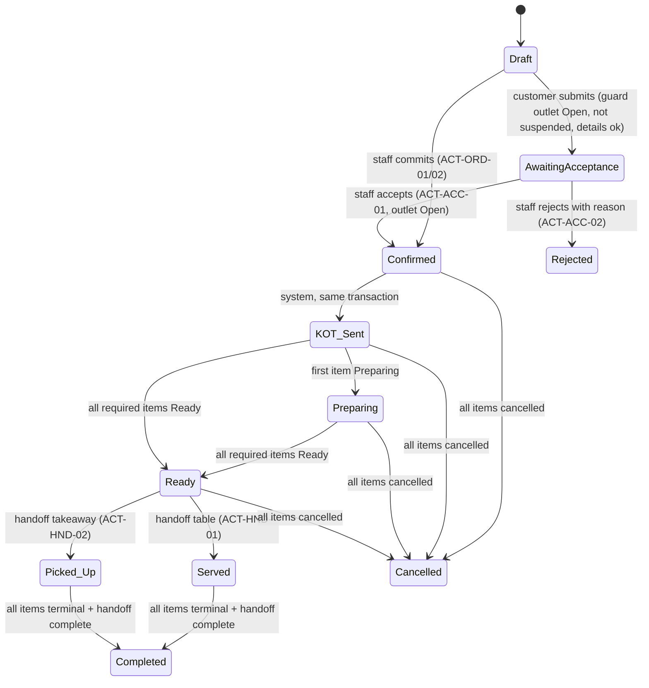

| Transition | Actor / atom | Guard (state/outlet/approval) | Idempotency | Side effects | Events |
|---|---|---|---|---|---|
| Draft → AwaitingAcceptance | Customer principal (ACT-ORD-01/02/03) | Outlet Open + activated + restaurant not suspended; every item currently available (MENU-015); name+phone present iff no table (ORD-030/042); table-QR: **no** details step (ORD-021) | `Idempotency-Key`; durable unique `(outletId, operation, key)` on the order (ORD-006) | Order created in one transaction with items+snapshots; day fence `$inc` (§27.3); order-link token issued (§30.2) | `order.submitted` → staff rooms (PRD-ORD-008.2) |
| Draft → Confirmed (staff) | ACT-ORD-01/02 holders | Outlet Open (ORG-024); restaurant active | same | Initial KOT created **in the same transaction** via transactional event `order.confirmed` (KOT-001) | `order.confirmed`, `kot.created` |
| AwaitingAcceptance → Confirmed | ACT-ACC-01 (Owner, Manager, Cashier, Waiter; **not Kitchen** — ORD-008, INV-13) | Outlet **Open** (ORG-033: while Closed it stays awaiting); not already accepted/rejected | `Idempotency-Key` + conditional write | Same as above | same |
| AwaitingAcceptance → Rejected | ACT-ACC-02 | Reason required (ORD-008, INV-16); outlet Open | same | History + customer-visible state | `order.rejected` |
| Confirmed → KOT_Sent | system | Initial KOT row exists | n/a | — | — |
| KOT_Sent/Preparing/Ready | derived from items | §15.2 | n/a | — | `order.stage.changed` |
| → Served / Picked Up | handoff atoms | §24 | per item | May trigger Completed | `order.item.served/pickedup` |
| → Completed | **system only** | Every item Served/Picked Up/Cancelled **and** handoff complete (ORD-063); bill/payment never completes it | derived → deterministic | Feedback becomes available; reorder eligible | `order.completed` |
| → Cancelled | Authorized actor / Kitchen / system | **All** items Cancelled (ORD-065) | derived | No feedback; not reorderable | `order.cancelled` |

**Forbidden (examples).** Draft → Ready/Preparing/KOT_Sent; AwaitingAcceptance → KOT_Sent without Confirmed; any transition by bill/payment status; Completed/Cancelled/Rejected → any active stage (ORD-061.AC1, ORD-063.AC2).

**Abandoned Draft** (ORD-064): not a state. After the inactivity threshold (`TD-ORD-3`, §22.5) the Draft receives `abandonedAt` and its **table occupancy claim is released**; the Draft is kept, creates no KOT or sale, and is never offered back to the customer (ORD-094). Transitioning an abandoned Draft is forbidden for customers (no resumption); staff Drafts remain commit-able per AF-028.

**Open product boundaries (design stays neutral):**

- `Rejected` — the upstream documents list **no** rejected state (AMB-03, **PB-4**). The TRD models rejection as a terminal pre-Confirmed outcome carrying `reason`; its **name and reporting classification** (e.g. whether analytics counts it under cancellations) are undecided. Until decided the customer view must show "not accepted + reason" without using the words Cancelled or Completed.
- Mixed item states (e.g. Burger Served, additional Fries Preparing) and adding items to an order already Completed while the bill is unresolved (AMB-01, **PB-3**): `deriveOrderStage` implements the unambiguous cases and, for mixed states, `TD-ORD-1` uses **the least-advanced non-cancelled item** as the provisional label. A single guard `canAddItems(order, bill, outlet)` isolates the Completed-order question; **that branch is not built until PB-3 is decided** (all other add-item cases follow ORD-080, BILL-004).

### 15.2 Order item

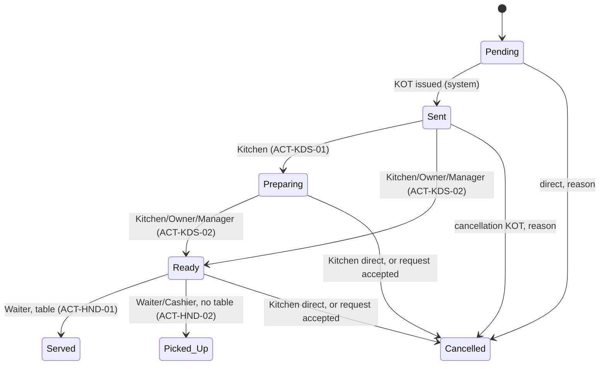

| Transition | Actor / atom | Guard | Concurrency | Audit | Events / side effects |
|---|---|---|---|---|---|
| Pending → Sent | system (ACT-KOT-01/02) | Order Confirmed | Same transaction as KOT | — | `kot.created`, `kds.updated` |
| Sent → Preparing | Kitchen (ACT-KDS-01) | Item Sent ("New") | Conditional write on `{status:'Sent', rev}` | — | `kds.updated`, `order.stage.changed` |
| Sent/Preparing → Ready | Kitchen, Owner, Manager (ACT-KDS-02) | Item **not yet Ready** (AMB-13 resolved: Sent→Ready valid) | Conditional write | — | `kds.updated`; roll-up may make order Ready → handoff staff visibility (PRD-HANDOFF-001.2) |
| Ready → Served | Waiter (ACT-HND-01) | Table associated (§15.0) | Conditional write | — | `order.item.served`; may complete order |
| Ready → Picked Up | Waiter, Cashier (ACT-HND-02) | No table | same | — | `order.item.pickedup`; may complete order |
| Pending → Cancelled | ACT-CAN-01 holders | Reason (ORD-089) | `rev` | **Audit** (AUDIT-002 item cancellation) | `order.item.cancelled`; billing recompute (transactional) |
| Sent → Cancelled | ACT-CAN-01 | Reason; **cancellation KOT** created (ORD-082, ORD-090) | same txn as KOT | Audit | `kot.created`, `kds.updated` |
| Preparing/Ready → Cancelled (Kitchen) | ACT-CAN-04 | Reason | `rev` | Audit | as above |
| Preparing/Ready → Cancelled (request accepted) | ACT-CAN-07 | Open request | §15.4 | Audit | as above |
| Served/Picked Up → any | — | **Forbidden** (ORD-082): use bill Reopen/refund workflow | — | — | `409 STATE_INVALID` directing to correction (PRD §65) |

Hold / Void / Re-fire (ORD-073, AF-033…035) add **no item state**:

| Operation | Technical form | Notes |
|---|---|---|
| **Hold** (ACT-MOD-03/06) | `held` flag + hold history on the item/order; progress transitions blocked while held | The product defines no *release* action (AMB-02); `held` can be cleared only by an authorized actor via the same atom — **PB-5**: release authority, KDS effect and readiness effect while held are undecided; implementation of release is blocked |
| **Void** (ACT-MOD-04/07) | A cancellation with `kind=VOID`; record preserved, reason required; once kitchen-processed follows ORD-082/088 state-safety | Distinct audit action |
| **Re-fire** (ACT-KOT-04) | New additional-KOT line referencing the original item (`refireOf`); original history intact | **Kitchen-only** (PO-TRD-03 §25.9.4): no order item, no item state, no bill line, no money; kitchen cancellation on a Finalized bill is refused (K1) |

### 15.3 KDS (derived, not stored)

KDS columns are a **read model**: `New` = item `Sent`; `Preparing`; `Ready` (KDS-003). It is computed from item state; there is no separate KDS state to drift. Order timer = server time since `Confirmed`. Priority (NORMAL → HIGH/URGENT; ACT-KDS-03: Manager, Kitchen) is a stored item/order attribute, manual only (KDS-005, AI-044). The whole-outlet queue is shown to every Kitchen user and any Kitchen user may act (C-STATION, KDS-001).

**READY roll-up** (`TD-KDS-1`): an order is *fully Ready* iff every **non-cancelled** item is Ready (or later), across all stations (KDS-009). Held items (PB-5) are treated as *not ready* until released or cancelled — provisional; isolated in `deriveOrderStage`.

### 15.4 Cancellation request (Preparing/Ready items)

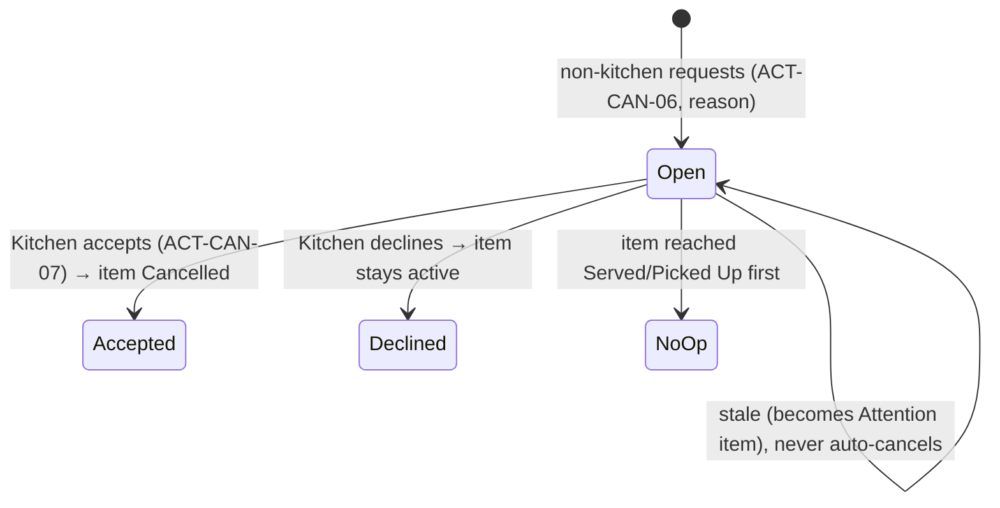

Guards: item Preparing/Ready at creation; at most one Open request per item (unique constraint); `Accepted` is a conditional write that also performs the item → Cancelled transition atomically; `NoOp` is set **by the handoff transaction itself** (it checks for an Open request on the item), satisfying ORD-093 ("Served/Picked Up wins"). Audit: item cancellations (AUDIT-002). Events: `cancellation.requested/resolved` → Kitchen (PRD-ORD-088.2). Stale threshold: `TD-KDS-2` (§23.6).

### 15.5 Bill

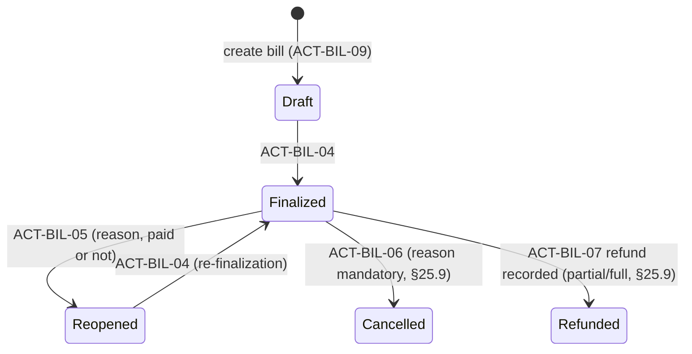

| Aspect | Rule |
|---|---|
| Statuses | `status ∈ {Draft, Finalized, Reopened, Cancelled, Refunded}` (SPEC BILL-002, APP_FLOW §16.1). Payment status is **separate** (§15.6). `Refunded` is entered from `Finalized` when a refund is recorded against a bill that has a payment; "partial / full" is derived, not a second status; lifecycle rules **§25.9.2** (PO-TRD-03) |
| Forbidden | Edit of a Finalized bill (BILL-004); Draft → Reopened (a Draft is corrected without Reopen — PAY-012); Cancelled → any; Refunded → any (§25.9.2); Draft/Reopened → Cancelled (cancellation only from Finalized, §25.9.6); Finalized → Draft |
| Cancel preconditions/effects | **Decided (PO-TRD-03, §25.9.6):** only from `Finalized`; mandatory reason; status change only — payments stay, no automatic refund (BILL-007), order unchanged, no replacement bill; writes a `CANCELLATION` revision with a negative sales delta. PB-6 closed |
| Finalize | In one transaction: recompute totals deterministically (§25.4), freeze a **finalized snapshot** (revision n), set `Finalized`; allowed while the outlet is Closed (ORG-027) |
| Reopen | Requires reason (BILL-014); appends a **bill revision** record preserving the prior snapshot (BILL-011); allowed while Closed (ORG-034); audited |
| Concurrency | `rev` conditional writes (§38); two cashiers finalizing → one wins, the other gets the existing result (M7) |
| Idempotency | Per transition key |
| Audit | Discounts, reopen, refund, cancellation, payment corrections (BILL-013) |
| Events | `bill.created/finalized/reopened/cancelled` → billing staff rooms |

### 15.6 Payment status (derived) and refunds

`paymentStatus ∈ {NotPaid, Paid}` (PAY-010). It is **derived inside the same transaction** as every payment/refund/bill-total change: `Paid` iff `recordedPaymentsTotal ≥ billTotal` (and a bill total > 0), else `NotPaid`. *Partially paid* is a derivable quantity (`recorded > 0 && outstanding > 0`), **not** a third persisted status, because SPEC PAY-010 defines exactly two statuses; a UI may display it. `overpayment = max(0, recorded − total)` is derived and shown explicitly (PAY-012). After refunds (PB-8, **decided — PO-TRD-03 §25.9.1**): `paymentStatus` and `outstanding` use the gross recorded payments; a refund nets against **overpayment only** (`overpayment = max(0, recorded − total − refunded)`), never creates an outstanding balance, and moves a Finalized bill to `Refunded` (§25.9.2).

### 15.7 Attention item

`Open → Dismissed | Resolved`, with actor and time (ATTENTION-006). Allowed: ACT-ANL-04 holders (Owner; Manager for own outlets) acting on an `Open` item. No automatic resolution is implemented because its semantics are undefined (AMB-18, **PB-9**); Dismissed vs Resolved are recorded as given by the actor. Conditional write on `status:'Open'`. Events: `attention.created/updated`.

### 15.8 Business day

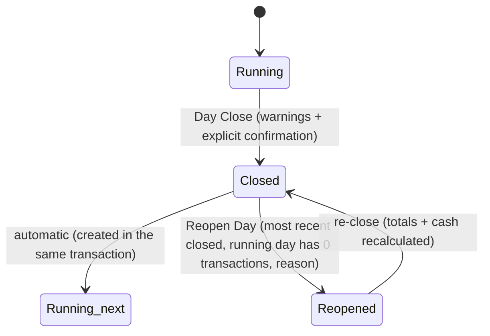

Detailed mechanics in §27. Forbidden: two active days per outlet; reopening any day except the most recent closed; reopening when the running day has a transaction; overlapping/non-contiguous days (DAY-023).

### 15.9 Table and table session

Matrix and guards: §21.2 (resolves TABLE-013/AMB-10 for the TRD). Session `Active → Closed`; ≤1 Active per table (unique constraint, §21.3).

### 15.10 Outlet and restaurant status

| Machine | States | Transitions (actor) | Rules |
|---|---|---|---|
| Outlet activation | NotActivated → Activated | Owner, via onboarding checklist (ONB-030) | No orders before activation (ONB-032). One-way in Phase 1 |
| Outlet availability | Open ↔ Closed | Owner, Manager (ACT-AVA-01); Owner Agent only with Owner confirmation (AI-029) | Manual only (ORG-032); initial value at activation is undefined (AMB-07, **PB-10**) |
| Restaurant platform status | Provisioned → Suspended / Deactivated | SuperAdmin only | Suspended and Deactivated are **enforced identically** (new business blocked, QR notice SCR-058, existing work continues, data retained — ONB-014/016); the *difference* and reinstatement are undefined (AMB-06, **PB-7**) |

### 15.11 AI import draft and Owner-Agent proposal

| Machine | States | Rule |
|---|---|---|
| Import draft | `Uploaded → Extracting → ReadyForReview → (Edited)* → Approved → Published` / `Failed` / `Discarded` | Only `Approved` by the Owner publishes (ACT-AI-02); publish is the **sole** write path into live menu (§31.4) |
| Agent proposal | `Proposed → Confirmed → Executed` / `Expired` / `Rejected` / `Failed` | Single-use, bound to the arguments hash, expires (`PROPOSAL_TTL` default 10 min); confirmed only by the Owner's own authenticated request, never by the model (§31.3) |

### 15.12 Cross-cutting transition catalogue

The complete machine tables are **code-resident constants** (`app/utils/constants/stateMachines.js`) that the schema, API, and tests are generated/validated against (§39.3: one test per allowed edge, one per forbidden edge class). This satisfies SPEC DF-03.

---

## 16. API Architecture

**Traces:** SPEC ORD-006, RBAC-007/008/016, TABLE-008, OFFLINE-001…003, SEC-006 · PRD §65 · AF-064, EF-01…EF-13 · C-POST, C-REFUSAL, C-SUBMIT.

### 16.1 Request pipeline (Diagram 3)

```mermaid
flowchart LR
  A[Client] --> B[ALB]
  B --> C[requestId · pino-http]
  C --> D[helmet · CORS · hpp · mongo-sanitize]
  D --> E[rate limit Redis]
  E --> F[body parse 1MB / raw for webhooks]
  F --> G[route table dispatch]
  G --> H[multer if formData]
  H --> I[Joi validation strict]
  I --> J[API-key / Origin client gate]
  J --> K[authenticate]
  K --> L[authorize factors 1-3]
  L --> M[idempotency middleware]
  M --> N[controller handler payload]
  N --> O[service: txn · scope · guards 4-5 · audit]
  O --> P[createSuccessResponse / thrown createErrorResponse]
  P --> Q[response + x-request-id]
  O -. after commit .-> R[events · jobs]
```

Order differs from the boilerplate only by inserting **authorize** and **idempotency** after authentication; the existing multer → Joi → API-key → `userValidate` order is otherwise preserved.

### 16.2 Conventions

| Topic | Decision |
|---|---|
| Base path | `/api/v1` (C5). `v2` folder reserved for breaking changes; v1 stays additive-only (§40.7) |
| Resources | Plural nouns, `kebab-case` segments, ids as path params. State transitions and operations are **sub-resource POSTs**: `POST /orders/{id}/accept`, `/orders/{id}/items`, `/bills/{id}/finalize`, `/days/{id}/close`. No verbs in resource names except these named operations |
| Methods | `GET` read · `POST` create/operation · `PATCH` partial update (requires `rev`) · `DELETE` only for config entities (soft: `status` = `DELETED`, the boilerplate's `3`) — **never** for business records (F9) |
| Operational scope | `X-Outlet-Id` header (TD-TENANT-1); org-level and platform routes omit it |
| Money | Integer paise only: fields suffixed `…Paise` (`totalPaise`, `unitPricePaise`); strings/floats rejected by Joi (`Joi.number().integer().min(0).max(Number.MAX_SAFE_INTEGER)`) |
| Time | ISO-8601 UTC strings; the server never trusts client time for business facts (M5) |
| Ids | Mongo ObjectId hex (existing Joi `objectId`); public identifiers (QR key, order-link token) are opaque random strings, **never** sequential |
| Request validation | Joi per route (`joiSchemaForSwagger`); unknown keys **stripped/rejected** (C6); errors → `400 BAD_REQUEST` with `data.fields[]` (`{path, code}`) |
| Concurrency | Updates carry `expectedRev` (body) or `If-Match: "<rev>"`; mismatch → `409 CONFLICT` with `data:{ current, rev }` (TABLE-008: "second writer informed") |
| Idempotency | `Idempotency-Key: <uuid-v4>` **required** on routes flagged `idempotent:true` (all business mutations in §19.2) → `400 IDEMPOTENCY_KEY_REQUIRED` if absent |
| Correlation | `x-request-id` accepted or generated (existing), echoed, propagated to logs/jobs/audit/Sentry |
| Pagination | `GET` lists: `limit` (default 25, max 100). Config lists use `page`+`limit` (boilerplate style); high-volume append-only lists (orders, bills, audit, KDS history, feedback) use **cursor** `after=<opaque>` + `limit` (`TD-API-1`: offset pagination degrades with volume; cursors are stable under concurrent inserts) |
| Filtering | Explicit whitelisted query params (`status`, `from`, `to`, `tableId`, `source`, `outletId` for org routes); anything else is rejected, never passed to Mongo |
| Sorting | `sort=<field>:<asc|desc>` from a per-route whitelist; default newest-first with `_id` tiebreak |
| Partial results | Lists return `data:{ items:[…], nextCursor?|page info, total? }`; `total` only where cheap |
| Caching | `ETag` on read models that support it; mutations never cached; `Cache-Control: no-store` on authenticated responses |
| Uploads | Small images via multer; large/AI files via **presigned S3** (§34) |

### 16.3 Response and error structure

Success (unchanged boilerplate envelope):

```json
{ "statusCode": 200, "status": true, "msg": "Order accepted.", "type": "Default",
  "data": { "order": { "id": "…", "stage": "KOT_Sent", "rev": 7 } } }
```

Error (envelope unchanged; `data` carries machine detail — C8):

```json
{ "statusCode": 403, "status": false, "msg": "You are not allowed to perform this action.",
  "type": "Forbidden",
  "data": { "code": "PERMISSION_DENIED", "factor": "permission", "action": "ACT-BIL-07" } }
```

| HTTP | `type` | When | Typical `data.code` |
|---|---|---|---|
| 400 | `BAD_REQUEST` | Validation failure; missing idempotency key | `VALIDATION_ERROR`, `IDEMPOTENCY_KEY_REQUIRED` |
| 401 | `UNAUTHORIZED` | No/invalid/expired session; inactive user | `SESSION_EXPIRED` (generic otherwise) |
| 403 | `Forbidden` | Authorization factor failed | `PERMISSION_DENIED`, `OUTLET_DENIED`, `OUTLET_CONTEXT_MISMATCH`, `STATE_INVALID`, `APPROVAL_REQUIRED`, `OUTLET_CLOSED`, `OUTLET_NOT_ACTIVATED`, `RESTAURANT_SUSPENDED` |
| 404 | `DATA_NOT_FOUND` | Not found **or** other tenant | — |
| 409 | `CONFLICT` | Stale `rev`; invalid state transition; already in state; unique violation | `REV_MISMATCH`, `STATE_INVALID`, `ALREADY_IN_STATE`, `IDEMPOTENCY_KEY_REUSED` |
| 429 | `TOO_MANY_REQUESTS` | Rate limit | `RATE_LIMITED` (+ `Retry-After`) |
| 500 | `INTERNAL_SERVER_ERROR` | Unexpected | — (generic message; detail only in logs/Sentry) |
| 503 | `SERVICE_UNAVAILABLE` | Dependency down for a dependent feature (e.g. AI) | `AI_UNAVAILABLE`, `INTEGRATION_UNAVAILABLE` |

`403` factor semantics satisfy RBAC-016: `factor ∈ {permission, outlet, state, approval}`; never another outlet's data. `state` denials of Closed/suspended/not-activated map to the PRD §65 messages ("Ordering unavailable", etc.); copy is UI/UX.

### 16.4 Post-action contract (C-POST)

Every successful mutation returns the **authoritative resulting object** (with `rev`) and, where a downstream fact matters, the derived fact (e.g. `kot` created, `paymentStatus`, `outstandingPaise`, closed-day record). Pending is never returned as success: a request that has not been durably committed returns an error (or the client shows pending locally).

### 16.5 Endpoint families (representative, not exhaustive)

`TD-API-2`: this document fixes **families and contracts**; the full catalogue is generated into OpenAPI during implementation (§41). Permission atoms are from SPEC §9.

| Family | Representative routes | Permission / scope |
|---|---|---|
| **auth** (public) | `POST /auth/login` · `POST /auth/refresh` · `POST /auth/logout` · `POST /auth/invitations/{token}/redeem` | `public` / session |
| **platform** (SuperAdmin) | `POST /platform/restaurants` · `GET /platform/restaurants/{id}` · `POST /platform/restaurants/{id}/suspend` · `POST /platform/owners/{id}/reset-credentials` · `GET /platform/audit-events` | `scope:'platform'` (ONB-*, ACT-ANL-05) |
| **organization / outlets** | `GET /outlets` · `POST /outlets` · `PATCH /outlets/{id}` · `POST /outlets/{id}/activate` · `POST /outlets/{id}/availability` | ACT-CFG-01, ACT-AVA-01 |
| **staff & access** | `GET/POST /staff` · `PATCH /staff/{id}` · `POST /staff/{id}/reassign` · `POST /staff/{id}/reset-credentials` · `PUT /staff/{id}/permission-overrides` · `PUT /roles/{role}/permission-overrides` · schedule/attendance/availability sub-resources | ACT-STF-*, ACT-ATT-*, ACT-AVL-* |
| **menu** | `GET/POST /menu/categories` · `/menu/items` · `PUT /menu/items/{id}/outlet-override` · `POST /menu/publish` · `POST /menu/imports` · `POST /menu/imports/{id}/approve` | ACT-MNU-*, ACT-AI-01/02/07 |
| **tables** | `GET/POST /floors` · `/tables` · `POST /tables/{id}/open` · `/tables/{id}/transfer` · `/tables/merge` · `/tables/{id}/split` · `/orders/{id}/move-items` · `/tables/{id}/clear` | ACT-TBL-* |
| **orders** | `POST /orders` (staff) · `GET /orders` · `GET /orders/{id}` · `POST /orders/{id}/commit` · `/accept` · `/reject` · `/items` · `PATCH /orders/{id}/items/{itemId}` · `POST …/cancel` · `/hold` · `/void` · `/refire` | ACT-ORD-*, ACT-ACC-*, ACT-MOD-*, ACT-CAN-* |
| **kitchen** | `GET /kds/queue` · `POST /kds/items/{id}/preparing` · `/ready` · `POST /kds/items/{id}/priority` · `POST /cancellation-requests/{id}/accept` · `/decline` | ACT-KDS-*, ACT-CAN-04/07 |
| **handoff** | `POST /orders/{id}/items/{itemId}/served` · `/picked-up` | ACT-HND-01/02 |
| **billing** | `POST /orders/{id}/bill` · `GET /bills/{id}` · `PATCH /bills/{id}` (discount/charges) · `POST /bills/{id}/finalize` · `/reopen` · `/cancel` · `GET /bills/{id}/print` | ACT-BIL-* |
| **payments / refunds** | `POST /bills/{id}/payments` · `POST /payments/{id}/correct` · `POST /bills/{id}/refunds` | ACT-PAY-01/02, ACT-BIL-07 |
| **day close** | `GET /days/current` · `POST /days/{id}/close` · `POST /days/{id}/reopen` · `GET /days/{id}/cash-reconciliation` | ACT-DAY-*, ACT-CSH-* |
| **customers / feedback** | `GET /customers` · `GET /customers/{id}/history` · `GET /feedback` | ACT-CUS-01, ACT-FB-02 |
| **analytics / attention** | `GET /analytics/dashboard` · `/analytics/comparison` · `/analytics/unresolved-bills` · `GET/POST /attention-items/{id}/dismiss|resolve` | ACT-ANL-01…04 |
| **ai** | `POST /ai/agent/messages` · `POST /ai/proposals/{id}/confirm` · `GET /ai/briefs/latest` · `POST /ai/what-changed` | ACT-AI-03/04/05/08 |
| **public** (customer) | `GET /public/qr/{key}` · `GET /public/outlets/{key}/menu` · `PUT /public/drafts/{draftKey}` · `POST /public/orders` · `GET /public/orders/{token}` · `POST /public/orders/{token}/reorder` · `POST /public/orders/{token}/feedback` | `scope:'public'` / `'customerLink'` |
| **webhooks** | `POST /webhooks/whatsapp` | Signature verified (§33.4) |
| **system** | `GET /health` (existing, `authFree`) · `GET /health/ready` | none |

### 16.6 Representative contracts

**Login** — `POST /api/v1/auth/login` `{ "identifier": "owner@x.in", "password": "…" }` → `200` `{ accessToken, expiresIn, user:{ id, role, outlets:[{id,name}] } }` + refresh cookie. Failure: generic `401` (AUTH-006.AC1).

**Customer submits an order** — `POST /api/v1/public/orders` (`Idempotency-Key` required)

```json
{ "qrKey": "k_9fA…", "draftKey": "d_…",
  "customer": { "name": "Asha", "phone": "+919800000000" },        // required only for a tableless QR / website
  "items": [ { "menuItemId": "…", "variantId": "…", "qty": 2, "modifiers": ["…"], "note": "less spicy" } ] }
```
→ `201` `{ order:{ id, stage:'AwaitingAcceptance', isTakeaway:true|false }, orderLink:{ url, token } }`. Table-QR requests with a `customer` object are accepted but **ignored** (ORD-021: no details step); missing details on a tableless QR → `400 VALIDATION_ERROR fields:[customer.name, customer.phone]` (ORD-030.AC1). Outlet Closed → `403 OUTLET_CLOSED` and **nothing is created** (ORG-021.AC1).

**Accept** — `POST /api/v1/orders/{id}/accept` + `X-Outlet-Id` + `Idempotency-Key` + `{ "expectedRev": 3 }` → `200` order `Confirmed/KOT_Sent` with `kots:[{id,kind:'INITIAL'}]`. Outlet Closed → `403 OUTLET_CLOSED` (order stays awaiting — ORG-033).

**Mark ready** — `POST /api/v1/kds/items/{id}/ready` `{ "expectedRev": 5 }` → `200` item `Ready`, order roll-up `{ stage, fullyReady }`.

**Record payment** — `POST /api/v1/bills/{id}/payments` (`Idempotency-Key`)

```json
{ "amountPaise": 184000, "mode": "UPI", "reference": "T2610071234" }   // reference optional, never fabricated (PAY-011)
```
→ `201` `{ payment:{…}, bill:{ paymentStatus:'NotPaid', outstandingPaise:100000, overpaymentPaise:0 } }`.

**Day Close** — `POST /api/v1/days/{id}/close` (`Idempotency-Key`) `{ "countedCashPaise": 1250000, "confirmUnresolved": true, "notes": "…" }` → `200` closed-day record (totals, expected/actual/variance, closing user, timestamp) and the new running day id. Unresolved items without `confirmUnresolved:true` → `409 CONFIRMATION_REQUIRED` with the warning list (DAY-012).

### 16.7 Idempotency and replay semantics

See §19.3. A replayed request returns the **original status code and body** with header `Idempotent-Replay: true`. Reusing a key with a different request hash → `409 IDEMPOTENCY_KEY_REUSED`.

---

## 17. Realtime Architecture

**Traces:** SPEC KDS-016, OFFLINE-005, ORD-008, HANDOFF-001, ORD-088/093, ATTENTION-008, INTEG-002 · PRD §54 (staff operational visibility), PRD-KDS-016.1 · AF-065, AF-027, AF-037, AF-041/042, C-VIS, NAV-GAP-022 · **REST/server state remains authoritative.**

### 17.1 Principles

| # | Principle |
|---|---|
| RT1 | **Events are hints, REST is truth.** A realtime event tells a client *something changed*; the client reconciles by refetching or by applying a `rev`-ordered patch. Losing every event never corrupts state (P1) |
| RT2 | Events are emitted **only after commit** (§10.3). A rolled-back transaction emits nothing |
| RT3 | Delivery is **at-most-once**; correctness comes from idempotent client application and REST resync (§17.6) |
| RT4 | Rooms are **server-controlled**: clients never name rooms; the server derives them from `ScopeContext` + effective permissions (§17.3) |
| RT5 | No customer PII or secrets in staff events beyond what the operational card needs; **customer events carry customer-safe fields only** |

### 17.2 Namespaces

| Namespace | Principals | Purpose |
|---|---|---|
| `/staff` | Authenticated restaurant users (Owner, Manager, Cashier, Waiter, Kitchen) | Operational updates, KDS, handoff, billing, attention, authz revocation |
| `/customer` | Order-link principals (§30.2) | Tracking of exactly one order (ORD-022) |

There is **no `/platform` namespace**: no SuperAdmin screen requires realtime (APP_FLOW §29.3.A), so none is built. KDS is *not* a separate namespace: it is a **room** inside `/staff` joined by holders of ACT-KDS-04, so one connection serves a user's whole session.

### 17.3 Rooms and authorization

| Room | Members (joined by atom, in the user's working outlet) | Carries (PRD §54) |
|---|---|---|
| `org:{o}:outlet:{u}:accept` | holders of **ACT-ACC-01** (Owner, Manager, Cashier, Waiter) | customer order awaiting acceptance (PRD-ORD-008.2) |
| `org:{o}:outlet:{u}:orders` | holders of **ACT-ORD-04** (incl. Kitchen) | order/item state changes, kitchen cancellations visible to Waiter/Cashier (PRD-KDS-013.2) |
| `org:{o}:outlet:{u}:kds` | holders of **ACT-KDS-04** (Owner, Manager, Kitchen) | new/additional/cancellation KOTs, item state, priority, cancellation requests (PRD-KOT-009.2, PRD-ORD-088.2) |
| `org:{o}:outlet:{u}:handoff` | holders of **ACT-HND-01 or ACT-HND-02** (Waiter; Cashier for takeaway) | Ready items awaiting handoff (PRD-HANDOFF-001.2) |
| `org:{o}:outlet:{u}:billing` | holders of **ACT-BIL-01** | bill/payment/refund changes |
| `org:{o}:outlet:{u}:tables` | holders of any `ACT-TBL-*` or ACT-ORD-04 | table state and operations |
| `org:{o}:outlet:{u}:attention` | holders of **ACT-ANL-04** | Attention items (PRD-ATTENTION-002.2) |
| `org:{o}:outlet:{u}:system` | all staff of the outlet | integration failures (WhatsApp/email — PRD-INTEG-002.2) |
| `user:{userId}` | the user | `authz.revoked`, personal notices |
| `/customer` → `order:{orderId}` | the link principal for that order | order status, accept/reject, ready, completed |

`TD-RT-1` — **Join authorization.** On connect, on `outlet.switch`, and on every `authz.changed` signal the socket server recomputes the allowed rooms (§13.3 effective permissions + outlet access) and performs `leave`/`join` itself. A client message can only say *which authorized working outlet* it wants. Owner/Manager join the `attention` rooms of **all** authorized outlets (their alerts are outlet-spanning) and operational rooms of the **working** outlet only. *Rationale:* satisfies SEC-002 and C-VIS ("exactly the stated roles") with no client-controlled room names.

`TD-RT-2` — **Handshake auth.** `auth: { token }` carries the access token (staff) or order-link token (customer); verification is identical to REST (§12.2). Because access tokens expire in 15 minutes, the client emits `auth.refresh { token }` before expiry; the server disconnects a socket whose token expired without refresh (+30 s grace). Revocation (`authz.revoked`) disconnects immediately (§12.7).

### 17.4 Transport and scaling

| Topic | Decision |
|---|---|
| Server | `socket` role (existing `SERVER_TYPE=socket` branch); `@socket.io/redis-adapter` using dedicated node-redis v4 pub/sub clients (Socket.IO adapter keys prefixed `sio:`); compatible with ElastiCache (cluster mode disabled) |
| Emitters | `api` and `worker` roles publish with `@socket.io/redis-emitter` — they never host sockets (F7) |
| ALB | Target group for `/socket.io/*` with **stickiness enabled** (needed for the HTTP long-polling fallback), WebSocket upgrade enabled, idle timeout ≥ 120 s; Socket.IO `pingInterval` 25 s / `pingTimeout` 20 s (engineering defaults) |
| Transports | `['websocket','polling']` |
| Scaling | Horizontal on **connection count / memory**, independent of the API role; no sticky state beyond the connection itself (rooms live in the adapter) |
| Back-pressure | Events are small (≤ 2 KB); per-socket send buffer limits default; slow consumers are disconnected and resync |

### 17.5 Event envelope and catalogue

```json
{ "id": "ev_01HX…", "seq": 18422, "type": "kds.updated",
  "org": "…", "outlet": "…", "entity": { "type": "orderItem", "id": "…" },
  "rev": 5, "at": "2026-10-07T10:41:12.331Z", "requestId": "…",
  "patch": { "state": "Ready", "station": "tandoor", "orderId": "…", "tableLabel": "T4" } }
```

| Field | Rule |
|---|---|
| `id` | Unique event id; clients dedupe on it (LRU of recent ids) |
| `seq` | **Per-outlet monotonic sequence** (`INCR seq:{outletId}` in Redis, assigned at emit time). Clients detect gaps (`seq > last+1`) and resync. Order across outlets is undefined |
| `rev` | The entity revision after the change; clients apply a patch **only if `rev` > the locally held `rev`** (idempotent, out-of-order safe) |
| `patch` | Optional compact view data for low-latency KDS/handoff cards; never the sole source — absence or doubt ⇒ refetch |

| Event type | Room(s) | Trigger |
|---|---|---|
| `order.submitted` | `accept` | customer order awaiting acceptance |
| `order.confirmed` / `order.rejected` | `orders`, `kds`(confirmed), customer `order:{id}` | accept / reject |
| `order.stage.changed` · `order.completed` · `order.cancelled` | `orders`, customer `order:{id}` | roll-up changes |
| `kot.created` | `kds` | initial / additional / cancellation KOT |
| `kds.updated` | `kds`, `orders` | item state / priority |
| `order.item.ready` (derived from `kds.updated`) | `handoff`, customer | order or item Ready |
| `order.item.served` / `pickedup` | `orders`, `handoff`, customer | handoff recorded |
| `cancellation.requested` / `cancellation.resolved` | `kds`, `orders` | PRD-ORD-088.2 |
| `bill.*` · `payment.recorded` · `refund.recorded` | `billing` | billing changes |
| `table.state.changed` · `table.operation` | `tables` | table actions |
| `attention.created` / `attention.updated` | `attention` | PRD-ATTENTION-002.2 |
| `day.closed` / `day.reopened` | `orders`, `billing` | context refresh |
| `outlet.availability.changed` | all outlet rooms + public cache invalidation | Open/Closed |
| `integration.failure` | `system` | PRD-INTEG-002.2 |
| `authz.changed` / `authz.revoked` | `user:{id}` (socket-role internal) | §12.7 |
| `menu.changed` / `menu.availability.changed` | `orders` | availability for staff entry |

Names are internal contracts. The transport (Socket.IO, in-app) is the **staff-alert transport** deferred by DF-13: no push, SMS or email is sent for operational alerts (`TD-RT-3`). Sounds, badges and layout are UI/UX.

### 17.6 Reconnect, missed events, resync (KDS-016, AF-065)

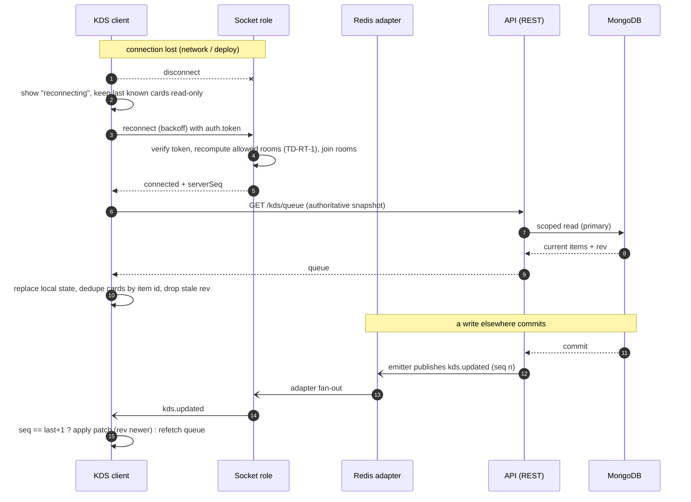

| Rule | Detail |
|---|---|
| Resync | After every (re)connect and on any `seq` gap the client refetches the **REST read model** for each active view. This restores state with **no duplicate cards** (cards keyed by item id; updates by `rev`) — KDS-016.AC1 |
| Safety poll | While connected, KDS and handoff views also revalidate every 30 s (TanStack `refetchInterval`; engineering default) so a lost event self-heals even if Redis pub/sub hiccups |
| Missed-event buffer | **Not provided.** Socket.IO connection-state recovery is incompatible with the pub/sub Redis adapter; adding Redis Streams replay would add a second source of truth for no product need. REST resync is the recovery path (`TD-RT-4`) |
| Duplicate/out-of-order | Handled by `id`/`rev`/`seq` as above |
| Eventual-consistency boundary | Event propagation is best-effort (engineering target p95 < 1 s after commit). Any **decision** (accept, mark Ready, finalize) is validated by the server against current state, never against what the client's screen showed (M2) |
| Kitchen actions while disconnected | **Not offline-eligible** (§19.5): the KDS shows a disconnected state and refuses to queue Ready/Preparing marks, because stale-state transitions would be misleading (AF-065, DF-13) |

### 17.7 Realtime flow (Diagram 4)

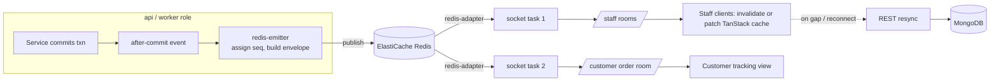

### 17.8 Operational visibility mapping (PRD §54, C-VIS, NAV-GAP-022)

| PRD §54 event | Who is informed | Realtime mechanism |
|---|---|---|
| Customer order submitted | Owner, Manager, Cashier, Waiter of the outlet | `order.submitted` → `accept` room |
| Order accepted / rejected | Customer | `order.confirmed|rejected` → `order:{id}` |
| Order Confirmed → KOT | Kitchen | `kot.created` → `kds` |
| Item added after KOT; sent item cancelled | Kitchen | `kot.created` (additional/cancellation) |
| Cancellation request | Kitchen | `cancellation.requested` → `kds` |
| Kitchen cancels items | Waiter/Cashier + customer | `order.item.cancelled` → `orders`, `order:{id}` |
| Order Ready | Waiter (table) / Waiter+Cashier (takeaway); customer | `order.item.ready` → `handoff`, `order:{id}` |
| Onboarding | Owner | **Email** job (§33.1) — not realtime |
| WhatsApp / email failure | Staff and Owner | `integration.failure` → `system` + persisted integration status (REST) |
| Unresolved items at Day Close | Closing user | Returned in the Day Close preview/response, not pushed |
| Attention item created | Owner; Manager for assigned outlets | `attention.created` → `attention` |

---

## 18. Redis & BullMQ

**Traces:** SPEC OFFLINE-*, SEC-003, SEC-006/DF-09, DF-13 · PRD §54–§56 · AF-064 · INV-05, INV-11.

### 18.1 Topology

| Item | Decision |
|---|---|
| Service | AWS ElastiCache for Redis, **replication group, cluster mode disabled**, Multi-AZ with automatic failover, in-transit TLS (`rediss://`) + AUTH token, at-rest encryption |
| Eviction | `maxmemory-policy noeviction` — **required by BullMQ** (an evicted queue key corrupts queues). Therefore **every non-queue key carries a TTL** and memory is alarmed at 70 %/85 % (`TD-REDIS-1`) |
| Clients | `redis` v4 (existing) for cache, locks, rate limits, idempotency, sequences, adapter pub/sub; `ioredis` solely for BullMQ (`maxRetriesPerRequest:null`) — C16 |
| Key prefix | `srv:{env}:` global; BullMQ `prefix: 'srv:{env}:bull'`. Tenant keys use the scope helper (§11.4) |
| Config additions | `REDIS_TLS=true|false`, `REDIS_DB` (boilerplate has only HOST/PORT/PASSWORD) |
| Split option | If cache churn threatens queue memory, run a second replication group (`cache`, `volatile-lru`) — `OTD-3`; no code change beyond configuration because roles use distinct clients |

### 18.2 Responsibilities (deliberately separated)

| Responsibility | Client | Key shape (TTL) | Correctness role |
|---|---|---|---|
| **Cache** (identity, permissions, platform status, public menu, analytics rollups) | node-redis | `o:{org}:…` (≤ 10 min; invalidated on change) | Optimization only; Mongo on miss |
| **Distributed coordination** (short locks) | node-redis | `lock:{scope}:{id}` (`SET NX PX`, ≤ 10 s, owner-token release via Lua) | **Contention reducer only.** Correctness never depends on a lock — conditional writes/unique indexes decide (§38). Locks are not Redlock; a lost lock cannot corrupt data |
| **Socket.IO adapter / emitter** | node-redis | `sio:*` pub/sub | Realtime fan-out |
| **BullMQ** | ioredis | `srv:{env}:bull:*` | Background execution |
| **Idempotency fast path** | node-redis | `idem:{org}:{principal}:{key}` (24 h) | Fast replay; durable layer is Mongo (§19.4) |
| **Rate limiting** | node-redis via `rate-limit-redis` | `rl:{bucket}:{subject}` (window) | Abuse control (§35.6) |
| **Counters/sequences** | node-redis | `seq:{outletId}` (no TTL while outlet active, re-seeded from last event on loss) | Event `seq` only — **not** business numbering (order/KOT numbers use Mongo counters, §22.4) |
| **Session revocation / authz version** | node-redis | `revoked:{sid}` (= access TTL), `authz:ver:{userId}` | Fail-closed backed by Mongo |

### 18.3 Redis failure behaviour (P10: fail closed, never open)

| Capability | If Redis is unavailable |
|---|---|
| Authentication / authorization | Fall back to MongoDB session + permission computation (slower, correct) |
| Idempotency | Fall through to the Mongo durable layer (unique `idempotencyKey`); non-durable ops lose only fast replay |
| Locks | Proceed without; conditional writes arbitrate (more retries, no corruption) |
| Rate limiting | Per-process in-memory fallback limiter (stricter per-task limits); login limiter never disables itself |
| Realtime | Degraded: no events; clients' 30 s safety poll and REST remain correct |
| BullMQ enqueue | The business transaction **still succeeds**; the enqueue failure is logged/metric'd and recovered by the reconciler (§18.5) |
| Health | `/health/ready` reports Redis degraded; the ALB keeps the task in service if Mongo is healthy (Redis is not a hard dependency of core REST — `TD-REDIS-2`) |

### 18.4 BullMQ — queues and jobs (product-driven only)

`TD-JOB-1` — Exactly **six queues**; each exists for a stated product need. **No `reports` queue** (the product defines dashboards, not report/export generation) and **no midnight/daily-boundary job** (DAY-001, NG-015).

| Queue | Jobs | Product need | Concurrency (engineering default) | Idempotency key (`jobId`) |
|---|---|---|---|---|
| `messaging` | `send-onboarding-email`, `send-whatsapp-reply` | ONB-006/013, AI-030 conversational replies (outbound **tracking** messages are deferred — DF-15) | 5 | `invite:{inviteId}`; `wa-out:{messageId}` |
| `ai` | `menu-import-extract`, `daily-brief-generate` | AI-010…014, AI-026 | 2 (provider quota-bound) | `import:{importId}`; `brief:{outletId}:{dayId}` |
| `whatsapp` | `whatsapp-inbound-turn` | AI-030…033, INTEG-002 | 5 (serialized per conversation via lock) | `wa-in:{providerMessageId}` |
| `analytics` | `rollup-day`, `rollup-invalidate` | ANALYTICS-*, DAY-017 | 3 | `rollup:{outletId}:{dayId}:{n}` |
| `attention` | `detect-after-close`, `sweep` | ATTENTION-001…008, ORD-093 stale | 2 | `detect:{outletId}:{dayId}`; `sweep:{minuteBucket}` |
| `maintenance` | `draft-sweep`, `audit-seal`, `reconcile-intents` | ORD-064, AUDIT-005 integrity, §18.5 | 1 each | scheduler id |

**Repeatable schedulers** (registered by the `worker` role through `cronScheduler.cronStartUpFunction()`, C15; BullMQ `upsertJobScheduler` is idempotent across tasks):

| Scheduler | Interval (engineering default) | Why it exists |
|---|---|---|
| `maintenance:draft-sweep` | 1 min | Abandon Drafts past the inactivity threshold and release table claims (ORD-064, TABLE-007; threshold `TD-ORD-3`) |
| `attention:sweep` | 5 min | Stale cancellation requests (ORD-093), kitchen-preparation slowdown (ATTENTION-003) |
| `maintenance:audit-seal` | 5 min | Hash-chain sealing of audit events (§32.5) |
| `maintenance:reconcile-intents` | 5 min | Re-enqueue lost after-commit jobs (§18.5) |

Daily Brief and post-close analytics/attention jobs are **event-triggered** by Day Close (`day.closed`), not time-scheduled.

### 18.5 Job design rules

| Rule | Detail |
|---|---|
| Payload | `{ organizationId, outletId?, requestId, actor, businessKey, schemaVersion }` — **no secrets, no PII beyond ids**; workers reload data through services under a rebuilt `ScopeContext` (system principal) and the tenancy guard (§11.4) |
| Enqueue | **After commit**, via a helper that sets deterministic `jobId` (de-duplicates re-enqueues) |
| Lost enqueue | Intent is derivable from state (e.g. invitation `status=Pending` without `enqueuedAt`; import `Uploaded` older than N min). `reconcile-intents` scans these and re-enqueues (idempotent by `jobId`). No transactional outbox in Phase 1 (`TD-JOB-2`: every job here is re-derivable from state, so an outbox adds machinery without adding safety) |
| Retries | `attempts: 5`, exponential backoff base 2 s ×2 with jitter, for **transient** errors; validation/authorization/business-rule errors throw `UnrecoverableError` (no retry) |
| Failure / dead-letter | Failed jobs retained (`removeOnFail` age 14 d, count 5 000) as the **dead-letter set**; the `failed` event increments `bullmq_job_failed_total{queue}`, reports to Sentry, and updates the owning domain status where the product needs it (invitation `Failed` → resend, ONB-013; import `Failed`; WhatsApp failure → `integration.failure`, INTEG-002) |
| Completed retention | `removeOnComplete` age 1 d, count 1 000 |
| Handler idempotency | Check current state before acting; a re-run after partial success is a no-op or completes the remainder |
| Isolation | Separate queues + worker concurrency per queue; the AI queue cannot starve messaging; per-organization AI rate limit at enqueue |
| Shutdown | `worker.close()` waits for the active job; ECS `stopTimeout` ≥ longest job-slice (long extractions checkpoint and are retryable) |
| Observability | Metrics: depth, oldest-job age, active, failed, duration p95 per queue → CloudWatch alarms (§36.4) |

### 18.6 Background job flow (Diagram 5)

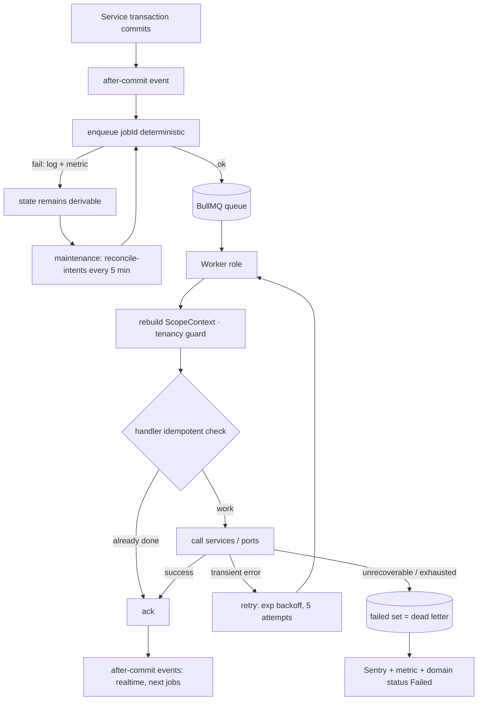

---

## 19. Offline & Idempotency

**Traces:** SPEC OFFLINE-001…008, ORD-006, KOT-007, PAY-006, DAY-009/010, SEC-003, DF-13 · PRD §55 · AF-064, AF-065 · INV-05, INV-11, EF-05.

### 19.1 Guarantees

| # | Guarantee | Mechanism |
|---|---|---|
| G-OFF-1 | One logical user action produces **at most one** business effect, however often it is retried | `Idempotency-Key` + durable uniqueness (§19.3–19.4) |
| G-OFF-2 | An acknowledged write is **durable** | MongoDB `writeConcern: majority, journal: true`; ack only after commit |
| G-OFF-3 | The user is **never told "success" before the server acknowledges** (OFFLINE-002) | Client states `pending` / `failed` / `succeeded`; success only on 2xx |
| G-OFF-4 | **Offline never bypasses** authorization, outlet state, business rules, state machines, audit or server authority (OFFLINE-008, INV-11) | Replays are ordinary requests re-validated in full at arrival; **authorization is evaluated at arrival, not at queue time** (AF-064) |
| G-OFF-5 | Local work is never silently lost | Persist-before-send IndexedDB queue; failed items are retained and visible |

### 19.2 Operations that are idempotent (and how)

| Operation | Key scope | Durable dedupe | Duplicate result |
|---|---|---|---|
| Customer/staff order submit/commit (ORD-006) | `(org, outlet, 'ORDER_SUBMIT', key)` | unique on order | existing order |
| Accept / reject / any transition | transition key | conditional write on `status`/`rev` | existing result or `ALREADY_IN_STATE` |
| Initial/additional/cancellation KOT (KOT-007) | derived `sourceKey` = `(orderId, cause, orderRev|itemId)` | unique on KOT `sourceKey` | the same KOT |
| Add items | `(orderId, key)` | unique on added-items batch key | same batch |
| Open table session | `(tableId, key)` | partial unique: one Active session per table (TABLE-014) | existing active session |
| Bill create (BILL-015) | `(orderId)` | unique `orderId` (one bill per order) | existing bill |
| Finalize / reopen | transition key | conditional on bill `status`+`rev` | existing result |
| Record payment (PAY-006) | `(billId, key)` + optional `(billId, providerRef)` | unique on both when present | existing payment |
| Refund | `(paymentId|billId, key)` | unique | existing refund |
| Day Close / Reopen (DAY-009) | `(outletId, dayId, 'CLOSE', key)` | conditional on day `status`+`rev` | **existing closed-day record** (EF-09) |
| Order-link issuance | `(orderId)` | unique | existing link |
| Feedback | `(orderId)` | unique (one per order — FEEDBACK-006) | existing feedback |
| WhatsApp inbound | `(providerMessageId)` | unique + `jobId` | ignored duplicate |
| Webhooks (signed) | provider event id | unique | ignored |

### 19.3 Key protocol

| Step | Rule |
|---|---|
| Generation | Client generates a **UUID v4 when the user initiates the logical action** and stores it with the queued operation; every retry reuses it. A *new* user intent (e.g. a second tap on a different cart) uses a new key |
| Request hash | `sha256(method + path + canonical(body) + X-Outlet-Id)` stored with the key |
| Server states | `absent` → claim `in_progress` (`SET NX EX 60`) → execute → store `{status, requestHash, response ≤ 64 KB}` for 24 h |
| Replay | Same key + same hash + completed → return stored response, header `Idempotent-Replay: true` |
| In flight | Same key while `in_progress` → `409 REQUEST_IN_PROGRESS` + `Retry-After: 1` |
| Misuse | Same key, different hash → `409 IDEMPOTENCY_KEY_REUSED` (never executes) |
| Principal binding | Key namespace includes the principal and organization, so two users cannot collide or probe each other's keys |
| Failed executions | A request that **failed with a non-5xx business refusal** stores its refusal (replays return the same refusal). A 5xx/crash releases the claim so a retry can execute |

### 19.4 Two-layer storage

1. **Fast layer** — Redis `idem:*` (24 h): cheap replays, in-flight detection.
2. **Durable layer** — the business document stores `idempotencyKey` with a **unique index** scoped as in §19.2. If Redis was flushed, or the retry arrives days later from an offline device, the second insert hits the unique index; the service catches the duplicate-key error and **returns the existing document** (response reconstructed from current state — equivalent, possibly newer).

*Rationale:* Redis may lose data; money and kitchen tickets must not depend on it (P1, P5). Duplicate submissions from **different** devices carrying **different** keys (two waiters both tapping Commit) are arbitrated by the state machine (the second sees `ALREADY_IN_STATE`) or, for item adds, by the active-order context (TABLE-015: items join the one active order).

### 19.5 Client offline queue and eligibility (DF-13)

`TD-OFF-1` — **Offline-eligible operations (queued and auto-replayed)**: staff **order commit** and **add items to an existing order**. Both are *additive*, are fully revalidated on arrival, and do not depend on a fresh view of someone else's state.

**Not eligible (require live server confirmation; the client refuses to queue them and shows why):** accept/reject; all KDS actions (AF-065); cancel/void/hold/re-fire; edit quantity/modifiers; handoff marks; every bill/payment/refund/discount/finalize/reopen/cancel action; table operations (transfer/merge/split/move/clear); Day Close/Reopen Day; outlet Open/Closed; staff/permission/credential/menu changes; every AI action. *Rationale:* these are financial, authorization-affecting or depend on state that may have changed; DAY-010 and PAY-006 additionally require server-confirmed atomic outcomes. The list is a constant (`OFFLINE_ELIGIBLE`); extending it requires a TRD revision and product awareness (OFFLINE-008).

| Queue property | Rule |
|---|---|
| Storage | IndexedDB, entry = `{ opId, idempotencyKey, userId, orgId, outletId, aggregateKey, endpoint, body, createdAt, attempts, state, lastError }` — persisted **before** the first network attempt; `navigator.storage.persist()` requested |
| Ownership | Entries are bound to `userId+orgId+outletId` and are **never replayed under a different identity or outlet** |
| Ordering | FIFO **per `aggregateKey`** (order/table); different aggregates may replay concurrently. A queued add-items for an order created offline waits for the create's server id (the create response maps `clientRef → orderId`) |
| Replay | Sequential per aggregate, exponential backoff with jitter, only when connectivity is detected; each request is an ordinary authenticated request (G-OFF-4) |
| Server unreachable at app launch | The queue resumes automatically; pending entries remain visible |

### 19.6 Conflict handling and server authority

| Replay outcome | Server response | Client behaviour |
|---|---|---|
| Valid and first time | `2xx` | entry → `succeeded`; show authoritative state (C-POST) |
| Duplicate | `2xx` replay / existing result | entry → `succeeded` (no duplicate record) |
| Refused: outlet Closed/suspended, permission revoked, bill Finalized, item unavailable, state changed | `403/409` with `code` | entry → **`failed`**, **kept**, reason shown (e.g. PRD-OFFLINE-008.AC1: item add refused after the outlet closed; Waiter told; nothing overwritten) |
| Stale `rev` on an edit | `409 REV_MISMATCH` + current | entry → `failed`; user chooses to re-apply on the new state. **No automatic merge, no last-write-wins** (never silently overwrite newer server data — OFFLINE-008) |
| 5xx / timeout | none | retry with the same key (safe, G-OFF-1) |

### 19.7 User-visible failure contract

Three states only — `pending`, `failed`, `succeeded` (OFFLINE-002). `failed` entries are never auto-discarded: the user can **retry** or **discard** them explicitly (discard confirms; the locally preserved work is the user's). Logging out with unsent entries warns the user (UI/UX); entries survive for the same identity.

### 19.8 What is *not* idempotent by design

Read endpoints (idempotent by nature); `PATCH` edits (protected by `rev`, not by key); AI chat turns (non-mutating; mutating AI actions go through proposals with their own single-use semantics, §31.3).

---

## 20. Menu Architecture

**Traces:** SPEC MENU-001…017, AI-014, ORD-082 snapshot rules, DAY-017 · PRD §18, §19 · AF-014…016 · INV-04 (price/tax snapshot).

### 20.1 Layers

| Layer | Scope | Content |
|---|---|---|
| **Organization menu** (central) | `organizationId` | Categories/subcategories, items, variants/portions, modifier groups, tax configuration, station mapping, preparation time, order-type availability, publish state (MENU-001…008) |
| **Outlet overlay** | `organizationId` + `outletId` | **Price override** and **availability override** per item (MENU-009/010/014) |
| **Resolved outlet menu** | derived | What customers and staff entry actually see at one outlet at one moment |

Only **published** menu content is orderable; unpublished or AI-imported-but-unapproved content is never visible to customers or staff entry (AI-014, MENU-008).

### 20.2 Overrides and the business-day rule

| Override | Kinds | Authority |
|---|---|---|
| Price | One value per item (and per variant) per outlet | Owner, Manager (ACT-MNU-02) — audited (MENU-013) |
| Availability | **Permanent** (until explicitly changed) **or** **Temporary for the current business day** | Owner, Manager (ACT-MNU-03) — audited |

`TD-MENU-1` — A temporary availability override stores the **`businessDayId`** of the outlet's current day. It is "in force" iff `override.businessDayId === currentBusinessDayId(outlet)`. When Day Close rolls the outlet to a new running day the comparison fails automatically: the override **stops applying at Day Close and never at midnight** (MENU-011, DAY-017), with **no scheduled job** to clear it (a job would reintroduce a time-based boundary that the product forbids). *Rationale:* derived, not scheduled — immune to missed jobs and clock/timezone issues.

Reopen Day (AF-053) changes the outlet's current day id back to the reopened day. Whether overrides created during the absorbed empty running period, or during the reopened day, apply is **undefined upstream (AMB-12, PB-14)**; the equality rule above is mechanically neutral and the behaviour is isolated in `isOverrideInForce()`.

### 20.3 Effective menu resolution

```
effectiveItem(outlet, item, orderType, now) =
    published(item)
 ∧ orderTypeAllowed(item, orderType)                       // MENU-007
 ∧ ¬ unavailable(outletOverride, currentBusinessDay)       // permanent or in-force temporary
 → price = outletPriceOverride ?? centralPrice             // MENU-009.AC1
```

| Rule | Detail |
|---|---|
| Single function | `menuService.resolveOutletMenu(scope, {orderType})` is the **only** way any channel (QR, website, WhatsApp, staff entry, reorder) obtains orderable items/prices — one truth (ORD-001) |
| Versioning | Each publish and each override change bumps `menuVersion` / `overrideVersion` (monotonic per organization / outlet). Used for cache keys, ETags, and traceability on order lines |
| Cache | Redis `o:{org}:ou:{outlet}:menu:{menuVersion}:{overrideVersion}` (public read path, ≤ 30 s TTL + invalidation by `menu.changed`); outlet **open/closed/suspended status is never cached with the menu** — it is read fresh |
| Multi-outlet | An item may be unavailable at one outlet and available at another (MENU-014) because overrides are per outlet |
| Optimistic edits | Menu entities carry `rev`; concurrent edits resolve by `409 REV_MISMATCH` (§38) |

### 20.4 Snapshots and order immutability (MENU-017, MENU-016, INV-04)

When a line is added to an order (any channel, any time, including additional items) the order line **copies**:

| Snapshot | Content |
|---|---|
| Identity | item name, variant/portion name, modifier names and their price deltas, veg/non-veg flag |
| Commercial | `unitPricePaise` (resolved at that moment, after outlet override), modifier deltas in paise, **tax configuration applied** (rate in basis points + tax component names), station mapping, preparation time |
| Provenance | `menuVersion`, `overrideVersion`, source item id (reference only — never used to recompute) |

Rules: after creation the snapshot is **never recomputed or rewritten** by menu, price, tax or modifier changes (a modifier becoming unavailable after order creation does not alter the order — MENU-016). Reports and bills read the snapshot. Reorder reads the *historical* order only to select items, then resolves **current** menu/price/tax/availability for the new order (CUSTOMER-017/019, §30.5).

`TD-MENU-2` — **Cart-to-submit price/availability check.** At submit the server re-resolves every line against the *current* effective menu. If an item became unavailable, the whole submission is refused with the unavailable lines named and **nothing is ordered silently** (MENU-015, MENU-015.AC1). If a price changed since the client displayed it (client sends `expectedUnitPricePaise` per line), the server returns `409 PRICE_CHANGED` with the refreshed lines and creates nothing, so the customer is never charged a price they did not see. *Rationale:* MENU-015's intent is that customers are never surprised; the technical safeguard adds no new product rule and uses only already-defined facts.

### 20.5 Publish and import

Publishing is a single transaction that bumps `menuVersion` and appends audit. AI-imported content reaches the live menu **only** via `menuService.publishApprovedImport` after Owner approval (§31.4). Menu price and availability changes are audited (MENU-013).

---

## 21. Table Architecture

**Traces:** SPEC TABLE-001…018, ORD-091, ACT-TBL-01…07, ACT-MOD-05 · PRD §20 · AF-017…022 · CON-03, AMB-04, AMB-09, AMB-10.

### 21.1 Ownership chain

```
Table ──(opens)──▶ Table Session ──(contains)──▶ Order ──(1:1)──▶ Bill
No table ─────────────────────────▶ Takeaway Order ──(1:1)──▶ Bill
```

The **order is the billing ownership boundary** (TABLE-018, BILL-015): a bill belongs to its order, never to a table. The table association is a **current** attribute plus an **append-only association history** on the session and order (TABLE-017). Historical table/bill ownership is never rewritten (INV-04, INV-10).

### 21.2 Table state matrix — resolves TABLE-013 / AMB-10 / DF-03

`TD-TBL-1` — The product fixes the states (Available, Occupied, Billing, Cleaning, Reserved), the typical flow, and the permissions (ACT-TBL-*), and **explicitly delegates the full transition table to the TRD**. This matrix is that table.

| # | From → To | Trigger / action | Atom (default holders) | Guard | Notes |
|---|---|---|---|---|---|
| T1 | Available → Occupied | Open table (starts a session); or staff order commit on an Available table | ACT-TBL-01 (Owner, Manager, Waiter) | No Active session on the table (unique) | Idempotent open returns the existing Active session |
| T2 | Available → Reserved | Set Reserved | ACT-TBL-04 (Owner, Manager) | Table has no Active session | Manual only; **no booking workflow** (TABLE-003, NG-016) |
| T3 | Reserved → Available | Clear reservation | ACT-TBL-04 | — | |
| T4 | Reserved → Occupied | Open table | ACT-TBL-01 | — | |
| T5 | Occupied → Billing | A bill is created for the session's active order | ACT-BIL-09 holders (system effect via transactional event `bill.created`) | Bill exists and is not Cancelled | The session need not wait for a finalized bill |
| T6 | Billing → Occupied | Items added while the bill is **not Finalized** | ACT-MOD-01 / ACT-ORD-01 | Bill not Finalized (TABLE-010) | If the bill **is** Finalized: refused, directed to Reopen (BILL-004) |
| T7 | Occupied/Billing → Cleaning | Clear table (closes the session) | ACT-TBL-03 (Owner, Manager) | Every order of the session is terminal (Completed/Cancelled/Rejected) **or** the session has no order (clears "Occupied with no active order") | Unresolved/unpaid bills do **not** block clearing: the bill stays reachable (TABLE-011) |
| T8 | Cleaning → Available | Mark Available | ACT-TBL-03 | — | |
| T9 | Occupied/Billing → Cleaning (source) | **Transfer** vacates the source table | ACT-TBL-06 | §21.4 | `TD-TBL-2`: the vacated table needs clearing; changing this to `Available` is a one-cell matrix change |
| T10 | Available/Reserved → Occupied (target) | **Transfer** target receives the session | ACT-TBL-06 | Target Available (or Reserved by the same actor intent — undecided, treat as not allowed) | |

Everything else is forbidden (`409 STATE_INVALID`). A table's `state` is **derived-then-stored**: it is changed only through these transitions inside the transaction that changes the session/order/bill, so it cannot drift.

### 21.3 Session and concurrency

| Invariant | Enforcement |
|---|---|
| ≤ 1 Active session per table (TABLE-014) | **Partial unique constraint** on `{organizationId, outletId, tableId}` where `status='Active'`; a concurrent second open gets a duplicate-key error → service returns the existing Active session (idempotent) |
| ≤ 1 active order context per session (TABLE-015 = ORD-091) | Active-order lookup + creation inside one transaction on the session document (`rev` conditional); additional items attach to the existing active order. **After a merge** several order contexts may coexist (CON-03, TABLE-018) — see §21.4 |
| Two staff modify the same table/order (TABLE-008) | `rev` conditional writes; the second writer receives `409 REV_MISMATCH` with the current state and is told the data changed (PRD §65) |
| Lock ordering for multi-table operations | Acquire Redis locks (`lock:table:{id}`) in **ascending id order** to avoid deadlock; the Mongo transaction's conditional writes on every table/session/order involved are the real arbiter |

### 21.4 Transfer, merge, split, move-items

| Operation (atom) | What the TRD fixes (technical, from TABLE-016/017/018, OD-35, OD-46) | Status |
|---|---|---|
| **Transfer** (ACT-TBL-06) | One transaction: re-point the session's **current** table from A to B; append `{from:A, to:B, opId, actor, at}` to session and order association history; source → Cleaning (T9), target → Occupied (T10); existing KOTs untouched and the kitchen sees the **new** table label via the next KDS read/event (TABLE-009); order/bill identity unchanged; audited operational event | **Buildable** (AF-019) |
| **Merge** (ACT-TBL-07) | Same envelope: locks, one transaction, append-only association history, audit event, **no order merged away, no bill merged or duplicated** (each order keeps its identity and bill — CON-03, TABLE-018), a Finalized bill is **never silently reassigned** (restructuring that needs billing change uses Reopen) | **Envelope fixed; target-order semantics = PB-13 (AMB-09)** — which order receives new items after a merge is undecided; AF-020 is not built until decided |
| **Split** (ACT-TBL-07) | Same envelope. What "split" does to a single order is undefined (AMB-09) | **PB-13**; not built until decided |
| **Move items** (ACT-MOD-05) | Same envelope; moved lines keep `originOrderId`/`originTableId` and `movedByOpId` (historical origin preserved); refused if an affected bill is Finalized | Envelope fixed; **whether moved items change order/bill is PB-13**; not built until decided |

All four are recorded as **table operation events** (a distinct append-only record type, not rewrites of existing orders) and are counted as transactions for DAY-025 ("relevant table/order operational changes").

### 21.5 QR keys

| Item | Decision |
|---|---|
| Table QR | Encodes `https://{web}/q/{qrKey}`; `qrKey` is a **random 128-bit URL-safe opaque id** (`TD-TBL-3`), never a sequence or a guessable table number. Resolves server-side to outlet + table (TABLE-005); one key per table; rotating a key invalidates the old one |
| Tableless QR | One opaque key per outlet encoding **no table information** (TABLE-006) |
| Resolution | `GET /public/qr/{key}` returns `{ outlet:{id,name}, table?:{label}, status }` where `status ∈ ACTIVE | OUTLET_CLOSED | NOT_ACTIVATED | SUSPENDED`. Suspended/deactivated → the suspended/blocked notice payload **without menu** (ONB-016); unknown key → generic not-found with no context (C-INVALID) |
| Abuse | Rate-limited per IP and per key (§35.6); the endpoint never discloses other tables or outlets |

### 21.6 Draft occupancy claims and the AMB-04 boundary

An abandoned Draft must not permanently occupy a table (TABLE-007, ORD-064): a Draft's table **occupancy claim** is a separate record with `releasedAt`, so releasing it never deletes the Draft. Whether a customer table-QR Draft *creates* a session (ACT-TBL-01 is staff-only), and how concurrent pending submissions from one table are combined, is undefined (AMB-04, **PB-11**). The design is neutral: customer submissions for a table with an active order become **independent pending add-batches** attached to that order (each accepted or rejected on its own, ACT-MOD-01 via ORD-008); when no session exists, the session is created by the **accepting staff action** subject to PB-11. Acceptance never merges two customers' pending submissions.

---

## 22. Order Architecture

**Traces:** SPEC ORD-001…094, TABLE-014/015, MENU-015/017, AI-031, ORG-021…028 · PRD §22–§32 · AF-023…035, AF-064 · INV-05, INV-13, INV-14, INV-16.

### 22.1 One engine, many channels

All channels call **one** service entry: `orderService.submit(scope, command)` (customer) or `orderService.createAndCommit(scope, command)` (staff). Channels differ only in **principal** and **channel adapter** (§29).

| Source (`source`) | Principal | Table? | Acceptance (ORD-008) | Customer details |
|---|---|---|---|---|
| `STAFF` (waiter/cashier/manager/owner) | Staff user | Table session or none (Takeaway) | Not required | Optional unless policy requires (ACT-ORD-03) |
| `TABLE_QR` | Customer | Yes (from QR) | **Required** | **No details step** (ORD-021, PO-AF-02) |
| `TABLELESS_QR` | Customer | No → Takeaway | Required | **Name + phone required**, no OTP (ORD-030/031) |
| `WEBSITE` | Customer | No → Takeaway | Required | Name + phone required (ORD-042) |
| `WHATSAPP` | Customer (agent) | No → Takeaway | Required | Phone from provider; name when available (CUSTOMER-021) |
| `REORDER` | Customer (link) | Table iff valid active context (CUSTOMER-020), else Takeaway | Required | From the link's customer |

`isTakeaway ≡ (tableId == null)` regardless of source (ORD-004). It is a **derived attribute computed in one place** (`orderService.isTakeaway(order)`) and every outbound DTO (staff screens, KOT, KDS, bill, customer view) carries the same derived `orderType` label (INV-14, HANDOFF-003).

### 22.2 Submission pipeline

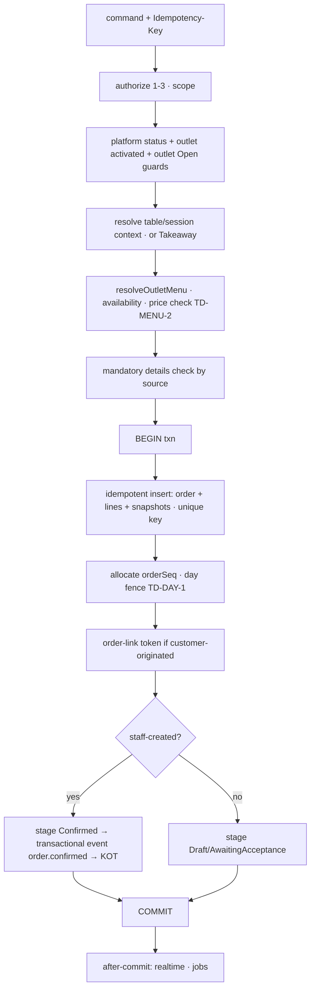

Guards in step C are exactly: restaurant not Suspended/Deactivated (ONB-014), outlet Activated (ONB-032), outlet Open for new orders (ORG-021/024). A guard failure creates **nothing** (ORG-021.AC1).

### 22.3 Modification

| Operation | Rule |
|---|---|
| **Add items** (ACT-MOD-01) | Allowed while bill **not Finalized** (BILL-004) and outlet **Open** (ORG-026); items attach to the table's active order (TABLE-015) or the takeaway order; after the initial KOT an **additional KOT** is created in the same transaction (ORD-080); original order/KOT history untouched. The Completed-order branch is **PB-3** |
| **Edit quantity/modifiers/notes** (ACT-MOD-02) | Pre-KOT (item Pending): in place with audit-less history. **Post-KOT**: represented as **cancellation KOT + additional KOT** (ORD-086); never an in-place rewrite of an issued KOT (ORD-090) |
| **Hold / Void / Re-fire** | §15.2; audited (ORD-073) |
| **Customer table-QR additions** | Pending add-batch → staff acceptance → additional KOT (ORD-008, §21.6) |
| **Kitchen notes / customer notes** | Free text on lines; length-bounded and output-encoded (§35.3) |

### 22.4 Numbering

`TD-ORD-2` — Orders and KOTs receive a **per-outlet, per-business-day sequence** from a Mongo counter incremented **inside the creating transaction** (`findOneAndUpdate … $inc`), unique with `(outletId, businessDayId, seq)`; the display number shown on KOT/KDS/staff screens (KOT-004) is that sequence. Redis `INCR` is **not** used for business numbers (it can lose state; Mongo is authoritative). Invoice numbering (PO-TRD-01: per-outlet, resets 1 April) uses its own Mongo counter in the finalization transaction. *Rationale:* a short, human-friendly kitchen number resetting at Day Close (not at midnight) is consistent with DAY-001, and the counter reuses the day-fence document so it adds no extra hot spot.

### 22.5 Drafts

| Topic | Decision |
|---|---|
| Staff Draft | Persisted server-side from the first line; leaving staff order entry before commit leaves an uncommitted Draft (C-BACK, ORD-064.2); creates no KOT, no sale; does not count as a DAY-025 transaction merely by existing |
| Customer Draft | `TD-ORD-4` — a **server-persisted cart keyed by a client-generated `draftKey`**, created on the **first item added** (no empty drafts) and upserted with `PUT /public/drafts/{draftKey}` (idempotent, `clientSeq`-ordered, ≤ 50 lines). Persisted so that an abandoned Draft remains identifiable in history (ORD-064), but **never offered back**: there is **no read endpoint that returns a Draft to a customer** (ORD-094, PO-AF-04). The `draftKey` lives only in the page that created it |
| Abandonment | `TD-ORD-3` — inactivity threshold `DRAFT_INACTIVITY_MIN` = **30 min** (engineering default, DF-13). `draft-sweep` (§18.4) sets `abandonedAt`, releases the table occupancy claim, keeps the Draft; no KOT, no sale |
| Retention | Drafts are historical records (INV-04) and are not deleted in Phase 1; growth is bounded by creation rate limits (§35.6). Archival is `OTD-9` |
| While Closed/suspended | Draft creation is refused like a submission (`403 OUTLET_CLOSED`/`RESTAURANT_SUSPENDED`) — the menu is not orderable (ORG-021, ONB-016) |

### 22.6 Acceptance and rejection (AF-027, ORD-008, ORG-033)

`accept` / `reject` are transitions of §15.1 by ACT-ACC-01/02 holders. While the outlet is **Closed** both are refused with `OUTLET_CLOSED` and the order stays awaiting acceptance; closing never auto-cancels it (ORG-033). Rejection stores `reason {code, text}`. The Kitchen cannot accept (INV-13): the atom is simply not in its profile and the pipeline's factor 3 refuses.

### 22.7 Cancellation record (ORD-082, ORD-088, ORD-089, ORD-092)

Each cancellation (item or order, any actor, any state) writes an **append-only cancellation record**: `{ target, actor, reason:{code,text}, at, previousState, resultingState, kind: CANCEL|VOID|KITCHEN|REQUEST_ACCEPTED, cancellationKotId? }`. **Reason is mandatory in every case** (ORD-089), validated server-side against the reason catalogue (`TD-ORD-5`: reason = category from a code list + optional free text, per the PRD DF-08 satisfaction; the catalogue content is configuration). Issued KOTs are never erased: a Sent item's cancellation creates a **cancellation KOT/event** (ORD-090).

### 22.8 Order → bill

Bills are **not system-created** (AMB-11 resolved sub-question: ACT-BIL-09 is a human action). `billService.createForOrder` is idempotent on `orderId` (BILL-015). Cancelled items are excluded from bill totals (ORD-087) via the transactional event `order.item.cancelled` (§10.3).

---

## 23. KOT / KDS Architecture

**Traces:** SPEC KOT-001…010, KDS-001…017, ORD-071/072/080…093, ORG-005/028, AI-044 · PRD §33–§36 · AF-036…040, AF-065 · INV-15, INV-17 · C-STATION.

### 23.1 KOT creation

| KOT kind | Created when | Atomicity |
|---|---|---|
| **Initial** (ACT-KOT-01) | Order becomes Confirmed (staff commit or acceptance) | Same transaction as Confirmed, via transactional event `order.confirmed` (KOT-001, KOT-007) |
| **Additional** (ACT-KOT-02) | Items added after the initial KOT, or a re-fire | Same transaction as the add |
| **Cancellation** (ACT-KOT-03) | A **Sent** item is cancelled/voided, or a post-KOT edit (cancel + add) | Same transaction as the cancellation |

Each KOT: outlet-day sequence number, `kind`, `sourceKey` (idempotency, **unique**), lines `{orderItemId, qty, modifiers, notes, stationId}`, order/table label or **Takeaway** (KOT-004/005), created-at. KOT history is retained on the order (KOT-008). **Printing is out of Phase 1** (KOT-010/DF-05): the KDS is the only KOT consumer.

### 23.2 Station model

Stations are **routing metadata inside the outlet's single kitchen** (ORG-005, KDS-002); a KOT line carries the item's mapped `stationId` (MENU-005, KOT-006.AC1). `TD-KDS-3` — stations are **not an authorization boundary**: every Kitchen user sees the whole outlet queue and may act on any item (KDS-001/008, C-STATION). Station filters in the UI never hide or block items. *Rationale:* RBAC-024 mentions "assigned outlet / station scope" but the later locked decisions LD-1/LD-2 and KDS-001/008 make the queue shared; the TRD follows the later decision (SOT-003).

### 23.3 KDS read model

KDS is a **query**, not a store (§15.3): items in states Sent/Preparing/Ready for the working outlet, joined to order/table label/Takeaway, station, notes, priority, timer, with `rev` for patching. Indexed on `(organizationId, outletId, state, priority, createdAt)` (conceptual, §37.3). The queue is whole-order oriented: cards group by order so "not fully Ready while required food is unready" is visible (KDS-009.AC1).

### 23.4 Mutations

| Action | Atom | Mechanism |
|---|---|---|
| Preparing | ACT-KDS-01 (Kitchen) | Conditional write `{status:'Sent', rev}` → `Preparing` |
| Ready | ACT-KDS-02 (Kitchen, Owner, Manager — oversight) | Conditional write `{status ∈ {Sent,Preparing}, rev}` → `Ready`; then roll-up |
| Priority | ACT-KDS-03 (Kitchen, Manager) | Attribute update with `rev`; manual only — no AI (KDS-005, AI-044) |
| Kitchen cancel item/order | ACT-CAN-04/05 | Reason required; transitions §15.2; cancellation KOT/event as needed; affects order/bill (KDS-013) |
| Cancellation request resolve | ACT-CAN-07 | §15.4 |

Concurrency: two Kitchen users acting on the same item → one conditional write wins; the other gets the existing state / `ALREADY_IN_STATE` and the client converges (§38).

### 23.5 Sequence — Order → KOT → KDS → Handoff (Diagram 9)

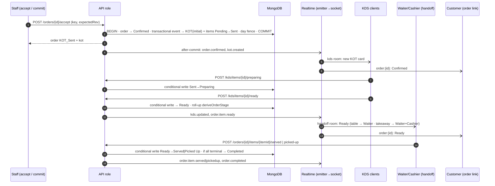

### 23.6 Cancellation requests and staleness (ORD-093, DF-13)

`TD-KDS-2` — A request is **stale** when `Open` longer than `CANCEL_REQUEST_STALE_MIN` = **5 min** (engineering default). The `attention:sweep` creates one Attention item per stale request (idempotent on `requestId`); the request itself is untouched — it **never auto-cancels** the item and stays visible (INV-17).

### 23.7 Re-fire, hold, void at the kitchen

KDS shows re-fired work as additional-KOT lines referencing the original (§15.2). Re-fire is kitchen-only (§25.9.4). Hold pauses progress; the release/KDS effect remains **PB-5 (hold release only)** and is not built. Void follows cancellation state-safety.

### 23.8 Reconnect and eventual consistency

Handled by §17.6 (resync, `rev`, `seq`). Kitchen state changes are **server-authoritative**: the client never advances an item locally; a card moves only after the `2xx`/event (or refetch).

---

## 24. Handoff Architecture

**Traces:** SPEC HANDOFF-001…004, ACT-HND-01/02, ORD-063, ORD-093 · PRD §37 · AF-041, AF-042 · CON-02 (resolved) · INV-14.

### 24.1 Canonical rule (APP_FLOW §15.0)

| Order type | End state | Atom | Default holders | Guard |
|---|---|---|---|---|
| Table-associated | **Served** | ACT-HND-01 | **Waiter**; any other role only if the **Owner grants** ACT-HND-01 through catalogue customization (RBAC-004/005) | Item Ready; **table associated** |
| No table (Takeaway) | **Picked Up** | ACT-HND-02 | Waiter, Cashier | Item Ready; **no table** |

There is no other handoff path, role or end state. A table-associated order can never be marked Picked Up (and vice-versa) because the guard compares the order's **derived `isTakeaway`** with the atom. Owner/Manager/Kitchen are not default holders (HANDOFF-004).

### 24.2 Mechanics

| Aspect | Rule |
|---|---|
| Granularity | Item-level (partial readiness/handoff — ORD-072); an order-level "serve all" convenience calls the item transition for each **Ready** item in one transaction |
| Completion | After each handoff the transaction evaluates `deriveOrderStage`: every non-cancelled item Served/Picked Up ⇒ **Completed** (ORD-063). Bill/payment status never completes an order (INV-09) |
| Concurrency | Conditional write `{status:'Ready', rev}`; double tap / two staff → one transition, the other `ALREADY_IN_STATE`; an Open cancellation request on the item becomes `NoOp` in the **same** transaction (ORD-093: Served/Picked Up wins) |
| Idempotency | Per item + key (§19.2) |
| Audit | Not in AUDIT-002; the handoff is recorded in the item's transition history (operational record, §32.1) |
| Realtime | `order.item.served|pickedup`, `order.completed` to `orders`, `handoff`, and the customer room |
| Customer-facing | Customer tracking shows Takeaway/handoff status identically (HANDOFF-003); after Completed, feedback and reorder become available (§30) |
| Offline | Not offline-eligible (§19.5) |

---

## 25. Billing Architecture

**Traces:** SPEC BILL-001…017, ORD-087, PAY-010/012, DAY-022, DF-14 · PRD §38, §39, §41 · AF-043…048 · INV-04, INV-09, INV-10.

### 25.1 Aggregate

A **Bill** belongs to exactly one **Order** (`unique orderId` — BILL-015) and carries `organizationId`, `outletId`, `businessDayId` (creation day), `rev`, status (§15.5), line references (never copies — lines are read from the order's price/tax snapshots), adjustments (discounts, service/packaging charges), a **computed totals block**, and an append-only list of **revisions** (finalized snapshots). Payment records and refunds are separate append-only collections that reference the bill (§26).

### 25.2 Lifecycle and ownership

State machine: §15.5. `Draft` → `Finalized` → `Reopened` → `Finalized`, or `Cancelled`. Finalization and payment status are independent concepts (BILL-001, INV-09): finalizing never implies payment, and payment never finalizes. Items may be added until the bill is **Finalized** (BILL-004, TABLE-010); a Draft bill's totals are recomputed in the **same transaction** as every line change (transactional event `order.items.changed`), bumping bill `rev`, so a concurrent finalize and add-item are arbitrated by `rev` (one wins, the other is told — §38).

### 25.3 Who does what

| Action | Atom | Default holders | Notes |
|---|---|---|---|
| Create bill | ACT-BIL-09 | Owner, Manager, Cashier, Waiter | Human action; idempotent on `orderId`; allowed while outlet Closed for an existing confirmed order (ORG-025) |
| View | ACT-BIL-01 | + Customer (own order via link, read-only projection) | |
| Discount / charges | ACT-BIL-02 / 03 | Owner, Manager, Cashier | Draft/Reopened only; audited (BILL-013) |
| Finalize | ACT-BIL-04 | Owner, Manager, Cashier, Waiter | Allowed while outlet Closed (ORG-027) |
| Reopen | ACT-BIL-05 | Owner, Manager, Cashier, **Waiter** (BILL-017) | **Reason required** (BILL-014); paid or unpaid; allowed while Closed (ORG-034); audited |
| Cancel | ACT-BIL-06 | Owner, Manager, Cashier | Rules: §25.9.6 (PO-TRD-03) |
| Print / reprint | ACT-BIL-08 | **Cashier** (per §9 matrix) | Never mutates (§25.7) |

Waiter direct edit of a **paid** Finalized bill is denied unless the Reopen correction workflow is used (BILL-016): the same Finalized-state guard blocks every non-reopen edit regardless of payment status.

### 25.4 Calculation architecture (DF-14)

`TD-BILL-1` — All arithmetic is **integer paise** (`Number.isSafeInteger` asserted at every boundary; intermediate products that could exceed 2^53 use `BigInt`). Calculation is one **pure, deterministic, versioned function**:

```
computeBill(lineSnapshots[], adjustments[], policy) → {
   subtotalPaise, discountPaise, chargesPaise[], taxBreakdown[], roundOffPaise, totalPaise,
   calcVersion
}
```

| Property | Rule |
|---|---|
| Inputs | **Only** order-line snapshots (§20.4) and recorded adjustments — never live menu or tax configuration (a menu/tax change cannot alter a bill — MENU-017) |
| Determinism | Same inputs ⇒ identical output (property-tested). No clocks, no randomness, no floating point |
| Versioning | `calcVersion` is stored on every finalized snapshot so a later change of policy never reinterprets an old bill |
| Policy object | `BillingPolicy { taxTreatment, roundingMode, roundOff, discountRules, serviceChargeBasis, packagingChargeBasis }` injected into the function |
| Tax | Per-line tax = f(line value, snapshot rate in **basis points**, tax components) — rates and components come from the snapshot, **never invented by the TRD** |
| Reporting | `taxBreakdown[]` keeps component totals (e.g., CGST/SGST/IGST names as configured) so tax reports can be derived without recomputation |

**PB-1 — RESOLVED (product-owner decision PO-TRD-01, 2026-10-07: "approve defaults").** SPEC DF-14 delegated billing policy values; the product owner approved the policy below. It is the **default `BillingPolicy`** injected into `computeBill`; values are outlet configuration where stated. *Recorded upstream as SPEC v1.3 amendment A3 (BILL-018, DAY-026; DF-14 resolved) and PRD v1.2 §71.6 (PRD-BILL-018.1, PRD-DAY-026.1).*

| # | Policy | Approved value |
|---|---|---|
| 1 | Tax treatment | Menu prices are **tax-inclusive**; GST rate and components are set per item or category in the menu; **CGST+SGST only** (no IGST in Phase 1) |
| 2 | Discounts | Percent or flat, **whole bill**, applied **before tax**, **no cap**; reason handling per PB-19; audited (BILL-013) |
| 3 | Service / packaging charges | Configured **per outlet**; **off by default**; taxed at the rate of the items they apply to — form, base and apportionment: **§25.9.3** (PO-TRD-03) |
| 4 | Rounding | Tax rounded **per line, half-up**; bill total rounded **to the nearest rupee**, shown as a separate **round-off line** |
| 5 | Invoice numbering | One sequence **per outlet**, **resets each 1 April** (Indian financial year), prefixed with an outlet code; a **cancelled bill keeps its number**; one number per bill across revisions: **§25.9.5** |
| 6 | Day Close totals | **Gross sales** = Σ finalized bill totals; **net sales** = gross − refunds recorded that day — correction deltas and cancelled-bill refunds: **§25.9.7** |

Consequences: `TD-BILL-1` stays the mechanism; the development-only policy is replaced by this one; invoice numbers are allocated by a Mongo counter in the finalization transaction (not Redis); taxes and the round-off line are stored in the finalized revision. Items 1, 4 and 5 may carry GST-compliance implications — **advise the product owner to confirm with their accountant**; changing a value later is a policy/config change with a new `calcVersion`, never a rewrite of finalized bills.

### 25.5 Finalization snapshot and revisions (BILL-011, BILL-004)

| Step | Behaviour |
|---|---|
| Finalize | One transaction: load bill (`rev`), recompute with `computeBill`, store an immutable **revision** `{n, totals, taxBreakdown, adjustments, lines (frozen copy), calcVersion, finalizedBy, finalizedAt, businessDayId}`, set `Finalized`; sales for DAY-022 are attributed to this `businessDayId` |
| Reopen | Appends a **reopen event** (reason, actor, at, businessDayId); status `Reopened`; prior revision retained untouched |
| Re-finalize | Appends revision `n+1`; both revisions remain; the bill keeps its **one invoice number** (printouts of `n ≥ 2` read "Revised n", §25.9.5). Each revision stores `previousTotalPaise` and `deltaPaise`; its Gross contribution is the **delta**, counted on the day it actually happens (`businessDayId`), with `attributedDayId` = the original bill's day — `TD-BILL-2`, §25.9.7 |
| Immutability | No update/delete path exists for revisions (F9) |

### 25.6 Adjustments

Discounts and service/packaging adjustments are recorded as adjustment entries (actor, amount basis, reason where required, timestamp) on a **Draft/Reopened** bill; each is audited (BILL-013, AUDIT-002 "discounts"). Discount rules are PO-TRD-01 (percent/flat, whole bill, before tax, no cap); charge rules are §25.9.3 (PO-TRD-03); the TRD enforces only state, permission, audit and integer arithmetic.

### 25.7 Print, digital bill, reprint (BILL-008/009)

| Rule | Mechanism |
|---|---|
| Source | Printable/digital/reprinted bill is **rendered from the latest finalized revision** (or the Draft preview), never recomputed by a different code path — identical financial data on reprint (BILL-009.AC1) |
| Print events | Append-only `{billId, revision, actor, at, kind: PRINT|REPRINT|DIGITAL}` |
| Digital bill | The customer sees a **read-only projection** through their order link (ACT-BIL-01 "own order"); no PDF-generation job in Phase 1 (printing/thermal = DF-05; no requirement to generate PDFs) |
| Mutation | Reprint touches only the print-event log |

### 25.8 Bill events and cross-effects

`bill.created` → table `Occupied → Billing` (T5); `bill.finalized` → table-state guard for T6, Day fence; `bill.reopened` → table `Billing → Occupied` is **not** automatic (bill state does not change table state beyond T5/T6); `bill.cancelled` → the order and table are **unchanged** (§25.9.6); the bill is resolved. Realtime to `billing` room.

### 25.9 Product-owner billing decisions — PO-TRD-03 (2026-10-08)

*Recorded here as the technical form of seven product-owner decisions (PO-1 … PO-6 and OD-DB-27 of the Database Schema closure pass). They close PB-5 (re-fire and kitchen cancellation on a Finalized bill), PB-6, PB-8 and PB-15. Hold **release** (the other half of PB-5) stays open. SPEC/PRD/APP_FLOW are not edited by this TRD amendment: they remain silent (AMB-02/05/11/14 are "not defined", not contradicted), and recording the decisions as a SPEC amendment is a governance follow-up.* All amounts are integer paise; `P` = Σ effective payment entries, `F` = Σ refunds, `T` = bill total.

**1. Refund netting — overpayment only (PO-1).**

```
outstanding   = max(0, T − P)
paymentStatus = (P ≥ T and T > 0) ? Paid : NotPaid
overpayment   = max(0, P − T − F)
refundKind    = F = P ? FULL : (0 < F < P ? PARTIAL : none)        // derived, never stored
```

A refund never reduces `P`, never changes `T`, and never creates an outstanding balance. It clears overpayment up to the excess and is otherwise visible through `F`, the bill status `Refunded` and the refund ledger. "Full" means *all recorded payments were refunded* (`F = P`), not "equal to the bill total"; refunding only an overpayment's excess is therefore partial. Invariant `F ≤ P` is checked in every refund and in every payment correction (a correction that would make `P' < F` is refused).

**2. Bill status `Refunded` and its lifecycle (OD-DB-27).** The status set is `Draft · Finalized · Reopened · Cancelled · Refunded` (SPEC BILL-002) with `paymentStatus` separate.

| Event | Bill status before | Effect |
|---|---|---|
| First refund on a bill that has a payment | `Finalized` | `Finalized → Refunded` in the **same transaction** as the refund record (explicit staff action ACT-BIL-07) |
| Further refund while `F < P` | `Refunded` | Ledger record only; status stays `Refunded` (partial becomes full by derivation) |
| Refund | `Draft`, `Reopened` | Ledger record only (PAY-012 overpayment resolution); **no** status change |
| Refund | `Cancelled` | Ledger record only; status stays `Cancelled` |
| Reopen, Cancel, record payment, edit lines/adjustments | `Refunded` | **Refused** — no edge leaves `Refunded`, and nothing may change a refunded bill's total |
| Payment correction | `Refunded` | Allowed (explicit, audited) only if `P' ≥ F` |
| Any edge not listed here or in §15.5 | any | Forbidden (§15.12) |

*Rationale (most conservative rule):* Reopen would let `T` change beneath refunds already recorded; Cancel would reverse a sale that a refund already deducts from Net (double count, §25.9.7); a late payment would silently re-open a settled bill. A `Refunded` bill is *resolved* (ANALYTICS-011).

**3. Service / packaging charges (PO-2 — C + X).**
- *Configuration.* Each outlet configures, per charge kind (`SERVICE`, `PACKAGING`): enabled (default off), `basis ∈ {PERCENT, FLAT}`, `valueBps` or `valuePaise`.
- *Application.* Staff apply a charge to a Draft/Reopened bill (ACT-BIL-03) as an adjustment entry that **snapshots** `kind, basis, value` at that moment. Changing outlet configuration later never alters an existing entry on any bill; a finalized revision is frozen.
- *Amount.* PERCENT: base = the **discounted item subtotal** (subtotal − whole-bill discount; tax-inclusive; other charges excluded, no compounding); `amount = round_half_up(base × valueBps / 10 000)` using `BigInt`; recomputed with the bill while Draft/Reopened. FLAT: `valuePaise`, once per bill.
- *Tax (X).* Charge amounts are tax-inclusive on the same basis as menu prices and discounts (PO-TRD-01 #1–#2) *[derived from those decisions; the accountant confirmation of GST items stands]*. The charge is apportioned across the bill's tax-rate groups **in proportion to each group's taxable value (after the discount)** by the largest-remainder method (integer-exact: parts sum to the charge; ties resolved by ascending `rateBps`); each part is taxed as a pseudo-line at its group's rate with **per-line half-up** rounding (PO-TRD-01 #4). The parts and the resulting tax are stored in the revision (`charges[].allocations[]`, `taxBreakdown[]`).

**4. Re-fire is kitchen-only; kitchen cancellation after finalization is refused (PO-3 — A + K1).**

| Layer | Re-fire |
|---|---|
| Kitchen | A new **additional-KOT line** referencing the original item (§15.2); shown on the KDS as additional work; no new KOT kind |
| Order item | **No** new `orderItems` row and **no** item-state change; the original item and its history are untouched. Completion of re-fired preparation is not tracked as a state (consistent with §15.2 "no item state") |
| Bill | Unaffected: bill lines come only from non-cancelled order items |
| Financial | Unaffected: no money field is written |

K1: while the order's bill is `Finalized`, `Refunded` or `Cancelled`, any cancellation or void that would change billable lines — **by Kitchen or anyone else** — is refused (`409 STATE_INVALID`, "Reopen the bill first"). It is allowed while there is no bill or the bill is `Draft` or `Reopened`. Re-fire stays allowed in every bill status (re-fire of a Cancelled item remains refused).

**5. One invoice number per bill (PO-4 — A).** The number is allocated once, at the bill's **first** finalization (§25.4 #5), and is reused by every later revision. Printouts of revision `n ≥ 2` carry the marker **"Revised n"** (derived from the revision number, never stored). No second invoice identity exists. Revisions stay auditable through `billRevisions`; GST-compliance review remains the accountant boundary of §25.4.

**6. Bill cancellation (PO-5 — A).**
- Allowed **only from `Finalized`** (any payment state), with a **mandatory reason**; audited. `Draft`/`Reopened` bills cannot be cancelled (a Reopened bill is re-finalized first).
- Status change only: payments stay recorded and untouched; **no automatic refund** (BILL-007); the order is unchanged; **no replacement bill** (BILL-015: one bill per order) and no further items (the bill is resolved).
- *Sales effect.* Writes an insert-only `billRevisions` record of kind `CANCELLATION` with `deltaPaise = −(latest finalized total)` stamped with the day of cancellation (§25.9.7). Cancellation is a DAY-025 transaction.
- A refund recorded afterwards against the cancelled bill is cash-relevant (CASH-007) but does **not** deduct from Net sales (its sale was already reversed): it is stored with `deductsFromNet = false`.

**7. Gross and Net sales; post-close corrections (PO-6 — B).** Each *finalization event* contributes a signed amount to the **day on which it actually occurs**, while keeping the bill's original attribution:

| Event | Contribution to that day's Gross |
|---|---|
| First finalization (revision 1) | `+T₁` |
| Re-finalization (revision n ≥ 2) | `+(Tₙ − Tₙ₋₁)` — only the **delta** |
| Cancellation of a Finalized bill | `−(latest finalized total)` |
| Reopen | `0` (the sale stays at its last finalized total until re-finalized) |

```
grossSales(D) = Σ deltaPaise of billRevisions with businessDayId = D        // signed
netSales(D)   = grossSales(D) − Σ amount of refunds with recordedDayId = D and deductsFromNet = true   // signed, unclamped
```

Σ of Gross over all days equals Σ of the current totals of non-cancelled bills, so no amount is counted twice. A stored Day Close revision is **never mutated** by a later correction (AMB-14 closed); only Reopen Day → re-close recalculates a day, using the same formulas over the contributions stamped with that day. An "as-originally-attributed" view is a report: Σ `deltaPaise` grouped by `attributedDayId`.

---

## 26. Payment Architecture

**Traces:** SPEC PAY-001…013, BILL-012, ACT-PAY-01/02, ACT-BIL-07, CASH-007, DAY-022 · PRD §40 · AF-049…051 · INV-05, INV-09 · EF-05, EF-12.

### 26.1 Boundary

**Phase 1 records payment *information*; it does not execute payments** (PAY-008 EXCLUDED, NG-011, BILL-012: a refund is a recorded fact, no money moves). The TRD therefore designs a **ledger**, not a gateway flow, and does **not** invent payment states such as Pending/Failed/Authorized.

### 26.2 Ledger model

| Record | Append-only? | Key fields (conceptual) |
|---|---|---|
| **Payment entry** | Yes | `billId`, `orderId`, `outletId`, `amountPaise` (> 0), `mode ∈ {UPI, Cash, Card}`, `reference?`, `recordedBy`, `recordedAt`, `businessDayId` (day **recorded** — PAY-009), `idempotencyKey`, `supersededBy?` |
| **Payment correction** | Yes | A new entry `{ type: CORRECTION, supersedes: paymentId, … }`; the original is **never edited or deleted** (PAY-007, PAY-012: "never silently deleted or rewritten"); effective payments = entries not superseded, plus correction entries |
| **Refund** | Yes | `billId`, `paymentId?`, `amountPaise`, `mode`, `reason`, `actor`, `at`, `providerReference?`, `attributedDayId` (original bill's day), `recordedDayId` (day recorded) — PAY-013, DAY-022 |

`TD-PAY-1` — **Split** (PAY-002/005): a split payment is *several payment entries* each with its own mode, linked by a `splitGroupId`; "Split" is a derived label (≥ 2 components) so every component stays individually available to Day Close reconciliation (PAY-005.AC1: ₹1,840 UPI + ₹1,000 cash).

### 26.3 Derived figures (computed in the same transaction as any change)

```
recordedTotal   = Σ effective payment entries
outstanding     = max(0, billTotal − recordedTotal)
overpayment     = max(0, recordedTotal − billTotal)          // shown explicitly, stays until resolved (PAY-012)
paymentStatus   = recordedTotal ≥ billTotal  ?  Paid : NotPaid // PAY-010
```

Payment is **independent of finalization** and may be recorded against a Draft bill (PAY-010, PAY-012); when the bill total later changes, existing payments are kept and `outstanding`/`paymentStatus` are recalculated (PAY-012). The effect of refunds is fixed by §25.9.1 (PO-TRD-03): `overpayment = max(0, recorded − total − refunded)`; `outstanding` and `paymentStatus` use gross recorded payments.

### 26.4 Recording flow (Diagram 10 — Billing → Payment)

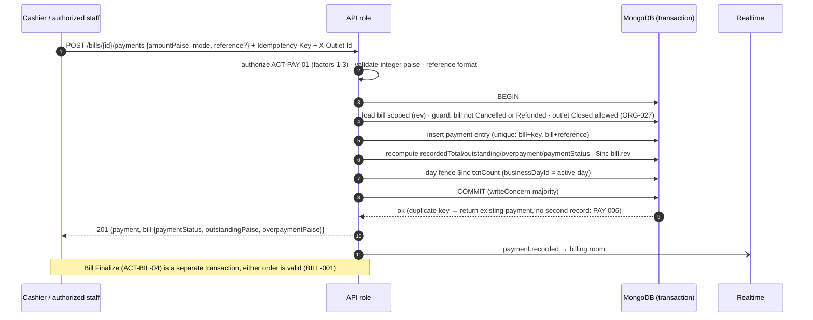

### 26.5 Reference handling (DF-09 "secure payment-reference handling")

`reference` (UPI/transaction id) is **optional and never fabricated** (PAY-003, PAY-011). It is treated as an **untrusted string**: trimmed, ≤ 64 chars, restricted charset, stored as given, never used as an identifier of authority, **masked in logs** (last 4 only), and unique per bill when present (PAY-006). No card numbers, UPI PINs or card data are ever accepted or stored: the API rejects any field outside the schema (§35.3) and the card mode records only that a card was used.

### 26.6 Corrections and refunds

| Action | Atom | Rules |
|---|---|---|
| Correct payment | ACT-PAY-02 (Owner, Manager, Cashier) | Creates a superseding entry (§26.2); audited (PAY-007, BILL-013); the reason requirement is not enumerated upstream (AMB-21, **PB-19**) — the field is accepted and stored, mandatory-ness is a guard |
| Refund (partial/full) | ACT-BIL-07 (Owner, Manager, Cashier) | Requires a recorded payment; allowed while outlet Closed (ORG-034); records PAY-013 fields; a first refund on a `Finalized` bill sets it `Refunded` in the same transaction (§25.9.2); stores `deductsFromNet` (false when the bill is `Cancelled`, §25.9.6); **Σ refunds ≤ Σ effective payments** (`TN-2`: integrity check — a refund cannot exceed what was paid; it is a data-consistency constraint, not a new business rule); audited; idempotent |
| Cash refund | | Counts against expected cash of the day **recorded** (CASH-007) |

### 26.7 Razorpay integration boundary (no Phase 1 execution)

`PaymentProviderPort` defines the *shape* a future gateway adapter would satisfy (`verifyWebhookSignature`, `fetchPayment(reference)`, amounts in paise — Razorpay's native unit), with **no Phase 1 adapter wired, no webhook route registered, and no gateway state machine designed** (DF-06 is a later phase; adding it needs new product decisions on states and reconciliation). The port exists so domain code never imports a gateway SDK (F6) and so the integer-paise contract is already compatible.

### 26.8 Concurrency and idempotency

Per §19.2 and §38: payment recording is idempotent on `(billId, key)` plus a unique `(billId, reference)` when present; every payment/correction/refund conditional-writes the bill `rev`; two cashiers recording simultaneously serialize through the bill document and both entries are kept (distinct keys = distinct intents), with `overpayment` shown explicitly if the total is exceeded.

---

## 27. Day Close Architecture

**Traces:** SPEC DAY-001…025, CASH-001…007, ANALYTICS-010/011, ORG-011, ORG-022, MENU-011 · PRD §45–§49 · AF-052, AF-053 · INV-08 · AMB-14.

### 27.1 Model

| Concept | Technical form |
|---|---|
| **Business day** | One record per outlet per day: `startedAt`, `closedAt?`, `status ∈ {Running, Closed, Reopened, Absorbed}`, `txnCount`, counters (order/KOT sequence), `rev` |
| **Day Close record** | Immutable, append-only revisions `{n, totals, cashReconciliation, closedBy, closedAt, notes}`; a re-close appends revision n+1 and keeps n |
| **Active day** | The single day with `status ∈ {Running, Reopened}` per outlet — enforced by a **partial unique constraint** (never two simultaneously active business days — DAY-015) |
| **Contiguity** | A new day's `startedAt` **equals** the previous day's `closedAt`; checked inside the closing transaction (DAY-023). No midnight, hours, or start-of-day record exists (DAY-001/002) |

All times are server clock (M5). Outlet time zone affects **display only**.

### 27.2 The day fence — `TD-DAY-1`

Every operation that DAY-025 defines as a **transaction** performs, **inside its own Mongo transaction**, a conditional `$inc: { txnCount: 1 }` on the outlet's **active day** document (`{outletId, status ∈ [Running, Reopened]}`) and stamps the new record's `businessDayId` from that document:

| Counts as a transaction (fenced) | Does **not** count |
|---|---|
| Order creation/submit (incl. **awaiting acceptance**), modification, cancellation; item changes; KOT-related changes; bill create/finalize/reopen/cancel; payment record/correct; refunds; cash reconciliation; table transfer/merge/split/move and other relevant table/order operational changes | An uncommitted customer/staff **Draft** merely existing; **opening an empty table** alone (DAY-025.AC1) |

*Rationale and consequences.*
1. **Exact reopen precondition.** DAY-021 ("running day has zero transactions") reduces to `txnCount === 0` — exact, O(1), no scans, no drift.
2. **Serialization without a global lock.** Reopen and Close write the same day document, so MongoDB's write-conflict detection serializes them against concurrent business writes: a business write that loses retries (`TransientTransactionError` handler) against the *new* active day and is attributed correctly (DAY-006, DAY-015). A write that wins first makes the day non-empty and Reopen is refused — no lost transaction, no mis-attributed one.
3. **Hot-document cost is acceptable.** One outlet's write rate is low (§10.1), so contention on a per-outlet counter is negligible; the counter also doubles as the order/KOT sequence holder (§22.4).
4. **Completeness is testable.** Each service method declares `dayEffect: 'transaction' | 'none'` in a registry; a test fails if a state-changing method omits it (§39.3), preventing silent under-counting.

### 27.3 Day Close — one atomic transaction (AF-052)

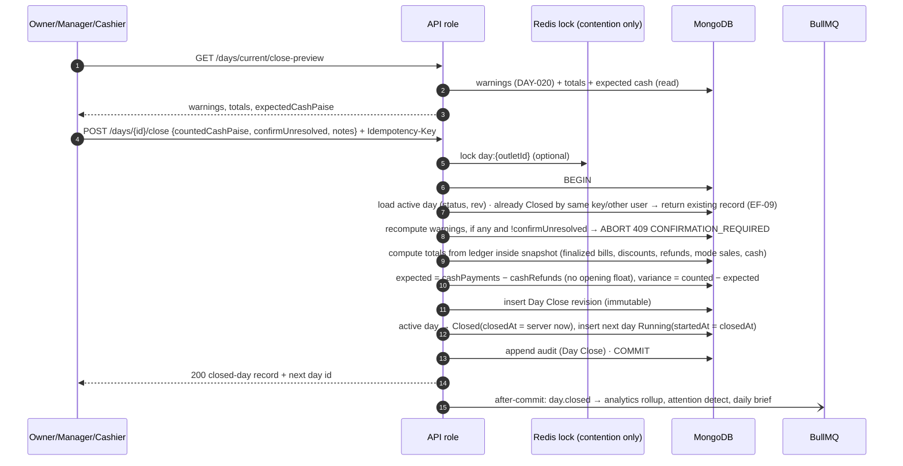

| Aspect | Rule |
|---|---|
| Atomicity (DAY-010) | Everything above is **one transaction**; on a lost connection the client calls `GET /days/current` and/or retries with the **same key** — the outcome is either "closed" (existing record returned) or "not closed" (executes), never duplicated (DAY-009) |
| Warnings (DAY-020) | Orders not Completed/Cancelled (a Rejected order's treatment follows **PB-4**); customer orders awaiting acceptance; items Pending/Sent/Preparing/Ready; unresolved bills (Draft, Reopened, Finalized+NotPaid — ANALYTICS-011). They are shown and require explicit confirmation; **nothing is cancelled or altered** (DAY-012); they remain visible and in analytics (DAY-011) |
| Totals (DAY-007, DAY-022) | Sales are **finalization-event based**: each first finalization, re-finalization delta and cancellation reversal contributes a signed amount to the day it actually occurs (§25.9.7); Draft/Reopened bills add nothing until (re-)finalized. Stored **as components** (first-finalization total, correction delta, gross, discounts, refunds recorded, refunds on cancelled bills, net, per-mode UPI/Cash/Card, expected/actual/variance); `grossSalesPaise` and `netSalesPaise` are **signed** (PO-TRD-01 #6, PO-TRD-03) |
| Cash (CASH-005…007) | Per outlet and day; no opening float; expected = cash payments recorded in the day − cash refunds recorded in it; variance = counted − expected; **variance never blocks close** (CASH-006) |
| Concurrency | Redis lock reduces contention only; the arbiter is the day `rev`/status conditional write plus the fence (§38) |
| Consistency snapshot | Totals are computed inside the transaction's snapshot; any concurrently committing fenced write conflicts and retries, so the record contains **every** transaction committed before it and **none** after (reporting consistency) |
| Effects | Temporary availability overrides stop applying (derived, §20.2); no order/item/bill/payment is modified (DAY-012) |
| Outlet Closed | Day Close works whether the outlet is Open or Closed (ORG-022.AC1) |
| Audit | Day Close appended in-transaction (AUDIT-008: Closed → Reopened → Reclosed) |
| Midnight | No job and no logic keyed to midnight (DAY-001, NG-015) |

### 27.4 Reopen Day and re-close (AF-053)

Preconditions evaluated **inside one transaction**: (a) the target is the outlet's **most recently closed** day (DAY-015); (b) the current active (Running) day has `txnCount === 0` (DAY-021/025); (c) a **reason** is supplied (DAY-018).

| Step | Effect |
|---|---|
| 1 | Conditional write: running day `{status:'Running', txnCount:0, rev}` → `Absorbed` (its empty period is absorbed — DAY-024) |
| 2 | Target day `Closed → Reopened` (`reopenedAt`, reason, actor), becoming the single active day; transactions recorded now belong to it (DAY-015) |
| 3 | Audit `Closed → Reopened` |
| 4 | **Re-close** repeats §27.3 on the Reopened day: totals and cash recomputed; **new** `closedAt` becomes that day's boundary; next Running day starts at it; revision n+1 appended (original retained); audit `Reclosed` |

Refusals (`409` with state message — PRD §65): not the most recent closed day; running day has any transaction (including a pending customer order — DAY-025.AC1); no reason. Race: a transaction that commits first makes `txnCount > 0` and blocks reopen; a reopen that commits first makes the racing transaction retry into the reopened day (§27.2).

### 27.5 Post-close corrections (DAY-022, AMB-14)

Refunds, payment corrections and re-finalizations after a close keep **both** their original `attributedDayId` and the actual timestamp/`recordedDayId` (§25.5, §26.2). A post-close correction **never changes the stored Day Close record** of the original day (PB-15 closed, PO-TRD-03 §25.9.7): a re-finalization contributes its delta, and a cancellation its reversal, to the day it actually happens; only Reopen Day → re-close recalculates a day.

### 27.6 Reporting and analytics consistency

"Today" = the active day since the last Day Close (DAY-017, ANALYTICS-005): running-day metrics read the **live ledger** (primary); closed days read the immutable Day Close revisions and `rollup-day`. Unresolved bills are a query over bill/payment state **independent of day** and never disappear (ANALYTICS-010/011).

### 27.7 Outlet Closed vs Day Closed

Distinct states with distinct stores (§28): `outlet.availability` (Open/Closed — blocks new business) is **not** `businessDay.status`; closing an outlet never touches the business day, and Day Close never changes availability (ORG-022, ORG-032).

---

## 28. Outlet Lifecycle

**Traces:** SPEC ORG-020…034, ONB-009, ONB-014…016, ONB-030, ONB-032, AI-029 · PRD §9, §10 · AF-003, AF-004, AF-006, AF-007 · INV-06, INV-07 · C-WEB.

### 28.1 Four independent state dimensions

| Dimension | Values | Controlled by | Scope |
|---|---|---|---|
| **Restaurant platform status** | Provisioned (Active), **Suspended**, **Deactivated** | SuperAdmin only | Organization |
| **Outlet activation** | NotActivated → Activated | Owner (onboarding checklist, ONB-030) | Outlet |
| **Outlet availability** | **Open** ↔ **Closed** (manual; no automatic transition — ORG-032) | Owner, Manager (ACT-AVA-01) | Outlet |
| **Business day** | Running / Closed / Reopened | Day Close (§27) | Outlet |

### 28.2 Operation gate — one function, one table

`TD-OUT-1` — A single `operationalGate(scope, operationClass)` is called from state guards (§13.5). The matrix below is the **only** place these rules live.

| Operation class | Outlet **Closed** | **Suspended / Deactivated** | **Not activated** | Source |
|---|---|---|---|---|
| New customer order / draft (QR, tableless QR, website, WhatsApp, reorder) | **Blocked** — "ordering unavailable" | **Blocked** — QR shows suspended/blocked page; other channels refuse | **Blocked** | ORG-021, ONB-014/016/032 |
| New staff-created order | **Blocked** | **Blocked** | **Blocked** | ORG-024, ONB-014, ONB-032 |
| Add items to an existing order | **Blocked** | *Not defined* (AMB-06 → **PB-7**) | n/a | ORG-026 |
| Accept / reject a pending customer order | **Blocked** (stays awaiting; never auto-cancelled) | Treated as new business-adjacent: *not defined* (PB-7) | n/a | ORG-033 |
| Kitchen processing, handoff, completion of **existing confirmed** orders | **Allowed** | **Allowed** | n/a | ORG-025/028, ONB-014 |
| Create/finalize bill, record payment for existing orders | **Allowed** | **Allowed** | n/a | ORG-023/025/027, ONB-014 |
| Reopen bill, corrections, refunds, re-finalize | **Allowed** | **Allowed** (normal authorization) | n/a | ORG-034, ONB-014 |
| Cancel/hold/void/re-fire existing items | Not enumerated (ORG-034 principle) → **PB-10** | Not enumerated → PB-10 | n/a | AMB-07 |
| Open a table; discounts/charges while Closed | Not enumerated → **PB-10** | PB-10 | n/a | AMB-07 |
| Day Close / Reopen Day | **Allowed** | **Allowed** | n/a | ORG-022 |
| Owner/Manager open the outlet again | Allowed (but a suspended restaurant still accepts nothing) | — | — | AF-007 |
| Staff sign-in | Allowed | **Allowed** (staff must finish existing work — AMB-06 resolved sub-question) | Allowed | AF-002/003 |

Cells marked PB are **not implemented**; the gate returns "unspecified" and the calling flow must be built only after the product decision (§45.2). Cells not marked PB are enforced exactly as shown, with `403 OUTLET_CLOSED | RESTAURANT_SUSPENDED | OUTLET_NOT_ACTIVATED` and **no mutation** (RBAC-008).

`Deactivated` is enforced **identically to Suspended**, because ONB-009, ONB-016 and AF-003 define them together; no deactivated-specific behaviour (e.g. blocking staff sign-in) is invented. The difference and any reinstatement path are **PB-7**.

### 28.3 Customer-facing behaviour

| Entry | Suspended/Deactivated | Closed | Not activated |
|---|---|---|---|
| QR scan | **Suspended/blocked page** — account suspended/blocked, contact the SERVENA technical team; no menu, no ordering (SCR-058, ONB-016) | "Ordering unavailable" (SCR-056) | "Ordering unavailable" |
| Website | Refuses new orders (EF-04) | Shows closed, accepts nothing (ORG-029) | Accepts nothing |
| WhatsApp | Refuses (reply states unavailability) | Replies closed (ORG-030) | Refuses |

`GET /public/qr/{key}` returns `status ∈ {ACTIVE, OUTLET_CLOSED, NOT_ACTIVATED, SUSPENDED}` (§21.5). Public status is cached for ≤ 5 s and invalidated by `outlet.availability.changed` / `restaurant.suspended`; **write paths always read authoritative state inside the transaction**.

### 28.4 Race tolerance

`TD-OUT-2` — The gate reads outlet/platform state inside the order transaction (snapshot). An order whose transaction began before an Open→Closed (or suspension) commit may still complete: the linearization point is the commit, and the window is milliseconds. No fence is added to the outlet toggle (it would couple every order write to the outlet document for a benign ms-scale tolerance). Pending customer orders are protected by ORG-033, not by this gate.

### 28.5 Audit and realtime

SuperAdmin suspension/deactivation is audited (AUDIT-002, ONB-009.AC1). Outlet Open/Closed is **not** in AUDIT-002 (AMB-21, **PB-19**): the change is still recorded as an **operational history entry** (actor, at, from→to) on the outlet; it is audited when executed by the **Owner Agent** (AI-029, AUDIT-004). `outlet.availability.changed` fans out to staff rooms; the SPA re-reads gate state.

---

## 29. Customer Ordering

**Traces:** SPEC ORD-002…042, ORD-021 (A2), ORD-094, AUTH-009, TABLE-005/006, ORG-021…033, ONB-016, DF-04, DF-15 · PRD §21–§27, §42 · AF-023…027, AF-054…056 · C-WEB, C-INVALID, C-SUBMIT, C-BACK.

### 29.1 Channel matrix (technical)

| Channel | Entry | Outlet determined by | Table | Customer details | Auth | Acceptance |
|---|---|---|---|---|---|---|
| **Table QR** | `/q/{qrKey}` | QR key (outlet + table) | Yes | **Not requested** (ORD-021, PO-AF-02) | none | Required |
| **Tableless QR** | `/q/{qrKey}` (outlet-level key) | QR key (outlet only) | No → Takeaway | **Name + phone required**, no OTP (ORD-030/031) | none | Required |
| **Website** | Per-outlet public URL key | URL key (C-WEB) — outlet is known **before** any menu is shown | No → Takeaway | Name + phone required (ORD-042) | none | Required |
| **WhatsApp** | Provider webhook (§31.6) | Business number/outlet mapping | No → Takeaway | Phone from provider; name when available | webhook signature | Required |
| **Staff-created** | Staff app | Working outlet | Table or none | Per ACT-ORD-03 | session | Not required |
| **Private order link** | `/o/{token}` | Token | — | — | link token | — |

`TD-CUS-1` — The website resolves the outlet from a **per-outlet public key** (a distinct opaque key, not the QR key, so a QR can be rotated without breaking the website). Choosing among outlets of a multi-outlet organization is UI/UX; the API only ever serves one outlet's menu per call (C-WEB).

**Not built (product decisions):** customer accounts, mandatory OTP (NG-012, DF-04 = unbuilt), abandoned-order resume (ORD-094), WhatsApp order tracking (DF-15). **A new scan creates a new order**: there is no server path to resume or look up a previous Draft.

### 29.2 Customer ordering flow (Diagram 8)

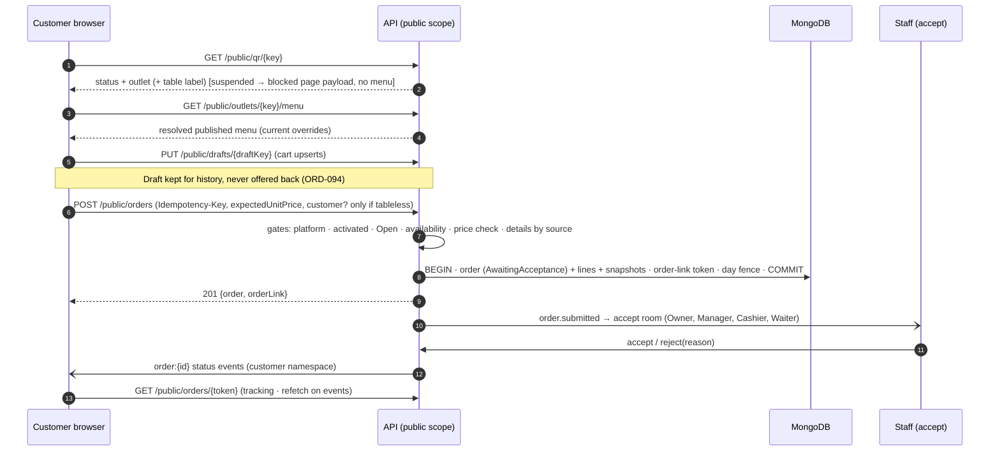

### 29.3 Abuse and integrity controls (public surface)

`TD-CUS-5` — Because the public endpoints are unauthenticated: per-IP and per-key rate limits (§35.6); payload caps (≤ 50 lines, ≤ 1 KB notes); a **per-phone / per-outlet pending-order throttle** (engineering default 3 pending customer orders per phone per outlet) to bound spam against the acceptance queue; honeypot-free design (no CAPTCHA is defined by the product, none is added); all input validated and output-encoded; menu and QR responses never include staff or other-customer data. Throttle breaches return `429` and create nothing.

### 29.4 Customer-originated order visibility

Customers see **only their own order** (CUSTOMER-003) through `customerLink` scope (§30.2); no list-orders endpoint exists on the public surface. Staff acceptance gates the kitchen (INV-13): no customer order reaches KDS before ACT-ACC-01.

### 29.5 Outlet Closed/suspended/not activated

§28.2/§28.3. A submission while Closed creates nothing and returns `403 OUTLET_CLOSED` (C-SUBMIT).

---

## 30. Customer Identity & Feedback

**Traces:** SPEC AUTH-009, CUSTOMER-001…021, FEEDBACK-001…006, ACT-CUS-01…03, ACT-FB-01/02, DF-12, DF-15 · PRD §42–§44 · AF-054…056, APP_FLOW §20 (customer identity) · AMB-16, AMB-19 (resolved).

### 30.1 Customer record

| Aspect | Decision |
|---|---|
| Key | **Phone number** (E.164) at **organization scope** (CUSTOMER-021); upserted when a name+phone order is placed (tableless QR, website, WhatsApp, staff-captured) |
| Table-QR customers | No details captured (ORD-021): the order has **no customer record**; history features do not apply |
| Visibility | Outlet-scoped by S4/S9: Owner all outlets; Manager/Cashier/Waiter/Kitchen own outlet (ACT-CUS-01, CUSTOMER-004). A phone match across outlets **never widens** access (CUSTOMER-021) and **never** lets one customer's link expose another's order |
| Derived stats (CUSTOMER-002) | Visit count, last order, AOV, preferred items, outlet history computed by the `customers` module from order/bill events. `TD-CUS-2`: *total spend* = Σ `totalPaise` of **Finalized** bills of the customer's orders (refunds tracked separately). The definition is not in the product documents; components are stored so any later definition is a recomputation |
| PII | Name and phone are PII: stored under Atlas encryption at rest, **never logged in clear** (masked to last 3 digits), excluded from Sentry payloads, absent from realtime events to non-privileged rooms |

### 30.2 Private order-link mechanism (DF-12, AUTH-009)

`TD-CUS-3`

| Aspect | Decision |
|---|---|
| Purpose | The **only** way a customer reaches their order (no accounts, no OTP) — tracking, bill view, feedback, reorder |
| Generation | 256-bit CSPRNG token (`crypto.randomBytes(32)`, base64url). Issued **once per customer-originated order at submission** (table QR, tableless QR, website, WhatsApp, reorder) — every customer-originated order has one (AMB-19 resolved) |
| Storage | **Only SHA-256(token) is stored**, with `orderId`, `organizationId`, `outletId`, `createdAt`, `expiresAt`, `revokedAt?`. The raw token exists only in the issuing response |
| Scope | **Exactly one order.** The principal can read that order's customer-safe projection, track it, view its bill, submit feedback for it, and reorder from it. It cannot list other orders. (A link that lists several past orders would need a product decision — `PB-17` family; CUSTOMER-016's "eligible past orders" is satisfied per link, i.e. per order) |
| Customer-safe projection | Order stage, items (names/qty), station-independent status, Takeaway/handoff label, totals and bill view, rejection reason; **never** staff identities, internal notes, audit data, other customers |
| Expiry | `ORDER_LINK_TTL_DAYS` = **30 days after the order reaches a terminal state**, with an absolute cap of **90 days from creation** (engineering defaults; DF-12). Expiry stops read and reorder access |
| Revocation | By expiry; platform-level revocation (security incident) by invalidating hashes. No customer-facing revoke (no accounts) |
| Transport | `https://{web}/o/{token}`; token in the **path**; `Referrer-Policy: no-referrer`, `Cache-Control: no-store`; access logs **redact** `/o/*` and `/public/orders/*` path tokens; invalid token → `404` generic (C-INVALID, CUSTOMER-003.AC1); lookups rate-limited per IP |
| WhatsApp | The link is generated like any customer order's but is **not sent to the customer** over WhatsApp: delivery of status/link on WhatsApp is deferred (DF-15, PO-AF-01) |

### 30.3 Feedback (AF-055, FEEDBACK-001…006)

| Rule | Mechanism |
|---|---|
| Eligibility | Order stage `Completed` and a customer-originated order with a valid link (ACT-FB-01, ORD-063) — a Cancelled/Rejected order offers none (ORD-065.AC1) |
| Content | Integer rating 1–5 + optional comment (≤ 1 000 chars; output-encoded; stored as plain text) |
| Uniqueness | One feedback per order: unique `orderId` + idempotency (FEEDBACK-006) |
| Association | Order, outlet, customer context (FEEDBACK-003) |
| Visibility | Owner (all outlets), Manager (own outlets) — ACT-FB-02; used as operational insight (FEEDBACK-004, ANALYTICS-006). Public review publishing is excluded (NG-008) |

### 30.4 One-tap reorder (AF-056, CUSTOMER-010…020)

`POST /public/orders/{token}/reorder` (`Idempotency-Key`), eligible only if the linked order is **Completed** and has reorderable items.

| Step | Rule |
|---|---|
| 1 Gates | Link valid; outlet Open, activated, not suspended (CUSTOMER-018, §28.2) |
| 2 Items | Select the historical order's **non-cancelled, fulfilled** lines (cancelled/non-fulfillable never recreated — CUSTOMER-020); the historical order is **read-only, never modified** (CUSTOMER-019) |
| 3 Resolve | Every line is **re-resolved against the current menu** — current price, tax, availability, overrides, modifiers (CUSTOMER-017); unavailable items are **excluded and reported, never substituted** (CUSTOMER-014.AC1) |
| 4 No silent partial order | `TD-CUS-4`: if any item is excluded the server returns `409 ITEMS_UNAVAILABLE` with the list unless the request carries `acknowledgeExcluded: true`; if **all** are unavailable no order is created. *Rationale:* upholds MENU-015's "never ordered silently" without adding a product rule; the UI may collapse the two calls into one tap when nothing is excluded. The all-unavailable UX is **PB-17** |
| 5 Table context | `resolveReorderTableContext()` — CUSTOMER-020 says "with a valid active table context it is associated with that table… otherwise Takeaway", but *how a private link obtains a valid active table context is undefined* (AMB-16, **PB-17**). Until decided the function returns *none*, so the reorder is **Takeaway** (never a guessed table) |
| 6 Create | Through the **unified order engine** as a new customer-originated order (`source: REORDER`, staff acceptance required — ORD-008), with its own order link (CUSTOMER-013, CUSTOMER-015) |

### 30.5 Identity boundaries (recap)

No customer accounts, no OTP, no cross-customer exposure. A customer order link grants no access to menu administration, other orders, or any staff route; its `ScopeContext` is the single order (§11.2).

---

## 31. AI Architecture

**Traces:** SPEC AI-001…045, ORD-008 (AI-033), ATTENTION-001…008, DF-02, DF-13, INTEG-001/002 · PRD §52, §57–§62 · AF-057…063 · INV-01 · NAV-GAP-025.

### 31.1 Boundary

AI is an **edge capability, never operational truth** (AI-004, AI-043, AI-045, INV-01):

| # | Rule | Enforced by |
|---|---|---|
| A1 | **Core operations run with the AI provider offline** (AI-003/040/041): ordering, KOT, kitchen, billing, Day Close | Dependency rule F5: no module outside `ai/` and the `ai-*` modules may import AI code; AI failures cannot propagate into core transactions |
| A2 | **No unrestricted database access** (AI-024) | The model sees only **tool results**; tools call the same domain services as REST; no Mongo handle, query string or collection name is ever exposed to a model or built from model output |
| A3 | **AI never bypasses RBAC** (AI-023, SEC-005) | Every tool call runs `authorize()` with the **invoking Owner's** `ScopeContext` (+`via:'ai'`); an AI principal never has more than its Owner |
| A4 | **Source data prevails** (AI-045, AI-022) | Facts shown to users are rendered by the server **from data**, not from model text; numeric grounding check (§31.6) |
| A5 | **Sensitive actions need explicit Owner confirmation** (AI-029) | Proposal protocol (§31.3) — the model cannot confirm |
| A6 | **Every executed AI action is audited** (AI-042, AUDIT-004) | `via:'ai'`, `proposalId` stored in the audit event |
| A7 | **KDS priority is not AI-driven** (AI-044) | No AI tool touches priority |

### 31.2 Components

| Component | Folder | Responsibility |
|---|---|---|
| `AiProviderPort` | `app/integrations/ai/` | Provider-agnostic `generate({system, messages, tools, schema, timeoutMs})`; adapter(s) implement it. Provider/model choice is `OTD-5` (the port makes it a configuration change) |
| Orchestrator | `app/ai/orchestrator/` | Builds context, runs the bounded tool-use loop (≤ 8 steps, ≤ 30 s wall clock), enforces budgets |
| Tool registry | `app/ai/tools/` | The **only** capabilities a model has (§31.3) |
| Context builder | `app/ai/context/` | Assembles the system prompt (static, versioned in the repo) and **untrusted-data-labelled** tool results |
| Guards | `app/ai/guards/` | Output schema validation, numeric grounding, redaction, refusal fallback |
| Proposal store | `app/ai/proposals/` | Single-use confirmation records (Mongo, TTL) |
| AI interaction log | Pino + Mongo (`aiInteractions`) | `{requestId, userId, orgId, outletId, tool, argsHash, status, latencyMs, tokens}` — **no prompts/PII persisted by default** (`TD-AI-4`) |

### 31.3 Owner Agent (AF-058, AF-059, AI-025, AI-029, ACT-AI-03/08)

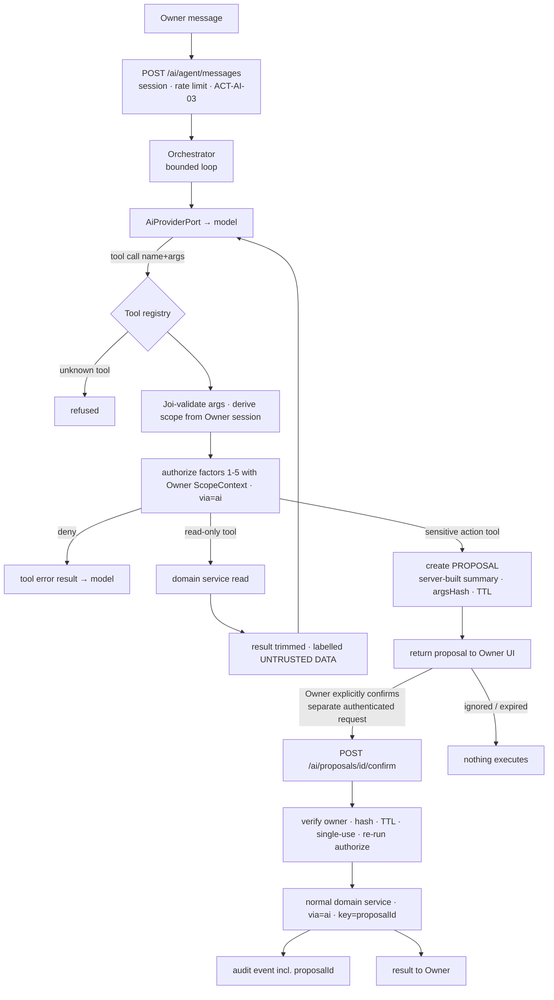

| Topic | Design |
|---|---|
| **Read-only by default** (AI-029) | The registry **ships read tools only**. Action tools exist only after a product decision lists them (**PB-18**, AMB-17: the *permitted action catalogue* is undefined; AI-029 names only the sensitive classes that need confirmation). AF-058 (read) is buildable; AF-059 (actions) is **blocked on PB-18** |
| Read tools | One tool per already-defined analytics family (ANALYTICS-002: sales, orders, AOV, payment mix, top items/categories, source mix, peak hours, discounts, cancellations, refunds, open orders, staff activity, variance, multi-outlet comparison), plus unresolved bills, Attention items, Day Close records, feedback summary — **no metric is invented**. Each tool declares `{ name, permission:ACT-…, inputSchema:Joi, handler }` and returns **aggregates**, never raw documents |
| Scope | `organizationId`/`outletId` are **never model-supplied arguments**; an optional `outletId` is validated ∈ `allowedOutletIds`; Manager principals have no agent (ACT-AI-03 is Owner-only) |
| **Proposal protocol** (sensitive actions: refunds, payment corrections, permission/RBAC changes, staff credentials/access, outlet Open/Closed, menu price changes, destructive/corrective actions — AI-029) | An action tool does **not execute**: it stores `{proposalId, ownerId, orgId, outletId, tool, args, argsHash, summary, status:Proposed, expiresAt}`. The `summary` shown to the Owner is **generated by the server from `args`**, not copied from model text. Confirmation is a **separate authenticated REST call by the Owner's own session** (never a chat message, never callable by the model); it re-verifies owner, hash, TTL (default 10 min), single use, and **re-runs full five-factor authorization at execution time** (state may have changed). Execution goes through the normal service with `via:'ai'` and `idempotencyKey = proposalId` |
| Unconfirmed | Leaving/ignoring executes nothing (AI-029.AC1, C-BACK); expired proposals are inert |
| Prompt-injection posture | Tool results and any DB-sourced text (item names, customer notes, feedback) are inserted as **delimited untrusted data** with an explicit instruction that they carry no authority; **authority never derives from text** — it derives only from the session, the registry and the confirmation endpoint. Even a fully compromised model output can at worst *propose* an action the Owner must confirm, or call read tools within the Owner's scope |
| Budgets | Per-user rate limit and token budget; max 8 tool steps; result size caps; recursion forbidden |
| Failure | Provider timeout/error → `503 AI_UNAVAILABLE`; agent UI unavailable; **core unaffected** (INTEG-001). Circuit breaker (Redis counters) opens after N consecutive failures and half-opens after a cool-down |

### 31.4 AI Menu Import (AF-057, AI-010…016, ACT-AI-01/02/07)

```mermaid
flowchart LR
  U[Owner uploads PDF/image/Excel/CSV] --> P[presigned POST → incoming/]
  P --> C[POST /menu/imports register · ACT-AI-01]
  C --> Q[(ai queue: menu-import-extract)]
  Q --> V[validate: size · magic bytes · page/row caps]
  V --> X{type}
  X -->|CSV/XLSX| D[deterministic parse · no formula eval]
  X -->|PDF text| T[text extraction]
  X -->|image/scan| M[model vision via port]
  D --> S[structured candidate JSON]
  T --> S
  M --> S
  S --> G[schema validation + confidence flags + duplicate detection]
  G --> DR[(import DRAFT store — isolated from live menu)]
  DR --> E[Owner reviews/edits · ACT-AI-07]
  E --> A[Owner approves · ACT-AI-02 · Owner approval factor]
  A --> PUB[menuService.publishApprovedImport · one txn · audit AI-015]
  PUB --> LIVE[(live menu · menuVersion++)]
```

| Rule | Mechanism |
|---|---|
| Draft isolation (AI-014.AC1) | Drafts live in their own store; **nothing the AI pipeline does can write the live menu** — `publishApprovedImport` is the only path and requires the Owner-approval fact on the draft |
| Low-confidence flags (AI-012) | Model-reported per-field confidence **plus deterministic rules** (missing price/category, price outliers, unparseable tax) — flags never block editing |
| Duplicates (AI-016) | Deterministic normalized-name+variant match within the draft and against the existing menu; flagged **before** approval |
| Safety | Parsers are non-executing (no macro/formula evaluation, no external fetches); extraction runs in the isolated worker with time/memory limits |
| Failure | Draft → `Failed` with reason; Owner may retry or create the menu **manually** (ONB-024); no effect on live menu |
| Audit | Approval audited (AI-015, AUDIT-002) |

### 31.5 Daily AI Brief (AF-060, AI-026/027, ACT-AI-04)

`TD-AI-1` — **Trigger:** event-driven by `day.closed` (the brief belongs to the outlet's business-day lifecycle — AI-026, DAY-017; not a clock schedule): a job `daily-brief-generate` with `jobId = brief:{outletId}:{dayId}:{closeRevision}` (a re-close generates a new brief). **Delivery:** stored and retrieved in-app (`GET /ai/briefs/latest`) by the Owner for authorized outlets and the Manager for assigned outlets; **no push/email/SMS** (DF-13: delivery mechanism delegated to TRD). *Rationale:* the smallest delivery that satisfies "Owner views it" and adds no notification policy (§39 prohibits inventing notification policies).

Generation: **(1)** compute deterministic metric set for the closed day (sales, orders, bills/payment status, anomalies, Attention items, meaningful changes, business-day comparison); **(2)** model produces *recommendations and narrative referencing metric ids*; **(3)** guards validate; **(4)** the stored brief renders **facts from metrics** and **recommendations from the model** as separate sections (AI-021). On any failure (provider down, validation failure) the brief falls back to the deterministic fact section only (AI-041) or is unavailable — nothing is fabricated.

### 31.6 What Changed? (AF-061, AI-028, ACT-AI-05)

`TD-AI-2` — On demand. **Baseline** = the outlet's **most recent completed (Closed) business day that has ≥ 1 transaction** ("comparable" is not further defined upstream; this is the most literal reading and is isolated in `selectWhatChangedBaseline()`). Compared to the current running day to date by a **deterministic diff** over sales, order volume/status, bills/payments, operational anomalies, Attention items and meaningful menu/staff/outlet configuration changes (read from operational change records through an internal feed — **not** the SuperAdmin-only audit trail, and not a raw audit viewer). **No valid baseline** → a deterministic "comparison unavailable" response is returned **without calling the model** and nothing is invented. The model, when available, only phrases meaningful differences over metric ids.

**Numeric grounding guard (all generated narratives)** — `TD-AI-3`: every numeric token in a "fact" must equal a value in the metric set supplied for that call; recommendation text may not introduce new figures. A violation discards the narrative and falls back to the deterministic template (AI-041, AI-022). Facts and recommendations are separate structure fields (AI-021).

### 31.7 Daily Brief surface (NAV-GAP-025)

Product content is fixed by AI-026; the **surface** (where/how displayed) is a UI/UX matter. The TRD supplies the data contract `GET /ai/briefs/latest?outletId=` returning `{ dayId, generatedAt, facts[], recommendations[], status: READY|UNAVAILABLE }`, authorized by ACT-AI-04 with outlet scope (Owner authorized outlets, Manager assigned — AI-026).

### 31.8 WhatsApp Ordering Agent (AF-063, AI-030…033)

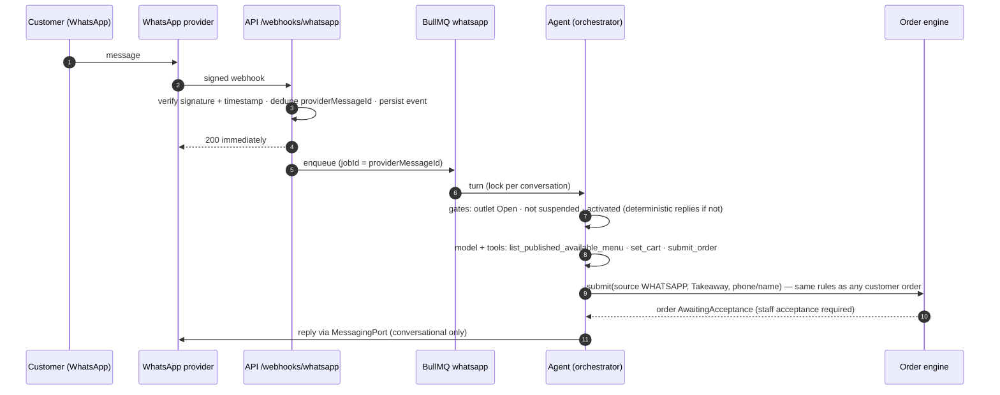

| Rule | Mechanism |
|---|---|
| Unified engine (AI-030/031/033) | The agent's `submit_order` tool calls the **same** `orderService.submit` as every channel: Takeaway, staff acceptance required, outlet gates, price/availability check |
| Only real items (AI-032) | `list_published_available_menu` returns **only** `resolveOutletMenu` output; items/prices in orders come from the server by `menuItemId`, never from model-typed names or prices |
| Conversation state | Redis `wa:conv:{org}:{outlet}:{phoneHash}` (TTL 24 h): cart + step; **not** operational truth |
| Closed/suspended | Deterministic reply (ORG-030, ONB-014); no model needed |
| **AI unavailable** (AMB-15, **PB-16**) | The product requires continuation and a deterministic fallback (AI-040/041) but defines **no non-AI WhatsApp path**. The TRD therefore guarantees only: inbound messages are persisted, **no partial order is ever created**, `integration.failure` is surfaced to staff/Owner (INTEG-002), and the webhook is acknowledged. A deterministic menu-driven fallback conversation is **not designed** until PB-16 is decided |
| Tracking/status messages | **Not built** (DF-15, PO-AF-01): no outbound acceptance/rejection/status or order-link message is sent over WhatsApp |
| Idempotency | Provider message id is the dedupe key at webhook and job levels (§19.2) |
| PII | Phone hashed in keys, masked in logs; name stored only when provided |

### 31.9 Attention Engine (AF-062, ATTENTION-001…008, DF-02)

Flow (ATTENTION-002): **detect → validate evidence → create item → review → dismiss/resolve** (§15.7). Detection is **deterministic, rule-based, and needs no AI** (so it works with AI down, AI-003); evidence is attached as metric references; wording is **template-generated, factual, and never accusatory or causal** (ATTENTION-004). It is an **insight only**: no KDS delayed-order alerts and no automated customer outreach (ATTENTION-005, C-04/C-05).

`TD-ATT-1` — Detector framework with **configurable engineering-default thresholds** (DF-02 delegated; **not product commitments**, calibrated later — `OTD-6`):

| Signal (ATTENTION-003) | Evaluated | Rule shape | Config keys (default) |
|---|---|---|---|
| Sales below baseline | after Day Close | day finalized sales < baseline × (1 − θ) | `ATTN_BASELINE_DAYS`=14, `ATTN_MIN_SAMPLES`=5, `ATTN_DEVIATION_PCT`=30 |
| Cash variance | at Day Close | \|variance\| > threshold (variance never blocks close — CASH-006) | `ATTN_CASH_VARIANCE_PAISE` |
| Unusual discount usage | after close | discount share/count above trailing baseline | as above |
| Unusual cancellation/void activity | after close | cancellation/void count/share above baseline | as above |
| Kitchen preparation slowdown | sweep (5 min) | median Confirmed→Ready of recent items > baseline × (1 + θ) over a window | `ATTN_KITCHEN_WINDOW_MIN`=60 |
| Customer reorder gap | after close | reorder interval of known customers above baseline | as above |
| Outlet underperformance | after close | outlet vs organization peers' baseline (Owner scope) | as above |
| *Stale cancellation request* | sweep | request Open > `CANCEL_REQUEST_STALE_MIN` (ORD-093) | §23.6 |

Idempotency: one item per `(outletId, signalType, dayId|window)`; items follow outlet authorization (ATTENTION-008). Auto-resolution and the semantics of Dismissed vs Resolved are **PB-9**.

### 31.10 Guardrail map (AI-020…045)

| Requirement | Mechanism |
|---|---|
| AI-020 authorized data | Tool scope = Owner's `ScopeContext` (A3) |
| AI-021 facts vs recommendations | Separate fields; facts server-rendered |
| AI-022 no invented ground truth | Numeric grounding guard; "unavailable" outputs |
| AI-023/024 RBAC / no DB access | Registry + `authorize()`; no direct DB |
| AI-025/029 permitted actions / confirmation | Read-only default; proposals; PB-18 |
| AI-040/041 degrade | F5 isolation; deterministic fallbacks |
| AI-042/043 audited, separation | Audit with `via:'ai'`; module isolation |
| AI-045 source prevails | Server-rendered facts |

---

## 32. Audit Architecture

**Traces:** SPEC AUDIT-001…008, AUTH-007, RBAC-010, STAFF-011, MENU-013, BILL-013, PAY-007, KDS-014, DAY-014, AI-015, AI-042/AUDIT-004, ONB-009 · PRD §53 · AF §26 · INV-04, INV-12 · AMB-21 · CON-01.

### 32.1 Two different records (do not conflate)

| Record | Purpose | Viewable by | Mutability |
|---|---|---|---|
| **Audit trail** | Who/what/when/outlet/before/after/reason for **sensitive actions** (AUDIT-001/002) | **SuperAdmin only** (AUDIT-007, ACT-ANL-05) — Owners and Managers cannot self-investigate (CON-01) | **Append-only** (AUDIT-005) |
| **Entity transition history** | Operational record of an entity's own transitions (`history[]` on orders/items/bills/sessions, cancellation records, print events) — needed for correct operation and INV-04 | Surfaced to authorized roles inside the normal flows (e.g., bill correction history, order timeline) | Append-only |

Entity history is **not** the audit trail and is never exposed through the audit endpoints; cancellation reasons reach Owners through analytics, not the audit trail (CON-01).

### 32.2 Audit event (conceptual structure — not a schema)

| Field | Meaning |
|---|---|
| `eventId`, `occurredAt` | Unique id; **server** time |
| `organizationId`, `outletId?` | Scope (`outletId` null for platform/organization-level actions) — **who/where** |
| `actor` | `{ type: USER|SUPERADMIN|SYSTEM|AI, id, role, via? , proposalId? }` — **who** |
| `action` | Stable code from the catalogue (§32.3) — **what** |
| `target` | `{ type, id }` of the affected object |
| `before`, `after` | **Changed fields only**, redacted (§32.4) |
| `reason` | `{ code?, text? }` where the action requires it (INV-16) |
| `source` | `{ channel (web/ai/system), deviceType?, ipHash? }` |
| `requestId`, `idempotencyKey?` | Correlation |
| `businessDayId?` | Day context |
| *(seal)* | Not stored on the event: tamper-evidence lives in a **separate append-only seal record** per event (§32.5), so audit events are never updated |

### 32.3 Audited actions catalogue

Exactly AUDIT-002, plus actor-class additions that the product states elsewhere:

| Area | Action codes (stable) | Source |
|---|---|---|
| Credentials / security | `AUTH.CREDENTIAL_RESET`, `AUTH.USER_DEACTIVATED`, `AUTH.INVITATION_REISSUED`, `AUTH.SA_LOGIN_FAILED_LOCKOUT`* | AUTH-007 |
| Permissions | `RBAC.OVERRIDE_CHANGED` | RBAC-010 |
| Staff | `STAFF.OUTLET_REASSIGNED` | STAFF-011 |
| Menu | `MENU.PRICE_CHANGED`, `MENU.AVAILABILITY_CHANGED`, `MENU.IMPORT_APPROVED` | MENU-013, AI-015 |
| Discounts | `BILL.DISCOUNT_APPLIED` | BILL-013 |
| Order | `ORDER.CANCELLED`, `ORDER.VOIDED`, `ORDER.HELD`, `ITEM.CANCELLED`, `ITEM.VOIDED`, `ITEM.HELD`, `ITEM.REFIRED`, `KITCHEN.CANCELLED` | AUDIT-002, KDS-014 |
| Bill/payment | `BILL.REOPENED`, `BILL.CANCELLED`, `REFUND.RECORDED`, `PAYMENT.CORRECTED` | BILL-013, PAY-007 |
| Day | `DAY.CLOSED`, `DAY.REOPENED`, `DAY.RECLOSED` | DAY-014, AUDIT-008 |
| Platform | `PLATFORM.RESTAURANT_SUSPENDED`, `PLATFORM.RESTAURANT_DEACTIVATED` | AUDIT-002 |
| AI | `AI.ACTION_EXECUTED` (wraps the underlying action, with `proposalId`) | AUDIT-004, AI-042 |

\* *TN-3*: SuperAdmin lockout is security telemetry required for platform integrity; it is recorded because SuperAdmin credential/security actions are audited (C-SA-AUTH, AUTH-007).

`TD-AUD-1` — The set of audited actions is a **code-resident registry**: each service method that performs a registered action declares `audit: 'ACTION.CODE'`; a CI test asserts that **every registered action produces an event with before/after** (PC-004) and that every state-changing method either declares an action or is explicitly `audit: 'none'` (AUDIT-003: a sensitive action without its event is a defect). Whether further actions (outlet Open/Closed, payment-correction reasons, bill cancellation reasons, other non-listed actions) are audited is **AMB-21 / PB-19**: the registry is open to additions by configuration; nothing is invented.

### 32.4 Redaction (what is never in `before`/`after`)

Never stored: password hashes or plaintext, tokens, refresh/invitation/order-link secrets, API keys, full card data, full payment references (last-4 only), webhook secrets, model prompts. PII (customer phone/name) is excluded unless the action is customer-specific, and then phone is masked. Each action code has an explicit **field allow-list** for `before`/`after`; fields not on the list cannot enter the audit record.

### 32.5 Immutability and integrity

| Layer | Mechanism |
|---|---|
| Application | `auditService` exposes **`append` only**; the model defines no update/delete helpers; Mongoose hooks on `update*`, `delete*`, `findOneAndUpdate/Delete`, `replaceOne` **throw** (F9) |
| Database | The application's Atlas database user has a **custom role with `insert` and `find` only** on the audit collection (no `update`, `remove`, `dropCollection`) — no credential, including the sealer's, can modify an audit event (`TD-AUD-2`) |
| Tamper evidence | The `maintenance:audit-seal` job (§18.4) walks unsealed events **per scope chain** `(organizationId, outletId|'platform')` in `_id` order and **inserts a seal record** `{scope, seq, eventId, prevHash, hash = SHA-256(prevHash ‖ canonical(event))}` into a **separate append-only seal collection**; a verify routine detects gaps or alterations and raises a Sentry alert. *Rationale:* inline chaining would create a write hot-spot on every audited transaction; sealing asynchronously keeps the business write path fast while still making silent edits detectable. This is **tamper-evidence, not a compliance claim** |
| Atomic with the action | `auditService.append(session, event)` is called **inside the same Mongo transaction** as the mutation (P11): if the audit insert fails, the business action rolls back — no sensitive action without its event |

### 32.6 Access

SuperAdmin-only endpoints `GET /platform/audit-events` (cursor-paginated; filters: organization, outlet, actor, action, target, date range). No Owner/Manager access path exists (ACT-ANL-05); route-level `scope:'platform'` plus a negative test enforce it.

### 32.7 Retention

Indefinite in Phase 1 (append-only, SuperAdmin-only, low volume). Archival/cold storage is `OTD-9`.

---

## 33. External Integrations

**Traces:** SPEC INTEG-001…003, PAY-008, ONB-006/013, AI-030…033, DF-06, DF-15 · PRD §56 · AF-001, AF-026, AF-057…063 · F6.

### 33.1 Common rules

| Rule | Detail |
|---|---|
| Ports and adapters | Domain code depends on **ports** (`MessagingPort`, `WhatsAppGatewayPort`, `ObjectStoragePort`, `AiProviderPort`, `PaymentProviderPort`); only adapters import provider SDKs (F6). Domain logic never branches on a provider |
| Timeouts | Every outbound call has an explicit timeout (engineering defaults: email/WhatsApp 5 s, S3 10 s, AI 30 s) and a bounded retry policy inside jobs (§18.5) |
| Circuit breaking | Failure counters in Redis open a breaker per integration; open → fast `503 INTEGRATION_UNAVAILABLE` / deferred job; half-open after cool-down |
| Secrets | AWS Secrets Manager → ECS task secrets (env vars); never in code, logs or the repository |
| Egress | Private subnets with NAT; security groups restrict outbound to required endpoints |
| Observability | Per-integration latency/error metrics, Sentry tags, `requestId` propagation (§36) |
| Failure visibility | Staff-visible failures surface via `integration.failure` events + persisted status (PRD-INTEG-002.2/003) |

### 33.2 Integration register

| Integration | Responsibility | Boundary / port | Auth | Retries & timeouts | Idempotency | Webhook security | Failure behaviour | Fallback |
|---|---|---|---|---|---|---|---|---|
| **MSG91 — email** | Onboarding invitation email (ONB-006); resend (ONB-013) | `MessagingPort.sendEmail` | MSG91 auth key (secret) | Job: 5 attempts, exp. backoff; 5 s timeout | `jobId = invite:{inviteId}`; provider message id stored | Delivery callbacks optional; if used, signature-verified | Job fails → invitation `Failed`; **account stays provisioned and recoverable**; surfaced (INTEG-003); resend path (ONB-013.AC1) | SuperAdmin can reissue; direct credential set (§12.5) |
| **WhatsApp (via provider; MSG91 as the adapter candidate)** | Inbound customer messages and **conversational** replies for the ordering agent (AI-030); **no** status/tracking messages (DF-15) | `WhatsAppGatewayPort.{verifyInbound, send}` | Provider API key | Replies: 5 attempts; 5 s timeout | Inbound `providerMessageId` unique | **HMAC signature over raw body**, constant-time compare, timestamp tolerance ± 5 min, replay rejection by message id, per-provider secret with **two active secrets** for rotation | Order data never corrupted (INTEG-002); failure surfaced to staff/Owner; no partial order | None designed (PB-16) |
| **AWS S3** | Private uploads, imports, restaurant assets | `ObjectStoragePort` | IAM **task role** (least privilege per prefix) | SDK retries (3), 10 s | Object key includes UUID; completion call idempotent | n/a | Upload/complete fails → user retries; no orphan DB rows (completion record created only after HEAD succeeds) | — |
| **CloudFront** | Serve public assets (logos, item images) | Config only | OAC to the public bucket | — | — | — | Origin failure → CDN serves stale/err; menu text unaffected | Placeholder |
| **AWS services** | ECS, ALB, ECR, Secrets Manager, CloudWatch, ElastiCache | Infra | IAM | — | — | — | See §40 | — |
| **AI providers** | Menu import, Owner Agent, Brief, What Changed?, WhatsApp agent | `AiProviderPort` | API key (server-side only) | 1 retry on idempotent calls; 30 s timeout; circuit breaker | Job ids (§18.4); no mutation without proposal | n/a | `503 AI_UNAVAILABLE`; core continues (INTEG-001) | Deterministic facts / "unavailable" |
| **Razorpay** | **Boundary only** (§26.7) | `PaymentProviderPort` | n/a in Phase 1 | n/a | n/a | n/a (no route registered) | n/a | Manual payment recording |
| **Sentry** | Error tracking | SDK | DSN | Async, non-blocking | — | — | Drop silently | stdout logs still go to CloudWatch |
| **CloudWatch** | Logs, metrics, alarms | awslogs driver / EMF | IAM | — | — | — | — | — |

### 33.3 Provider selection

The product names no AI or WhatsApp provider; the stack names MSG91 for messaging. Adapter selection beyond that is `OTD-5` (AI provider/model) and `OTD-7` (WhatsApp transport details). Both are **configuration + one adapter** behind ports.

### 33.4 Webhook handling (generic)

Routes under `/api/v1/webhooks/*` use `express.raw` (a `verify` hook retains the raw body only for those paths — the global JSON parser otherwise discards it), verify the signature **before** parsing, respond `200` quickly after persisting the event, and do all work asynchronously. Unsigned or stale requests get `401` and are rate-limited; no webhook can authenticate as a user.

---

## 34. File Storage

**Traces:** SPEC ONB-020 (logo), MENU-002 (item images), AI-010, SEC-006 · PRD §11, §18, §57 · AF-057.

### 34.1 Buckets and distribution

| Bucket | Content | Access |
|---|---|---|
| `servena-{env}-private` | AI-import sources, validated import artifacts, anything non-public | **Block Public Access ON**; reachable only via the ECS task role and short-lived **presigned** URLs |
| `servena-{env}-public` | Restaurant assets: logos, menu-item images | Not public; served **only through CloudFront (Origin Access Control)** |
| CloudFront | Public assets | Long-TTL caching on **content-hashed** object names (immutable); no invalidation needed; HTTPS only |

No customer-facing upload exists: the public surface cannot upload files (smaller attack surface). Generated/exported documents are **not required in Phase 1** (no export or PDF requirement) and are not designed.

### 34.2 Object naming and tenant isolation

```
org/{organizationId}/outlet/{outletId | _}/{purpose}/{yyyy}/{mm}/{uuid}.{ext}
   purpose ∈ { incoming, logo, item-image, import-source, import-artifact }
```

Keys contain **only server-generated ids and UUIDs** — never user-supplied file names. A metadata record binds each object to `organizationId`/`outletId`/uploader; presign and read endpoints load that record under the **tenancy guard**, so a key from another tenant can never be signed.

### 34.3 Upload flow

```mermaid
sequenceDiagram
  autonumber
  participant C as Client
  participant API as API
  participant S3 as S3 (incoming/)
  participant W as Worker
  C->>API: POST /uploads/presign {purpose, mime, size}
  API->>API: authorize by purpose (logo: ACT-CFG-01 · item image: ACT-MNU-01 · import: ACT-AI-01) · allow-list MIME · size cap
  API-->>C: presigned POST (conditions: content-length-range, Content-Type, exact key, 5 min)
  C->>S3: upload
  C->>API: POST /uploads/{id}/complete
  API->>S3: HEAD (size, type)  → record created
  API->>W: validate-upload
  W->>S3: read prefix bytes → magic-byte sniff (file-type) vs declared MIME
  W->>S3: copy to final prefix (public/ or private/import-source) · delete incoming
  W-->>API: status READY | REJECTED
```

| Control | Value (engineering defaults) |
|---|---|
| Allowed MIME | Images: `image/jpeg`, `image/png`, `image/webp`; imports: `application/pdf`, `image/jpeg|png|webp`, `text/csv`, `application/vnd.openxmlformats-officedocument.spreadsheetml.sheet` (the boilerplate's `gif` is dropped — not needed) |
| Size | Images ≤ 5 MB (boilerplate default); import sources ≤ 10 MB (`OTD-8`); PDF ≤ 30 pages; sheets ≤ 5 000 rows |
| Validation | Declared MIME **and** magic bytes **and** extension must agree; mismatch → `REJECTED`, object deleted |
| Images | Optional re-encode to strip metadata (`OTD-8`); SVG is **not** accepted (XSS) |
| Malware/security boundary | Files are **never executed**; parsers are non-executing and run only in the isolated worker with limits; optional S3 malware scanning (GuardDuty Malware Protection for S3) is `OTD-8` |
| Encryption | SSE-S3 (or KMS) at rest; TLS in transit |
| Lifecycle | `incoming/` expires after 1 day; import sources/artifacts retained 90 days then deleted (engineering default; they are not business records) |
| Downloads | Private objects only via **presigned GET** (TTL 5 min) issued after an authorize check; never listing |
| CORS | Bucket CORS allows only the configured web origins for presigned POST |

Small images (logo, item image) may alternatively use the existing multer path (5 MB, memory) before being written through `ObjectStoragePort` — the same validation applies; presigned POST is the default for anything large.

---

## 35. Security Architecture

**Traces:** SPEC SEC-001…006, DF-09, AUTH-002/005/006, RBAC-007/008, AUDIT-005, AI-023/024, PAY-006/011 · PRD §63 · AF INV-02, INV-03, INV-05, INV-12 · EF-01.

This section is a **concrete control set**, not a compliance claim. No certification (PCI, SOC 2, ISO, etc.) is claimed because none is required by the canonical documents.

### 35.1 Assets and principal threats

| Asset | Threat | Primary controls |
|---|---|---|
| Tenant data | Cross-tenant / cross-outlet read or write | §11 (scoping, tenancy guard, 404/403 semantics), cache/room/job/object scoping, generated isolation tests |
| Credentials | Brute force, stuffing, theft, replay | §12.8, bcrypt, lockout, rotation + reuse detection, short access token, httpOnly cookie |
| Financial integrity | Duplicate/forged payments, refunds, Day Close; tampering | Idempotency, transactions, append-only ledgers, audit atomicity, hash sealing, integer paise |
| Customer orders | Enumeration, spam, link leakage | 256-bit tokens, hashed storage, throttles, redaction, no list endpoints |
| AI surface | Prompt injection, over-privileged tools | §31 (registry, scope = Owner, proposals, no DB access) |
| Platform | DoS, webhook forgery, supply chain | Rate limits, limits/timeouts, signature verification, dependency controls |

### 35.2 Authentication and sessions

See §12. Summary controls: passwords hashed with bcrypt (cost 12, ≤ 72 bytes); access JWT 15 min with **no authority in claims**; rotating refresh tokens with reuse detection; session revocation is immediate (§12.7); inactive users refused without existence leak; SuperAdmin on a separate key and stricter limits; no 2FA/OTP (NG-012) so none is implemented.

### 35.3 Input validation, injection, output handling

| Concern | Control |
|---|---|
| Validation | **Joi on every route**; unknown keys stripped/rejected (C6); numeric ranges, string lengths, enums, `objectId`, E.164, ISO dates; money must be integer paise |
| **NoSQL injection** | `express-mongo-sanitize` (existing) **plus** schema validation that rejects objects where scalars are expected (a `{ "$gt": "" }` value fails Joi); queries are built from **typed parameters only**, never from raw request objects; `$where`/`$function`/JS execution disabled; regexes from users forbidden (or escaped and length-capped) |
| HTTP parameter pollution | `hpp` (existing) |
| Mass assignment | Joi strips unknown fields; services copy **explicit allow-lists** into updates (never `Model.create(req.body)`) |
| XSS | The API returns JSON only; free text (notes, comments, item names) is stored raw and **escaped on output by React**; no `dangerouslySetInnerHTML` on user text (frontend lint rule); frontend CSP (§35.8); feedback and notes length-capped |
| SQL/command injection | No shell calls; no dynamic `eval`/`Function`; file parsers are libraries with limits |
| Open redirect | Return-to paths are same-origin relative only (§12.6) |
| SSRF | No server-side fetch of user-supplied URLs (AI import accepts uploaded files, not URLs) |
| Output | Customer DTOs are explicit projections (never `lean()` documents passed through); error responses never include stack traces or Mongo error text (existing generic 500 handler retained) |

### 35.4 CSRF and CORS

| Surface | Position |
|---|---|
| API calls | Authenticated by the `Authorization` **header** (not a cookie) ⇒ not CSRF-prone |
| Refresh endpoint | Cookie-authenticated ⇒ protected by `SameSite=Strict`, `Path=/api/v1/auth`, a **required custom header** (`X-Requested-With`), and an `Origin` allow-list check (§12.2, `TD-AUTH-5`) |
| CORS | Exact-origin allow-list from `ALLOWED_ORIGINS` (production start-up already refuses to run without it); `credentials: true` only for the web origin; no wildcard in production |
| Public endpoints | Same CORS policy; they use no cookies |

### 35.5 Authorization and isolation

§11 and §13. Additional: **default-deny** route registration (§13.9 start-up assertion); generated cross-tenant/cross-outlet tests (§39.5); AI tools inherit the Owner scope; customer link scope is one order.

### 35.6 Rate limiting and abuse protection (resolves DF-09)

`TD-SEC-1` — Redis-backed `express-rate-limit` (C18) with per-route buckets. **Engineering defaults** (configurable; not product commitments):

| Bucket | Key | Limit |
|---|---|---|
| Login (restaurant) | IP; identifier hash (lockout) | 10 / 15 min / IP; progressive lockout after 5 failures |
| Login (SuperAdmin) | IP; identifier | 5 / 15 min; lockout 30 min |
| Refresh | session | 30 / hour |
| Authenticated API (general) | userId | 300 / min |
| Public QR resolve, menu | IP | 120 / min |
| Draft upsert | IP; `draftKey` | 60 / min; 20 / min |
| **Order submit (public)** | IP; `qrKey`/website key; **phone per outlet** | 10 / min; 5 / min; **max 3 pending customer orders per phone per outlet** |
| Order-link read | IP | 60 / min; invalid-token lookups 20 / min |
| Reorder / feedback | token | 10 / min; 5 / min |
| AI | userId | 20 / min + daily token budget |
| Webhooks | source | signature-gated; 600 / min coarse cap |
| Uploads presign | userId | 20 / min |

Rate-limit responses are `429` with `Retry-After`. If Redis is unavailable, a conservative per-process fallback applies (§18.3). Beyond limits: request body ≤ 1 MB (existing; per-route overrides only for uploads), JSON nesting depth cap, `server.requestTimeout` 30 s, `headersTimeout` 35 s, ALB idle timeout aligned.

### 35.7 Secrets and encryption

| Item | Control |
|---|---|
| Secrets | AWS Secrets Manager → ECS task secrets; production start-up validation (existing) extended to every required secret (`JWT_SECRET`, `ADMIN_JWT_SIGN_KEY`, `API_AUTH_KEY`, DB/Redis credentials, provider keys, webhook secrets); no defaults accepted in production (the boilerplate's `changeme…`/`secret-key` fallbacks cause a **fatal exit** in production) |
| In transit | TLS 1.2+ at ALB/CloudFront; `rediss://` to ElastiCache; TLS to Atlas |
| At rest | Atlas encryption at rest; ElastiCache at-rest encryption; S3 SSE; EBS/ephemeral storage encrypted |
| Key rotation | Two active JWT signing keys supported (`kid`) for rotation; webhook secrets dual-active |
| Field-level | Not required; refresh/invitation/link tokens and refresh families are **stored only as hashes** |

### 35.8 Secure headers

`helmet` (existing) on the API. Because the SPA is on Vercel, a **CSP** is configured there: `default-src 'self'`; `connect-src` the API origin + WebSocket origin; `img-src` the CloudFront asset origin; no inline script. HSTS and `Strict-Transport-Security` at ALB/CloudFront/Vercel; `X-Content-Type-Options: nosniff`; `Referrer-Policy: no-referrer` on order-link pages; `Cache-Control: no-store` on all authenticated and order-link responses.

### 35.9 PII, payment data, logging

| Item | Rule |
|---|---|
| PII | Customer name/phone, staff email/phone: minimal collection (ORD-021 means table-QR collects none); masked in logs; never in Sentry payloads; never in realtime events to non-privileged rooms |
| Payment data | **No card data is ever accepted or stored** (card mode is a label, §26.5); references masked in logs; no money movement (PAY-008) |
| Logging | Pino redaction paths (§36.2) plus the **NEVER-LOG** list |

### 35.10 Dependency, build and runtime security

| Control | Mechanism |
|---|---|
| Supply chain | `npm ci` with a committed lockfile; GitHub Actions `npm audit --omit=dev` (fail on high/critical), Dependabot, `--ignore-scripts` for installs except an allow-list; pinned base image digests |
| Image | Multi-stage Docker build; non-root user; read-only root filesystem where possible; `trivy`/ECR image scanning in CI |
| Runtime | Least-privilege task roles per ECS service (api: S3 prefixes, Secrets read; worker: + S3 imports; socket: none beyond Redis) |
| Config | Production refuses default secrets (existing check, extended) |
| Static analysis | ESLint security plugin; `dependency-cruiser` boundaries (§10.4) |

### 35.11 Webhooks, uploads, AI, audit

Webhooks: §33.4. Uploads: §34 (allow-lists, magic bytes, signed URLs, no SVG, non-executing parsers). AI: §31 (registry-only capability, scope inheritance, proposals, untrusted-data labelling, no DB access). Audit integrity: §32.5 (insert/find-only DB role, hash sealing).

### 35.12 Control-to-requirement map

| Requirement | Controls |
|---|---|
| SEC-001 tenant isolation | §11 incl. tenancy guard |
| SEC-002 cross-outlet denial | S2/S3/S6, 403 `factor:'outlet'` |
| SEC-003 duplicate financial operations | §19, §38 |
| SEC-004 inactive users | §12.1, §12.7 |
| SEC-005 unauthorized AI actions | §31 (A2/A3/A5) |
| SEC-006 / DF-09 baseline | §35.3 validation, §35.6 rate limits, §26.5 payment-reference handling |

---

## 36. Observability

**Traces:** SPEC KDS-016, DAY-010, AUDIT-*, INTEG-* · PRD §53, §55–§56 · boilerplate C14, C21, C22.

### 36.1 Logging — structured Pino

| Topic | Decision |
|---|---|
| Library | `pino` + `pino-http` (replaces `winston` and the per-request `console.log`s); the existing `utils.log` / `utils.logger` **facade is kept** so call sites read the same (C14) |
| Output | **JSON to stdout** only (no log files in containers — remove `data/logs/error.log` usage); ECS `awslogs` driver ships to CloudWatch |
| Levels | `fatal/error/warn/info/debug`; production `info`; request logs at `info` for ≥ 400 and sampled (engineering default 10 %) for 2xx **except** mutating routes (always logged) |
| Standard fields | `time`, `level`, `service` (role), `env`, `version` (git sha), `requestId`, `organizationId`, `outletId`, `userId` (id only), `route`, `method`, `status`, `durationMs`, `idempotencyKey` (hash), `jobId`, `queue`, `eventId` |
| Redaction (Pino `redact`) | `req.headers.authorization`, `req.headers.cookie`, `res.headers['set-cookie']`, `*.password`, `*.token`, `*.refreshToken`, `*.apiKey`, `*.secret`, `*.phone` (masked), `*.reference`, `req.body.customer`, `*.orderLinkToken` (path redaction for `/o/*`, `/public/orders/*`) |

### 36.2 NEVER log

Passwords or hashes; access/refresh/invitation/order-link tokens; `Authorization`/cookie values; API keys and secrets (DB URL credentials — already protected by logging only host/port/name); full phone numbers or customer names; full payment references; card data (never held); AI prompts and model outputs by default (`TD-AI-4`); webhook bodies in clear; full request bodies of auth, payment, refund, customer-details routes; audit `before/after` values (they live in the audit store only); stack traces to clients.

### 36.3 Request and correlation IDs

`x-request-id` (existing C21) is accepted from a **trusted proxy chain or generated** (UUID v4), echoed in the response, stored in every log line, passed in job payloads (`requestId`), event envelopes, Sentry tags, and audit events. A BullMQ job started by a request carries the originating `requestId` and its own `jobId`; Socket.IO events carry `requestId`; the client may display it for support.

### 36.4 Sentry

| Topic | Decision |
|---|---|
| Init | All three roles; `release` = git sha; `environment` |
| Capture | Unexpected errors (5xx, unhandled rejections, job failures, tenancy-guard violations, audit sealing mismatches). **Business refusals (4xx) are not captured** |
| Context | `requestId`, `organizationId`, `outletId`, `userId`, role — **ids only** |
| Scrubbing | `beforeSend` applies the §36.1 redaction and drops request bodies for sensitive routes |
| Tracing | Low sample rate (`tracesSampleRate` 0.05) — `OTD-11` covers OpenTelemetry; not required |

### 36.5 CloudWatch

| Item | Decision |
|---|---|
| Logs | One log group per role per environment; retention 30 days (prod) / 7 days (non-prod) — engineering defaults |
| Metrics | **Embedded Metric Format** JSON from the app for custom metrics (no sidecar) plus native ECS/ALB/ElastiCache metrics; Atlas metrics via Atlas alerts/integration |
| Alarms | See §36.7 |

### 36.6 Metrics catalogue

| Category | Metrics |
|---|---|
| HTTP | request rate, latency histogram, error rate by route and status class, 401/403 by `factor`, 409 by `code` |
| Concurrency/idempotency | `rev_mismatch_total`, `already_in_state_total`, `idempotent_replay_total`, `txn_retry_total`, `txn_failed_total` |
| Isolation | `tenant_scope_violation_total` (must stay 0) |
| Auth | `auth_failure_total{reason}`, lockouts, refresh reuse detections |
| Database | op latency p95, pool in-use/wait, replica lag (Atlas), slow queries |
| Redis | command latency, errors, memory %, evictions (must be 0), keyspace |
| BullMQ | depth, oldest-job age, active, failed, retries, duration p95 — per queue |
| Socket.IO | connections by namespace, emit rate, emit errors, reconnect rate, adapter latency |
| Business-critical **operational** (no new analytics): | `order_submitted_total`, submit→accept latency, accept→KOT latency, KOT→first-Preparing latency, Day Close duration and failures, payments recorded/duplicates blocked, refunds recorded, integration failures by provider, AI call latency/failure/fallback counts |

### 36.7 Alarms (initial set)

5xx rate; API p95 latency; any `tenant_scope_violation_total > 0`; Redis memory > 85 % or evictions > 0; BullMQ oldest-job age and DLQ growth; Socket connection saturation; Mongo pool wait; ECS task restarts; ALB unhealthy targets; Day Close failure; audit seal mismatch; webhook signature failures spike; AI failure ratio; certificate/secret expiry.

### 36.8 Health checks

| Role | Liveness | Readiness |
|---|---|---|
| `api` | `GET /api/v1/health` (existing route, `authFree`) → `{ timestamp }` | `GET /api/v1/health/ready` → MongoDB `ping` (hard), Redis `PING` (**soft/degraded** — `TD-REDIS-2`), `version` |
| `socket` | `GET /health` on the socket port | + Redis adapter ping (hard for this role) |
| `worker` | Tiny HTTP server (`/health`, port 3001): queue connection alive | + schedulers registered |

The ALB target-group health check uses `/api/v1/health/ready` for `api` and `/health` for `socket`; ECS container health checks use liveness. Readiness never returns provider secrets or topology.

### 36.9 Audit logs vs application logs

Application logs are operational and may be sampled/rotated; the **audit trail** is a business record (§32) stored in MongoDB, not in logs. Platform (SuperAdmin) access to tenant data is access-logged (`TD-TENANT-3`) separately from the audit trail.

---

## 37. Performance & Scalability

**Traces:** SPEC KDS-016, DF-01 (quantitative targets deferred), OFFLINE-* · PRD §4 (qualitative goals) · APP_FLOW §4.2.

> **Labelling.** SPEC DF-01 keeps quantitative success metrics **deferred**; the product commits to **no SLA**. Every number below is an **engineering target** used to size and test the system. It is **not** a product requirement or a customer commitment.

### 37.1 Engineering targets (nominal load for one region)

| Area | Target |
|---|---|
| REST read (cached/indexed) | p95 ≤ 300 ms server-side |
| REST write (single transaction) | p95 ≤ 500 ms server-side |
| Public menu / QR resolve | p95 ≤ 200 ms (cache hit) |
| Event delivery (commit → staff client) | p95 ≤ 1 s |
| Day Close transaction | ≤ 5 s for a typical outlet-day |
| KDS queue fetch (≤ 200 active items) | p95 ≤ 300 ms |
| Availability posture | Multi-AZ; rolling deploys without full outage (§40) |

### 37.2 Capacity assumptions (to be validated by load tests)

Per outlet: ≤ ~5 orders/min peak, ≤ ~50 concurrent staff/KDS sockets, ≤ ~100 active order items. System: hundreds of organizations, low thousands of outlets — scale-out by adding `api`, `socket`, and `worker` tasks. These are planning assumptions, not product statements.

### 37.3 Index strategy (conceptual — the schema document owns definitions)

All compound indexes **lead with `organizationId`, then `outletId`** (§11.4).

| Access pattern | Index intent |
|---|---|
| Active orders per outlet / KDS queue | `(org, outlet, stage, priority, createdAt)`; items `(org, outlet, state, createdAt)` |
| Orders by table/session | `(org, outlet, tableId|sessionId, stage)` |
| Order by idempotency | **unique** `(org, outlet, operation, idempotencyKey)` |
| One active session per table | **partial unique** `(org, outlet, tableId)` where `status=Active` |
| One bill per order | **unique** `(org, orderId)` |
| Unresolved bills | `(org, outlet, status, paymentStatus)` |
| Payments/refunds by bill | `(org, billId, recordedAt)`; **unique** `(billId, idempotencyKey)`, `(billId, reference)` partial |
| Active day per outlet | **partial unique** `(org, outlet)` where `status ∈ {Running, Reopened}` |
| Customers by phone | **unique** `(org, phoneNormalized)` |
| Order-link lookup | **unique** `(tokenHash)`, **TTL**/expiry field |
| Sessions | **unique** `(refreshHash)`, `(userId)`, **TTL** on absolute expiry |
| Audit | `(org, outlet, occurredAt)`, `(action, occurredAt)`; seal `(scope, seq)` unique |
| Analytics reads | `(org, outlet, businessDayId, …)` aligned to rollups |
| KOT idempotency | **unique** `(org, outlet, sourceKey)` |

`autoIndex` is **disabled in production**; indexes are created by a deploy-time `syncIndexes` task (§40.6) — essential for partial unique indexes.

### 37.4 Query and data-access practices

`.lean()` reads and explicit projections (the boilerplate's `NORMAL_PROJECTION` idea); cursor pagination for large lists (`TD-API-1`); no unbounded `find`; no N+1 (batched `$in` loads; limited `$lookup`); the KDS and handoff read models are single indexed queries; aggregations begin with an indexed `$match`; `allowDiskUse` only for rollups in the worker.

### 37.5 Caching

| Layer | Strategy |
|---|---|
| Redis | Identity/permission snapshots (version-keyed), platform/outlet status (≤ 5 s), resolved public menu (versioned, ≤ 30 s), analytics rollups (≤ 60 s + invalidation on `day.closed`) |
| HTTP | `ETag` on read models; authenticated and link responses `no-store` |
| CloudFront | Public assets, immutable hashed names |
| Frontend | TanStack Query `staleTime` per entity (KDS short; menu longer); invalidated by realtime hints; hashed static assets on Vercel with long cache |

### 37.6 Connection pooling

Mongoose `maxPoolSize` is set per role (api 30, worker 15, socket 5 — engineering defaults, `OTD-10`) so **tasks × pool** stays within the Atlas connection limit with headroom; `serverSelectionTimeoutMS` 5 s, `socketTimeoutMS` 45 s, `maxIdleTimeMS` 60 s; connection string `retryWrites=true&w=majority`. The existing retry-with-backoff connect helper (`db_mongo.js`) is retained. node-redis/ioredis use bounded reconnect backoff.

### 37.7 Scaling

| Component | Scale trigger | Notes |
|---|---|---|
| `api` ECS service | Target tracking: CPU 55 % and ALB `RequestCountPerTarget`; min 2 tasks across 2 AZs | Stateless; graceful shutdown |
| `socket` ECS service | Custom metric: connections per task vs tested capacity (70 %); min 2 | Sticky ALB cookie; adapter via Redis |
| `worker` ECS service | Queue depth/oldest age step scaling; min 1 (2 in prod) | Concurrency per queue §18.4; AI queue deliberately small |
| ALB | Cross-zone, idle timeout ≥ 120 s for WebSockets | Separate target groups for `/api/*` and `/socket.io/*` |
| MongoDB Atlas | Tier by load; secondaries for analytics reads | `readPreference: secondaryPreferred`, `maxStalenessSeconds` 90 — **analytics only**; money, Day Close, orders, KDS read the **primary** |
| Redis | Vertical first; split cache/queue groups (`OTD-3`) | Memory alarms |
| CloudFront / Vercel | Managed | — |

### 37.8 Specific cases

| Case | Approach |
|---|---|
| **Large KDS queues** | Query capped (200 active items, grouped by order); client list virtualization; history is a separate cursor-paginated query |
| **Multi-outlet organizations** | Owner dashboards read `rollup-day` documents + bounded-concurrency per-outlet live queries for the running day; Managers only their assigned outlets; no cross-outlet scans without `$in: allowedOutletIds` |
| **Analytics queries** | Pre-aggregated rollups on close and invalidated incrementally; live running-day figures computed with indexed aggregation; secondary reads |
| **Day Close** | O(orders in day) aggregation inside one transaction; indexed by `businessDayId` |
| **Bursts at meal times** | Per-outlet low volume; the cost driver is concurrent sockets and chatty KDS refetches (hence patches + 30 s poll, not per-event full refetch) |

---

## 38. Concurrency & Consistency

**Traces:** SPEC TABLE-008, TABLE-014/015, ORD-006, KOT-007, PAY-006, DAY-009/010/015/021, SEC-003, DF-11 · PRD-SEC-003.1 · AF-064, EF-05, EF-09 · INV-05.

**MongoDB Atlas + Mongoose is authoritative.** Redis improves throughput; it never decides correctness.

### 38.1 Toolbox

| Tool | Use |
|---|---|
| **Atomic conditional update** | `findOneAndUpdate({_id, org, outlet, status: from, rev}, {$set, $inc:{rev:1}})` — the default for every state transition (M2) |
| **Optimistic concurrency (`rev`)** | Explicit integer on concurrency-sensitive aggregates (orders, items, bills, tables/sessions, menu entities, outlet, day, overrides). Chosen over Mongoose `__v` because the boilerplate sets `versionKey:false` (C10) and clients must see and send `rev` (TABLE-008) |
| **Transactions** | Multi-document invariants: `session.withTransaction`, `readConcern: snapshot`, `writeConcern: majority`; short (< 1 s), **no network I/O inside**; retried on `TransientTransactionError`/`UnknownTransactionCommitResult` (≤ 5 attempts, jitter) |
| **Unique & partial unique constraints** | Structural duplicate prevention (§37.3) — duplicate-key errors are *converted into idempotent results*, never surfaced as 500s |
| **Idempotency keys** | §19 |
| **Redis locks** | Contention reducers on multi-aggregate operations (table merge, Day Close); **never relied upon for correctness** (§18.2) |
| **Day fence** | `$inc txnCount` on the active day (§27.2) |

### 38.2 `rev` protocol

Reads return `rev`; edits send `expectedRev`; the conditional write includes it; a mismatch returns `409 REV_MISMATCH` with the current object so the client can show "the data changed" (PRD §65, TABLE-008). Additive, commutative operations (add-items, record-payment) do **not** require `rev` — they are made safe by transactions and uniqueness, so two cashiers or two waiters never silently overwrite one another.

### 38.3 Protection matrix

| Operation | Hazard | Protection | Loser experiences |
|---|---|---|---|
| **Table assignment / open** | Two staff open the same table | Partial unique "one Active session per table" + conditional state `Available→Occupied` | Returned the existing session (idempotent open) |
| **Table transfer** | Concurrent transfers/ordering during transfer | Ordered Redis locks + one transaction with conditional writes on both tables, session, order `rev` | `409 REV_MISMATCH`/`STATE_INVALID` with current state |
| **Table merge / split / move items** | Multi-aggregate races; deadlock | Ascending-id lock order; one transaction; `rev` on every involved aggregate; refused if any bill Finalized (TABLE-018). Target-order semantics: PB-13 | 409 |
| **Order modifications** | Two edits to one order; edit vs finalize | `rev` on order; add-items transactional with bill recompute and bill `rev` | `REV_MISMATCH`; second writer informed (TABLE-008) |
| **Duplicate submissions** | Retry, double tap, offline replay | `Idempotency-Key` + unique durable key | Original result (`Idempotent-Replay`) |
| **KOT creation** | Retry creates two KOTs | Created in the order transaction; unique `sourceKey` | Same KOT |
| **KDS transitions** | Two kitchen users | Conditional write on `{status, rev}` | `ALREADY_IN_STATE` (converges) |
| **Bill finalization** | Two finalizers; finalize vs add item | Conditional on bill `status`+`rev`; totals recomputed in-transaction | Existing result / `REV_MISMATCH` |
| **Payment recording** | Duplicate payment; concurrent payments | Unique `(bill, key)`, `(bill, reference)`; recompute in transaction; bill `rev` | Existing payment; or both kept when distinct keys |
| **Refund** | Duplicate; refunding more than paid | Unique key; in-transaction check Σ refunds ≤ Σ payments (`TN-2`) | Existing refund / `STATE_INVALID` |
| **Day Close** | Double submit; close during activity | Idempotent on key; conditional on active day `status`+`rev`; fence; Redis lock (reducer) | Existing closed record (EF-09); activity retried into the new day |
| **Day Reopen** | Reopen vs new transaction | `txnCount===0` conditional in the same write as `Absorbed` | Refused with state message, or the racing write lands in the reopened day |
| **Outlet Open/Closed** | Two toggles; toggle vs order | Conditional on outlet `rev`; gate reads in-transaction (`TD-OUT-2` tolerance) | Latest committed state shown |
| **Permission changes** | Change vs in-flight action | Override document `rev`; `authz:ver` increment **in the same transaction**; next request recomputes | In-flight transaction may finish (ms window); next action refused (C-REVOKE) |
| **Staff reassignment** | Reassign vs action at old outlet | Conditional on assignment `rev`; version increment; sockets leave rooms | Next action refused with `factor:'outlet'` (ORG-010.AC1) |
| **Menu publish / override** | Concurrent edits | `rev`; versioned publish | `REV_MISMATCH` |
| **AI proposal confirm** | Double confirm | Single-use conditional `Proposed→Confirmed` | Existing result |

### 38.4 Retry behaviour

| Layer | Rule |
|---|---|
| Server | Retries **only** transient transaction errors and write conflicts (bounded, jittered). Never retries business refusals |
| Client | Retries network/5xx/timeout with the **same** `Idempotency-Key` and backoff; never retries 4xx automatically (409/403/400 require user/state resolution) |
| Jobs | §18.5 |

### 38.5 Consistency boundaries

| Strongly consistent (primary, transactional) | Eventually consistent (bounded staleness) |
|---|---|
| All writes and transitions; money (bills, payments, refunds); Day Close/Reopen; idempotency (durable); audit append; authorization decisions (version-keyed) | Realtime events (hints; REST resync), analytics rollups (≤ 60 s + invalidation), public outlet/menu status caches (≤ 5 s / ≤ 30 s; writes re-check), Daily Brief generation, Attention detection (minutes) |

Server-authoritative rule: **no decision is made from an eventually consistent source**; every mutation re-validates against the primary inside its transaction.

---

## 39. Testing Strategy

**Traces:** SPEC SOT-011, SOT-013, PC-001…007 · PRD §67, §68 · APP_FLOW §27 (journeys), §28 (invariants). **No tests are written in this task**; this defines how they will be.

### 39.1 Tooling

| Layer | Tool | Notes |
|---|---|---|
| Unit, service, API/integration | **Jest** (ESM mode — `OTD-4`: `--experimental-vm-modules` with `jest.unstable_mockModule`, or a transform) + **Supertest** (against `expressStartup(app)` without listening — C23) | One runner for backend |
| End-to-end | **Playwright** | Against staging; deterministic seeded tenant |
| Database | `mongodb-memory-server` **replica set** (transactions need a replica set) | Real transaction semantics |
| Redis/BullMQ/Socket | **Real Redis** (CI service container) | BullMQ and the adapter cannot be faithfully mocked |
| External providers | **Fake adapters** behind the ports (§33) + **port contract tests** run against fake and (nightly, optional) sandbox | No provider call in the default suite |
| Non-functional | Load/soak tooling is `OTD-4b` (not in the mandated stack); the targets in §37 are verified there | |

### 39.2 Test categories (SOT-013's five, applied everywhere)

Every module's suite covers: **happy path · invalid transition · permission denial · duplicate/retry/idempotency · failure/offline/recovery**.

| Category | Technical scope |
|---|---|
| **Unit (pure)** | `computeBill` (property tests: determinism, integer paise, no float), `deriveOrderStage`, state-machine tables (**one test per allowed edge, one per forbidden-edge class**), `effectivePermissions`, `resolveOutletMenu`, `operationalGate`, grounding guard, token generation/hashing, reason catalogue validation |
| **Service tests** | Real Mongo replica set: transactions, tenancy guard (`TENANT_SCOPE_MISSING`), audit-atomicity (a failing audit insert rolls the action back), duplicate-key→idempotent conversion, day fence/attribution, `dayEffect` registry completeness |
| **API/integration** | Route-table assertions (every non-`authFree` route has `permission` or an explicit `scope`; strict Joi; envelope/error shape; `Idempotency-Key` required where flagged); rate limiting; pagination/filters whitelist |
| **Authorization** | **Generated from SPEC §9**: for each ACT row × each role (default profile) assert Y→allowed, N→`403 factor:'permission'` with **no state change** (PC-003, RBAC-012.AC1); outlet-factor, state-factor and approval-factor cases; Owner customization bounds (RBAC-005.AC1); revoked/deactivated user next-action refusal (C-REVOKE) |
| **Isolation matrix** | **Generated**: for every route with `scope ∉ {public}`, call with another tenant's and another outlet's ids → `404`/`403`, no data (§11.4; ORG-007.AC1, ORG-008.AC1) |
| **State transitions** | From the state-machine constants (§15.12): allowed edges succeed with side effects/events/history; forbidden edges `409` with no change (ORD-061.AC1, ORD-063.AC2) |
| **Concurrency** | Parallel requests (`Promise.all`) for: same key; table open; table transfer vs add-items; double Ready; double Served; finalize vs add-item; duplicate payment; refund over-payment; **Day Close ×N**; **Reopen vs new transaction race** (both orderings); permission change vs action; add/accept vs outlet-close — assert invariants, never timing |
| **Idempotency** | Replay returns original body + `Idempotent-Replay`; key reuse with different body → 409; Redis flushed between attempts → durable layer still dedupes; duplicate across devices with different keys arbitrated by state |
| **Offline/retry** | Client queue (fake IndexedDB): persist-before-send, per-aggregate FIFO, identity binding, failed items retained; server: queued add-items after outlet Closed → refused, nothing overwritten (PRD-OFFLINE-008.AC1); success never shown before 2xx |
| **Realtime** | `socket.io-client` against a real socket role + Redis adapter: room authorization per atom, no client-named rooms, `authz.revoked` disconnect, `seq` gap → resync, duplicate/out-of-order events, customer room scoped to one order, KDS reconnect restores queue with no duplicate cards (KDS-016.AC1) |
| **AI** | Tool registry scope (no model-supplied org/outlet); injection fixtures (an item name or customer note instructing "refund everything") → **no action executes**; proposal single-use/expiry/hash; sensitive actions never run without confirmation (AI-029.AC1); grounding guard; AI provider down → core flow green (PC-006, INTEG-001.AC1); import cannot go live unapproved (AI-014.AC1) |
| **Security** | NoSQL operator injection payloads; mass assignment; JWT tampering/`alg` confusion; refresh reuse detection; revoked session; webhook signature/timestamp/replay; upload MIME/magic mismatch; SVG rejected; token redaction in logs |
| **Billing property tests** | Sum of components = total; reprint equality (BILL-009.AC1); payment + split totals (PAY-005.AC1); overpayment display; refunds ≤ payments |
| **Migration** | Forward migration on fixtures; N-1 code against migrated data (§40.6) |
| **E2E (Playwright)** | See §39.3 |
| **Regression** | OpenAPI breaking-change diff; permission catalogue ↔ SPEC §9 parser test; state-machine constants snapshot; `dependency-cruiser`; golden files for KOT/bill DTOs |

### 39.3 Critical end-to-end journeys (Playwright)

| # | Journey | Source |
|---|---|---|
| E1 | **Full loop with AI disabled**: provision → setup → menu → staff → tables → table-QR order → acceptance → KOT → KDS Ready → Served → finalize → split payment info → Day Close | PC-001, AI-003 |
| E2 | Tableless QR order (name + phone, no OTP) → Takeaway → Picked Up; **table QR shows no details step** | PC-002, ORD-021 |
| E3 | Suspended restaurant QR → blocked page, no menu, no order; existing order still completes | ONB-016, ONB-014 |
| E4 | Outlet Closed: new orders blocked on every channel; pending order stays awaiting; existing order → bill → payment → refund allowed | ORG-021…034 |
| E5 | Offline: staff commits an order offline → pending → replay → one order, one KOT | OFFLINE-001/008 |
| E6 | KDS disconnect/reconnect | KDS-016 |
| E7 | Cancellation request on a Preparing item; Served/Picked Up wins | ORD-088/093 |
| E8 | Bill reopen/refund by a Waiter-reopen/Cashier-refund; Waiter paid-bill edit denied | BILL-016/017 |
| E9 | Day Close with unresolved warnings → Reopen blocked when running day has a transaction → allowed when empty | DAY-012/021/025 |
| E10 | Customer link: track, feedback after Completed, one-tap reorder with an unavailable item | AF-054…056 |
| E11 | Role navigation/visibility per actor; refusal never navigates | C-NAV, C-REFUSAL |
| E12 | Owner Agent: read answer; sensitive proposal not executed until confirmed | AI-029 |

### 39.4 Requirement → test mapping (SOT-011)

| Requirement set | Test home |
|---|---|
| RBAC-*, ACT-* (§9 cells) | Authorization generated suite (PC-003, PC-005) |
| SEC-*, ORG-007/008 | Isolation matrix + security suite |
| ORD-006, KOT-007, PAY-006, DAY-009/010, SEC-003 | Idempotency + concurrency suites |
| ORD-060…065, KDS-003, BILL-002…005, DAY-015/021/023, TABLE-001/014 | State-transition + concurrency suites |
| ORG-021…034, ONB-014/016 | Gate matrix (service) + E3/E4 |
| AUDIT-001…008 | Audit registry test (PC-004): every registered action emits before/after; append-only enforced |
| OFFLINE-*, KDS-016 | Offline/realtime suites + E5/E6 |
| AI-* | AI suite + E12 |
| BILL-*, PAY-* | Billing property + service suites |
| PC-001…007 | E1, E2, authorization suite, audit suite, negative NG-* checks, AI suite, "no OPEN/PROPOSED" doc gate |

`TD-TEST-1` — Each test carries a `verifies:` tag listing SPEC/PRD ids (SOT-010); a CI script **fails if a CONFIRMED SPEC requirement id appears in no test** (SOT-011). Engineering thresholds: 80 % line coverage on services; 90 % branch coverage on `billing`, `order-engine`, `day-close`, `identity-access` (labelled engineering, not product).

### 39.5 CI gates

PR gate: lint + `dependency-cruiser` + all Jest/Supertest suites + OpenAPI lint/diff + `npm audit` + image scan. Staging gate: Playwright E1–E12 (smoke subset on every deploy; full nightly). Production promotion only from a green staging build of the **same image digest**.

---

## 40. Deployment Architecture

**Traces:** Required stack (Docker, ECS Fargate, ALB, ElastiCache, S3, CloudFront, Vercel, GitHub Actions) · boilerplate C15, C17, C22 · AF-064 (reconnect).

### 40.1 Topology (Diagram 12)

```mermaid
flowchart TB
  U[Users] --> R53[Route 53 DNS]
  R53 --> VCL[Vercel — React SPA]
  R53 --> ALB
  R53 --> CFN[CloudFront — public assets]
  CFN --> S3P[(S3 public\nOAC only)]
  subgraph AWS[AWS VPC — 2+ AZs]
    subgraph Public[Public subnets]
      ALB[Application Load Balancer\nTLS 1.2+ · sticky for /socket.io]
      NAT[NAT gateways]
    end
    subgraph Private[Private subnets]
      API[ECS Fargate: api\nmin 2]
      SOCK[ECS Fargate: socket\nmin 2]
      WRK[ECS Fargate: worker\nmin 1-2]
      EC[(ElastiCache Redis\nMulti-AZ · TLS · noeviction)]
      VPCE[VPC endpoints: S3 · Secrets Manager · ECR · Logs]
    end
  end
  ALB -->|/api/* · /webhooks/*| API
  ALB -->|/socket.io/*| SOCK
  API --- EC
  SOCK --- EC
  WRK --- EC
  API --> ATLAS[(MongoDB Atlas\nprivate connectivity)]
  WRK --> ATLAS
  SOCK -.-> ATLAS
  API --> S3V[(S3 private)]
  WRK --> S3V
  WRK --> EXT[AI provider · MSG91 · WhatsApp\nvia NAT]
  API --> EXT
  API --> OBS[CloudWatch · Sentry]
  WRK --> OBS
  SOCK --> OBS
  GH[GitHub Actions] -->|OIDC| ECR[(ECR)] --> API
  ECR --> SOCK
  ECR --> WRK
  GH --> VCL
```

### 40.2 Environments

| Env | Purpose | Notes |
|---|---|---|
| `local` | Developer machine | Local MongoDB **replica set** (transactions) + Redis. The backend's Docker files were removed in `d3abf32`; **decided:** the production `Dockerfile` and a local-dependencies-only `docker-compose.yml` (Mongo replica set + Redis) are restored in the foundation slice (`OTD-13`) — tooling, not a boilerplate behaviour change |
| `dev` / `staging` | Integration, Playwright | Separate Atlas project, Redis, buckets, secrets, AWS account or isolated VPC; staging mirrors production topology at small size |
| `production` | Live | Separate AWS account recommended; Atlas production cluster; Multi-AZ |

Config is injected as **environment variables** using the boilerplate's names (§40.8); no environment-specific code branches beyond the existing `config/env/<NODE_ENV>.js` override pattern.

### 40.3 Image and services

One **multi-stage Docker image** (Node LTS slim, non-root, `NODE_ENV=production`, `npm ci --omit=dev`, `HEALTHCHECK`), pushed to ECR with **immutable tags = git sha**. Three ECS Fargate services run the **same image** with `SERVER_TYPE=api|socket|worker` (C17). Initial sizing (engineering): api 0.5 vCPU/1 GB, socket 0.5 vCPU/1 GB, worker 0.5 vCPU/1 GB; counts per §37.7; graceful shutdown per C22 (`stopTimeout` 30–60 s, ALB deregistration delay 30 s).

### 40.4 Load balancer routing

| Rule | Target |
|---|---|
| `/socket.io/*` | `socket` target group — **stickiness on**, idle timeout ≥ 120 s, health `/health` |
| `/api/*`, `/webhooks/*` (under `/api/v1/webhooks`) | `api` target group — health `/api/v1/health/ready` |
| default | fixed 404 |

TLS terminates at the ALB (modern security policy); optional AWS WAF managed rules in front of the ALB/CloudFront is `OTD-14`.

### 40.5 CI/CD (GitHub Actions)

```
PR            : lint → dependency-cruiser → Jest/Supertest (replica-set Mongo + Redis services)
                → OpenAPI generate/lint/breaking-diff → npm audit → docker build → image scan
merge to main : build + push image (sha) → deploy STAGING
                → one-off ECS task: migrations + syncIndexes → rolling deploy api/socket/worker
                → Playwright smoke (full nightly)
promotion     : manual approval → same image digest → PRODUCTION (migrations first, then services)
Frontend      : Vercel preview per PR; production deploy after backend compatibility check
```

AWS access uses **GitHub OIDC** (no long-lived keys). Secrets live in Secrets Manager, not in GitHub.

### 40.6 Migrations and index management

| Topic | Decision |
|---|---|
| Mechanism | Versioned scripts in `backend/migrations/` (`NNNN_description.js`), a `migrations` collection recording applied ids with a lock; executed by a **one-off ECS task before** the service rollout |
| Policy | **Expand → migrate → contract**: each release is backward compatible with the previous app version (N-1); destructive changes ship in a later release after the old code is gone |
| Indexes | `autoIndex=false` in production; the migration task runs an explicit, allow-listed `syncIndexes` (including partial unique indexes); index builds are background and ordered before code that relies on them |
| Down migrations | Not used in production — rollback = redeploy the previous image (schema is compatible by policy) |
| Versioning | The boilerplate's `DATABASE_VERSIONS` constant is retained as the schema-version registry |

### 40.7 Frontend / backend version compatibility

| Rule | Detail |
|---|---|
| API | `/api/v1` is **additive-only**; removing/renaming ships as `/api/v2` with a deprecation window (`Deprecation`/`Sunset` headers) |
| Order | Deploy **backend first** (compatible with the current SPA), then the SPA; the SPA tolerates unknown fields and unknown event types |
| Detection | SPA sends `X-Client-Version`; the server logs it and may answer `426` only for an emergency hard break |
| Realtime | Event envelope carries `v`; consumers ignore unknown event types |
| Jobs | Job payloads carry `schemaVersion`; workers handle N-1 payloads already in the queue |
| Offline queue | Queued entries carry the endpoint + body at queue time; a server that changed an endpoint must still accept N-1 bodies (additive rule), otherwise `failed` + visible reason |

### 40.8 Configuration and secrets

Existing variables retained (`NODE_ENV, TZ, SERVER_*, DB_*/dbUrl, REDIS_*, AWS_*, S3_BUCKET_NAME, JWT_*, ADMIN_JWT_SIGN_KEY, API_AUTH_KEY, SOCKET_SERVER_AUTH_KEY, RATE_LIMIT_*, ALLOWED_ORIGINS, SU_*, SWAGGER_AUTH_*, RUN_CRON`). Additions (all `UPPER_SNAKE_CASE`; secret = Secrets Manager, otherwise SSM/env):

| Group | Variables |
|---|---|
| Roles/process | `SERVER_TYPE=api|socket|worker`, `WORKER_HEALTH_PORT` |
| Redis | `REDIS_TLS`, `REDIS_DB`, `BULL_PREFIX` |
| Auth | `BCRYPT_ROUNDS`, `ACCESS_TTL`, `REFRESH_IDLE_TTL`, `REFRESH_ABS_TTL`, `SA_ACCESS_TTL`, `SA_REFRESH_IDLE_TTL`, `SA_REFRESH_ABS_TTL`, `INVITE_TTL` |
| Product-technical thresholds | `ORDER_LINK_TTL_DAYS`, `ORDER_LINK_MAX_DAYS`, `DRAFT_INACTIVITY_MIN`, `CANCEL_REQUEST_STALE_MIN`, `PROPOSAL_TTL_MIN`, `ATTN_*` |
| Storage | `S3_PRIVATE_BUCKET`, `S3_PUBLIC_BUCKET`, `CDN_URL`, `UPLOAD_MAX_*` |
| AI | `AI_ENABLED` (**kill switch**), `AI_PROVIDER`, `AI_API_KEY` *(secret)*, `AI_TIMEOUT_MS` |
| Messaging | `MSG91_AUTH_KEY` *(secret)*, `MSG91_SENDER_ID`, `WHATSAPP_API_KEY` *(secret)*, `WHATSAPP_WEBHOOK_SECRET` *(secret, dual)*, `WHATSAPP_OUTLET_MAP` |
| Observability | `SENTRY_DSN` *(secret)*, `LOG_LEVEL`, `METRICS_NAMESPACE` |
| Docs | `SWAGGER_ENABLED` |

Production start-up validation (existing pattern) is extended: the process **exits** if any required secret is missing or equals a known default.

### 40.9 Zero/minimal-downtime behaviour

Rolling deployment (min healthy 100 %, max 200 %) with the ECS deployment circuit breaker and automatic rollback; `api` drains via ALB deregistration; `socket` clients **auto-reconnect and resync** (§17.6) so a restart is a brief reconnect, not data loss; `worker` finishes active jobs on `SIGTERM`; schemas are backward compatible (§40.6). Kitchens may see a few seconds of "reconnecting" during a deploy.

### 40.10 Rollback and kill switches

| Mechanism | Use |
|---|---|
| ECS previous task-definition revision | Backend rollback (schema compatible by policy) |
| Vercel instant rollback | Frontend |
| `AI_ENABLED=false` | Disables every AI feature without a deploy; core operation unaffected (AI-003) |
| Feature gating of unbuilt product boundaries | Flows blocked by `PB-*` are **not deployed** (no code path), not toggled |

### 40.11 Backup and recovery (engineering targets)

Atlas continuous backup with point-in-time restore (target RPO ≤ 5 min, RTO ≤ 1 h — *engineering*, not product); S3 versioning on the private bucket; Redis is **reconstructible** (queues are re-derivable from state, idempotency has a durable layer, sessions fall back to MongoDB) so no Redis backup is required for correctness. Multi-region DR is out of scope for Phase 1.

---

## 41. API / OpenAPI Strategy

**Traces:** Required stack ("OpenAPI") · boilerplate C7 · §16.

| Topic | Decision |
|---|---|
| Source of truth | The **route table** (`joiSchemaForSwagger`) — one declaration drives validation, authorization metadata and docs, exactly as in the boilerplate |
| Format | **OpenAPI 3.0.3** generated by an upgraded `swaggerService` (C7). Added: response schemas (success envelope, error envelope per `data.code`), shared parameters (`X-Outlet-Id`, `Idempotency-Key`, `If-Match`), security schemes (`bearerAuth`, `apiKey`), `x-permission` (ACT id), `x-scope`, `x-idempotent`, `x-day-effect`, tags = route `group`, `operationId` from route `model` |
| Generation time | **Build/CI time** (`npm run openapi` → artifact), **not** at runtime (the boilerplate writes `swagger.json` on boot, which fails on read-only container filesystems) |
| Serving | `/documentation` behind the existing basic-auth; **disabled in production** unless `SWAGGER_ENABLED=true` |
| Quality gates | Spectral lint; **breaking-change diff** against the last released spec in CI; Supertest responses validated against the spec (contract tests) |
| Frontend | TypeScript types generated from the spec (`OTD-12`); no hand-written DTO copies |
| Versioning | §40.7; `x-deprecated`/`Deprecation` headers |
| Realtime contract | The event envelope and catalogue in §17.5 is the contract (versioned by `v`); optional AsyncAPI document is `OTD-12` |
| Examples | Representative contracts §16.6 are seeded as spec examples |
| Quirk preserved | The boilerplate's `joi-to-swagger` flow remains; only the emitted document version and metadata change |

---

## 42. Technical Traceability

Chain: **SPEC requirement → PRD requirement → APP_FLOW behaviour → TRD architecture** (SOT-010). The TRD does not restate requirements; every section above opens with a `Traces:` line. This section consolidates them and records coverage. TRD "requirement" ids are the section-scoped decision ids (`TD-*`, `TN-*`, `ADR-*`) plus section numbers.

### 42.1 Technical area → upstream

| Technical area | TRD § | SPEC | PRD | APP_FLOW |
|---|---|---|---|---|
| Modular monolith, module boundaries | §8, §10 | SOT-*, CAPABILITY-MAP, ORG-003 | PRD-ORG-003.1 | §4.1, INV-03 |
| Tenant + outlet isolation | §11 | SEC-001, SEC-002, ORG-004, ORG-007, ORG-008 | PRD-SEC-001.1, PRD-SEC-002.1, PRD-ORG-007.AC1 | AF-002, AF-009, INV-03, C-OUTLET |
| Authentication | §12 | AUTH-001…009, ONB-006/010/012/013 | PRD-AUTH-001.1, PRD-AUTH-006.1, PRD-AUTH-009.1 | AF-002, AF-001, NAV-GAP-001/009/011/012/033 |
| Authorization (five-factor RBAC) | §13 | RBAC-001…030, §9 | PRD-RBAC-002.1, PRD-RBAC-007.1, PRD-RBAC-008.1, PRD-RBAC-016.1 | §3, AF-010, INV-02, EF-01 |
| State machines | §15 | ORD-060…065, ORD-071, KDS-003, BILL-002, PAY-010, DAY-015, ATTENTION-006 | PRD-ORD-061.1, PRD-ORD-063.1 | §12, §14, §16, §18, §23 |
| API, errors, pagination | §16, §41 | ORD-006, RBAC-016, TABLE-008 | PRD-ORD-006.1, PRD-TABLE-008.1 | AF-064, EF-01…13 |
| Realtime | §17 | KDS-016, ORD-008, HANDOFF-001 | PRD-KDS-016.1, PRD-ORD-008.2, PRD-HANDOFF-001.2 | AF-065, AF-027, C-VIS |
| Redis / BullMQ | §18 | OFFLINE-*, ORD-064, ORD-093 | PRD §54–§56 | AF-064 |
| Offline + idempotency | §19 | OFFLINE-001…008, ORD-006, KOT-007, PAY-006, DAY-009 | PRD-OFFLINE-001.1, PRD-OFFLINE-008.1, PRD-PAY-006.1 | AF-064, INV-05, INV-11 |
| Menu, overrides, snapshots | §20 | MENU-001…017, DAY-017 | PRD-MENU-009.1, PRD-MENU-011.1, PRD-MENU-017.1 | AF-014…016, INV-04 |
| Tables, sessions | §21 | TABLE-001…018, ORD-091 | PRD-TABLE-014.1, PRD-TABLE-018.1 | AF-017…022, CON-03 |
| Orders | §22 | ORD-001…094 | PRD-ORD-001.1, PRD-ORD-021.1, PRD-ORD-094.1 | AF-023…035, INV-13, INV-14 |
| KOT / KDS | §23 | KOT-001…010, KDS-001…017 | PRD-KOT-001.1, PRD-KDS-009.1 | AF-036…040, INV-15, INV-17 |
| Handoff | §24 | HANDOFF-001…004, CON-02 | PRD-HANDOFF-001.1 | AF-041, AF-042, §15.0 |
| Billing | §25 | BILL-001…017, DF-14 | PRD-BILL-004.1, PRD-BILL-015.1 | AF-043…048, INV-09, INV-10 |
| Payment | §26 | PAY-001…013, BILL-012 | PRD-PAY-010.1, PRD-PAY-012.1 | AF-049…051 |
| Day Close | §27 | DAY-001…025, CASH-001…007 | PRD-DAY-009.1, PRD-DAY-021.1, PRD-DAY-025.1 | AF-052, AF-053, INV-08 |
| Outlet lifecycle | §28 | ORG-020…034, ONB-014, ONB-016, ONB-032 | PRD-ORG-021.1, PRD-ONB-014.1, PRD-ONB-016.1 | AF-003, AF-006, AF-007, INV-06/07 |
| Customer ordering | §29 | ORD-020…042, AUTH-009 | PRD-ORD-021.1, PRD-ORD-030.1, PRD-ORD-042.1 | AF-023…027 |
| Customer identity, feedback, reorder | §30 | CUSTOMER-001…021, FEEDBACK-001…006 | PRD-CUSTOMER-020.1, PRD-FEEDBACK-006.1 | AF-054…056, INV-18 |
| AI architecture | §31 | AI-001…045, ATTENTION-* | PRD-AI-029.1, PRD-AI-014.1 | AF-057…063, INV-01 |
| Audit | §32 | AUDIT-001…008 | PRD-AUDIT-007.1 | §26, INV-12 |
| Integrations | §33 | INTEG-001…003, PAY-008 | PRD-INTEG-001.1, PRD-INTEG-002.1 | AF-026, AF-001 |
| File storage | §34 | AI-010, MENU-002 | PRD-AI-010.1 | AF-057 |
| Security | §35 | SEC-001…006, DF-09 | PRD-SEC-003.1 | INV-02, INV-05 |
| Observability | §36 | KDS-016, AUDIT-* | PRD §55–§56 | AF-064 |
| Performance/scalability | §37 | DF-01 (deferred) | PRD §4 | §4.2 |
| Concurrency/consistency | §38 | TABLE-008, DF-11 | PRD-TABLE-008.1 | EF-05, EF-09 |
| Testing | §39 | SOT-011, SOT-013, PC-001…007 | PRD §67, §68 | §27 |
| Deployment | §40 | — (TECHNICAL NECESSITY) | — | AF-065 |

### 42.2 SPEC prefix coverage

Every SPEC prefix in §2.1 maps to at least one TRD section:

SOT §4, §10, §42 · ONB §11.6, §12.5, §28 · ORG §11, §28 · AUTH §12 · RBAC/ACT §13 · STAFF §14, §38 · MENU §20 · TABLE §21 · ORD §22, §29, §15 · KOT §23 · KDS §17, §23 · HANDOFF §24 · BILL §25 · PAY §26 · CASH §27 · DAY §27 · CUSTOMER §30 · FEEDBACK §30.3 · AI §31 · ATTENTION §31.9 · ANALYTICS §27.6, §37 · AUDIT §32 · OFFLINE §19 · INTEG §33 · SEC §35 · NG §6/§3 (non-goals preserved) · PC §39.

### 42.3 APP_FLOW flow coverage (67/67)

| Flows | TRD |
|---|---|
| AF-001 | §11.6, §12.5, §28, §33 |
| AF-002 | §11, §12, §13 |
| AF-003 | §28, §32, §12.7 |
| AF-004, AF-005 | §14 (Outlet), §28.1 |
| AF-006, AF-007 | §28.2, §28.4 |
| AF-008, AF-009 | §14 (Staff), §11.5, §12.7, §38.3 |
| AF-010 | §13.3, §13.7 |
| AF-011…AF-013 | §14 (Staff), PB-12 |
| AF-014…AF-016 | §20 |
| AF-017…AF-022 | §21, §22.5 |
| AF-023…AF-027 | §29, §22, §30.2 |
| AF-028…AF-032 | §22.1–§22.7 |
| AF-033…AF-035 | §15.2 |
| AF-036…AF-040 | §23, §15.4 |
| AF-041, AF-042 | §24 |
| AF-043…AF-048 | §25 |
| AF-049…AF-051 | §26 |
| AF-052, AF-053 | §27 |
| AF-054…AF-056 | §30 |
| AF-057 | §31.4 |
| AF-058, AF-059 | §31.3 |
| AF-060 | §31.5 |
| AF-061 | §31.6 |
| AF-062 | §31.9 |
| AF-063 | §31.8 |
| AF-064, AF-065 | §19, §17.6 |
| AF-066, AF-067 | §27.6, §37.8, §14 (Analytics) |

### 42.4 Delegated-item closure

| Delegated | Source | Closed by | Residual |
|---|---|---|---|
| DF-02 Attention thresholds | SPEC | `TD-ATT-1` (§31.9) | Calibration `OTD-6` |
| DF-03 transition tables, permission atoms, idempotency keys, offline mechanics, audit payloads, API contracts | SPEC | §15, §13.2, §19, §32.2, §16 | Table matrix `TD-TBL-1`; merge/split semantics PB-13 |
| DF-09 baseline security | SPEC | §35 | — |
| DF-11 concurrency mechanism | SPEC | §38 | — |
| DF-12 order-link mechanism | SPEC | `TD-CUS-3` | Multi-order link PB-17 |
| DF-13 thresholds & delivery mechanics | SPEC | `TD-ORD-3`, `TD-KDS-2`, `TD-AI-1`, `TD-RT-3`, `TD-OFF-1`, §31.3 | Action-tool catalogue PB-18 |
\1 |
| TABLE-013 / AMB-10 | SPEC/APP_FLOW | `TD-TBL-1` (§21.2) | — |
| NAV-GAP-001 | APP_FLOW | `TD-AUTH-6` | — |
| NAV-GAP-009 | APP_FLOW | §12.2–§12.3 | `OTD-2` values |
| NAV-GAP-012 | APP_FLOW | §12.6 | URL scheme = UI/UX |
| NAV-GAP-025 | APP_FLOW | §31.7 | Surface = UI/UX |
| NAV-GAP-033 | APP_FLOW | §12.7 | — |

### 42.5 Invariant enforcement (INV-01…INV-19)

| INV | Primary enforcement |
|---|---|
| 01 AI never truth | §31.1 A1–A7, F5 |
| 02 Unauthorized users cannot act | §13.4 pipeline, §13.9 assertion |
| 03 Boundaries cannot be bypassed | §11.4 plugin, scoped cache/rooms/jobs |
| 04 History never rewritten | M3, F9, append-only ledgers, §20.4 |
| 05 No duplicate operations | §19, §38 |
| 06/07 Closed blocks new, existing continues | §28.2 `operationalGate` |
| 08 Day Close explicit, per outlet | §27 |
| 09 Bill ≠ payment status | §15.5–15.6, §25 |
| 10 Table → Order → Bill | §21.1, §25.1 |
| 11 Offline cannot bypass server | §19.1 G-OFF-4 |
| 12 Sensitive actions audited | §32 (atomic, append-only, SuperAdmin-only) |
| 13 No kitchen before acceptance | §15.1, §22.6 |
| 14 No table ⇒ Takeaway everywhere | §22.1 derived `isTakeaway` |
| 15 One kitchen per outlet | §23.2 |
| 16 Reasons everywhere required | §22.7, §15 transitions |
| 17 Requests never auto-cancel | §15.4, §23.6 |
| 18 Customers see only own order | §30.2 scope |
| 19 No non-goals | §3, §6, no design for NG-001…016 |

### 42.6 TECHNICAL NECESSITY items (no direct product requirement)

| Id | Necessity | Why it is needed |
|---|---|---|
| TN-1 | Invitation-redemption entry for the first password | Owner needs a first credential (ONB-006) but AUTH has no self-service recovery; a one-time link satisfies both |
| TN-2 | Refunds ≤ effective payments | Prevents inconsistent ledgers; a data-integrity constraint |
| TN-3 | SuperAdmin lockout recorded | Platform integrity; follows AUTH-007 for SuperAdmin |
| TN-4 | Tenancy-guard plugin and generated isolation tests | Conventions alone cannot guarantee SEC-001/SEC-002 |
| TN-5 | Health/readiness endpoints, graceful shutdown | Required to run behind an ALB on Fargate without outages |
| TN-6 | Redis `noeviction` + TTL discipline | BullMQ correctness |
| TN-7 | Reconciler for lost after-commit jobs | Redis/enqueue can fail after a successful commit |
| TN-8 | Migration runner + explicit index sync | Partial unique indexes carry business invariants; `autoIndex` is unsafe in production |
| TN-9 | Architecture-fitness CI (`dependency-cruiser`) | Boundaries erode without enforcement |
| TN-10 | Container image, ECR, OIDC deploys | Required to ship the mandated runtime |

---

## 43. Architecture Decision Records

Concise ADRs for the decisions that shape everything else. Status for all: **Proposed** (accepted when the TRD is approved).

**ADR-001 — Modular monolith, one image, three roles.** *Context:* transactional core, low per-outlet volume, existing single-app boilerplate. *Decision:* one codebase/image run as `api`, `socket`, `worker` (§8.2, §10). *Alternatives:* microservices (rejected: distributed transactions for no product gain); single-process everything (rejected: sockets and AI/CPU work would starve HTTP). *Consequences:* simple ops; boundaries enforced by `dependency-cruiser` (ADR-001a/§10.4); extraction seams exist (§10.5).

**ADR-002 — MongoDB Atlas + Mongoose with multi-document transactions.** *Context:* required stack; invariants span aggregates. *Decision:* MongoDB is the only system of record; replica-set transactions for cross-document invariants; conditional writes and unique/partial-unique constraints for the rest (§38). *Alternatives:* relational DB (excluded by stack). *Consequences:* every service is transaction-aware; short transactions, no I/O inside; retry on transient errors.

**ADR-003 — Redis for six separate roles, never for correctness.** *Decision:* cache, locks, Socket.IO adapter, BullMQ, idempotency fast path, rate limits (§18.2); correctness always from MongoDB; `noeviction` with TTL discipline. *Alternatives:* Redis as a store of record (rejected). *Consequences:* every Redis feature has a defined degradation (§18.3).

**ADR-004 — BullMQ for background work; six queues; no cron timers in `api`.** *Decision:* exactly the queues in §18.4; schedulers registered idempotently by the `worker` role (C15). *Alternatives:* `node-cron` (rejected: N tasks ⇒ N runs). *Consequences:* a worker role, re-derivable jobs, no outbox.

**ADR-005 — Socket.IO with Redis adapter; events are hints.** *Decision:* separate `socket` role, server-controlled rooms, per-outlet `seq`, `rev`-ordered patches, REST resync (§17). *Alternatives:* SSE/polling only (rejected: KDS latency); connection-state recovery (rejected: incompatible with pub/sub adapter). *Consequences:* at-most-once delivery, idempotent clients.

**ADR-006 — REST `/api/v1`, declarative route table, Joi-driven OpenAPI 3.** *Decision:* keep the boilerplate's route-table + controller→service→model language; add `permission/scope/idempotent` keys; prefix `/api`; generate OpenAPI at build time (§16, §41, C4–C8). *Alternatives:* `express.Router` per resource, tRPC, GraphQL (rejected: departs from boilerplate/stack). *Consequences:* one declaration drives validation, authorization metadata and docs.

**ADR-007 — Structural tenant/outlet isolation.** *Decision:* scope-first service signatures, a Mongoose tenancy-guard plugin, scoped keys/rooms/jobs/objects, 404-for-cross-tenant, generated isolation tests (§11). *Alternatives:* convention only; database-per-tenant (rejected: operational cost, cross-outlet Owner views). *Consequences:* a forgotten filter fails loudly.

**ADR-008 — Server-authoritative state with optimistic `rev`.** *Decision:* all decisions on the primary inside transactions; explicit `rev`; clients show server state only (§38). *Alternatives:* CRDT/last-write-wins (rejected: financial and kitchen truth must not auto-merge — OFFLINE-008). *Consequences:* conflicts are shown to users, never silently resolved.

**ADR-009 — Integer paise everywhere.** *Decision:* all money is an integer number of paise in storage, API (`…Paise`), calculation and Razorpay boundary; floats forbidden; `BigInt` for large intermediates (§25.4). *Alternatives:* decimal strings (rejected: unnecessary given paise granularity and JS safe-integer headroom). *Consequences:* deterministic reproducible bills.

**ADR-010 — Two-layer idempotency.** *Decision:* `Idempotency-Key` with Redis fast layer **and** durable unique keys on business documents (§19). *Alternatives:* Redis-only (rejected: loss ⇒ duplicate money/KOTs). *Consequences:* duplicate-key errors become idempotent results.

**ADR-011 — AI behind a tool boundary with out-of-band confirmation.** *Decision:* model has only registry tools under the Owner's scope; sensitive actions are proposals confirmed by a separate authenticated request (§31). *Alternatives:* model executes with prompt-level guardrails (rejected: prompt injection). *Consequences:* AI cannot exceed its Owner, cannot confirm itself, and cannot touch core flows.

**ADR-012 — Audit trail in-transaction, append-only, hash-sealed.** *Decision:* audit insert inside the business transaction; insert/find-only DB role; asynchronous hash chain per scope (§32). *Alternatives:* log-based audit; inline chain (rejected: hot-spot). *Consequences:* no sensitive action without its event; tamper-evident.

**ADR-013 — Day fence for exact day semantics.** *Decision:* every DAY-025 transaction increments the active day's `txnCount` inside its transaction (§27.2). *Alternatives:* scan-based emptiness check (race-prone); global lock (heavy). *Consequences:* exact Reopen precondition and automatic serialization.

**ADR-014 — Claims-free access token + rotating refresh, server session authoritative.** *Decision:* §12.2. *Alternatives:* long-lived JWT with permissions (rejected: C-REVOKE). *Consequences:* immediate revocation; one Redis GET per request with Mongo fallback.

**ADR-015 — One-order private link tokens, hash-stored.** *Decision:* `TD-CUS-3`. *Alternatives:* per-customer multi-order links (needs product decision). *Consequences:* minimal exposure; reorder/feedback via the order's link.

**ADR-016 — ESM migration that preserves boilerplate shape.** *Decision:* adopt ESM (required) while keeping folders, barrels, object-of-functions modules, route tables and envelope (§5.2 C1). *Alternatives:* stay CommonJS (violates the required stack). *Consequences:* explicit extensions, `import.meta.dirname`, Jest ESM mode (`OTD-4`).

**ADR-017 — Deployment: ECS Fargate rolling, same image digest promoted, expand→contract migrations.** *Decision:* §40. *Alternatives:* blue/green (deferred; rolling suffices with compatible schema). *Consequences:* backward-compatible releases; AI kill switch.

---

## 44. Technical Risks

| ID | Risk | Impact | Likelihood | Mitigation | Owner / decision boundary | Blocks implementation? |
|---|---|---|---|---|---|---|
| R-01 | **Product decisions pending (PB-2…19)** leave flows or policies undefined (PB-1 billing policy is resolved) | High | Certain | Isolate behind guards/policies (P12); do not build blocked flows; schedule decisions before the affected module | Product owner | **Yes — per flow** (§45.2) |
| R-02 | **Billing/tax correctness** (GST treatment, rounding, invoice numbering) | High (legal/financial) | Medium | Deterministic versioned `computeBill`; approved policy PO-TRD-01 injected; property tests; accountant confirmation of GST items 1, 4, 5 | Product owner + finance advisor | No (PB-1 resolved) |
| R-03 | **Tenant data leak** through a missed filter | Critical | Low–Medium | Tenancy-guard plugin, scope-first signatures, lint ban, generated isolation tests, 404 semantics | Engineering | No |
| R-04 | **Race conditions** around Day Close/Reopen, table merge, payments | High | Medium | Day fence, conditional writes, transactions, concurrency test suite (§39.2) | Engineering | No |
| R-05 | **Transaction contention / retries** on the day document or hot aggregates | Medium | Low | Low per-outlet volume; bounded retry with jitter; metrics `txn_retry_total` | Engineering | No |
| R-06 | **Redis misconfiguration** (eviction, single node) corrupts queues or loses state | High | Medium | `noeviction`, TTL discipline, memory alarms, Multi-AZ; every Redis use has a Mongo fallback (§18.3) | Engineering/Infra | No |
| R-07 | **Realtime unreliability** (event loss, ALB stickiness, deploy reconnects) causes stale KDS | High (kitchen) | Medium | Events as hints; `seq`/`rev`; resync + 30 s poll; sticky TG; load test | Engineering | No |
| R-08 | **Offline queue complexity / browser storage eviction** (esp. iOS Safari) loses queued work | Medium | Medium | Persist-before-send, `storage.persist()`, small eligible set, visible failed state; documented limits | Eng + UI/UX | No |
| R-09 | **AI provider risk**: outages, cost, prompt injection | Medium | Medium | Isolation (F5), proposals, rate/token budgets, kill switch, deterministic fallbacks | Engineering | No |
| R-10 | **WhatsApp channel constraints** (provider approval, conversation windows, no non-AI fallback PB-16, tracking deferred DF-15) | Medium | High | Port abstraction; persist inbound; surface failures; no outbound tracking | Product owner (PB-16) + vendor | Partly (PB-16) |
| R-11 | **Boilerplate defects carried forward** (JWT fallback, memory rate limiter, runtime swagger write, permissive Joi, 2FA fields) | High | Certain if unaddressed | Compatibility register C6–C13; startup assertions; tests | Engineering | No |
| R-12 | **ESM migration friction** (Jest ESM, mocking, `__dirname`) | Low–Medium | High | OTD-4 decision early; small spike; barrels keep call sites unchanged | Engineering | No |
| R-13 | **Audit gaps** (AMB-21 / PB-19) — unknown which further actions must be audited | Medium | Medium | Registry open to configuration; AUDIT-002 is the floor | Product owner | No |
| R-14 | **Public endpoint abuse** (spam orders, QR scraping, link guessing) | Medium | Medium | Rate limits, per-phone throttle, 256-bit tokens, no list endpoints, WAF option (OTD-14) | Engineering | No |
| R-15 | **Atlas connection limits** with many tasks × pools | Medium | Medium | Per-role pool sizing, monitoring, tier planning (OTD-10) | Engineering/Infra | No |
| R-16 | **Draft growth** (anonymous server-persisted carts retained per INV-04) | Low–Medium | Medium | Create-on-first-item, caps, rate limits, archival OTD-9 | Engineering + product (retention) | No |
| R-17 | **Clock/time authority** (server clock drives day boundaries, timestamps) | Medium | Low | Fargate/AWS time sync; server-only timestamps (M5); monitoring | Engineering | No |
| R-18 | **Supply chain / dependency vulnerabilities** | Medium | Medium | Lockfile, audit gates, Dependabot, image scan, minimal deps | Engineering | No |
| R-19 | **Unclear unit definitions in analytics** (gross/net sales, total spend) | Medium | Medium | Store components; formula per PO-TRD-01 / `TD-CUS-2` | Product owner | Partly |
| R-20 | **Operational complexity of three roles** for a small team | Medium | Medium | One image, shared config, runbooks, alarms; extraction not attempted | Engineering | No |

---

## 45. Open Technical Decisions

### 45.1 Open Technical Decisions (remain **technical**; each has a default)

| ID | Decision | Default used in this TRD | Needed before |
|---|---|---|---|
| OTD-1 | Node.js LTS version and `engines` | Node 22 LTS | Foundation |
| OTD-2 | Session TTL values (staff/KDS/SuperAdmin) | 15 min / 24 h idle / 7 d absolute; SA 10 min / 30 min / 8 h | Auth implementation |
| OTD-3 | One Redis group vs split cache/queue groups | One group, `noeviction` | Production sizing |
| OTD-4 | Jest ESM approach (`--experimental-vm-modules` vs transform); OTD-4b load-test tool | `--experimental-vm-modules`; tool to be selected | Test foundation |
| OTD-5 | AI provider and model(s) | Provider-agnostic port; provider configurable | AI implementation |
| OTD-6 | Attention thresholds calibration | `TD-ATT-1` defaults | Attention rollout |
| OTD-7 | WhatsApp transport details (MSG91 WhatsApp API vs another BSP) | MSG91 adapter candidate | WhatsApp implementation |
| OTD-8 | Upload limits, image re-encode, S3 malware scanning | 5 MB images / 10 MB imports, no re-encode, no scan | Upload implementation |
| OTD-9 | Archival/retention for Drafts and audit | Indefinite in Phase 1 | Post-launch |
| OTD-10 | Atlas tier, private connectivity (PrivateLink vs peering), pool sizes | Per §37.6 | Infra build |
| OTD-11 | Metrics/tracing pipeline (EMF only vs OpenTelemetry) | EMF + Sentry | Observability build |
| OTD-12 | OpenAPI→TS generator; optional AsyncAPI for events | `openapi-typescript`; no AsyncAPI | Frontend foundation |
| OTD-13 | ~~Local dev compose for Mongo replica set + Redis~~ **DECIDED (product owner delegated, 2026-10-07):** restore a production `Dockerfile` + `.dockerignore` (ECS image, §40.3) and a `docker-compose.yml` for **local dependencies only** (single-node MongoDB replica set + Redis); the API runs on the host with `npm run dev` | Foundation slice |
| OTD-14 | AWS WAF in front of ALB/CloudFront | Not initially | Production hardening |

### 45.2 Product decisions deliberately NOT made (`PRODUCT DECISION REQUIRED`)

Each maps to an **OPEN** item in APP_FLOW §31/§29.12 or an upstream delegation that is product-defining. The TRD stays **neutral**, isolates the point behind one guard/policy, and states exactly what is blocked.

| ID | Undecided product question | Source | TRD stance | Blocked until decided |
|---|---|---|---|---|
| ~~PB-1~~ | **RESOLVED — PO-TRD-01 (2026-10-07):** billing policy approved (§25.4) | — | — | Nothing: billing calculation and invoice numbering are unblocked |
| **PB-2** | Provisioning validation; duplicates; one Owner across organizations | AMB-20 | Login identifiers unique platform-wide; user belongs to one organization | Multi-organization Owner; duplicate rules |
| **PB-3** | Order-level label for mixed item states; add items to an already-Completed order | AMB-01 | Provisional least-advanced label (`TD-ORD-1`); `canAddItems` guard | Completed-order add-item branch of AF-030 |
| **PB-4** | Name/terminal state/reporting class of a **rejected** customer order | AMB-03 | Terminal pre-Confirmed outcome with reason | Final naming, analytics classification |
| **PB-5** | Hold release and KDS/readiness effect. *(Re-fire bill effect and kitchen cancellation on a Finalized bill: **RESOLVED — PO-TRD-03, §25.9.4**)* | AMB-02 | Hold flag; re-fire is kitchen-only | Hold release action only |
| ~~**PB-6**~~ | **RESOLVED — PO-TRD-03 (2026-10-08), §25.9.6:** cancel only from Finalized, mandatory reason, status-only, no refund / re-bill | AMB-11 | — | Nothing |
| **PB-7** | Suspended vs Deactivated difference; reinstatement; add items/accept-reject while suspended | AMB-06 | Both enforced identically; sign-in allowed | Reinstatement flow; unspecified gate cells |
| ~~**PB-8**~~ | **RESOLVED — PO-TRD-03 (2026-10-08), §25.9.1–2:** refund nets against overpayment only; bill status `Refunded` (partial/full) | AMB-05 | — | Nothing |
| **PB-9** | Attention auto-resolution; Dismissed vs Resolved meaning | AMB-18 | Manual states only | Any auto-resolution |
| **PB-10** | Outlet Closed gaps: initial availability at activation; open table, discounts, cancel/hold/void/re-fire while Closed | AMB-07 | Gate returns "unspecified" | Those specific operations while Closed |
| **PB-11** | Whether a customer table-QR Draft opens a session; concurrent pending submissions; acceptor without ACT-TBL-01 | AMB-04 | Independent pending add-batches; session created by accepting staff action (subject to this decision) | Table-QR acceptance when no session exists (AF-023/AF-018 interplay) |
| **PB-12** | What "new assignment" means for On Break/Unavailable staff | AMB-08 | Availability recorded; no assignment subsystem (STAFF-013) | Enforcement of blocked assignments |
| **PB-13** | Merge/split/move-items semantics (target order, order/bill effect) | AMB-09 | Envelope fixed (locks, txn, history, audit, no bill merge) | **AF-020, AF-021** (transfer AF-019 is unblocked) |
| **PB-14** | Temporary availability overrides during a reopened day | AMB-12 | Day-id equality, isolated | Behaviour for overrides across Reopen |
| ~~**PB-15**~~ | **RESOLVED — PO-TRD-03 (2026-10-08), §25.9.7:** never mutate a closed Day Close; corrections contribute deltas to the day they happen | AMB-14 | — | Nothing |
| **PB-16** | WhatsApp ordering when AI is unavailable (deterministic path) | AMB-15 | Persist inbound, no partial orders, surface failure | Non-AI WhatsApp path |
| **PB-17** | Reorder: table context from a private link; all-items-unavailable UX | AMB-16 | Reorder = Takeaway; link = one order (**multi-order link closed**: past orders are staff-only, for billing correction — product owner, 2026-10-07); no silent partial | Table-associated reorder |
| **PB-18** | Owner Agent **permitted actions** catalogue | AMB-17 | Read-only registry; action framework ready | **AF-059** (AF-058 unblocked) |
| **PB-19** | Audit status of actions outside AUDIT-002; whether payment-correction/bill-cancel reasons are mandatory | AMB-21 | Registry open to additions; reason field accepted | Extra audit events; mandatory-reason rules |

*Mapping check:* all 18 OPEN AMBs map to a PB (AMB-01→3, 02→5, 03→4, 04→11, 05→8, 06→7, 07→10, 08→12, 09→13, 11→6, 12→14, 14→15, 15→16, 16→17, 17→18, 18→9, 20→2, 21→19); PB-1 comes from DF-14. AMB-10 was a TRD delegation and is **closed here** (`TD-TBL-1`); AMB-13 and AMB-19 were already RESOLVED upstream.

### 45.3 Product-boundary notes and contradictions found

| # | Observation | Resolution (higher authority preserved; no product document modified) |
|---|---|---|
| 1 | The task statement lists a **Partial** payment status; SPEC PAY-010 defines exactly **Not Paid → Paid** ("stays Not Paid until recorded payments cover the total") | SPEC prevails: two persisted statuses; *partially paid* is a derived quantity (§15.6) |
| 2 | SPEC RBAC-024 mentions Kitchen "station scope" while LD-1/LD-2, KDS-001/008 make the queue shared by every Kitchen user | The later explicit decision prevails: stations are routing, not authorization (`TD-KDS-3`) |
| 3 | Required stack mandates **ESM**; the boilerplate is **CommonJS** | Required stack wins; shape preserved (§5.2 C1, ADR-016) |
| 4 | SPEC §32 notes the repository was "not a git repo" and the boilerplate had Docker; the repo is now git-tracked and `d3abf32` removed the Docker files | Informational; Docker is re-introduced for ECS at implementation (`OTD-13`, §40) |
| 5 | ACT-TBL-01 (open table) excludes Cashier while a Cashier may accept customer orders (ACT-ACC-01) | Recorded as PB-11; no permission inferred beyond §9 (RBAC-017) |
| 6 | HANDOFF-002.1's "no waiter" wording vs ACT-HND-02 "no table" | Already resolved upstream (CON-02, §15.0); the TRD implements ACT-HND-02's precondition |
| 7 | AI-026 says the Brief belongs to the business-day lifecycle but leaves trigger/delivery open (DF-13) | Closed technically (`TD-AI-1`); no product behaviour added |
| 8 | DF-15/PO-AF-01 defers WhatsApp tracking, so even the order link is not delivered over WhatsApp | The link exists but is not sent (§30.2) |
| 9 | The task statement names the day states "Open → Closed → Reopened"; SPEC/APP_FLOW name the running state **Running** ("Open/Closed" is outlet availability, a different dimension — ORG-022) | SPEC/APP_FLOW terminology prevails to avoid conflating the two (§15.8, §28.1) |

---

## 46. Implementation Constraints for Downstream Artifacts

### 46.1 For the Database Schema

The schema MUST: carry `organizationId` (and `outletId` for outlet-owned data) on every tenant record (ORG-003); lead every compound index with them; include `rev` on the aggregates listed in §38.1; define the **unique and partial unique constraints** of §37.3/§19.2/§21.3/§27.1; stamp `businessDayId` (and `attributedDayId` where §25.5/§26.2 require it); store `idempotencyKey` on every idempotent business document; keep **price/tax snapshots** on order lines (§20.4); store **money as integer paise**; keep **append-only** collections for audit, payments, corrections, refunds, KOTs, cancellation records, bill revisions, table-operation events, print events, Day Close revisions; use TTL indexes for sessions, proposals and expired link bookkeeping; store **only hashes** of refresh/invitation/order-link tokens; provide history arrays for orders/items/bills/sessions; never physically delete business records (F9); remove the boilerplate's 2FA/self-signup fields (C11). It MUST NOT invent states, statuses or fields that encode a `PB-*` decision (e.g. a named rejected state, a `Refunded` entry rule) beyond the reserved neutral forms in §15.

### 46.2 For the UI/UX Design Brief

It MUST derive from APP_FLOW + TRD, and: show only **pending / failed / succeeded** (never false success — §19.7); present refusals with the failed **factor** and no cross-outlet data (C-REFUSAL); implement the working-outlet context (`X-Outlet-Id`, C-OUTLET) so caches are outlet-keyed; treat realtime as **hints** with resync (§17.6) and show a disconnected KDS state; handle `409 REV_MISMATCH`/`ALREADY_IN_STATE`/`PRICE_CHANGED`/`ITEMS_UNAVAILABLE` as designed outcomes; **not** offer offline queuing for anything outside §19.5; place the "set first password" step reachable from the invitation link (`TN-1`); never show a customer Draft back to a customer (ORD-094); not display "Split"/"Partial" as stored states; render Takeaway on every surface for no-table orders; use the customer-safe projection only on link pages (§30.2); keep presentation decisions (grouping, route names, layout) out of the TRD's scope.

### 46.3 For the Implementation Plan

It MUST: follow the CAPABILITY-MAP build order (L0–L10) and the dependency direction of §10; begin with a **platform foundation** slice (ESM + Pino + config hardening, tenancy plugin, `authorize()` pipeline and route-table extensions, idempotency, domain events, jobs and realtime scaffolding, health/graceful shutdown, test foundation, CI); schedule `PB-*` decisions **before** the modules they block (§45.2) and mark those flows out of scope until decided; include the generated authorization, isolation and state-machine test suites as part of the foundation, not as a later phase; carry `TD-*` ids into task descriptions so decisions stay traceable.

### 46.4 For Implementation

Implementation MUST NOT invent product behaviour: no flow blocked by a `PB-*` may be built from guesswork; each `TD-*` is referenced in code comments where it is applied; the boilerplate conventions of §5.3 are followed; every route declares `permission`/`scope`; every state-changing service method declares `audit` and `dayEffect`; no Redis lock is ever the sole guarantor of correctness.

### 46.5 Downstream contract

The downstream order is fixed:

```
TRD  →  DATABASE SCHEMA  →  UI/UX DESIGN BRIEF  →  IMPLEMENTATION PLAN  →  IMPLEMENTATION
```

| Artifact | May consume | Must not |
|---|---|---|
| **Database Schema** | SPEC + PRD + APP_FLOW + **TRD** (§11, §15, §19, §20–§27, §32, §37.3, §38, §46.1) | Contradict the TRD's invariants or invent product states |
| **UI/UX Design Brief** | APP_FLOW (screens, navigation, behavioural contracts) + **TRD** (§12.6, §16, §17, §19, §28, §30, §46.2) + Database/API constraints where relevant | Add destinations/behaviours not in APP_FLOW; contradict TRD semantics |
| **Implementation Plan** | All approved canonical artifacts (SPEC, PRD, APP_FLOW, TRD, Schema, UI/UX Brief) | Schedule a `PB-*`-blocked flow before its decision |
| **Implementation** | The approved plan and every canonical artifact above | **Invent product behaviour**; bypass an invariant; build a blocked flow |

---

## 47. TRD Completion Checklist

*Verification performed by script and review at completion — see the report appended to the delivery message.*

| Gate | Status | Evidence |
|---|---|---|
| SPEC v1.2 read | ✔ | §4 source versions; amendment A2 items applied (§22.1, §28.3, §29, §30, §22.5) |
| PRD v1.1 read | ✔ | PRD ids cited throughout; PRD §54 mapped (§17.8) |
| APP_FLOW v1.4 read | ✔ | 67/67 flows mapped (§42.3); 19 INVs mapped (§42.5) |
| Backend boilerplate inspected; conventions extracted and preserved | ✔ | §5.1–§5.3; 24 compatibility rows, each deviation reasoned |
| System design (12 diagrams) | ✔ | §7.2, §8.1, §16.1, §17.7, §18.6, §13.4, §31.3, §29.2, §23.5, §26.4, §27.3, §40.1 |
| Architecture / modules / dependency rules | ✔ | §8, §10 |
| Multi-tenancy / outlet scoping | ✔ | §11 |
| RBAC / authentication | ✔ | §12, §13 |
| State machines | ✔ | §15 |
| API / realtime / Redis-BullMQ | ✔ | §16–§18, §41 |
| Offline / idempotency | ✔ | §19 |
| Billing / payment / Day Close | ✔ | §25–§27 |
| Customer channels | ✔ | §29, §30 |
| AI architecture | ✔ | §31 |
| Security / observability / performance / concurrency | ✔ | §35–§38 |
| Audit | ✔ | §32 |
| Testing / deployment | ✔ | §39, §40 |
| Traceability / ADRs / risks | ✔ | §42, §43, §44 |
| Open technical vs product decisions separated | ✔ | §45.1 vs §45.2 |
| No unsupported product behaviour | ✔ | Every undefined item is `PB-*`; policies isolated |
| No database schema designed | ✔ | Conceptual constraints only |
| No UI/UX design | ✔ | §9.3, §46.2 state boundaries only |
| No application code changed | ✔ | Only `docs/TRD.md` created |

---

## Appendix A — Diagram Index

| # | Diagram | Section |
|---|---|---|
| 1 | System Context | §7.2 |
| 2 | High-Level Architecture | §8.1 |
| 3 | Request / API Flow | §16.1 |
| 4 | Realtime / Socket.IO Flow | §17.6, §17.7 |
| 5 | Background Job / BullMQ Flow | §18.6 |
| 6 | Authentication / Authorization Flow | §13.4 |
| 7 | AI Tool Boundary Flow | §31.3 |
| 8 | Customer Ordering Flow | §29.2 |
| 9 | Order → KOT → KDS → Handoff Flow | §23.5 |
| 10 | Billing → Payment Flow | §26.4 |
| 11 | Day Close Flow | §27.3 |
| 12 | Deployment Architecture | §40.1 |

---

## Appendix B — Technical Decision Register

Every `TD-*` (TECHNICAL DECISION): the decision, where it applies, and why. None adds product behaviour (TRD-SOT-1); all can be revised by a later TRD change without touching SPEC/PRD/APP_FLOW.

| ID | § | Decision | Rationale |
|---|---|---|---|
| `TD-ARCH-1` | §8.2 | Roles selected by the existing `SERVER_TYPE` switch, extended with `worker` | Boilerplate already branches on it; one image, independent scaling |
| `TD-ARCH-2` | §9.4 | New `app/` folders `jobs`, `realtime`, `integrations`, `ai` | Infrastructure that fits none of the five boilerplate layers |
| `TD-ARCH-3` | §10.3 | Lower→higher dependency direction; transactional and after-commit domain events | Order engine must not import kitchen yet KOT must be atomic with Confirmed |
| `TD-ARCH-4` | §10.4 | `dependency-cruiser` enforces module boundaries in CI | Boundaries erode without a failing build |
| `TD-TENANT-1` | §11.2 | Working outlet carried in `X-Outlet-Id`, validated every request | Stateless; satisfies AUTH-008 / C-OUTLET |
| `TD-TENANT-2` | §11.4 | Tenancy-guard Mongoose plugin on every tenant model | Conventions alone cannot guarantee SEC-001/002; fail loudly |
| `TD-TENANT-3` | §11.6 | SuperAdmin reads via read-only platform projections, access-logged | ONB-007 visibility without a bypass of scoping |
| `TD-AUTH-1` | §12.1 | bcrypt cost 12, ≤72 bytes, min length 8, no composition rules | Upstream defines no policy; lowest-friction safe default |
| `TD-AUTH-2` | §12.1 | Login identifiers unique platform-wide | SCR-001 has no restaurant selector (cross-org Owner = PB-2) |
| `TD-AUTH-3` | §12.2 | Claims-free 15-min access JWT + rotating refresh; server session authoritative | Immediate revocation (C-REVOKE); bounded lost-token risk |
| `TD-AUTH-4` | §12.2 | Redis down → authenticate against MongoDB | Fail closed, never open |
| `TD-AUTH-5` | §12.2 | SPA and API on one registrable domain; exact-origin CORS | SameSite=Strict refresh cookie without CSRF exposure |
| `TD-AUTH-6` | §12.4 | SuperAdmin: separate key, shorter sessions, stricter limits, no 2FA | Mechanism undefined upstream; NG-012 forbids 2FA |
| `TD-AUTH-7` | §12.5 | Single-use hashed invitation token sets the first password | First credential without emailing a password (ONB-006, AUTH-005) |
| `TD-RBAC-1` | §13.2 | Permission atoms 1:1 with SPEC §9 ACT rows | Directly testable (PC-003); RBAC-009 forbids broader authority |
| `TD-RBAC-2` | §13.5 | State-guard registry of pure functions | Testable per cell; one place to change when a PB is decided |
| `TD-RBAC-3` | §13.7 | Cache invalidation by version increment | Delete-based invalidation has a race window |
| `TD-ORD-1` | §15.1 | Provisional order label = least-advanced non-cancelled item | Deterministic label needed; isolated for PB-3 |
| `TD-KDS-1` | §15.3 | Fully Ready = all non-cancelled items Ready or later; held counted not-ready | KDS-009; hold semantics PB-5 |
| `TD-API-1` | §16.2 | Cursor pagination for high-volume lists, page/limit for config lists | Offset degrades with volume; cursors stable under inserts |
| `TD-API-2` | §16.5 | TRD fixes endpoint families and contracts, not a full catalogue | Avoid speculative endpoints; OpenAPI generated later |
| `TD-RT-1` | §17.3 | Server computes room membership from permissions; clients never name rooms | SEC-002 and C-VIS exactness |
| `TD-RT-2` | §17.3 | Socket handshake with access token; in-band token refresh | 15-minute tokens must not silently outlive revocation |
| `TD-RT-3` | §17.5 | Staff alerts are in-app realtime only (no push/SMS/email) | DF-13 delegated transport; no notification policy invented |
| `TD-RT-4` | §17.6 | No missed-event replay buffer; REST resync | Connection-state recovery incompatible with pub/sub adapter; avoids second truth |
| `TD-REDIS-1` | §18.1 | `noeviction` with TTL on every non-queue key; memory alarms | BullMQ corrupts if keys are evicted |
| `TD-REDIS-2` | §18.3 | Redis is a soft readiness dependency | Core REST remains correct via MongoDB fallbacks |
| `TD-JOB-1` | §18.4 | Exactly six queues; no reports queue; no midnight job | Only product-driven jobs (DAY-001, NG-015) |
| `TD-JOB-2` | §18.5 | No transactional outbox; reconciler instead | Every job is re-derivable from state |
| `TD-OFF-1` | §19.5 | Offline-eligible = staff order commit + add items only | Additive, revalidated; everything financial/authz-affecting needs the server |
| `TD-MENU-1` | §20.2 | Temporary availability bound to `businessDayId` by equality | Ends at Day Close with no midnight/scheduled job |
| `TD-MENU-2` | §20.4 | Submit re-resolves menu; `PRICE_CHANGED` 409; unavailable lines refuse the order | MENU-015: never ordered silently |
| `TD-TBL-1` | §21.2 | Table state transition matrix T1–T10 | TABLE-013/AMB-10 explicitly delegate it to the TRD |
| `TD-TBL-2` | §21.2 | Vacated source table after transfer → Cleaning | Diners physically left; one-cell change if product prefers Available |
| `TD-TBL-3` | §21.5 | Random 128-bit opaque QR keys | No table enumeration; rotatable |
| `TD-ORD-2` | §22.4 | Per-outlet per-business-day order/KOT sequence in Mongo | Human-friendly KOT number resetting at Day Close, not midnight |
| `TD-ORD-3` | §22.5 | Draft inactivity threshold 30 min (config) | DF-13 delegated; only releases the table claim |
| `TD-ORD-4` | §22.5 | Customer cart persisted server-side from first item; never read back | ORD-064 identifiable Draft; ORD-094 no resumption |
| `TD-ORD-5` | §22.7 | Reason = code from catalogue + optional free text | PRD satisfies DF-08; catalogue is configuration |
| `TD-KDS-3` | §23.2 | Stations are routing metadata, not an authorization boundary | Later decisions LD-1/KDS-001/008 override RBAC-024 wording |
| `TD-KDS-2` | §23.6 | Stale cancellation request = open > 5 min (config) | ORD-093 delegated threshold (DF-13) |
| `TD-BILL-1` | §25.4 | Pure deterministic versioned integer-paise `computeBill` with injected policy | DF-14 mechanism without inventing tax rules (policy approved: PO-TRD-01) |
| `TD-BILL-2` | §25.5 | Re-finalization revisions keep original-day attribution and actual day | DAY-022 |
| `TD-PAY-1` | §26.2 | Split payment = several entries with a split group id | PAY-005 component preservation |
| `TD-DAY-1` | §27.2 | Day fence: every DAY-025 transaction `$inc txnCount` on the active day in-transaction | Exact DAY-021 check and automatic Close/Reopen serialization |
| `TD-OUT-1` | §28.2 | Single `operationalGate` and matrix | One place for Closed/suspended/not-activated rules |
| `TD-OUT-2` | §28.4 | Millisecond race tolerance on outlet toggle vs in-flight order | Avoids coupling every order write to the outlet document |
| `TD-CUS-1` | §29.1 | Website outlet resolved from a per-outlet public key | C-WEB; QR rotation independent of the website |
| `TD-CUS-5` | §29.3 | Public-surface throttles incl. 3 pending orders per phone per outlet | Unauthenticated endpoints need abuse bounds |
| `TD-CUS-2` | §30.1 | Total spend = Σ finalized bill totals (refunds separate) | CUSTOMER-002 needs a definition; components stored |
| `TD-CUS-3` | §30.2 | 256-bit hashed order-link token, one order, 30-day post-terminal / 90-day cap | DF-12 delegated; minimal exposure |
| `TD-CUS-4` | §30.4 | Reorder with excluded items needs `acknowledgeExcluded` | MENU-015 principle: no silent partial order |
| `TD-AI-4` | §31.2 | AI interaction log stores no prompts/PII by default | Privacy; minimal retention |
| `TD-AI-1` | §31.5 | Daily Brief generated on `day.closed`, retrieved in-app only | Belongs to business-day lifecycle; no notification policy invented |
| `TD-AI-2` | §31.6 | What Changed baseline = latest closed day with ≥1 transaction; none → deterministic "unavailable" | Literal reading of "comparable"; nothing fabricated |
| `TD-AI-3` | §31.6 | Numeric grounding guard on generated narratives | AI-022 / AI-045 |
| `TD-ATT-1` | §31.9 | Deterministic detector framework with configurable engineering-default thresholds | DF-02 delegated; works without AI; calibratable |
| `TD-AUD-1` | §32.3 | Audited actions are a code registry with CI completeness test | AUDIT-003: missing event is a defect |
| `TD-AUD-2` | §32.5 | Audit events never updated; seals are separate append-only records | Append-only enforceable at the database role |
| `TD-SEC-1` | §35.6 | Redis-backed rate-limit buckets with the listed defaults | DF-09; per-process limiter multiplies with task count |
| `TD-TEST-1` | §39.4 | `verifies:` tags and CI check that every CONFIRMED SPEC id has a test | SOT-010/011 |

*61 technical decisions; open technical decisions are in §45.1, product decisions deliberately not made in §45.2.*

*End of SERVENA TRD v1.0 — DRAFT. No application code, database schema, UI/UX design or implementation plan is defined here.*
